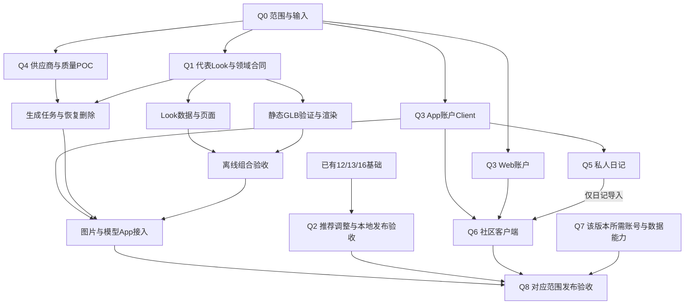

# Then 产品 Backlog

更新：2026-09-23。范围为当前已确认的完整产品：**离线完整 Look → 真实衣橱与每日决策 → 完整穿搭图 → 主动生成静态 GLB → 保存复用 → 私人日记与图文社区**。

本文件按用户要求提供一份完整的任务队列、checklist、执行顺序、建议周期和验收出口。当前按用户最新指示只在 `then-server/backend` 推进服务端；Web 核验页和 App 后续再做。付费调用和生产发布尚未执行，新 Look 路线与客户端云能力仍待实现。

## 使用规则与状态

- 本文件维护全局优先级、依赖和勾选视图；[Plan 10](docs/plan/10-OOTD产品实施计划.md)维护阶段与当前事实，单切片 Plan 维护详细步骤/文件职责，[PRD](docs/prd/README.md)维护需求，[Acceptance](docs/acceptance/README.md)维护实际证据。已有任务沿用原 ID，不另造同义任务。
- 完成任务时，先回写原 Plan 与 Acceptance，再同步本文件复选框；发生冲突以实际证据及原 Plan 为准。这里不是第二套可以独立更改的状态账。
- `[x]` 仅表示括号中明确的工作范围已完成；`[ ]` 表示仍有工作。`pending` 待执行，`blocked` 缺必要条件，`in_progress` 仅部分完成，`backlog` 尚需形成切片，`deferred` 已延期，`superseded` 已被取代。
- 开发、真机、供应商质量/费用、运营和生产验收分开。文档已完成、模拟器已通过、API 已实现均不能自动勾选发布任务。延期/退役项不计入完成率。
- `BL-*` 仅用于尚无切片的需求细化、跨功能验收和发布工作。进入开发前分配对应领域的下一有效 Plan 编号，并在本条登记接续 ID；不复用已退役编号，不提前建空目录/表/接口。
- 周期单位为有效工作人日：S 约 0.5～1 人日，M 约 1～3 人日，L 约 3～5 人日；超过 L 先在原 Plan 拆检查点。具体周期见各工作包，外部许可、资产返工、设备等待不计入人日；不是交付日期承诺。
- 单人执行同一时间只推进一个主要实现切片；多人可以执行依赖已满足的独立任务，但共享 schema、API 和 Look 合同先对齐。每 1～2 个工程人日检查一次可运行结果，失败先修本切片，不靠扩范围绕过。

状态依据为本次读取的工作区 Plan/Acceptance，未重新运行历史 CI 或设备测试。实施时先核对最新代码与任务状态。

## 产品能力覆盖索引

| 需求领域 | 本文件的任务去向 | 验收依据 |
| --- | --- | --- |
| PRD10 完整产品、离线、事实分离与跨功能质量 | Q0、Q8及全部工作包；13项NFR逐项勾选 | OOTD-SYS-ACC-001～019的当前适用项；退役/延期不执行 |
| PRD11 默认人物/Look、可选本人照片、静态GLB、图片输出 | Q1、本人照片独立前置、Q4 EXPORT；高级角色在延期表 | AVATAR-ACC-026/029～031及原照片准入场景 |
| PRD12 真实衣橱、确认属性、媒体与选衣 | Q2既有REL、Q1来源/草稿；拆衣/批量/商品图在Q7 | WARDROBE原场景及ACC-020/021；自动拆衣另有SYS-004 |
| PRD13 场景、硬约束、锁换、保存、明确反馈消费 | Q2的13-01 REL与13-02；扩展统计在Q7 | RECOMMEND-ACC-001～010 |
| PRD14 完整图与按需模型 | Q4 GATE→POC→DATA/WORKER/DELETE→IOS/EXPORT→TEST/REL | TRYON-ACC-001～008/011/012、CLOUD-ACC-012 |
| PRD15 独立视频 | 延期表；恢复后分配新切片，不混入Q1/Q4 | Acceptance15及SYS-007，当前deferred |
| PRD16 Look/计划/实际/反馈/历史 | Q1与Q2；云反馈、关联和复用在Q7 HISTORY | OUTFIT原场景及ACC-011；SYS-003/005 |
| PRD17 账户、API/Client、云任务与工程 | Q3/Q4；邮件/会话/同步在Q7；既有工程列复用清单 | ACCOUNT-ACC-011、CLOUD-ACC-001～012与既有账户场景 |
| PRD18 用途、权限、删除、导出与保留 | 各切片中的删除/同意任务、Q7 DATA/SYNC、Q8 NFR/OPS | PRIVACY当前场景、SYS-008/009/010/013 |
| PRD19 私人日记、日历、发现、发布、互动、治理 | Q5/Q6；账号/统计扩展在Q7，生产运营在Q8 | COMMUNITY-ACC-001～013 |

“完整”指当前需求均有任务或明确延期/退役去向，不表示所有功能都排入首版，也不把尚未形成Plan的扩展标成可直接编码。

## 推荐执行顺序

P0 先建立可见价值并解决复用前置，P1 完成主动云链路及所需生产条件，P2 补齐完整日常/社区体验，P3 为条件扩展和后续版本。**优先级不同于依赖：日常本地功能不用等待 Provider，社区不用等待付费模型。**

| 顺序 / 工作包 | 优先级 | 主要依赖 | 建议周期 / 责任 | 本包退出结果 |
| --- | --- | --- | --- | --- |
| Q0 范围、素材和设备准备 | P0 | 当前 PRD/Plan | 0.5～1 人日；产品+iOS+后端 | 确定启用范围、代表样本、设备和负责角色，费用/素材门禁有记录 |
| Q1 离线 Look：11-05 | P0 | Q0、合法代表图/GLB | 代表样本1～2人日；实现5～8人日首估；资产/真机另计；iOS+资产 | 图片/真实三维、保存/重启/删除与三人物六套内容 |
| Q2 既有本地验收与推荐调整 | P0/P2 | 已有12/13/16开发；13-02依赖13-01、16-01/03 | 既有发布复核2～4人日；13-02约3～5人日；iOS+验证 | 衣橱→推荐调整→计划→实际/反馈闭环，真机缺口明确关闭 |
| Q3 App/Web账户接入 | P0前置/P1 | 现有账户API；Web页面先完成17-13合同 | App约3～5、Web约3～5人日；iOS/Web+后端 | 实际会话/owner隔离、个人资料、退出和删除 |
| Q4 云生成：14-01 | P1 | Look合同、App账户；供应商POC单独前置 | POC约1～3、工程约6～10人日首估；许可/返工/综合验收另计；后端+iOS+产品 | 图先用、按需模型、去重/恢复/删除与主动图片输出 |
| Q5 私人日记：19-07 | P2 | 17-30、19-03 API | 约3～5人日；iOS+验证 | 账号日记/图片/月历，不混算未同步本地记录 |
| Q6 社区与治理：19-08 | P2 | 17-30、17-13、已有社区API；日记导入依赖19-07 | 约5～10人日；iOS+Web+运营 | 送审→批准→公开→互动→举报/撤回/申诉 |
| Q7 按功能启用关闭扩展缺口 | P1门禁/P3扩展 | 相应领域数据/客户端及准入 | 每项先S～M需求细化，再估实施；负责人见后续表 | 邮件/头像/同步/导出等均有明确去向，不能假称已具备 |
| Q8 组合验收与发布 | 每个版本必需 | 该版本所有启用功能及其门禁 | 每个候选版约3～5人日；产品+验证+发布 | 功能、NFR、权限、恢复、运营与发布证据一致 |

以上周期是工作包估算，重叠的QA、账户Client和正式内容不能重复累加；也不能把离线/Look原15～25人日粗估当作包含社区、同步和邮件的完整产品工期。先完成Q0和代表样本后再做人员排期。

受控集成只要求相应Client/数据任务完成，不等待公开生产REL；公开发布必须满足REL。图中连线表示交付依赖，不强制独立后端开发等待全部App真机结果。

## Q0 开工准备

主责：产品；协作：iOS、后端、资产与验证。对应PRD10，验收记录回写Plan10。以下准备工作不重复采购授权，也不因建立backlog自动启动费用动作。

- [x] `BL-READY-01` 固定下一版启用范围：离线Look、云图片、云模型、日记、社区分别选定；列出未启用入口及其用户表现。依赖：现行PRD；验收：每个启用功能有Plan/ACC，无默认开放的占位按钮。S。范围与入口处理见Plan10的Q0记录。
- [x] `BL-READY-02` 核对两仓库分支/工作树、工具链、当前schema/Client/资源版本与可用测试环境，保留已有改动。依赖：READY-01；验收：可复核基线，无清库/跨任务覆盖；OOTD-NFR-012。S。基线及工具链差异见Plan10；核对完成不表示环境门禁通过。
- [ ] `BL-READY-03` 落实合法代表图/GLB、原始交付包/许可/参数/hash与六套内容负责人。依赖：READY-01；验收：11-05-GATE-01有实际输入，不用工程模型冒充正式资产。S，外部制作另计。
- [ ] `BL-READY-04` 确定最低支持iOS26真机及验证窗口、测试账号/隔离PG/Kafka/MinIO、费用核对与运营负责人。可与READY-02/03并行；验收：设备/账号/预算是否具备逐项可见，缺项只阻断对应能力。S。

下一项主要实现为`11-05-GATE-01`；若样本等待，可推进不依赖样本的账户契约核对或已有本地验收，不制作更多未经质量验证的资产。

## Q1 完整 Look 与离线三维

来源：[11-05](docs/plan/11-05-三维人物与造型闭环执行计划.md)。需求：AVATAR-REQ-032/034～037/040～042、WARDROBE-REQ-035～037、OUTFIT-REQ-009。主责：iOS；协作：产品/资产。当前合同approved，实施pending。

- [x] `11-05-SPEC-01` 完成整套Look、状态、保存/删除与追溯合同（仅文档）。
- [ ] `11-05-GATE-01` 验证一个正式代表图/静态带纹理GLB：来源、正侧背、连续观察、格式/预算。依赖：READY-03；验收：AVATAR-ACC-026/029适用子集；失败先修样本，不扩六套。
- [ ] `11-05-DOMAIN-01` 定义Look、不可变内容版本、草稿/当前显示/已保存状态、来源快照和旧回调拒绝。依赖：GATE-01；验收：图片/模型/标签同版本，保存不产生拥有/穿着事实；AVATAR-ACC-030。
- [ ] `11-05-DATA-01` 实现真实GRDB保存、日期/原时区、收藏、编辑/取消、删除与中断恢复；幂等/expected revision、文件发布和补偿。依赖：DOMAIN-01；验收：重启和事务故障不丢原记录；AVATAR-ACC-030、OUTFIT-ACC-011。
- [ ] `11-05-RENDER-01` 改造旧固定rig/禁贴图校验，加载受控整套GLB，旋转/有界缩放/复位、session/revision ACK、原子切换与资源释放。依赖：DOMAIN-01/GATE-01，可与DATA并行；验收：坏包、A→B→C、WebContent/后台恢复均不串款；AVATAR-ACC-029/030。
- [ ] `11-05-UI-01` 完成今日、整套选择/详情、内置参考与我的衣物来源、选衣草稿、穿搭簿和可恢复状态；移除首版逐件3D/体型假入口。依赖：DATA/RENDER；验收：WARDROBE-ACC-020/021、AVATAR-ACC-030，VoiceOver替代操作可用。
- [ ] `11-05-ASSET-01` 扩三人物各两套，共六套正式图/GLB；至少每人物一套默认图/GLB随包，其余可用/下载状态明确。依赖：GATE；可与实现并行；验收：六套逐项视觉/权利/hash通过，默认三套断网可用。
- [ ] `11-05-TEST-01` 执行真实库/画布/文件组合，坏hash/URI/超限、低存储、旧回调、删除后重启、快速切换及无隐式网络检查。依赖：UI/ASSET；验收：AVATAR-ACC-029/030、WARDROBE-ACC-020/021、OUTFIT-ACC-011。
- [ ] `11-05-REL-01` 最低真机性能、人工无障碍、Release Archive、许可/披露和回退演练。依赖：TEST；验收：OOTD-SYS-ACC-017及适用NFR；当前pending。

退出旅程：无账号/照片/用户衣物、断网→默认图→真实GLB观察→切整套→日期/收藏保存→重启→编辑取消/保存→删除后不复活。图片主动输出归14-01；眼部、骨架和逐件换网格不是本包前置。

## Q2 真实衣橱、推荐与记录

### 已有本地功能的发布缺口

这些实现已存在，不重新开发；保留原状态，补缺失设备与发布证据。可与Q1/Q3独立推进。主责：iOS+验证，合并安排设备窗口但逐项回写结果。

- [ ] `12-01-REL-01`（blocked）无图衣橱真实数据保护/锁屏、低存储/恢复与人工无障碍。依赖：已有TEST-01和真机；验收：[Acceptance12](docs/acceptance/12-数字衣橱与衣物录入验收.md)适用无图场景、SYS-003。
- [ ] `12-03-REL-01`（pending）单件图片选取、复核、换图/移除、删除、真机网络/保护与低存储恢复。依赖：已有TEST-01；验收：Acceptance12单件媒体场景；不能复用模拟器网络证据称真机通过。
- [ ] `12-05-REL-01`（pending）确认属性编辑/清空、历史快照不倒灌、真机锁屏/低存储和VoiceOver。依赖：已有TEST-01；验收：Acceptance12属性场景，未知值仍未知。
- [ ] `13-01-REL-01`（blocked）基础推荐最低真机性能、最大字号/VoiceOver、旧请求取消和恢复。依赖：已有开发/CI；验收：RECOMMEND-ACC-001/003～005/008/009适用范围；不认领锁件/保存。
- [ ] `16-01-REL-01`（blocked）计划日期/原时区、状态、删除和重启，人工VoiceOver与物理保护。依赖：已有TEST-01；验收：OUTFIT-ACC-001/005/006/009/010的计划子集。
- [ ] `16-02-REL-01`（blocked）主动实际、穿后状态、纠正/删除、重复确认和恢复；真机保护/VoiceOver。依赖：已有TEST-01；验收：OUTFIT-ACC-001～003/005/006的实际子集。
- [ ] `16-03-REL-01`（原计划内简称REL-01，blocked）可选反馈、撤回/纠正和证据重建的真机/VoiceOver/恢复。依赖：已有开发；验收：[Acceptance16](docs/acceptance/16-穿搭记录与反馈验收.md)反馈子集，不把媒体行为变成偏好。

来源：[12-01](docs/plan/12-01-无图衣橱与数据库基础执行计划.md)、[12-03](docs/plan/12-03-单件图片导入与媒体生命周期执行计划.md)、[12-05](docs/plan/12-05-手工衣物属性与确认来源执行计划.md)、[13-01](docs/plan/13-01-结构化场景与本地硬约束推荐执行计划.md)、[16-01](docs/plan/16-01-穿搭计划与时间线执行计划.md)、[16-02](docs/plan/16-02-实际穿着与穿后状态执行计划.md)、[16-03](docs/plan/16-03-结构化穿后反馈与证据重建执行计划.md)。

### 推荐调整与计划保存

来源：[13-02](docs/plan/13-02-推荐调整与计划保存执行计划.md)。需求：RECOMMEND-REQ-004/010～017；主责：iOS。依赖已有13-01候选和16-01/03数据能力，实施pending；不依赖云生成。

- [x] `13-02-SPEC-01` 明确锁件/换件/撤销、保存和反馈边界（仅文档）。
- [ ] `13-02-DOMAIN-01` 实现锁项冲突、局部换件/撤销、无解说明和异步取消。依赖：13-01；验收：RECOMMEND-ACC-002/009，硬约束不放宽。
- [ ] `13-02-DATA-01` 事务内复核衣物revision/状态、幂等保存计划，读取可撤回明确反馈作软排序。依赖：DOMAIN、16-01/03；验收：RECOMMEND-ACC-006/007/010，撤回后排序可重建。
- [ ] `13-02-UI-01` 接锁/换/撤销、日期确认、冲突恢复、计划成功与主动实际入口。依赖：DOMAIN/DATA；验收：同次保存一条计划，不自动生成WearEvent/Look任务。
- [ ] `13-02-TEST-01` 覆盖候选后改衣/待洗/删除、重复提交、无替代、反馈撤回和重启。依赖：UI；验收：RECOMMEND-ACC-002/006/007/009/010。
- [ ] `13-02-REL-01` 最低真机、无障碍、完整日常旅程。依赖：TEST及相应12/16发布门禁；验收：OOTD-SYS-ACC-005。

退出旅程：真实衣橱→最多三套或无解→调整→保存计划→主动实际→可选反馈→回看/撤回。Look、计划、实际、日记与偏好计数始终独立。

## Q3 App 与 Web 账户访问

### App 共用账户Client

来源：[17-30](docs/plan/17-30-App账户与云端访问执行计划.md)。需求：ACCOUNT-REQ-003～011、DELIVERY-REQ-002/004；主责：iOS+后端。复用现有后端，不另建认证协议；实施pending。

- [x] `17-30-SPEC-01` 明确访客、会话、退出/删除、账号隔离（仅文档）。
- [ ] `17-30-CONTRACT-01` 从隔离实际API的运行时OpenAPI验证并固定Swift Client生成方案/版本、所需账号操作及错误映射。依赖：现有账户API；验收：成功/错误/Cookie可消费，无平行DTO/schema。
- [ ] `17-30-CLIENT-01` 实现实际网络adapter/账号Repository、受保护会话持久化、超时/取消/429处理。依赖：CONTRACT；验收：真实登录/读取/退出，凭据不落日志/UserDefaults/GRDB。
- [ ] `17-30-UI-01` 原生注册/登录/资料/退出/删除，取消返回原草稿，登录恢复后不自动付费或发帖。依赖：CLIENT；验收：ACCOUNT-ACC-011正常/失败旅程。
- [ ] `17-30-ISOLATION-01` 按owner隔离云草稿/任务/缓存和迟到响应；明确访客本地数据不自动合并上传。依赖：CLIENT/UI；验收：A退出→B登录不见A内容，独立本地事实保留。
- [ ] `17-30-TEST-01` 两账号+访客、真实Cookie/401/409/422/429/503、重启和删除回执。依赖：UI/ISOLATION；验收：ACCOUNT-ACC-011，后端事实与App一致。
- [ ] `17-30-REL-01` TLS/披露/真实会话保护/最低设备及公开注册条件。依赖：TEST、BL-ACCOUNT-01～04按启用范围适用部分；验收：ACCOUNT-ACC-011与SYS-008/013。未过REL可做合成账号集成，不能称公开注册已发布。

媒体、生成、日记、社区operation由实际消费者加入同一Client基础；不要为了一个登录生成另一套全量业务服务层。

### Web账户与治理前置

来源：[17-13](docs/plan/17-13-Web账户管理执行计划.md)。主责：Web+产品；账户页面开发与本地真实服务验证完成，公开注册发布门禁仍pending。

- [x] `17-13-DOC-01` 完成注册/登录/账户/退出/删除路由、状态和安全合同的审查，按原计划转approved。依赖：Design15/16、当前账户API；验收：字段、错误、会话、删除状态无遗漏。
- [x] `17-13-UI-01` 桌面/移动页面稿与加载、错误、冲突、删除确认状态。依赖：DOC；验收：映射DESIGN且可完成整条旅程。
- [x] `17-13-WEB-01` 消费现有生成Client、Cookie/路由保护、本人CRUD和退出。依赖：UI及已有GEN；验收：页面与真实API一致，无自创BFF/DTO。
- [x] `17-13-TEST-01` 对实际业务运行生成差异、相关测试、lint/typecheck/format/build和无障碍。依赖：WEB；验收：[Acceptance17账户Web场景](docs/acceptance/17-云端生成与任务管理验收.md#账号认证与web账户管理验收)。
- [x] `17-13-BROWSER-01` 真实PG/API/Next完成注册→刷新→编辑→退出→登录→删除及移动布局。依赖：TEST；验收：包括401/冲突/网络失败，浏览器证据可复核。
- [ ] `17-13-REL-01` 开发证据已回写；公开发布仍依赖账号邮件验证、TLS、隐私与运维门禁。依赖：BROWSER及账号生产门禁；验收：Web账户可供治理端使用。

### Web 无图衣橱数据核验

用户确认先在 `then-server` 完成服务端与 Web 页面，再做 App。[17-31](docs/plan/17-31-Web衣橱数据核验执行计划.md)复用既有 17-20/17-21 API，作为 Q3 账户之后的服务器验证切片；不抵扣 Q1/Q2 的离线 Look、推荐或 App 验收。

- [x] `17-31-DOC-01` 固定 Web 无图衣橱范围、删除影响与非目标；依据 PRD12/Design25。
- [x] `17-31-UI-01` 本人衣物分页、创建/编辑、可选属性和两种删除影响策略。
- [x] `17-31-TEST-01` 实际生成 SDK 无漂移，相关单测与前端质量命令通过。
- [x] `17-31-BROWSER-01` 隔离真实服务验证两账号、409、401、删除历史影响、网络恢复及响应式/键盘。
- [ ] `17-31-REL-01` 本地证据已回写并单独提交；公开入口须另行通过账号发布门禁。

### Web 穿搭计划数据核验

用户指定先在 `then-server` 验证后端与 Web 页面。[17-32](docs/plan/17-32-Web穿搭计划数据核验执行计划.md)接续 17-31，消费已有 17-22/17-23 API；不抵扣 Q2 的 App 离线计划、实际记录与推荐验收。

- [x] `17-32-DOC-01` 固定 Web 计划意图、状态、快照与非目标；依据 PRD16/Design26。
- [x] `17-32-UI-01` 本人计划创建/列表/编辑/状态/删除及逐件不可穿确认。
- [x] `17-32-TEST-01` 生成客户端无漂移，单测与前端质量命令通过。
- [x] `17-32-BROWSER-01` 隔离真实服务验证意图不产实际、两账号、409、状态/删除、网络恢复与布局。
- [ ] `17-32-REL-01` 本地证据已回写并单独提交；公开入口须另行通过账号发布门禁。

### Web 实际穿着数据核验

用户指定先在 `then-server` 完成后端与 Web 页面。[17-33](docs/plan/17-33-Web实际穿着数据核验执行计划.md)接续 17-32，消费已有 17-23 API；不抵扣 App 离线记录、反馈和推荐验收。

- [x] `17-33-DOC-01` 固定来源、主动确认、逐件待洗/不可穿、同日相似与快照边界；依据 PRD16/Design27。
- [x] `17-33-UI-01` 本人实际创建、分页回看、纠正、删除及关联计划状态展示。
- [x] `17-33-TEST-01` 运行中 OpenAPI 客户端无漂移，表单单测与前端质量命令通过。
- [x] `17-33-BROWSER-01` 隔离真实服务验证重复确认、待洗/计划事务、两账号、409/401/断网、分页和布局/键盘/axe。
- [ ] `17-33-REL-01` 本地证据独立提交；公开入口须另行通过账号发布门禁。

## Q4 完整图片与按需 GLB

来源：[14-01](docs/plan/14-01-完整穿搭图与按需三维生成执行计划.md)。需求：TRYON-REQ-001～006/008～010、AVATAR-REQ-043/044、CLOUD-REQ-007～009、OOTD-REQ-018/019；主责：后端+iOS+产品/资产。合同approved_with_gates，实施pending。

- [x] `14-01-SPEC-01` 明确图/模型各自用途、版本、任务、费用和删除合同（仅文档）。
- [ ] `14-01-LOCAL-POC-01` 在现有 `then-server` 中固定零费用本地验证：`fixture` 图片替身、受控本地图片服务接口，以及 `img2threejs`→GLB 导出/纹理/容器校验；不创建第二套数据库或服务入口。依赖：SPEC；验收：可复现输入/输出 hash、失败关闭、无云请求。
- [ ] `14-01-GATE-01` 核实具体账号、POC预算、素材/产物权利、终端服务许可、地域/留存/删除和参数。依赖：READY-03/04；验收：有实际准入记录，缺项的模式不调用；价格以Design20及调用前核实结果为准。
- [ ] `14-01-POC-01` 先代表→至少12组授权输入；固定类别/组合与评分，所有失败/丢弃/费用登记；默认最多2次计费尝试/样本并有总预算。依赖：GATE；验收：TRYON-ACC-011及模型独立质量结论，API成功不代替衣物保真。
- 当前统一配置保持 `GENERATION_MODE=off`、`GENERATION_ENABLED=false` 与 `GENERATION_PROVIDER_CALLS_ENABLED=false`；本地配置、测试和 CI 不调用第三方生成服务，不产生供应商生成费用。`local` 仅允许 fixture/回环本地图片服务并要求零外部预算；供应商开关在 GATE/POC/WORKER 完成前由启动校验拒绝，未来开启后才进入实际费用核对。
- [ ] `14-01-DATA-01` 实现image/model任务、Look版本/输入快照、同意、owner、额度/成本、幂等/去重、血缘和Outbox；Provider 无关领域合同已开始并覆盖按用途输入校验、owner/purpose 作用域幂等/去重分类、纯领域接纳编排（重放/内容去重、fail-closed 预算/配额、任务+临时额度占用+单一 Outbox 意图）、额度占用只从新建 queued/未提交/未取消任务创建且时间不可倒退、额度预留身份/金额/状态版本（reserved=1、终态=2）/创建与更新时间在结算和终态重放前 fail-closed、任务核心身份/输入快照/参数哈希/状态枚举/失败原因/结果/租约/时间事实/状态修订号溢出在写入口 fail-closed、Outbox 事件身份/类型/聚合版本/用途/创建时间事实在生成时 fail-closed、不可变输出事实与 image→model 来源摘要绑定、Provider 成功回调停在 validating 且必须经过校验输出才能进入 succeeded、成功只能关联合法输出资产且失败/取消/过期不保留结果引用、取消请求后的成功终态/输出发布拒绝、成功输出与任务终态/额度消费的原子结算意图、失败状态稳定原因校验、失败/取消/过期释放与终态重放幂等且终态重放也校验提交事实、提交中/受理未知状态与显式对账防盲重、提交状态/尝试次数/时间戳/external ID 不一致时 fail-closed、活动租约内才允许提交状态/受理/Provider 状态写入且晚到受理时间不得早于任务创建、Provider 状态观察必须带有效时间且失败/取消/过期观察必须经无输出结算、过期状态写入拒绝、未知状态不得获取租约、活动租约不能直接迁移终态、外部受理/状态对账、worker 租约获取/续租/释放、过期与旧 fencing token 拒绝、活动租约内才允许发布成功输出、释放或过期后拒绝结算、终态禁止保留活动租约、成功重放要求产物发布时间不晚于任务终态、结算拒绝非法持久化租约形状、结算写集携带 token 及双账号合成 Provider 替身；当前已用隔离真实 PostgreSQL 验证参数规范化回放、幂等/内容去重、额度预留、取消、跨账号隔离、租约恢复、未知提交对账、输出成功/失败结算及终态重放；新增 Huma 实际路由测试覆盖会话、202 接纳、本人查询/分页/取消及禁用/冲突错误映射；新增真实 PostgreSQL + Huma 路由集成覆盖 202 接纳、本账号读/列表、跨账号 404、幂等回放、取消请求、删除撤权及进度查询；Provider-backed worker 全链路和 Kafka/MinIO 故障矩阵仍待 GATE/POC。依赖：11-05领域合同和POC真实参数；验收：真实PG/HTTP跨账号/版本/配额事务，CLOUD-ACC-003/008/012。
  - 2026-09-25 验收补充：真实 PostgreSQL + Huma 接纳路由验证服务端估算 USD 60 minor units/1 quota unit、幂等重放和预算上限 100 时拒绝第二个 USD 60 请求；成本/额度不由客户端控制，缺远端报价失败关闭。合成数据，无 Provider 调用和生成费用。见 14-01 Plan 与 Acceptance 17。
  - 2026-09-25 验收补充：真实 PostgreSQL + Huma 路由验证同幂等键改输入冲突、同内容新键去重、owner/Look revision/媒体 hash 快照及 consent receipt 持久化、跨账号 GET/list 隔离。合成数据，无 Provider/媒体调用。见 14-01 Plan 与 Acceptance 17。
- [ ] `14-01-WORKER-01` 实现submit/query/fetch、租约/fencing、有限退避、不确定受理对账、校验后私有MinIO发布；当前已实现生成任务的获取/续租/释放、到期恢复递增 fencing token、旧 worker 条件写入拒绝，`in_flight`/`unknown`/`accepted` 提交状态、显式未受理对账、external task ID、非终态 Provider 状态观察，已知未受理后的 capped exponential `next_attempt_at` 与最大提交次数门禁，验证后输出元数据与成功/失败/取消/过期结算的原子持久化，以及 Provider-neutral 清理 worker 的待办领取、目标执行、有限退避和 stale running 回收；新增 PostgreSQL `FOR UPDATE SKIP LOCKED` 的 submission/observation/result 持久领取边界，提交领取覆盖 ready 的 not_started 与 lease 过期的 in_flight（恢复后转 unknown，不重提），观察/结果只领取 accepted running / accepted validating，过期 lease 由 fencing 递增恢复；新增未启用的 submission/observation 编排分别负责带 fencing 的一次 submit 和已受理 identity 的状态观察，成功只停在 validating，终态失败/取消/过期走无输出结算；新增未启用的 result 编排只领取 validating 任务，要求 `ResultFetcher` 回传 task/look/revision/purpose/输入快照身份并校验 JPEG/GLB 元数据与 Look/revision 血缘，再原子发布/消费额度，抓取失败保留 validating；观察 worker 对取消请求只对 queued/running/validating 外部状态调用 Cancel 并再次查询，不可信时保留取消请求；Provider queued 映射为本地 running；结果 worker 在抓取前将 validating 取消任务原子结算为 canceled 并释放额度；撤销后迟到 `external_task_id` 会在同一 PostgreSQL 事务内补进已有 cleanup manifest，并将已完成或运行中的清理请求重开为 pending，旧 cleanup claim 不能覆盖新目标，重复目标即使时间戳较旧也幂等保留；本轮补齐清理目标身份：对象目标按 `object_id + object_version_id` 去重，Provider 目标按 `provider_task_id` 去重；提交 worker 对恢复到 `in_flight` 或收到取消的 `unknown` 任务会保留待对账、释放租约且不盲目重提；清理目标在最后一次尝试失败或 stale running 恢复时均落为 `cleanup_retry_exhausted` 并从 pending/failed 队列排除，并允许在访问撤销后创建迟到的 source cleanup scope；Provider/object-store 调用与真实产物下载仍未开启。依赖：DATA；验收：受理响应丢失不盲重发，明确未受理才有限退避，worker/队列重启不丢任务，清理失败可重试且旧 worker 不能覆盖新领取，CLOUD-ACC-004/006/007/012。
- [x] `14-01-OPS-01` then-server 已实现 `unknown` 提交结果的 admin-only 待核对分页和 revision/evidence 驱动的受理决定；accepted 记录外部任务 ID 并串入迟到清理，not accepted 终结为 failed 或已撤销任务的 canceled 并释放预留额度，审计与任务/额度变更在同一 PostgreSQL 事务提交。拒绝陈旧 revision、有效 worker lease、非管理员和不合法证据；未调用 Provider、未自动重提。真实隔离 PostgreSQL、Huma 权限/合同、全量 Go race 与 integration race 通过；供应商准入和实际生成能力仍待后续门禁。
- [ ] `14-01-DELETE-01`（in_progress）已实现生成任务 `DELETE /generation-jobs/{job_id}`、访问立即撤销、迟到输出拒绝、私有对象 key+version/Provider task 清理目标快照、失败重试、源媒体引用级联、图→模型级联、任务查询返回当前清理状态，以及账号注销等待 generation cleanup 完成后再删除生成记录；缺失历史 key 的清理 fail-closed；已有媒体/Provider/object-store 实际删除 worker、缓存副本和外部回执仍待接入。依赖：WORKER和已有19-06；验收：真实 PG 事务已验证访问先关、清理目标存活、完成后删输出元数据、源/账号级联与注销回执；CLOUD-ACC-005/009/012、PRIVACY-ACC-011。
- [ ] `14-01-IOS-01` 冻结人物/衣物→用途/费用确认→真实任务恢复→核对保存图→显式模型→缓存复用与新版本隔离。依赖：DATA/WORKER/DELETE、17-30 TEST级共用Client、11-05实际Look/renderer；验收：TRYON-ACC-011/012，图失败留草稿、模型失败留图。
- [ ] `14-01-EXPORT-01` 用户主动保存相册/系统分享已确认有权图片；Add Only、净化、临时副本和外部删除说明。依赖：IOS；验收：AVATAR-ACC-031，拒绝/取消/低存储可恢复；不导出原始人物源/GLB或自动发社区。
- [ ] `14-01-TEST-01` 真实隔离PG/Kafka/MinIO故障矩阵、合成Provider替身、预算内真实Provider对账和App组合验证。依赖：IOS/EXPORT及前面服务端任务；验收：画面、版本、文件、任务和账单可相互对照；SYS-018。
- [ ] `14-01-REL-01` 按启用来源完成供应商/真实照片/地域/删除、最低真机、独立开关和成本停止演练。依赖：TEST、所启用账号/照片/数据生产条件；验收：TRYON-ACC-008/011/012、CLOUD-ACC-011/012、PRIVACY-ACC-011、SYS-018。

退出旅程：支持人物+选衣→图先用→可选择在图片阶段结束→明确请求GLB→复用→换衣新图版本→删除。缓存命中不新计费；未知受理先对账。只通过图片就只开放图片，不能据此勾选模型质量/生成完成。

## 本人照片能力的独立前置

来源：[11-01](docs/plan/11-01-照片输入与质量门执行计划.md)。这组是本人照片模式的P1前置，不阻塞授权虚构人物默认体验；开发已有大量证据，下列剩余项均pending。主责：iOS+质量/隐私；设备可用后先M级测量，再决定扩样规模。

- [ ] `11-01-TEST-03` 在iOS目标环境验证Vision授权输入矩阵、误拒/误收、分组风险与阈值；不由macOS/合成样例代替真机/真实人群准入。依赖：已有IOS-06/SEC-01；验收：参数与失败分布报告。
- [ ] `11-01-TEST-06` 最低真机PhotosPicker/iCloud离线、锁屏保护/备份排除、快照、强制终止、资源/能耗与时延。依赖：原TEST-01～05；验收：设备/阈值/样本/测量完整，模拟器不抵扣。
- [ ] `11-01-TEST-07` 双人复核中性原因文案、质量结果，无身体评价/人口属性/身份或合身结论。依赖：TEST-03、已有IOS-10；验收：文案与误判修正清单。
- [ ] `11-01-SEC-03` 网络、日志、沙盒、剪贴板/分享、Widget/Spotlight/通知、备份与后台快照检查。依赖：TEST-06及原SEC-02；验收：无未批准表面、无长期源副本/敏感载荷。
- [ ] `11-01-REL-01` 按原计划补齐相关产品回归、Swift/UI测试及Debug/Release检查的剩余范围。依赖：原自动化任务；验收：原已测范围保留，未测/跳过和新结果分列。
- [ ] `11-01-REL-02` 冻结可据实采用的POC参数/设备/误判报告并回写设计、验收。依赖：TEST-06/07；验收：参数有证据，风险仍可阻断生产。
- [ ] `11-01-REL-03` Release不可达与回退/临时清理演练。依赖：REL-01；验收：DEBUG POC仍不构成生产入口，不影响现有库/业务。
- [ ] `11-01-REL-04` 形成go/no-go与后续生产准备切片输入。依赖：REL-02/03、SEC-03；验收：所有必需证据逐项判定；POC通过仍不自行开启生产照片。
- [ ] `BL-PHOTO-01` 将获准本地照片准备用例接入实际创建流程，落实逐次云用途/删除/真实人群生产门禁。状态backlog；依赖：REL-04合格结论及14-01合同；先新建本领域后续Plan，验收AVATAR/TRYON/PRIVACY相应生产场景，不把DEBUG host当上线实现。

## Q5 私人日记与月历

来源：[19-07](docs/plan/19-07-私人日记与月历客户端执行计划.md)。需求：COMMUNITY-REQ-001～003/011/012；主责：iOS+验证；实施pending。服务端19-03已完成，客户端不重新定义日记API。

- [x] `19-07-SPEC-01` 明确私人保存、日期、关联、账号月历与错误范围（仅文档）。
- [ ] `19-07-CONTRACT-01` 接实际diary/calendar/media操作与owner/revision错误。依赖：17-30可集成Client、19-03 API；验收：运行时Client可消费，未实现云Look/统计不伪造字段。
- [ ] `19-07-DATA-01` 日记领域/Repository、受保护未上传草稿、普通图片检查/净化及固定版本关联。依赖：CONTRACT；验收：无图可保存，失败/取消/冲突可恢复，不存媒体BLOB。
- [ ] `19-07-UI-01` 列表/编辑/详情/月历，一日多条、原日期/时区、编辑取消与删除。依赖：DATA；验收：重启可读，未存草稿和账号已保存区分。
- [ ] `19-07-TEST-01` 两账号、未来日期/跨日界线、离线/409/429/坏图、重复保存、删关联与切账号。依赖：UI；验收：COMMUNITY-ACC-012及001/002/009适用子集；日记不改变实际穿着数。
- [ ] `19-07-REL-01` 真机、VoiceOver、权限/锁屏缓存与删除恢复，检查账号生产条件。依赖：TEST及17-30生产门禁；验收：账号日记可用，未实现同步/反馈统计不计通过。

退出旅程：零衣物用户写两条→重启→编辑/取消→月份回看→删除；账号月历与未同步本地记录范围清楚，云Look关联不是无关联日记前置。

## Q6 图文社区与治理

来源：[19-08](docs/plan/19-08-社区发现发布与治理客户端执行计划.md)。需求：COMMUNITY-REQ-004～015；主责：iOS/Web；协作：后端、产品和运营。合同approved_with_gates，实施pending。

- [x] `19-08-SPEC-01` 固定公开字段、角色、审核/撤回状态与治理边界（仅文档）。
- [ ] `19-08-CONTRACT-01` 接发现/草稿/媒体/审核/关系/通知/治理实际操作，核对公开和私有字段白名单。依赖：17-30和已有19-02/04～06 API；验收：不手抄schema，不用假审核状态。
- [ ] `19-08-READ-01` App发现/关注/详情/作者页/搜索分页，以及匿名Web阅读。依赖：CONTRACT；验收：相同时间稳定游标、屏蔽/下架后重读，公开内容与权限一致。
- [ ] `19-08-WRITE-01` 从零或选私人字段创建草稿、普通图片、公开预览、送审/修改/撤回。依赖：CONTRACT；日记导入另依赖19-07；验收：私人→草稿→待审→公开区分，源ID/未选字段不泄漏。
- [ ] `19-08-GOVERN-01` 最小Web审核/举报/下架/封禁/申诉，指定目标版本、原因与审计。依赖：CONTRACT、17-13实际账号页面；验收：角色权限和并发撤回/批准正确，普通用户无法提权。
- [ ] `19-08-SOCIAL-01` 赞藏关、评论/一级回复、站内通知、屏蔽、举报和申诉；错误回滚、同意图去重。依赖：READ/WRITE/GOVERN；验收：私藏身份不公开，通知不回显私有/失效正文。
- [ ] `19-08-TEST-01` 多角色+匿名完整路径与故障矩阵。依赖：READ/WRITE/GOVERN/SOCIAL；验收：COMMUNITY-ACC-013与003～011适用范围；App/匿名Web/治理端/媒体事实一致。
- [ ] `19-08-REL-01` 实际审核负责人/时限、举报申诉、媒体保留/删除、邮件/地域、限流、无障碍和关闭演练。依赖：TEST、BL-ACCOUNT/BL-OPS适用项；验收：COMMUNITY-ACC-013生产部分及SYS-016对应范围。

先交付一篇合成帖子“私有草稿→送审→Web批准→匿名可读→撤回后正文/图不可读”，再扩互动。原始人物采集图和生成Look的社区直发未获此用途准入；系统图片分享不等于App自动发布。短视频、私信、商城不在本包。

## Q7 尚需形成切片的完整产品需求

以下均为保留需求，状态backlog。每个工作包第一项是明确契约和验收；实施前接续正式FF-SS Plan，不能由本文件假定API、算法或生产配置已存在。账号/治理/删除等与当前启用范围相关的事项升为P1前置，其余保持P3；默认不把这些全部塞入离线首版。

### 账号扩展

依据：[PRD17](docs/prd/17-云端生成与任务管理需求.md)、[PRD19](docs/prd/19-每日记录与穿搭社区需求.md) COMMUNITY-REQ-014、Design15/23。主责：后端+App/Web；目标验收：COMMUNITY-ACC-008/011、账户验收与SYS-008。

- [x] `BL-ACCOUNT-01` 固定网易 163 发信通道、验证/找回流程、挑战有效期/重放/频率/枚举保护、账号状态和客户端提示；后端契约见 [17-36](docs/plan/17-36-账号邮件验证与找回后端执行计划.md)。163 发信服务不决定 API/数据部署区域，正式部署地域留在 `17-36-REL-01` 发布门禁。
- [x] `BL-ACCOUNT-02` 实现验证/找回持久挑战、可靠发送、过期/使用一次/撤销与错误一致响应。依赖：ACCOUNT-01；验收：真实隔离PG+邮件替身，邮箱是否存在不泄漏，不在日志留token。后端本地验收见 [17-36](docs/plan/17-36-账号邮件验证与找回后端执行计划.md)；真实 163 送达与公开注册门禁仍待。
- [ ] `BL-ACCOUNT-03` App/Web验证/找回入口、深链接和错误恢复。依赖：ACCOUNT-02、17-30/17-13；验收：过期/重放/跨账号/退出/重新登录旅程，未验邮件投递不称生产完成。
- [ ] `BL-ACCOUNT-04` 受控真实邮件送达、挑战失效、限流/滥用、隐私/地域与恢复演练。依赖：ACCOUNT-03；验收：公开注册所需门禁完成，不仅mock通过。
- [ ] `BL-ACCOUNT-05` 头像独立媒体用途/净化/替换/删除，公开资料只读合格衍生图。依赖：账号/媒体基础及用途合同；验收：owner、元数据、固定版本和旧图撤回，不复用本人采集原图。[17-37](docs/plan/17-37-公开资料头像后端执行计划.md) 本地后端已通过；Web/App 展示及真实用户发布另验，故整项暂不勾选。
- [ ] `BL-ACCOUNT-06` 多设备会话列表/撤销与安全事件提示，按实际需求补API/Client。依赖：当前Cookie会话模型；验收：撤销目标会话后立即拒绝、不能撤销别人会话、无凭据暴露；不存在列表时不放假入口。[17-38](docs/plan/17-38-多设备会话管理后端执行计划.md) 本地后端已通过；客户端提示另验，故整项暂不勾选。

### 数据主体导出与删除进度

依据：[PRD18](docs/prd/18-隐私与数据控制需求.md) PRIVACY-REQ-005～008，已有19-06可靠删除。主责：后端+客户端/隐私；验收：PRIVACY-ACC相应数据控制、CLOUD-ACC-009、SYS-009/010。

- [x] `BL-DATA-01` 固定本地合成数据开发的身份再验证、导出类别/格式、24 小时临时产物、7 天最小删除回执与注销后凭据查询合同；见 [18-01](docs/plan/18-01-数据主体导出与删除回执合同执行计划.md)。真实用户范围、正式保留和目标市场评审仍属发布门禁，不抵扣 `BL-DATA-02/03` 代码与验收。
- [ ] `BL-DATA-02` 实现受控结构化/原图导出与临时产物访问/过期/清理，Client展示生成/获取失败。依赖：DATA-01；验收：仅本人授权范围，无私人媒体误公开，分享单张图片不抵扣完整导出。18-02/18-03 的本地两档后端已完成并测试；Client 展示按当前后端优先顺序暂缓，故本项不勾选。
- [ ] `BL-DATA-03` 完成可验证的删除回执/进度查询及App/Web展示。依赖：DATA-01、19-06；验收：访问关闭、清理中、重试、完成真实区分，注销后无无限登录循环，无清理依据丢失。18-04 的本地后端已完成并测试；App/Web 展示按当前后端优先顺序暂缓，故本项不勾选。
- [ ] `BL-DATA-04` 覆盖备份过期、恢复后应用删除墓碑、Provider副本清理和回执留存。依赖：DATA-02/03及实际保留合同；验收：恢复不复活、超时有责任人；离线设备/外部分享副本边界如实。

### 完整跨设备同步与合并

依据：OOTD-REQ-014、CLOUD/PRIVACY数据合同、PRD12/16/19保留范围。主责：App+后端；目标SYS-010/016及各领域保存/删除验收。状态backlog，登录/CRUD/单次上传不是同步实现。

- [x] `BL-SYNC-01` 固定用户主动同步范围、访客数据归属、账号切换、ID映射、revision/游标/墓碑、冲突和删除优先规则，形成正式Plan。依赖：相应领域实体；M细化，不先开新空表。本地技术合同见 [17-39](docs/plan/17-39-主动同步合同执行计划.md)，服务端增量与客户端验证归 SYNC-02～04。
- [x] `BL-SYNC-02` 补齐服务端增量/幂等/墓碑能力及 owner 校验，复用现有衣橱/计划/实际/日记接口。本地真实 PostgreSQL、HTTP、race 与实际进程验证见 [17-40](docs/plan/17-40-服务端增量同步执行计划.md)；App 与真实两设备验收仍归 SYNC-03/04。
- [ ] `BL-SYNC-03` App实现明确同意后的同步、离线变更队列、冲突复核/取消和受保护媒体缓存。依赖：SYNC-02、17-30；验收：拒绝不同步、不自动合并另账号内容、不复制DTO/媒体BLOB。
- [ ] `BL-SYNC-04` 两台设备断网修改/删除/重连、账号切换、重复推拉、旧客户端/重启和恢复演练。依赖：SYNC-03；验收：日期/身份/快照一致，迟到不复活，不能只测同一模拟器两次登录。

### 衣橱录入扩展

依据：[PRD12](docs/prd/12-数字衣橱与衣物录入需求.md)与OOTD-REQ-003/005。主责：产品+iOS/AI适配；目标WARDROBE相关验收、SYS-004。未知算法/供应商先有质量与成本POC。

- [ ] `BL-WARDROBE-01` 独立归档/恢复/可用状态筛选的后端切片已按 [17-41](docs/plan/17-41-衣橱归档恢复与状态筛选后端执行计划.md) 实现；完整任务仍要求客户端推荐/管理 UI、归档/待洗/借出不进新推荐、恢复不改历史快照的端到端验收；不把已有状态字段等同于完整管理UI。
- [ ] `BL-WARDROBE-02` OOTD自动拆衣：输入授权/两个用途分离→质量POC→逐件草稿→用户确认拥有/属性→保存。验收：不自动创建穿着/长期人物源，不静默丢件，误识别能修正/放弃。
- [ ] `BL-WARDROBE-03` 批量录入/整理：固定数量/资源预算、逐项失败/重试、重复候选确认、取消与中断恢复。依赖：单件媒体合同；验收：已成功项不因一张坏图丢失，不把图片hash当衣物ID。
- [ ] `BL-WARDROBE-04` 商品图专项输入：确认图片权利、来源、属性建议/未知与拥有确认，再决定是否进入支持的生成集。验收：商品图不等于用户拥有，规格不被AI补成事实。

### 历史复用、统计与扩展反馈

依据：[PRD13](docs/prd/13-穿搭推荐需求.md)、[PRD16](docs/prd/16-穿搭记录与反馈需求.md)、[PRD19](docs/prd/19-每日记录与穿搭社区需求.md)。主责：iOS+后端；目标OUTFIT-ACC-005/006、RECOMMEND-ACC-007、COMMUNITY-ACC-002及SYS-005/016。

- [ ] `BL-HISTORY-01` 历史Look/计划/实际复用为新草稿，复核当前衣物状态、图片权利与版本，再主动保存。验收：复用不改原历史或自动产生新的WearEvent/付费任务。
- [ ] `BL-HISTORY-02` 固定云反馈/统计事实范围、关联、撤回/纠正重算与日历口径，形成数据/API/Client切片。依赖：本地16-03和当前账号实际事件；验收：无反馈不伪造统计，不混算未同步本地记录。后端 [17-34](docs/plan/17-34-账号反馈与穿着统计API执行计划.md) 已通过本地开发验证并生成 Client；Web 页面/用户旅程接续 17-35，整体仍 `in_progress`。
- [ ] `BL-HISTORY-03` 接实际Look云关联到日记/月历及所选统计。依赖：14-01实体、19-07、HISTORY-02所需合同；验收：owner/删除解关联/原日期，缺关联仍可写独立日记。
- [ ] `BL-HISTORY-04` 扩样验证建议的解释、硬约束和撤回重建，复核留存/激活指标所需合法最小事件。依赖：13-02；验收：不把查看/生成/分享当喜欢或实际穿着，不自行增加追踪SDK。

## Q8 通用质量、运营与发布验收

### 非功能 Checklist

标准唯一来源：[PRD10 NFR](docs/prd/10-OOTD产品需求.md#非功能性需求)，方法：[SYS-ACC-019](docs/acceptance/10-OOTD产品系统验收.md#非功能验收协议)。下列均是待验目标，本文件不更改阈值；主责验证，各实现角色提供修复。相同证据可关联多条，不能把未启用范围记passed。

- [ ] `BL-NFR-001` 离线/降级：零账号/权限/网络完成对应本地旅程，未主动云动作时上传/生成请求0次。映射OOTD-NFR-001，依赖该版本本地UI。
- [ ] `BL-NFR-002` 资产：单GLB≤10MiB、纹理最长边≤2048、三角形≤50,000、一个活动模型；hash/边界/URI/扩展/超限拒绝。映射OOTD-NFR-002，依赖正式六套及validator。
- [ ] `BL-NFR-003` 真机三维：本地缓存命中可交互p95≤2秒、持续拖动≥30fps、10分钟无持续内存增长，后台停绘制。映射OOTD-NFR-003；按协议逐模型采样，不以模拟器替代。
- [ ] `BL-NFR-004` 持久化：真实GRDB/PG事务、重复命令、revision冲突、低存储/提交前后终止和升级恢复。映射OOTD-NFR-004；无静默清库或丢旧记录。
- [ ] `BL-NFR-005` 事实隔离：拥有/Look/计划/实际/反馈/日记/帖子前后计数正确；硬约束违规0，未知不补事实。映射OOTD-NFR-005。
- [ ] `BL-NFR-006` 数据最小化：同意/用途、元数据净化、日志/公开DTO/网络无私人源/凭据/非必要载荷。映射OOTD-NFR-006。
- [ ] `BL-NFR-007` 权限/删除：两账号+匿名、会话/私有资源/来源篡改拒绝，访问先关、清理重试和迟到不复活。映射OOTD-NFR-007。
- [ ] `BL-NFR-008` 任务恢复：worker/Kafka/PG/MinIO故障、Outbox重投、外部受理未知对账、过期执行者不能发布。映射OOTD-NFR-008；真实Provider幂等/账单另验。
- [ ] `BL-NFR-009` 成本：图/模型各自明确触发，额度/并发/总预算原子接纳，缓存0新增计费，取消费用规则诚实。映射OOTD-NFR-009；没有具体预算配置不接新任务。
- [ ] `BL-NFR-010` 无障碍：VoiceOver、最大辅助字号、Reduce Motion、减少透明度与原生三维替代控件完成同等旅程。映射OOTD-NFR-010；保留人工证据。
- [ ] `BL-NFR-011` 运维：脱敏request/job/revision、失败/成本/清理可追踪；图片/模型独立关停且存量任务不丢。映射OOTD-NFR-011。
- [ ] `BL-NFR-012` 工程：固定工具链、Huma/实际Client/GORM/GRDB唯一事实源，相关构建/CI与资源版本匹配。映射OOTD-NFR-012；不把文档通过当运行时通过。
- [ ] `BL-NFR-013` 服务：受控环境20并发、按协议总请求≥200并分别报告各类指标；读取p95≤500ms、普通写入/异步接纳p95≤1s，非预期5xx为0。映射OOTD-NFR-013；报告资源/数据量，Provider时延与媒体传输另报。

### 运营与生产准备

状态backlog/pending，具体配置值由实际地域、供应商与发布范围落实，不新增通用运营平台。首个每项S～M的准入细化后给实施估算；不能以时间盒届满关闭任务。

- [ ] `BL-OPS-01` 确定启用地区、年龄/素材政策、隐私披露/数据清单、处理方与留存/删除时限；与实际网络流和页面同意一致。依赖：发布范围/供应商；验收：PRIVACY-ACC适用生产项。
- [ ] `BL-OPS-02` 生产TLS、数据库/对象权限与备份、Kafka认证/ACL/副本/保留/重放、可信代理与限流、密钥管理。依赖：实际部署环境；验收：17-26等保留生产门禁；本机单broker不记高可用。
- [ ] `BL-OPS-03` 监控任务积压/外部受理未知、成本/额度、结果失败、清理失败与媒体访问异常，明确处理人和恢复步骤。依赖：真实任务/媒体/通知；验收：脱敏告警/演练，未配置预算则关闭新生成。
- [ ] `BL-OPS-04` 确定社区审核/举报/申诉角色、处理时限、通知与审计保留；用测试内容演练误审、下架、封禁/恢复和运营不可用。依赖：19-08 GOVERN；验收：COMMUNITY-ACC-013，恢复账号不自动重新发布内容。
- [ ] `BL-OPS-05` 演练备份恢复、删除墓碑与Provider/固定对象版本清理，明确RPO/RTO/保留期的实际值。依赖：DATA-04、生产存储/供应商；验收：不复活已删媒体，指标有测试依据。
- [ ] `BL-OPS-06` 正式资产许可/第三方声明、品牌资源、App Store隐私信息、最低设备、Archive/发布配置和支持/删除入口核对。依赖：当前启用功能与资产；验收：SYS-011，未启用能力不在商店文案宣称可用。

### 按范围发布 Checklist

每项先明确本次release启用集合。已在安装包中对用户开放的已有功能也必须满足自身发布门禁，不能只验新增页面。发布动作只有在届时已有授权和完整证据后执行，本轮不部署或提交应用。

- [ ] `BL-REL-01` 离线候选版：Q1、所有已开放12/13/16功能REL和对应NFR通过，完成SYS-017/003等适用旅程。证据：正式资源、真实保存、最低设备、人工无障碍与无隐式上传。
- [ ] `BL-REL-02` 云图片/模型候选版：Q3/Q4及所启用照片、账号、隐私/费用门禁通过；SYS-018、TRYON/CLOUD/PRIVACY/AVATAR输出场景齐全。图片/模型逐项放行，互不代签。
- [ ] `BL-REL-03` 日常决策/日记候选版：Q2/Q5与账号门禁通过；SYS-005、COMMUNITY-ACC-012，计划/实际/日记/Look口径独立。若承诺同步，额外依赖SYNC-04。
- [ ] `BL-REL-04` 社区候选版：Q6、账号/邮件、OPS-01/04等适用门禁通过；匿名+作者+普通账号+运营完整验收，SYS-016只认领已具备组合范围。
- [ ] `BL-REL-05` 每个候选版关闭与回退：停新生成/投稿、保留已接纳任务/审核/删除清理，旧版本和数据仍可恢复；不删库/队列/清理依据，不静默换Provider/地域。依赖：候选版实际流程；验收：关闭和恢复录屏、数据差分。
- [ ] `BL-REL-06` 发布核对与证据回写：按原Plan/ACC记录版本、环境、命令、样本数、实测/失败/跳过、链接、限制与责任人，再更新本文件勾选；区分本地、远端CI和生产。未通过项保持未勾选。

## 已完成基础与复用清单

下列`[x]`只指原文所载范围，本轮未重跑其构建/CI。后续缺口已进入上面的任务；不以新backlog重置既有进度，也不把开发完成写成完整产品交付。

- [x] 后端启动/健康、容器与真实依赖测试边界：[17-01](docs/plan/17-01-后端服务启动与健康契约执行计划.md)、[17-07](docs/plan/17-07-后端容器构建与运行验证执行计划.md)、[17-10](docs/plan/17-10-数据库与中间件开发环境执行计划.md)、[17-11](docs/plan/17-11-后端MVP与测试边界执行计划.md)。生产配置/可用性在OPS队列。
- [x] 账户、会话撤销、限流与本人声明：[17-12](docs/plan/17-12-账号认证与本人账户API执行计划.md)、[17-16](docs/plan/17-16-账号HTTP会话撤销闭环执行计划.md)、[17-17](docs/plan/17-17-账号认证Redis限流执行计划.md)、[17-18](docs/plan/17-18-本人成年声明API执行计划.md)。App/Web业务与邮件扩展尚待上面任务。
- [x] 私有人物媒体上传/删除的合成数据后端：[17-19](docs/plan/17-19-本人照片私有上传与删除闭环执行计划.md)。不代表真实照片或生成worker已准入。
- [x] 账号衣橱/确认属性/计划/实际API：[17-20](docs/plan/17-20-结构化衣橱账户API执行计划.md)、[17-21](docs/plan/17-21-衣橱确认属性API执行计划.md)、[17-22](docs/plan/17-22-账号穿搭计划API执行计划.md)、[17-23](docs/plan/17-23-账号实际穿着API执行计划.md)。App全量同步留在SYNC队列。
- [x] 仓库/运行时OpenAPI/GORM、Go与目录规范：[17-14](docs/plan/17-14-客户端服务端仓库拆分与CI执行计划.md)、[17-15](docs/plan/17-15-OpenAPI文档门户与Umi生成执行计划.md)、[17-24](docs/plan/17-24-Go工程结构与测试分层执行计划.md)、[17-25](docs/plan/17-25-Go业务能力文件细分执行计划.md)、[17-29](docs/plan/17-29-Backend目录与HTTP文件职责规范化.md)。按对应Plan保留本地/远端证据边界。
- [x] Kafka/根入口以及Web设计与目录基础：[17-26](docs/plan/17-26-Kafka与工程规范化执行计划.md)、[17-27](docs/plan/17-27-Web设计体系与工程规范同步执行计划.md)、[17-28](docs/plan/17-28-Frontend目录结构规范化.md)、17-13基础工程。不能抵扣生产Kafka或Web账户业务。
- [x] 后端日记/社区需求、资料、日历、审核治理、发现互动/通知及可靠删号：[19-01](docs/plan/19-01-后端需求与数据设计审核计划.md)、[19-02](docs/plan/19-02-账号状态与公开资料执行计划.md)、[19-03](docs/plan/19-03-私人穿搭日记与日历API执行计划.md)、[19-04](docs/plan/19-04-社区帖子审核与治理API执行计划.md)、[19-05](docs/plan/19-05-社区发现互动与通知API执行计划.md)、[19-06](docs/plan/19-06-可靠账号删除执行计划.md)。客户端/运营验收在Q5/Q6。
- [x] 本地无图/单件图/确认属性、候选、计划/实际/反馈的已有开发和模拟器子集：12-01/03/05、13-01、16-01～03。各自REL仍在Q2未勾选。
- [x] 11-01照片POC的既有领域/净化/系统适配/临时清理/DEBUG界面与部分自动化；剩余真实质量/安全/设备/Release报告单列。
- [x] 11-04已实现的工程微动/生命周期模拟器子集。当前缺失历史录屏与真机证据按[Acceptance11](docs/acceptance/11-数字形象与照片采集验收.md)保留限制；不代表正式资产/眼部效果完成。
- [x] 当前设计→PRD→Plan→Acceptance拆解与历史临时物清理（文档/文件范围），见Plan10；业务代码迁移和新资产验收仍未完成。

## 延期与退役事项

这些条目覆盖完整需求去向，但不进入当前首版关键路径，不因“没做”重复插入P0。

| 状态 / 事项 | 当前处理 | 恢复前置和验收 |
| --- | --- | --- |
| deferred：AI 360°视频、视频下载/分享 | 保留[PRD15](docs/prd/15-动态预览需求.md) MOTION-REQ-001～007；图/GLB不替代视频 | 独立价值/Provider/用途/预算/质量POC→新15-SS；原生播放、连续性、取消/删除和输出独立验收 |
| deferred：体型、骨架/眼部、眨眼注视和逐件三维换装 | 保留PRD11明确延期需求；不要求首版资产附带rig/眼部 | 对应角色/衣物资产和兼容合同→新切片→真实交互/视觉/真机；不能用整套GLB证明可逐件换装 |
| deferred：工程装饰微动的进一步生产验收 | 11-04-ACC-02最低真机仍pending；不阻断不启用装饰微动的首版 | 若复用微动须关闭11-04相应设备门禁并联验NFR-003/010，不自动删除原证据 |
| superseded：旧多视角矩阵、24组合、72图与并行LookRenderSet路线 | [11-03](docs/plan/11-03-Woo多视角形象与内置穿搭执行计划.md)退役，编号/必要输入证据保留 | 不恢复；当前11-05/14-01接续，不记passed |
| superseded：旧生活管理迁移、旧Vite基础 | 历史语义/工程证据按原Plan保留 | 不恢复旧业务或旧框架；当前数据升级仍需NFR-004/SYS-010 |
| 非当前范围：商城、广告、私信、直播、任意用户模型、量体/真实合身 | 不进入本次backlog实施队列 | 必须先有新的用户价值/设计/PRD，不借当前生成或社区任务扩大范围 |

## 开始与完成检查

每次开始一项任务，核对：启用范围和授权仍有效、必要依赖已完成、具体输入与owner清楚、计划内文件和副作用明确、验收可执行。缺设备/许可只影响对应门禁，不能捏造通过或盲目扩大支出。

每次结束一项任务，核对：正常/取消/失败/重试/删除行为，真实数据或媒体变化，适用NFR，正确环境下的证据，未测项与回退。先更新Plan/Acceptance，再勾选本文件；因范围变化不再做的条目标deferred/superseded，不勾为完成。

证据至少包含：任务/REQ/ACC/NFR、代码或工作树版本、资产hash、设备/服务环境、实际步骤/命令、预期与实测、样本数、通过/失败/跳过、脱敏链接及剩余限制。技术栈/费用只引用Design事实源；不把密钥、真实私人照片、日志/缓存或临时比对文件提交到仓库。
