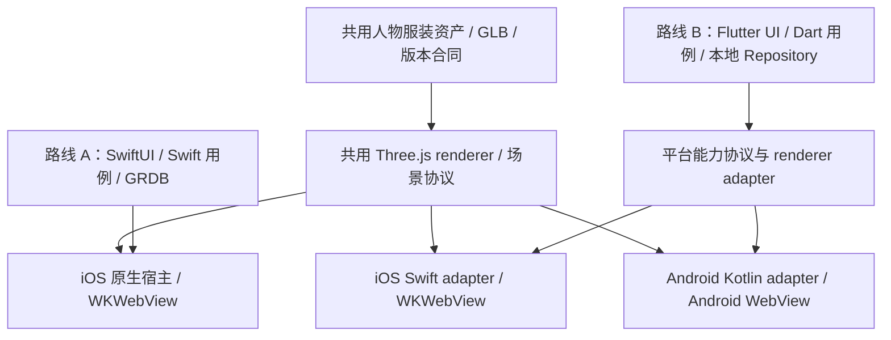

# OOTD 技术选型基线

## 2026-09-15 Woo 立体形象技术路线重评定案

首版人物技术固定为：**受控人物预设 + 内置衣物 + 预生成/人工验收的正侧背 Look 资产 + SwiftUI 原生图片呈现 + AVFoundation 可选短视频**。人物/衣物生成发生在内容生产阶段，App 的 Dress up 只解析已经发布的完整渲染集；用户路径不依赖 GPU、生成供应商、Three.js、WKWebView、Blender、GLB、VRM、NeRF 或 3DGS。

默认三套人物各随包一套三视图，其余有效组合存私有 MinIO 并以版本化 manifest、字节数和 SHA-256 下载到本地受保护缓存。PostgreSQL 保存人物、目录衣物、recipe、render set 和媒体元数据；目录查询不接 Redis/RabbitMQ。RabbitMQ 只在后续 Create 360° 或本人照片产生真实异步任务时启用，Redis 仍只承担可重建缓存/限流。

候选内容生产首轮比较 FASHN API 与 Google Virtual Try-On；FASHN VTON v1.5 可作为自托管质量 POC，但其人体解析依赖许可必须单独复核。非商业的 CatVTON、IDM-VTON、OmniVTON++ 和许可不明的 VTON360 不进入产品。选型证据、固定范围和重新引入真实 mesh 的门槛见 [Design 18](18-Woo立体数字衣橱技术路线研究与决策.md)。

本节取代下方 Blender → GLB → Three.js 的生产定案；旧工具链只保留 POC/no-go 事实，不得继续指导资产制作或 App 接线。

## 2026-09-15已停止的三维生产工具链记录

该阶段曾固定：**Blender `5.2.1 LTS` 可编辑母版 → 随 Blender 发行的 Khronos glTF 2.0 exporter → plain GLB → Khronos glTF-Validator + Swift 项目校验 → Three.js `0.185.1` / WebGL 2 隔离运行时**。该路线已经 POC no-go；以下内容仅保存当时的技术证据，不构成现行生产要求。

首版 GLB 使用内嵌 buffer 与 PNG/JPEG PBR 贴图，不启用 Draco、Meshopt、KTX2、WASM 或外部 URI。glTF Transform 仅在生产贴图/几何实际超出预算后作为离线优化候选，届时先锁版和验证唯一解码路径。人物与服装源 `.blend`、原始贴图、source revision、许可证和 SHA-256 在开发期本地持久化并备份到私有 MinIO；App 只随包发布已验收的 GLB、缩略图和 manifest，不连接 MinIO 完成日常换装。

当前 8 个工程 GLB、18-joint `then-template-v1`、两项 morph 和 Three.js 加载链保留为 POC/安全回归输入；它们没有可编辑源，且 54 场景审查发现蓝色衬衫肩/肘/袖口穿模，不能进入生产清单。下一资产迭代固定使用含左右 clavicle 的 20-joint `then-humanoid-v1` 并直接替换工程 rig，不保留旧资产兼容层。完整研究和市场比较见 [三维虚拟形象与服装系统研究](13-三维虚拟形象与服装系统研究.md#2026-09-15市场复核与生产架构定案)。

## 2026-09-14后端最小技术栈定案

当前服务端固定为 **Go 1.26 + Gin + Huma + GORM + PostgreSQL 18**。Huma operation 与 Go struct tag 在运行时生成 OpenAPI 3.1.2，Swagger UI 和未来 Umi 读取同一进程的 `/openapi.json`；仓库不保存 OpenAPI YAML/JSON，不保留 `generate_openapi.go`。数据库 schema 由 Repository 内 GORM record 声明，API 在监听前集中执行 `AutoMigrate`；当前开发阶段没有历史数据，因此不使用 Atlas、手写 SQL migration、旧 schema 兼容或回填。

Redis、RabbitMQ、MinIO 保留为已验证的条件组件，只有实际缓存、异步任务或对象业务进入切片后才注入运行时。日常开发使用本机服务，Compose 只是显式选择的隔离备用环境。此节覆盖本文后续历史段落中关于 Atlas、受版本控制 OpenAPI、生成脚本以及应用不执行 DDL 的旧决定。

## 数据库与中间件接入决策

2026-09-14 用户明确要求评估数据库并接入 MinIO、Redis、RabbitMQ。选定 **PostgreSQL 18.4 + MinIO + Redis + RabbitMQ**；随后明确日常开发使用本机已经安装的四项服务，避免为本地联调增加容器前置。标准命名的 Compose 文件仅作为显式启用的隔离备用环境，执行归 [17-10](../plan/17-10-数据库与中间件开发环境执行计划.md)。不改变 App 离线、不上传即可换装的主路径。

| 对比 | PostgreSQL 18 | MySQL 8.4 LTS | 本项目判断 |
| --- | --- | --- | --- |
| 事务/外键/并发领取 | 支持事务与 SKIP LOCKED | InnoDB 同样支持事务与 SKIP LOCKED | 两者都能实现可靠任务，不能声称仅 PG 可用 |
| 结构化扩展与索引 | JSONB、GIN、部分索引 | 原生 JSON、生成列/函数索引等 | PG 的 JSONB 查询及部分索引适合资产扩展属性、少量未完成任务；核心字段仍使用有约束的关系列 |
| 现有工程 | 已接 GORM PostgreSQL、major 18 校验和真实数据库测试 | 尚未接入驱动、方言与测试 | 继续 PG 维护成本最低；不引入双数据库适配 |
| 运维与性能 | 需备份、恢复、容量与慢查询治理 | 同样需要 | 当前无实测证明谁更快；未来按真实查询和团队运维能力重评 |

依据：[PostgreSQL JSONB](https://www.postgresql.org/docs/18/datatype-json.html)、[部分索引](https://www.postgresql.org/docs/18/indexes-partial.html)、[PG SKIP LOCKED](https://www.postgresql.org/docs/18/sql-select.html)、[MySQL SELECT](https://dev.mysql.com/doc/refman/8.4/en/select.html)、[MySQL JSON](https://dev.mysql.com/doc/refman/8.4/en/json.html)。

职责固定：PG 保存业务事实、任务/幂等/同意/资产索引；MinIO 保存对象字节，桶私有；Redis 保存可重建缓存、限流及通知；RabbitMQ durable quorum queue 负责可靠任务传递。业务写入与 Outbox 同事务，confirm 后标记发布，消费者幂等处理并提交后 ack；至少一次投递，不宣称跨系统恰好一次。[Redis Pub/Sub](https://redis.io/docs/latest/develop/pubsub/) 是 at-most-once，不能替代可靠消息；[RabbitMQ quorum queue](https://www.rabbitmq.com/docs/quorum-queues) 的单节点开发部署不具有生产高可用。

**MinIO 维护限制**：截至本次核实，[官方 minio/minio](https://github.com/minio/minio) 已归档并明确不再维护，社区服务端为 AGPLv3。按用户选定方向保留 MinIO，本次仅用已有历史发行版做 loopback/合成数据的隔离开发验证；不得据此放行公网生产或真实用户媒体。生产仍需明确受维护发行版/支持、安全修复与许可，不能无说明改成 AIStor、其他商业服务或 fork。SDK 的维护状态与服务端分开核验。

可选隔离环境的镜像锁（tag + digest，不使用 latest）：

| 组件 | 固定镜像与 digest |
| --- | --- |
| PG | `postgres:18.4@sha256:a02db8cac496f15b094798a38254f14d6e00741f709360e5e00bb6668ea31636` |
| MinIO，仅隔离开发 | `minio/minio:RELEASE.2025-09-07T16-13-09Z@sha256:14cea493d9a34af32f524e538b8346cf79f3321eff8e708c1e2960462bd8936e` |
| Redis | `redis:8.10.0@sha256:344e3945a0b431c8ff1eecd58c5573538126bd756f02fc7e218ddf1fc2546366` |
| RabbitMQ | `rabbitmq:4.3.5-management@sha256:57bddb6fbc3498b5d8b5a14dc6f4506073ebcf94c66ba2a7678c335faa8dd631` |

Redis/AMQP Go SDK 沿用下方锁版；新增 `minio/minio-go/v7 v7.3.0`（官方 module 元数据核验，Apache-2.0）用于真实协议测试。这三个 SDK 此切片仅由测试消费，不注入无实际用例的 API 依赖。账号切片将 `google/uuid v1.6.0` 与 `x/crypto v0.57.0` 变为直接依赖，Go MVS 同步得到 x/sync 0.23.0、x/sys 0.48.0 与 x/text 0.42.0；go.mod/go.sum 固定实际闭包。既有 Go/Gin/GORM/契约库版本不变，运行回归验证共享依赖。镜像不等于可再分发的生产供应链验收。

## 当前最小技术栈与开源复用

2026-09-14 按用户“减少过度设计、优先开源复用”要求复核。当前默认旅程是零上传内置三维，不能为了角色换装先部署云平台。下面区分已接入、条件组件和建议，精确版本仍归本文件固定版本表；不因调研自动升级、安装或替换依赖。

### 当前实际使用

| 层 | 保留的最小方案 | 当前事实与职责 |
| --- | --- | --- |
| iOS 页面 | SwiftUI、Observation、Swift Concurrency | 单一 ThenApp 业务模块；系统导航、照片选择器、ImageIO/Vision，避免增加同类 UI、图片处理或状态框架 |
| 本地数据 | GRDB + 系统 SQLite、受保护媒体文件 | 衣橱/计划等事实已落地；正式三维 Look 持久化尚待生产切片，不用 renderer 内存代替数据库 |
| 人物呈现 | SwiftUI 图片 + AVFoundation 视频 | 首版使用已发布三视图和可选转身视频；Three.js/WKWebView/工程 GLB 只作已停止 POC，不进入生产路径 |
| API 协作 | Huma 运行时 OpenAPI、Swagger UI、未来 `@umijs/openapi` | Go operation/类型 tag 是唯一声明；Swagger/Umi 读取 `/openapi.json`，不提交生成契约 |
| Go 基线 | Go + Gin/Huma、GORM/PostgreSQL、kin-openapi、标准库 slog/context/config | 已有健康、账号 Service/Repository、GORM schema 和内嵌 Swagger；worker 尚未实现 |
| 开发验证 | Swift Testing/XCUITest、Go testing/httptest、本机服务、按需 Testcontainers | 日常协议测试连接本机服务；Docker 只用于隔离环境、真实数据库容器与镜像测试，不要求开发三维时启动，也不恢复独立 Swagger 容器 |

依据为当前 Package.resolved、go.mod、main.go、router.go 和 Renderer/manifest.json。`go list -deps .` 与带 integration/container 标签的测试源码核对表明：Moby/Testcontainers 用于容器测试；Gorilla mux 用于 kin-openapi 的契约匹配；Gin 依赖包含 BSON 编码代码。这些不代表项目另部署 Docker daemon、第二套 HTTP 服务或 MongoDB，不能按间接依赖的名称机械删除。

### 中间件按实际需求启用

| 组件 | 当前决策 | 真正启用条件 |
| --- | --- | --- |
| PostgreSQL | Go API 基线保留；App 本地主路径不依赖它 | 开发后端/查看其内嵌 Swagger 时按既有启动契约连接；不在本次新增无数据库 API 模式 |
| RabbitMQ、Outbox/Inbox | 按 17-10 接入本机 RabbitMQ，Outbox/Inbox 随业务切片实施 | 首个需可靠接纳、重启恢复的云生成任务切片启用；仅研究 Provider 质量的隔离调用不强制先建完整队列，不能将实验当成用户任务服务 |
| Redis | 按 17-10 接入本机服务，验证 TTL 与失效；不存业务事实 | 出现具体的跨实例限流、缓存或通知需求并有失效策略后启用；首个云任务不自动捆绑 Redis，不另加 Redis 任务队列 |
| 私有 S3-compatible 存储 | 用户指定 MinIO，按 17-10 在本机验证；Logo/基础人物/服装仍可随包 | 用户主动云上传、生成媒体保留或确需远程资产时接单一 SDK；先验证选定服务的签名/加密/删除，不实现通用多云网关 |
| FFmpeg | 三维渲染和静态选衣不用 | 真正需要视频编码/帧处理时，放进受限媒体 worker；不提前部署独立媒体微服务 |
| OpenTelemetry | 当前 slog 与健康端点保留 | 首个云业务生产接纳前落实必要 trace/metrics/告警；不提前自建整套日志搜索/追踪集群 |
| GORM AutoMigrate | 当前账号 schema 的唯一初始化方式 | 启动监听前执行；开发阶段破坏性变更通过重建本地数据库处理 |

取消“所有云端 AI POC 都必须先部署 RabbitMQ”的笼统表述；区分模型质量实验与持久任务 POC。真实已接纳任务的事务、幂等、取消、迟到结果和删除要求不降低，不用 HTTP 内 goroutine 或内存队列替代可靠任务链。也不在尚无任务业务时换成另一套 PostgreSQL/Redis 队列框架。

### 复用开源能力，限制自研范围

| 需求 | 优先复用 | 项目只实现的部分 |
| --- | --- | --- |
| 人物/服装内容生产 | 托管生成 API 先做固定输入 POC；候选可替换 | 项目只维护人物参考、内置衣物、recipe、人工视觉验收和发布 manifest；不建设通用建模/生成平台 |
| 图片与视频呈现 | SwiftUI、URLSession、ImageIO、AVFoundation | 三视图吸附切换、hash 校验、原子缓存、播放状态和无障碍；不引入 Web renderer 或游戏引擎 |
| 发布资产检查 | 图片解码/像素/MIME/字节/hash 检查与逐张人工验收 | 三视图完整性、人物/衣物一致性和版本原子发布；格式合法不能抵扣视觉通过 |
| Web 网络请求 | Huma 运行时 OpenAPI + `@umijs/openapi` | 前端生成请求文件，不复制 DTO、URL 清单或接口 YAML |
| 数据库与事务 | GRDB、GORM AutoMigrate、数据库约束及事务 | 实际业务 Repository、领域不变量和媒体生命周期；不实现通用 BaseRepository 或 UnitOfWork 框架 |
| Go 运行与验证 | Gin、kin-openapi、标准库、Testcontainers | 必要的路由/授权/错误映射及真实故障测试，不引入全栈脚手架替换现有小型基线 |

当前人物路线由 Design 18 和 11-03 管理；11-02 的 Blender/validator/GLB 结论已经 no-go。代表生成样本、人物/衣物一致性、三视图完整性和发布矩阵由 11-03 的 POC/ASSET 任务验收。

### 官方资料核实与限制

- [Blender 当前导出 API](https://docs.blender.org/api/current/bpy.ops.export_scene.html) 明确提供 glTF 2.0、skinning 和 morph target 导出参数；[Khronos Blender glTF 导出器](https://github.com/KhronosGroup/glTF-Blender-IO) 随 Blender 发行，无需另找第三方通用导出插件。
- [Three.js r185 GLTFLoader](https://github.com/mrdoob/three.js/blob/r185/examples/jsm/loaders/GLTFLoader.js) 提供标准资产加载；[Khronos glTF-Validator](https://github.com/KhronosGroup/glTF-Validator) 输出规范错误与资产统计。它们减少格式层自研，不承担本项目画质/服装适配判定。
- [GRDB](https://github.com/groue/GRDB.swift)、[GORM 事务](https://gorm.io/docs/transactions.html) 与 [GORM Migration](https://gorm.io/docs/migration.html) 覆盖当前数据访问、事务和开发 schema 初始化；不再并列第二套 ORM 或迁移工具。
- [oapi-codegen 当前主分支](https://github.com/oapi-codegen/oapi-codegen) 已描述初步 OpenAPI 3.1 支持，同时提示 README 可能包含未发布功能。因此不沿用“永久不支持 3.1”的结论，也不直接切换生产生成器；只有 Go 业务 DTO 重复成本实际出现时，再对已发布版本验证 nullable/oneOf/错误合同。现有两个健康接口不足以支持新增工具链。

### 当前收敛结果

iOS 主路径仍本地运行；用户随后明确要求接入数据库、MinIO、Redis 与 RabbitMQ，因此后端开发环境按 17-10 启用这四项基础设施。Go API 现阶段只消费数据库；其他连接通过隔离集成测试验证，不新增空消费者或业务表。此决定替代先前默认延后接入的建议，生产任务链仍单独验收。


## 历史：2026-09-14核心三维研究结论

该阶段曾以 Woo 可见体验、无上传内置换装与真实模型为核心，并采用 SwiftUI、Three.js `0.185.1` 和 WebKit 做隔离 POC。2026-09-15 重评后已停止该生产路线，工程 GLB 只保留 POC/no-go 证据。

本机只读版本查询确认 Blender `5.2.1 LTS`、build `9e2066aef7ef`；其 GPL 工具许可不改变项目原创输出的许可，但所有第三方模型、贴图和动作仍逐项登记。生产建模不使用仓库脚本，导出参数、源 revision、hash、许可证和校验结果随资产清单保存。

不新增 VRM、任意 rig 重定向、布料实时物理或图像生成模型作为首版依赖；这次没有模型采购、iOS/Go 运行依赖或 API 变更。

## 2026-09-13实施顺序更新

历史决定：09-13 曾将照片生成前移；09-14 曾改为无上传内置 mesh 优先。现行范围见 [PRD 10](../prd/10-OOTD产品需求.md#2026-09-15当前批准主路径)；当前中间件启用条件以上方最小技术栈为准，照片生成、多视角 Look 和 Create 360° 分别验收。

## 2026-09-08 方向确认与研究边界

本节记录 09-08 的原始方向；它已被本文顶部和 Design 18 取代。[`13-三维虚拟形象与服装系统研究.md`](13-三维虚拟形象与服装系统研究.md) 与 11-02 保存 mesh/renderer POC 及 no-go 证据；生产范围由 11-03 管理。现有 `11-01` 照片 POC 范围不变。

## 2026-09-12生成Client编译兼容评估

> 历史可行性记录。2026-09-14 服务端取消物化 OpenAPI，且 App 尚未接入云端请求，因此 ThenTransport、生成插件、OpenAPI 依赖和跨仓库符号链接已经移除。当前规则见本文顶部“后端最小技术栈定案”和“API 与测试”。

当前锁定工具链与依赖不变。生成器 1.13.0 的配置只提供生成模式、访问级别、导入/注释、过滤、命名和类型覆盖等选项，没有 actor isolation 开关；本机源代码与 [官方配置源码](https://github.com/apple/swift-openapi-generator/blob/1.13.0/Sources/swift-openapi-generator/UserConfig.swift) 已核对。修复前将生成 Client 放在 MainActor 默认模块中无法通过构建；[上游问题 796](https://github.com/apple/swift-openapi-generator/issues/796) 也记录过同类冲突，但其关闭整个模块默认隔离的做法不符合本项目 App 约束。

最小变更方案（`approved`，2026-09-13 用户确认；实施验收归 17-01）：增加一个**仅承载生成 transport 的 ThenTransport 模块**，以 nonisolated 默认隔离和 Swift 6 Complete Strict Concurrency 编译；ThenApp/UI 继续 MainActor + Approachable Concurrency，页面/领域/Repository 仍在 ThenApp。继续使用现有唯一 OpenAPI 符号链接与锁定的 Build Tool Plugin，将 YAML/插件的 target membership 移至 transport target，生成访问级别改为 public；不复制契约、不手改生成产物、不新增业务框架或包装服务。模块内没有 UI、数据库或业务状态。

2026-09-12 可行性阶段，本机已将未改动的实际 GeneratedSources/Types.swift 与 Client.swift 独立编译为测试模块，iOS Simulator arm64 / Swift 6 / Complete Strict Concurrency 下通过；这是编译可行性证据，不是 App 链接、插件 target 迁移或运行验收。方案影响 Xcode target/依赖、生成器配置和根规范的单模块条款；2026-09-13 用户已明确确认该具体例外，允许同步规范后实施。该确认不批准其他业务模块、历史数据处置或三维资产方案。跨模块契约测试显式链接既有 OpenAPIRuntime 与 Package.resolved 已锁定的 HTTPTypes 1.6.0，不新增或升级依赖版本。ThenTransport 采用静态 framework target，不增加运行时框架装载或初始化逻辑；源码仍全部来自插件产物，原两份 YAML 路径保持不变，仅转移 target membership。回滚可恢复原 target membership/配置并移除 transport target，无数据迁移，但原编译错误会恢复。

不采用注释注入代码、生成后文本改写、unchecked Sendable、降低 App 并发检查、实验性文件隔离语法或未经核实的依赖升级来伪造通过。Swift 的 [默认隔离提案](https://github.com/swiftlang/swift-evolution/blob/main/proposals/0466-control-default-actor-isolation.md) 明确默认隔离的模块边界；当前工程需按实际编译结果选择边界。

本地验证增加统一 `scripts/validate-ios.sh`：串行执行版本检查、架构检查和真实 xcodebuild，默认检查 Debug/Release 编译；test 模式由显式模拟器 destination 运行现有测试。命令失败保留非零退出码，不将架构脚本的成功当成构建成功，不改变既定版本。远程 CI 的 runner 和发布权限仍另行确认，不创建无人承接的 self-hosted 工作流。

2026-09-13 正式工程实施已通过 Debug/Release 构建、跨模块 Client 与相关照片测试、两项 UI 回归；证据及警告边界见 [17 号验收](../acceptance/17-云端生成与任务管理验收.md#历史2026-09-13生成client正式工程验收)。仅生成模块的技术例外已落地，其他产品门禁保持原状态。

## 2026-09-12OpenAPI文档与客户端生成链路

同日选型复核与实施授权：Docker 不是 Swagger 或 Swift 生成的必要条件。用户在 GitHub 调研后要求按 SOP 开始实现，采用 [Design 02 部署复核](02-后端架构.md#http与openapi) 的 Gin 内嵌方案，执行归 17-09。固定 Swagger UI v5.32.15 的官方 bundle/CSS 和许可证，通过 Go embed 打包并锁定 SHA256SUMS；不新增 npm 运行时或 Go 包装器。原独立 Docker 工具在新入口验收后直接退役，不保留兼容入口，不授权生产文档暴露。

2026-09-14 用户进一步明确接口文档必须由声明直接生成，不再手工维护。固定采用 Huma v2.39.1：Gin 继续承担 HTTP 运行时，Huma operation、Go 请求/响应类型及 struct tag 同时生成 OpenAPI 3.1.2 并执行请求校验。Swagger UI 和 Umi 使用运行时 `/openapi.json`；仓库不保存生成契约，也不运行 `go generate` 物化工具。

历史 17-08（已被 17-09 替代）使用官方 Swagger UI `v5.32.15`，镜像 `docker.swagger.io/swaggerapi/swagger-ui` 锁定多平台 digest `sha256:9ae209e3791e6fa78e1426769bf54562a043caa969287bfd3779428ece4930e5`。独立 Compose 只监听 `127.0.0.1:18108`，只读挂载唯一契约；关闭外部 validator、鉴权持久化、查询参数覆盖和 Try it out。页面及脚本由镜像提供，不依赖运行时 CDN。该工具不是生产 API 或首版云依赖。

显式生成脚本复用当前 Xcode Build Tool Plugin 已构建的锁定生成器，输出到忽略的 `DerivedData/OpenAPI/` 供检查。生成器缺失时明确失败，先按现有锁定插件构建流程准备，不另行下载未锁定工具。正式 App 构建仍由插件生成；检查副本不加入 target。代码生成成功不代表 App 编译通过，上述 transport 模块方案已于 2026-09-13 获批，实际构建/运行证据以 17-01 为准。

## 状态

已确认，2026-08-30。

本文是项目技术选型的唯一事实源。用户已确认产品方向切换为面向 C 端的 OOTD 穿搭产品，并固定 iOS 使用 SwiftUI；必要的高级动态效果可以在 SwiftUI 页面内使用受控 Three.js 渲染表面。旧生活管理产品的 chi、纯 pgx、单一 `schema.sql`、无消息队列和无对象存储基线由本文替代；历史文档仅用于解释既有代码，不再指导新功能实现。

## 客户端最终决策与原生液态玻璃

2026-09-08 用户明确确认：采用前后端分离，App 使用 SwiftUI，最低版本提高为 **iOS 26.0**，统一使用 Apple 原生 Liquid Glass。此决策替代此前 iOS 18 基线和下节条件选型建议；Flutter 研究保留为历史备选，不进入当前依赖或交付计划。提高最低版本意味着 iOS 18 等旧系统不能安装本次新版本，发布时需明确最低要求，不删除或改写旧用户数据。

- 客户端：SwiftUI + Observation + Swift Concurrency，feature-first + MVVM + Repository；GRDB/SQLite 保存本地事实，受保护文件保存媒体。
- 服务端：Go 模块化单体沿用 Gin、Huma、GORM、PostgreSQL；Redis/RabbitMQ/MinIO 按真实业务启用。未来 `frontend/` 直接使用运行时 OpenAPI 生成 SDK，不增加 BFF 或微服务。
- 通信：REST + JSON，Go transport 的 operation 与标注类型是接口定义源；Swagger 与 Umi 使用 `/openapi.json`。用户界面不直接访问数据库或供应商。
- 离线：调节角色、已安装资产换装、浏览衣橱与保存本地组合不依赖每次 API 调用。身份、配额、云任务、授权及服务端删除状态由后端判定。
- UI 组件：系统 `TabView`、`NavigationStack`、`toolbar`、`sheet` 优先；独立操作按钮使用 `.buttonStyle(.glass)` 或 `.glassProminent`，自定义悬浮表面使用 `.glassEffect`，相邻玻璃元素按需使用 `GlassEffectContainer`。
- 不引入第三方玻璃 UI 库，不用 Three.js 或 Web 页面绘制原生控件。细化组件职责见 [总体设计](03-OOTD产品总体设计.md#swiftui-液态玻璃组件设计)。

上述自定义玻璃 API 的 iOS 26.0 可用性已核对本机 Apple SDK 的 SwiftUI/SwiftUICore 接口声明；不使用最低版本以上才提供的重载。系统减少透明度、减少动态效果与增强对比度仍须适配，它们属于无障碍要求，不是旧系统兼容层。页面组件设计与视觉验收仍为 draft/pending，本次没有实现生产 OOTD 页面。

官方依据：[采用 Liquid Glass](https://developer.apple.com/documentation/technologyoverviews/adopting-liquid-glass)、[自定义玻璃视图](https://developer.apple.com/documentation/SwiftUI/Applying-Liquid-Glass-to-custom-views)、[GlassEffectContainer](https://developer.apple.com/documentation/swiftui/glasseffectcontainer)、[材质设计规范](https://developer.apple.com/design/human-interface-guidelines/materials)。

## 客户端平台选型复评：SwiftUI 与 Flutter

> 历史复评记录：以下建议描述最终确认前的条件与备选，已由上节 SwiftUI / iOS 26 决策收敛；包括 Flutter UI 候选在内均不代表当前执行方案。

### 状态与当前建议

复评日期：2026-09-08。用户要求重新判断原生 iOS 与 Flutter 跨端，不能以本文件原有“iOS-only”结论代替分析。**当前建议保留 SwiftUI 做 iOS 首版，前提是 Android 尚无明确发布承诺；若明确双端首发，或 Android 已进入未来 6–12 个月有预算和负责人的发布计划，则优先选择 Flutter，并先关闭三维宿主的双端 POC。** 6–12 个月是规划窗口，不是技术上的临界常数；实际判断看团队、需求与总成本。

截至本次复评，用户已确认可调外观/体型的 3D 角色直接换装，但尚未确认 Android 时间表、目标设备、客户端团队经验或双端预算。本段是条件明确的技术建议，不把未答复解释为用户放弃 Android，也不代表已批准切换 Flutter。现有生产实现基线继续有效；下文原有“不采用 Flutter”仅属于原 iOS-only 范围，不是对本次跨端研究的禁止。

上一版三维研究沿用了已确认的 SwiftUI 基线，但没有充分展开平台覆盖的成本取舍，本节补齐这一决策。项目尚未实现 OOTD 页面或三维 renderer，现有代码主要是被冻结的旧生活管理功能；不能因“已有 iOS 仓库”就认定 Flutter 迁移昂贵，也不能把旧数据保护工作当作可以省略。

### 先分开三个问题

| 决策 | 备选 | 判断依据 |
| --- | --- | --- |
| 覆盖哪些用户设备 | 先 iOS；iOS + Android | 目标用户、获客/内测渠道、发布承诺、预算和设备覆盖；没有调研数据时不假定用户全用 iPhone |
| 页面和业务代码用什么 | SwiftUI；Flutter；双端原生 | 发布平台数、团队经验、系统能力集成、重复开发和长期维护成本 |
| 人物与衣服如何实时显示 | Three.js/WebView；经验证的原生 renderer | 资产合同、画质、最低设备、内存、交互和维护能力 |

Flutter 是 UI/应用框架，Three.js 是三维渲染库；二者不是互相替代关系。选 Flutter 不自动解决人物建模、服装 morph、骨骼适配、叠穿和穿模。选 SwiftUI 也不自动获得原生三维渲染性能——如果内部仍用 Three.js，它同样需要 WebKit。

### 两条可落地路线



**路线 A：SwiftUI + Three.js/WebKit。** 优势是先只交付一个平台，Swift 用例可直接调用系统服务，渲染宿主、文件保护、生命周期和无障碍集成路径更短。以后做 Android，可复用三维资产、TypeScript renderer、场景合同、OpenAPI、Go 后端和领域测试样例；SwiftUI、Observation、GRDB Repository 和 Swift 测试代码不会自动变成 Android 实现。

**路线 B：Flutter + Three.js + 两端受控 WebView。** Flutter 统一页面、导航、领域状态和可共享的本地用例；平台 adapter 负责照片选择、文件/密钥保护、渲染宿主、后台/进程异常及系统生命周期。首个 WebView 候选是 Flutter 官方发布的 `webview_flutter`，其 iOS 实现使用 WKWebView，Android 实现使用系统 WebView；不能假设它的统一 API 已覆盖本项目全部安全与资源加载要求。[webview_flutter](https://pub.dev/packages/webview_flutter)

Flutter 通过 Platform Views 嵌入系统视图，并通过 platform channels 与 Swift/Kotlin 通信。iOS 与 Android 的合成实现不同，均有需要实测的性能取舍；新增的框架与合成边界不等于“性能必然不合格”，也不能忽略。[Flutter 平台架构](https://docs.flutter.dev/resources/architectural-overview)、[iOS Platform Views](https://docs.flutter.dev/platform-integration/app/platform-views)、[Android Platform Views](https://docs.flutter.dev/platform-integration/android/platform-views)

Flutter 的 Impeller 负责 Flutter 渲染。**使用 WebView 的 Three.js 场景仍由对应 Web 引擎执行 JS、WebGL、蒙皮和材质；Impeller 可能参与表面合成，但不会把 Three.js 自动转换为 Flutter 原生三维。** 这是依据两者架构作出的推论，不是本项目性能测试结论。[Impeller](https://docs.flutter.dev/perf/impeller)、[webview_flutter](https://pub.dev/packages/webview_flutter)

如改用 RealityKit，SwiftUI 可直接使用相应原生能力；Flutter 也可通过平台插件嵌入，但 Android 仍需要另一个 renderer 和资产适配。这会削弱三维代码共享收益，不能把“Flutter + RealityKit”称为同一套双端三维实现。其他 Dart/Flutter GPU 三维方案需要单独验证 glTF、rig、morph、压缩和维护成熟度，本次不因名称相似直接替换已研究的 Three.js 路线。

### 对本产品的比较

下表是工程判断，不是基准跑分或市场份额结论。比较双端成本时，对照对象应是“SwiftUI + Android 实现”，不能把只做一个平台的成本与交付两个平台直接混为一谈。

| 维度 | SwiftUI iOS 首版 | Flutter iOS + Android |
| --- | --- | --- |
| 单平台首版交付 | 同等团队能力下，需维护的平台、宿主和发布组合较少 | 仅发 iOS 时，跨端复用收益尚未兑现，仍需管理 Flutter 与插件体系 |
| 双端迭代 | 后续 Android UI、用例和数据层需另做，或把已有 iOS 改写为 Flutter | 页面与 Dart 业务代码可共享；平台差异仍需 adapter 和测试 |
| 三维质量 | 同一 Three.js 资产的质量主要取决于资产、渲染与设备 | 不会因 Flutter 自动改善或降低建模质量；WebView/合成差异需实测 |
| 系统能力 | PhotosPicker、Vision、Keychain、Data Protection 等直接封装 | 能集成原生能力，但插件缺口、权限和生命周期需要 Swift/Kotlin 工作 |
| 推荐和离线记录 | Swift 领域层、GRDB 为现基线 | 可共享 Dart 规则与 Repository，需重选本地库及迁移方案 |
| 原生感与可访问性 | 直接使用系统控件与语义仍需正确实现 | 可以实现高质量可访问性，但字体缩放、手势、返回、VoiceOver/TalkBack 都需双端验证 |
| 测试范围 | iOS 设备/OS、WebKit、资产版本 | 同时覆盖 iOS 与 Android 的 OS/GPU/WebView、插件和合成模式；不是写一次测一次 |
| 三维资产投入 | 人物、服装、适配、许可证与美术 QA 均不可省 | 同样不可省；两端通常复用资产，但低档设备可能需要不同 LOD/预算 |
| 运维和云成本 | Go/API/队列/对象存储方案不因 SwiftUI 改变 | 同一后端可用；新增客户端本身不要求微服务、额外数据库或云渲染 |
| 团队门槛 | Swift/iOS 与 TypeScript/技术美术 | Dart/Flutter、TypeScript、必要 Swift/Kotlin 与技术美术；团队已有经验会显著影响选择 |

Flutter 官方提供移动端部署和无障碍能力，但框架支持范围不等于所有插件或本产品设备均已合格。[支持平台](https://docs.flutter.dev/reference/supported-platforms)、[Accessibility](https://docs.flutter.dev/ui/accessibility)

本次“跨端”只比较 iOS 与 Android；不自动包括 Web、桌面、鸿蒙原生或小程序。移动端 WebView 插件、文件保护和数据库方案不能直接视为这些平台已实现。

### 哪些成本能够共享

建议用工作包估算，而不是宣称固定代码复用率或成本减半：

```text
双端原生成本 = iOS页面/业务/数据实现 + Android页面/业务/数据实现
             + 共用资产和renderer + 两端系统adapter + 两端QA/发布 + 后端

Flutter双端成本 = 共用Dart页面/业务/数据实现 + 平台交互差异
                + 共用资产和renderer + 两端系统adapter + 两端QA/发布
                + Flutter/插件集成维护 + 后端
```

若 Android 已承诺，Flutter 的价值主要是避免长期重复维护产品页面和业务规则。若 Android 只是远期可能，提前完成它的 adapter、设备 QA 和发布基础会增加当前投入；也可以采用 Flutter 先发 iOS，但必须说明这属于为明确跨端路线做准备，不能只用“以后也许会用”支撑全部成本。

“先 SwiftUI，做大以后全部迁 Flutter”不是免费演进：届时仍会重写 UI、状态、Repository、测试和构建。若近期 Android 已有确定计划，现在正是选择共享客户端的窗口，不能以现有文档数量作为保留 SwiftUI 的理由。反过来，若决定持续双端原生，也能共享资产、renderer 和后端，不一定必须迁 Flutter。

### Flutter 转向的具体影响

| 部分 | 可保留 | 需要重做或重新验证 |
| --- | --- | --- |
| 产品与领域 | 真实衣物、推荐硬约束、视觉近似、保存与实际穿着分离、资产删除规则 | 平台交互、首发范围、系统能力差异和验收设备 |
| 三维 | GLB、人物/服装母版、rig/morph 合同、TypeScript renderer、版本化场景协议 | iOS/Android 宿主和本地资源加载，Flutter 叠层/手势与 renderer 联调 |
| 客户端 UI/状态 | 信息架构、文案、验收场景 | SwiftUI/Observation 改为单一 Flutter UI/状态方案；不长期并存两套主导航 |
| 本地数据库 | 经评审的领域 schema 与 migration 意图 | GRDB 是 Swift 访问层，不能直接用于 Dart/Android。Drift + SQLite 可作为候选，但执行器、SQLite 来源与版本、事务并发和历史迁移须重新确定 |
| HTTP | Go 生成的 OpenAPI、幂等和错误合同 | 改用可验证的 Dart Client 生成链，测试 OAS 3.1 的 nullable、缺失/null 区别、oneOf、枚举及日期；不能复制第二份契约或手写绕过 DTO |
| 照片/隐私 | 原生服务协议和安全目标 | Apple Vision 不会自动跨端；Android 实现可不同，但输入、输出与用户承诺必须一致。照片非首版必需，不为它阻塞无照片换装验证 |
| 密钥与文件 | 最小权限、私有资产、删除世代、不记录敏感正文 | iOS Keychain/Data Protection 与 Android Keystore/私有存储/备份政策分别实现；清 WebView 缓存不等于完整删除 |
| 验证/发布 | 合成夹具、领域用例、预算和故障场景 | Dart 单测/widget/integration test、必要原生测试，双端签名/隐私申报/商店发布与回滚 |
| 旧生活管理数据 | 冻结和保护原则、既有迁移历史 | 没有数据保留决策不能删旧模块、清库或更换 Bundle ID 掩盖迁移；历史 SQLite 不能未经验证直接交给新 ORM |

Drift 官方提供跨平台数据库执行器，其当前 native 方案涉及所用 SQLite 的选择；这不同于本项目既有“GRDB + 系统 SQLite”基线，必须显式重新评审。[Drift platforms](https://drift.simonbinder.eu/platforms/) OpenAPI Generator 提供 Dart Dio Client 生成器，但“生成器稳定”不证明本项目每项契约特性都已通过。[dart-dio generator](https://openapi-generator.tech/docs/generators/dart-dio/) Flutter 支持通过平台通道集成原生能力；例如 Android Keystore 的能力与生命周期仍需平台实现。[Platform channels](https://docs.flutter.dev/platform-integration/platform-channels)、[Android Keystore](https://developer.android.com/privacy-and-security/keystore)

### 平台定案前的最小验证

第一步关闭产品问题：Android 是否有确定用户、发布时间、维护预算和负责人。第二步用同一套合法测试资产验证宿主，不为比较技术先开发两个完整 App。

| 场景 | 对照内容 | 通过依据 |
| --- | --- | --- |
| iOS 宿主开销 | 同一 iPhone，SwiftUI/WebKit 与 Flutter/WebKit，完全相同 JS/GLB/分辨率/画质 | 冷开、换衣、调体型、旋转、页面切换；同时测三维和 UI 帧、触摸延迟、完整进程/GPU 资源 |
| Flutter 双端成立 | 最低目标 iPhone 与 Android，记录 OS/GPU/Android WebView 版本及实际合成模式 | 达到各自绝对体验预算；不能只看平均 FPS 或旗舰机 |
| 交互与可访问性 | 角色画布上叠加按钮、底部 sheet、滚动/拖动冲突、文字放大、读屏和系统返回 | Flutter UI 与 WebView 输入协调；VoiceOver/TalkBack 可完成核心动作，无障碍路径仍可换件和保存 |
| 离线与安全 | 首次无网络、内置 GLB、受限本地加载、恶意外部 URI、坏 hash、旧会话 | 两端均无意外外联和权限泄露；默认插件接口不足则验证小型原生 adapter，不放宽安全要求 |
| 生命周期 | 100 次换衣/进入退出、后台恢复、内存压力、Web 内容进程丢失、删除当前资产 | 无持续资源增长、无旧画面冒充新状态、无资产复活；两端分别模拟实际异常机制 |
| 持久化与契约 | 角色/衣橱事务、文件发布崩溃窗口、旧 schema 升级、Dart Client 序列化 | 业务事实不依赖 renderer，旧数据不被破坏，生成客户端行为可验证 |

必须使用真机和适合测量的构建模式；Flutter 官方明确 debug 模式的性能不能代表发布表现。对照环境和构建参数需记录。[Flutter performance profiling](https://docs.flutter.dev/perf/ui-performance)

Android 的 Platform View 合成模式会随 Flutter/系统/设备能力变化；本次查阅时 HCPP 仍是有平台要求的实验选项，不把实验优化当最低设备发布保证。iOS 的叠层、裁剪、过滤器也有约束；不能承诺所有 Flutter 效果可直接用于 WebView。[Android Platform Views](https://docs.flutter.dev/platform-integration/android/platform-views)、[iOS Platform Views](https://docs.flutter.dev/platform-integration/app/platform-views)

不预设“Flutter 必须与原生一样快”才通过；两者先满足相同的产品预算，再比较额外开销与双端收益。也不预设允许固定百分比回退，正式门槛按最低设备和交互需求确定。若 Flutter 失败来自插件或合成，先定位该层；若两者都失败来自服装/贴图预算，先修资产，不把问题误归因到 UI 框架。

### Flutter 条件路线的 UI 与应用层组件

用户进一步询问采用 Flutter 时的 UI 组件选择。建议组合为：**Flutter 官方 Material 3 + 项目品牌主题与业务组件 + 局部 Cupertino 适配 + Riverpod + go_router；三维仍通过独立 AvatarRenderer 接入。** 这是 Flutter 路线下的明确候选，不表示当前已从 SwiftUI 切换，也不预建组件目录或安装依赖。精确版本在平台定案后于本文统一锁定并验证依赖可解。

#### 基础组件与视觉系统

采用单一 `MaterialApp.router` 作为应用入口。Material 3 提供常用移动端组件及主题基础；用 `ThemeData`、`ColorScheme`、`TextTheme` 和 `ThemeExtension` 管理品牌颜色、文字、圆角、间距、边框、状态及动效 token。Flutter 官方已采用 Material 3 作为默认 Material 体系。[Material Design for Flutter](https://docs.flutter.dev/ui/design/material)

OOTD 页面建议以人物和衣物为视觉主体：中性背景、清晰图片、克制的强调色、轻边框和稳定卡片比例；实际品牌色与排版另由视觉设计确定。基础控件外观统一改在主题和少量业务组件中，不让每个 Feature 单独定义按钮、颜色和尺寸。系统字体优先，自定义字体经授权后随包提供，不依赖运行时在线下载。浅/深色主题、文字放大、对比度和选中/禁用状态一起设计。

Cupertino 只用于需要平台习惯的局部交互，如 iOS 的动作选择、日期选择或合适的 adaptive 控件。Material 组件不全部自动变成 Cupertino；具体平台选择由统一 UI adapter 封装。保持一个导航与状态体系，不分别维护 `MaterialApp` 与 `CupertinoApp` 两套产品入口。Flutter 文档区分自动适配的系统行为与需要应用主动选择的组件风格。[平台适配说明](https://docs.flutter.dev/ui/adaptive-responsive/platform-adaptations)

#### 页面到组件的对应

| 页面/动作 | 首选组件 | 项目封装与约束 |
| --- | --- | --- |
| 今日、衣橱、穿搭簿 | `Scaffold`、`NavigationBar` | 单一主导航；Tab 可保留列表位置，隐藏 Tab 必须暂停/释放三维资源 |
| 今日角色展示 | `AvatarViewport` 包装受控 WebView | Flutter 持有按钮、说明、状态与读屏语义；Three.js 只持有渲染投影 |
| 衣橱列表 | `CustomScrollView`、`SliverGrid`、`SliverList` | `WardrobeItemCard` 展示真实衣物、可用状态和视觉支持；懒构建、限定缩略图解码尺寸 |
| 类别与筛选 | `FilterChip`、`ChoiceChip`、`SegmentedButton` | 同一主题；筛选条件由领域层解释，不以三维资产缺失过滤真实衣物 |
| 选衣与换件 | `showModalBottomSheet`、按需 `DraggableScrollableSheet` | `GarmentPickerSheet`；列表滚动、sheet 拖动与角色旋转不得抢同一个手势；WebView 叠层真机验证 |
| 角色参数 | `Slider`、选项按钮、步进操作 | `BodyParameterControl`；有限合法域、数值语义、重置/撤销和读屏替代，不评价身体优劣 |
| 单品编辑 | `Form`、`TextFormField`、选择组件 | 页面内校验、未保存提示和明确提交；复杂表单出现前不增加整套第三方表单框架 |
| 搭配槽位 | `ListView`/`Wrap` 与项目组件 | `OutfitSlotBar`；上装/下装/连体装互斥由用例判断；大字体时允许换行或改纵向布局 |
| 保存、取消、删除 | `FilledButton`、`OutlinedButton`、适当 dialog | 破坏性动作按领域删除合同执行；按钮禁用有可见原因，状态不只依赖颜色 |
| 加载、空数据与失败 | 项目 `EmptyState`、`ErrorState`、进度控件 | 缓存数据可见；错误靠近失败内容；关键删除/任务进度不能只用短暂 SnackBar |
| 普通页面反馈 | `AnimatedSwitcher`、`AnimatedContainer`，必要时显式动画 | 支持减少动态效果；首版不为简单转场引入动画框架或持续骨架闪烁 |

首批业务组件只围绕实际页面创建：`AvatarViewport`、`WardrobeItemCard`、`GarmentPickerSheet`、`OutfitSlotBar`、`BodyParameterControl`、`VisualApproximationBadge`，以及真实需要的空/错/加载状态。`VisualApproximationBadge` 明确“相似款示意”；组件不直接访问数据库、文件或 Provider API。

#### UI 周边的具体依赖选择

| 用途 | 首选 | 使用边界 |
| --- | --- | --- |
| 状态与依赖注入 | `flutter_riverpod` | 交互状态用 `Notifier`，异步读取/用例状态用 `AsyncNotifier` 等明确类型；Provider 注入精确 Repository/Service，领域模型保持纯 Dart |
| 路由 | Flutter 团队发布的 `go_router` | 管理三 Tab、角色编辑、单品详情与未来任务深链；鉴权重定向不能阻断本地无登录入口 |
| 本地化 | `flutter_localizations` + `gen-l10n` / ARB | 替代 Flutter 实现中的 String Catalog；日期/复数按 locale，品牌文案集中管理 |
| 图标 | Flutter `Icons`，必要的 `CupertinoIcons` | 先选择统一视觉风格；不同图标家族不随页面任意混用，关键图标配语义标签 |
| 普通动效 | Flutter 自带动画 API | 优先隐式动画；三维循环由 renderer 独立管理，UI 动效不驱动每帧 bridge |
| 三维宿主 | `webview_flutter` + 必要原生 adapter | 精确能力、CSP、本地资源、取消/恢复按前文 POC；不是直接引入一个模型查看器就完成换装系统 |
| 本地数据 | Drift + SQLite 候选 | Repository 后实现；迁移、SQLite 来源、保护与后台执行按前文重新评审 |
| 网络 | OpenAPI Generator `dart-dio` + Dio 候选 | transport 由唯一契约生成；UI 不直接写 HTTP 或手写重复 DTO |

Riverpod 的 Notifier/AsyncNotifier 可表达由交互驱动的同步与异步状态；路由使用 go_router 的声明式导航能力。[Riverpod Providers](https://riverpod.dev/docs/concepts2/providers)、[go_router](https://pub.dev/packages/go_router) 本地化遵循 Flutter 官方生成流程。[Flutter internationalization](https://docs.flutter.dev/ui/internationalization)

页面 Provider 生命周期不拥有需要跨页面恢复的生成任务、资产导入或删除事实；这些由持久 Repository 和有明确所有者的 Service 管理。Riverpod 当前具有失败自动重试机制，须显式确定策略；创建生成、删除和计费动作不能放在可重建/自动重试的读取 Provider 初始化中。副作用只由用户动作调用幂等用例，读取重试也按稳定错误码和可重试标志控制。[Riverpod automatic retry](https://riverpod.dev/docs/concepts2/retry)

衣物和人物缩略图统一经 `MediaStore` 提供受控 `ImageProvider` 或等效展示适配，管理用途、解码尺寸、缓存 revision 和删除。不能让 UI 组件另建一个默认持久网络图片缓存；删除时需要失效相关文件、解码缓存和当前显示，避免出现图片已删但仍可展示。通用第三方图片缓存库只有能够满足此合同才考虑。

#### 为什么先采用这一组合

Material 3 负责成熟的移动端交互基础，品牌主题与业务组件负责穿搭产品的样式和语义；局部平台适配照顾返回、输入、选择器和无障碍。首版不同时叠加多个完整 UI 套件，也不为了衣橱卡片和换装面板更换全局组件体系。新增第三方组件只在官方组件缺乏必要能力时逐项审查维护、许可证、适配和替换成本。

Riverpod 与 go_router 各自负责状态和导航，不再并行加入另一套全局状态/路由框架。组件测试覆盖空/加载/部分失败/删除状态、大字体、屏幕阅读器和暗色；至少用今日角色画布与换装 sheet 的真实叠层做双端验收。Material 组件可定制不等于任意模糊、遮罩和动画都能作用于嵌入的 WebView，三维宿主仍遵守前文合成限制。

### 决策表与变更流程

| 已确认条件 | 建议 |
| --- | --- |
| Android 没有确定发布窗口，先完成 iOS 三维产品验证 | 维持 SwiftUI；资产/renderer/后端保持平台独立，不预建 Android 全套 |
| 双端首发，核心是衣橱、推荐、记录和可控三维换装 | 优先 Flutter；完成上述双端 POC 后锁定正式实现基线 |
| iOS 先发，但 Android 已明确在近期投入，团队可维护 Flutter 与必要原生 adapter | 优先现在评估并选择 Flutter，不默认经历 SwiftUI 完成后再整体重写 |
| 产品转为重度 Apple 专属相机、AR、RealityKit 或原生系统体验，Android 可延后 | SwiftUI 优先；重新评估三维 renderer，不为未确定平台牺牲已确认能力 |
| 团队原生能力成熟且两端体验明显不同、能承担双端维护 | 双端原生也是可行方案；不能仅凭“跨端”认定 Flutter 一定更省 |

当前执行选择维持 SwiftUI；Flutter 是在 Android 计划明确时优先评估的替代路线。切换前统一修订根 `AGENTS.md`、产品总纲、本文技术/UI/数据库/API/版本条款、相关功能 design、产品计划及验收；同时锁定 Flutter/Dart、Android SDK/JDK/Gradle、插件和生成器版本。不得保留“Flutter 已选定”与“所有产品页面必须 SwiftUI”两条互相冲突的实施规则。

本次只完成研究和条件决策，没有安装 Flutter、建立跨端工程、迁移数据库或运行性能对照；上一版三维研究的工期是原 iOS 范围估算，不能直接作为双端报价。后续三维方案中的 SwiftUI 示例均按当前执行路线阅读；跨端采用时必须替换为单一 Flutter 应用层，而不是在 Flutter 外再维护 SwiftUI 主页面。

## 选型目标

- 只开发 iOS 客户端，优先使用 Apple 原生框架与 SwiftUI。
- 简单界面动效保持原生；只有 2.5D/3D 场景、着色器、粒子或 GPU 合成确有增量价值时，才使用隔离、可关闭、可静态降级的 Three.js 渲染器。
- 衣橱、基础推荐、穿搭记录在无网络时可用；AI 生成是异步增强，不阻断核心路径。
- 使用成熟、边界清楚的 Go Web 框架、ORM、中间件、消息队列和可审计迁移方案。
- 人物照片、衣物图片、生成结果和动态素材具有独立资产身份、用途、保留期和删除链。
- 保持模块化单体，不因使用队列和 worker 提前拆成微服务。
- OpenAPI、iOS 本地 schema 和 PostgreSQL 迁移各自只有一个事实源。

## 固定版本

精确版本用于首次实现，不代表表内组件已安装、启用或必须同时运行。尚未接入项在首次使用时复核对应发行版/许可与安全状态，不盲目追新。Swift Package 必须提交 `Package.resolved`，Go 依赖必须由 `go.mod` 与 `go.sum` 固定，服务镜像必须固定 tag 与发布 digest；禁止在 CI 或生产使用 `latest`。

| 层 | 技术 | 固定版本或设置 |
| --- | --- | --- |
| iOS IDE | Xcode | `26.6`，Build `17F113` |
| Swift | Xcode 内置 Swift | `6.3.3`，Swift 6 language mode |
| 最低系统 | iOS | `26.0` |
| UI | SwiftUI + Observation | 系统框架；所有产品页面固定使用 |
| 局部 Web 图形宿主 | WebKit / `WKWebView` | 系统框架；最低 iOS 26 通过 `UIViewRepresentable` 封装，只承载批准的渲染表面 |
| 条件动态渲染 | Three.js | `0.185.1`（r185，MIT）；只在获批执行计划与 POC 后离线打包启用 |
| 并发 | Swift Concurrency | Complete Strict Concurrency、Main Actor 默认隔离 |
| iOS 本地数据库 | GRDB + 系统 SQLite | GRDB `7.11.1` |
| Go 工具链 | Go | language `1.26.0`，toolchain `1.26.5` |
| HTTP framework | Gin | `v1.12.0` |
| ORM | GORM v2 | `v1.31.2`，使用 Generics API |
| GORM PostgreSQL driver | `gorm.io/driver/postgres` | `v1.6.2` |
| Go UUID | `github.com/google/uuid` | `v1.6.0`；账号与会话业务 ID |
| Go 密码散列 | `golang.org/x/crypto/bcrypt` | module `v0.57.0`；bcrypt cost 12 |
| 服务端数据库 | PostgreSQL | major `18`；本地和 CI 固定 `18.4` |
| 开发 schema | GORM AutoMigrate | 监听 HTTP 前集中执行；当前无历史数据，不维护第二套迁移账本 |
| 消息队列 | RabbitMQ | `4.3.5`，durable quorum queues |
| Go AMQP client | `rabbitmq/amqp091-go` | `v1.14.0` |
| 缓存与协调 | Redis Open Source | `8.10.0` |
| Go Redis client | `redis/go-redis/v9` | `v9.22.0`；不启用实验性客户端缓存和自动流水线 |
| 媒体处理 | FFmpeg | `8.1.2`，固定构建与 codec 清单 |
| API 规范 | OpenAPI | `3.1.2` |
| Go API 契约生成/请求校验 | Huma / kin-openapi | `v2.39.1` / `v0.149.0`；Huma 生成并执行请求校验，kin-openapi 校验生成文档 |
| 可观测性 | OpenTelemetry Go / otelgin | `v1.46.0` / `v0.71.0` |
| Go 集成测试 | Testcontainers for Go | `v0.44.0` |
| Web UI | React / React DOM | `19.3.0` |
| Web 构建 | Vite / React plugin | `8.3.0` / `6.1.1`，Node.js `24.19.0`、npm `12.0.2` |
| Web 语言 | TypeScript | `6.0.3`，strict；7.0.2 未通过当前生成器预检 |
| Web 路由 / 服务端状态 | React Router / TanStack Query | `7.18.3` / `5.102.8` |
| Web OpenAPI 生成 | `@umijs/openapi` / `tslib` | `1.14.1` / `2.8.1`；开发时读取 API 暴露的 `/openapi.json`，生成结果进入 `frontend/src/api/generated/` |
| Web 测试 | Vitest / Testing Library React | `5.0.0` / `16.3.3` |
| CI runner | GitHub-hosted Ubuntu / macOS | 服务端 `ubuntu-24.04`；App `macos-26`，默认 Xcode `26.6` Build `17F113` |
| CI actions | `actions/checkout` / `actions/setup-go` | `d23441a48e516b6c34aea4fa41551a30e30af803`（v6）/ `924ae3a1cded613372ab5595356fb5720e22ba16`（v6），工作流固定完整 commit SHA |

版本依据以各项目官方 release 为准，包括 [Three.js r185](https://github.com/mrdoob/three.js/releases/tag/r185) 与 [npm three 0.185.1](https://registry.npmjs.org/three/0.185.1)、[Gin v1.12.0](https://github.com/gin-gonic/gin/releases/tag/v1.12.0)、[GORM v1.31.2](https://github.com/go-gorm/gorm/releases/tag/v1.31.2)、[GORM PostgreSQL driver v1.6.2](https://github.com/go-gorm/postgres/releases/tag/v1.6.2)、[PostgreSQL 18.4](https://www.postgresql.org/docs/release/18.4/)、[RabbitMQ release information](https://www.rabbitmq.com/release-information)、[amqp091-go v1.14.0](https://github.com/rabbitmq/amqp091-go/releases/tag/v1.14.0)、[Redis 8.10.0](https://github.com/redis/redis/releases/tag/8.10.0)、[go-redis v9.22.0](https://github.com/redis/go-redis/releases/tag/v9.22.0)、[kin-openapi v0.149.0](https://github.com/getkin/kin-openapi/releases/tag/v0.149.0)、[OpenTelemetry Go v1.46.0](https://github.com/open-telemetry/opentelemetry-go/releases/tag/v1.46.0)、[OpenTelemetry Go Contrib v0.71.0](https://github.com/open-telemetry/opentelemetry-go-contrib/releases/tag/v0.71.0)、[Testcontainers for Go v0.44.0](https://github.com/testcontainers/testcontainers-go/releases/tag/v0.44.0)、[Hey API TypeScript client](https://heyapi.dev/docs/openapi/typescript/get-started) 和 [FFmpeg 8.1.2](https://ffmpeg.org/download.html)。

## iOS 客户端

### SwiftUI 是唯一产品 UI 架构

- App 生命周期使用 SwiftUI `App`，页面、导航、Tab、sheet、表单、状态和无障碍语义全部使用 SwiftUI。
- 界面状态使用 Observation 与 `@Observable`；不新增 `ObservableObject`、`@Published`、`@StateObject` 或 Combine 全局状态流。
- UIKit 只允许封装缺少合适 SwiftUI 接口的系统控制器，例如特殊相机采集或系统分享，以及已批准的局部 WebKit 图形渲染表面；桥接必须位于 Platform/Services 边界，不承担页面导航、领域状态或业务规则。
- 不使用 UIKit View Controller 作为产品页面，不建立 SwiftUI 与 UIKit 两套导航体系。
- 当前 iOS-only 执行基线不采用 Flutter、React Native、Kotlin Multiplatform UI、纯 H5 或低代码壳；Flutter 的双端替代条件见本文“客户端平台选型复评”，不以本条阻止研究。

### 模块与状态管理

- 首版保持一个生产 `ThenApp` Swift module，加 `ThenAppTests` 与 `ThenAppUITests`；不提前拆内部 framework 或 Swift Package。
- 采用 feature-first + MVVM + Repository。每个 Feature 包含 Presentation、Domain、UseCases 与 Repository 协议；Data 和 Services 提供实现。
- View 只表达布局、状态和用户事件，不直接访问 GRDB、文件系统、Vision、Photos、网络或供应商 SDK。
- ViewModel 使用初始化器注入精确依赖，不接收包含全部系统服务的巨型环境对象。
- 领域模型使用纯 Swift 值类型；GRDB Record、OpenAPI DTO、Vision 结果和供应商对象不得泄漏到 View 或领域层。
- Swift Concurrency 负责异步工作；UI 状态更新明确位于 Main Actor，长任务由有所有者、可取消的 task 或 actor 管理。

### 本地数据与媒体

- 使用 GRDB `DatabasePool`、WAL、显式事务和集中 `DatabaseMigrator`。
- 衣物、推荐会话、穿搭计划、实际穿着与反馈默认本地可用；网络不可用不能阻止浏览、手工编辑和基础推荐。
- 已发布过的 migration identifier 永不修改；结构修正追加新 migration，并保留“历史 schema + 数据 → 最新 schema”的升级测试。
- 媒体文件不作为 SQLite BLOB 保存。数据库仅保存稳定资产 ID、相对路径、用途、质量、版本、哈希和生命周期状态。
- 人物照片、衣物照片、试穿结果、动态帧和缩略图分目录、分用途管理；删除使用资产血缘遍历，不依赖页面生命周期。
- 访问令牌和刷新凭据存 Keychain；本地敏感文件启用合适的 Data Protection。

### Apple 原生能力

- `PhotosPicker` / PhotosUI：用户主动选择图片，不请求整个照片库读取权限。
- AVFoundation：只有定制拍摄质量门确有需要时才用于相机；否则优先系统能力。
- Vision：端侧人物/前景分割、质量门、姿态和基础图像分析。
- Core ML：只有经过许可证、体积、耗电和最低设备性能评审的模型才能进入 App 包。
- UserNotifications：仅用于用户主动允许的任务完成或计划提醒，不把敏感正文放入通知载荷。
- WeatherKit、EventKit 和位置不是基础推荐的强依赖；用户可手工选择天气、场景和活动强度。

### Three.js 局部渲染边界

Three.js 是条件启用的图形渲染器，不是产品 UI 框架。Apple 的 [`WKWebView`](https://developer.apple.com/documentation/webkit/wkwebview) 允许 App 内承载 HTML/JavaScript 内容；最低 iOS 26 通过 `UIViewRepresentable` 把它封装为 SwiftUI 页面中的局部、可替换画布。

- 适用范围：2.5D 动态预览、透视/深度合成、着色器、粒子或同类 GPU 效果。按钮反馈、页面转场、加载状态和普通帧切换优先 SwiftUI；没有测得增量价值时不得为了“统一技术栈”引入 Web 渲染。
- 架构边界：SwiftUI 拥有页面、导航、手势语义、文案与无障碍；Observation/ViewModel 拥有状态；Swift Service 拥有认证、媒体下载、hash/尺寸验证、缓存、生命周期和删除。Three.js 只消费可丢弃的渲染投影。
- 宿主边界：`WKWebView` 只存在于明确的 Rendering Service adapter，通过 renderer 协议替换；不得加载远程页面、承担 Feature 路由、表单、登录、业务规则或 Repository。
- 供应链：`three@0.185.1`、HTML、JavaScript、着色器和已批准 addon 随 App 离线打包。实施切片必须提交精确 lockfile、许可证/NOTICE、SBOM、可复现构建命令和 bundle hash；生产运行时禁止 CDN、远程脚本、动态代码下载和热更新。Node/包管理器/构建器在首个获批 Three.js 执行计划中精确锁版，并同步回写本文后才能进入产品代码。
- 2026-09-15 [11-02 POC](../plan/11-02-无照片三维角色与静态降级执行计划.md) 已 superseded/completed(no-go)：工程纵切和供应链检查有效，但未证明 Woo 使用 mesh，也未满足正式人物与服装质量。Three.js 包、工程 GLB 和 Blender 调查只保留回归/决策证据，不进入生产 App；当前执行转入 [11-03](../plan/11-03-Woo多视角形象与内置穿搭执行计划.md)。
- 渲染基线：首个候选只使用 Three.js [`WebGLRenderer`](https://threejs.org/docs/pages/WebGLRenderer.html) 和 WebGL 2，并在启动时做能力探测；不把 WebGPU、WebXR、自由相机、远程 addon、人体 mesh、服装物理或实时 AR 随 Three.js 一并批准。
- 安全边界：使用非持久 `WKWebsiteDataStore`、严格 CSP、受控本地 scheme/临时资产句柄，并拒绝外部导航、弹窗、下载、远程请求、`eval`、`new Function` 和生产 Web Inspector。Swift—JavaScript bridge 只接受版本化、大小受限、枚举化消息，不拼接用户或供应商正文执行脚本。
- 数据边界：JavaScript 不接收账号令牌、签名 URL、对象 key、用户 ID、原文件路径或任意 base64 媒体正文。原生层下载并验证媒体后，只按 session 提供不含业务语义的临时句柄；Web 存储不作为资产、同意、任务、缓存索引或删除事实源。
- 生命周期：页面不可见、App 后台、低电量、热压力、内存告警、WebContent 终止或 WebGL context lost 时停止渲染并释放纹理、几何体、message handler 和临时数据；恢复失败直接切换原生静态图。
- 无障碍与降级：canvas 不能成为唯一交互面。所有说明和关键动作保留原生 SwiftUI 等价控件；Reduce Motion、VoiceOver、GPU 不可用、bridge/CSP/manifest 失败时不启动连续渲染，提供静态图及原生上一/下一操作。
- 准入：首个使用 Three.js 的功能必须通过隔离 POC，比较原生 renderer 与 Three.js 的包体、启动、触摸到显示、hitch、App 与 WebContent 合计内存、能耗、热状态、离线、进程终止、零非预期网络、无障碍和删除结果。一个生产切片只保留获批实现，不长期维护两套 renderer。

### API 与测试

- Go transport operation 与类型标注是云接口定义源，运行时 `/openapi.json` 和 `/openapi.yaml` 是唯一可消费契约；仓库不保存物化副本。
- 当前 App 未接入云端请求层，不保留生成插件、空 transport module 或未使用的 OpenAPI 依赖。实际接入时按独立计划生成或封装已使用的请求代码，并在 Repository 边界映射为领域模型。
- 纯领域、排序规则和 ViewModel 使用 Swift Testing；核心旅程使用 XCUITest。
- 图片质量、最低设备性能、照片权限、Reduce Motion、VoiceOver、Dynamic Type、离线恢复和后台任务完成通知必须真机验收。

## Web frontend

2026-09-14 用户新增 `frontend/` 作为账户注册、登录与本人 CRUD 的 Web 入口，随后要求先不实施。当前只固定 Design 16 与 17-13 草案，不创建目录、依赖或页面。批准后该目录是独立 React SPA，通过 Vite 本地同源代理访问 Go `/v1`；生产由同源网关分别发布静态文件和 API。它不替代 SwiftUI App，不成为 BFF，也不承载 OOTD 领域事实。

- 页面与组件使用 React 19.3.0、TypeScript 6.0.3 strict 和 React Router 7.18.3；服务端状态使用 TanStack Query 5.102.8。
- `@umijs/openapi` 1.14.1 从本机 API 的 `/openapi.json` 生成 `src/api/generated/`，请求实现由 `requestLibPath` 统一指向项目内的 Cookie 请求适配器。JSON 由运行时 Go operation 与标注类型直接生成并校验；不提交第二份 JSON 契约，也不手写前端 transport DTO 或路径字符串。生成器仅为开发依赖，关闭 mock；其当前依赖树包含未修复的 mockjs 高危公告，生产依赖审计为 0，正式前端开工时必须复核并将生成器隔离在 CI/开发环境。
- 构建使用当前已验证 Node.js 24.19.0、npm 12.0.2、Vite 8.3.0；依赖精确锁定并提交 `package-lock.json`。
- 前端测试只位于 `frontend/tests/`，使用 Vitest 5.0.0 与 Testing Library React 16.3.3，独立于 Go services 测试和真实数据库。
- 页面视觉沿用 Design 03 的“于是”产品语言；Woo 未展示的认证页面不声称一比一复刻。账号数据与安全边界见 [Design 15](15-账号认证与账户数据设计.md)，Web 页面开工条件见 [Design 16](16-Web账户管理设计.md)。

## Go 服务端

### 编码前技术冻结与启用界限

2026-09-08 用户确认首版先交付本地 3D 穿搭闭环，云端 AI 与多设备同步分期启用。以下技术方向固定，精确版本继续只认本文“固定版本”表；本轮不升级依赖、不宣称已通过完整集成测试。

| 领域 | 固定选择与原因 | 启用时点 |
| --- | --- | --- |
| 业务框架 | Go + Gin，显式 HTTP 中间件，便于长期维护与契约验证 | 17-01 运行基线起；业务 API 分期 |
| 数据与迁移 | PostgreSQL + GORM；record 声明当前开发 schema，Main 集中 AutoMigrate | 已启用账号表；当前无历史数据，破坏性调整后重建开发库 |
| API | REST/JSON + Huma OpenAPI 3.1.2；Go operation 和类型 tag 是接口源 | 已启用运行时 `/openapi.json`、`/openapi.yaml` 与 `/docs` |
| 异步 | RabbitMQ + PostgreSQL Outbox/Inbox、租约及 fencing | 首个可靠持久云任务切片；模型质量隔离实验不要求整套队列，用户任务不能用请求内 goroutine 代替 |
| 缓存 | Redis，限流/短 TTL/可重建通知；不是必需的本地依赖 | 按云功能需要，故障时有受控接纳策略 |
| 对象与媒体 | 私有 S3-compatible 存储，FFmpeg 仅在有媒体转码任务时启用 | 上传阶段启用对象存储；不用 FFmpeg 服务角色 morph 或换装 |
| 配置 / 日志 / 并发 | typed config、标准库 slog、context、显式构造函数 | 后端骨架；不新增 Viper、DI 框架或全局容器 |
| 观测与测试 | OpenTelemetry、标准 testing/httptest、Testcontainers | 首个切片启用测试；OTel 运行观测在首个云业务生产接纳前落实 |
| 构建与部署 | 单 module / 二进制 / OCI 镜像；API 是当前唯一实现角色 | 生产云阶段再评估 worker；不引入微服务或 Kubernetes |
| 资产制作与分发 | 首版资产随 App 离线发布；资产工具链和 Go 运行进程隔离 | 首版不启用远程 Catalog、用户 GLB 上传或素材商城 |

云对象 SDK、身份验证库、镜像 digest、许可证选择及供应商型号不在尚未验证时编造版本；它们要在首个使用它们的切片编码前补齐本表/锁文件和 POC。当前已有 Go 工具链锁定，不表示其他文档列出的依赖已经加入 `go.mod`。详细模块、接口、数据库、故障和合入规则固定于 [后端架构](02-后端架构.md#依赖方向)。

### 后端选型执行决策与当前状态

2026-09-08 用户要求先固定后端结构、服务规范及 SOP。继续采用本页精确版本，不引入另一套框架。本次不升级依赖，实际安装版本由 `backend/go.mod` / `go.sum` 核对。

| 决策 | 选择理由与代价 | 当前状态 |
| --- | --- | --- |
| Go + Gin | 适合单二进制和明确 HTTP 边界；保持熟悉的中间件与测试方式，业务不绑定 Gin | 17-01 已有 API 运行代码；尚未完整交付 |
| GORM + PostgreSQL | CRUD 降低重复代码，record 与数据库约束共同维护当前开发事实 | 已有账号 Repository、约束与集中 AutoMigrate；真实 PostgreSQL 测试通过 |
| REST + Huma OpenAPI | operation 与 Go tag 同时承担路由、验证和运行时契约，避免物化文件漂移 | 8 个 operation 已通过契约测试；Swagger 与未来 Umi 读取 `/openapi.json` |
| RabbitMQ + Outbox/Inbox | 支持持久消息与分离确认，业务需自建幂等、租约和清理 | 未启用；异步切片才引入实际运行依赖 |
| Redis | 仅缓存、限流、通知，失效后可恢复；增加独立故障面 | 未启用；必须有具体用例才接入 |
| 私有 S3-compatible + 受控 FFmpeg | 字节与关系数据分离；媒体执行隔离资源，需供应商/地域与删除验证 | 未启用；SDK 与部署选型在使用前固定，不虚构具体供应商 |
| 标准库 config/slog/context + 显式注入 | 当前需求可直接覆盖，减少配置/依赖注入框架与隐式状态 | 已用于运行代码 |
| OpenTelemetry + 标准测试/Testcontainers | 追踪和真实故障证据职责分开；监控后端选择须结合实际部署 | 测试已用；OTel 版本随测试依赖锁定，但 exporter/otelgin 尚未接入 |

对 OTel 的阶段说明：首个运行切片用 slog 与健康端点，测试依赖中的 OTel 不等于运行监控已经启用；首个云业务生产接纳前必须完成 trace/metrics、告警和脱敏验证。对象 SDK、镜像和校验工具未锁定的项目只能阻断对应后续切片，不能用“待定”延迟它们实际接入前的选型。

目录不按框架样板扩充：保持根 `main.go` + `internal`，不引入 BFF、微服务、第二个 Go module、Viper、通用 BaseRepository 或自动 DI。目录职责和标准流程见 [Design 02 目录](02-后端架构.md#目录)及[开发交付 SOP](02-后端架构.md#开发sop)。

### 运行形态

- 使用一个 `go.mod`、一个 `main.go`、一个 OCI 镜像和一个模块化单体代码库。
- 同一二进制支持 `APP_ROLE=api`、`worker`、`all`。本地开发可使用 `all`；生产把 API 与 worker 作为同一镜像的独立进程部署和扩缩。
- API、worker 共享 model、service、repository 和 platform 代码，但不能通过进程内内存传递任务。
- 首版不拆微服务，不使用 Kubernetes，不引入分布式事务。

### Gin 与中间件

- 使用 `gin.New()`，禁止依赖 `gin.Default()` 的隐式日志和恢复顺序。
- 中间件固定顺序：trusted proxies → request/trace ID → recovery → security headers/CORS → access metrics → body/timeout gate → IP limit → authentication → account/device risk → user rate limit → OpenAPI validation → authorization → idempotency → handler → response mapping。额度预占只在首次命令的业务事务内执行；幂等回放仍重新授权，不被重复计费。
- Handler 只做协议转换和认证上下文提取；业务规则在 Service；数据访问和事务在 Repository。
- request/response/domain 使用纯 Go struct，不让 `gin.Context`、GORM model 或供应商对象进入 Service。

### GORM 使用边界

- GORM v2 Generics 用于 CRUD、简单筛选、关联、乐观锁和普通事务写入。
- Repository 是唯一数据访问边界；Service 不直接调用 GORM。
- 当前无历史数据阶段由 `repository.Migrate` 集中执行 `AutoMigrate`；禁止在 handler、service 或各 repository 分散执行迁移。
- 不使用传统 `Save`、隐式 association cascade、无界 `Preload`、字符串拼接排序或隐藏跨聚合副作用的 hook。
- 复杂推荐查询、CTE、窗口函数、Outbox `FOR UPDATE SKIP LOCKED` 和性能敏感批处理使用命名 raw SQL；需要 pgx 专有能力时由单一 Repository 完整拥有连接与事务。
- 新 GORM CLI 尚不作为强制基线。只有生成结果稳定、版本锁定且能通过 SQL 审查时才可针对少量重复查询启用。

### PostgreSQL 与开发 Schema

- Repository 内未导出的 GORM record 是当前 schema 的唯一事实源；不维护 Atlas、SQL migration、checksum 或旧 schema 探测。
- Main 在监听 HTTP 前调用一次 `repository.Migrate`；失败立即结束，不能先对外报告启动成功。
- 当前没有历史数据。破坏性结构变化直接修改 record 并重建本地开发库，不写回填、双写或兼容分支。
- 每个跨表业务动作在一个 PostgreSQL 事务中提交；所有用户数据查询必须显式限定 `user_id`。
- 新 OOTD 跨端业务 ID 统一 UUID v4（安全随机源），不依赖生成时间排序。表示、约束和事务规则见 [Design 02](02-后端架构.md#gorm与数据结构)。
- 当项目需要保留共享或生产数据时，先建立新的版本化迁移 Design/Plan；该生产门禁不在当前代码中预建。

## 消息队列、Redis 与对象存储

### RabbitMQ

- 第一个云端 AI 生成能力上线时即使用 RabbitMQ，不用 HTTP 请求或内存 goroutine 承载长任务。
- 使用 topic exchange、durable quorum queues、publisher confirms、mandatory publish、manual ack、固定退避 retry queues 和每类 DLQ。
- PostgreSQL Outbox 与业务写入同事务；Inbox、任务租约和 fencing token 保证消费者幂等。
- 语义是至少一次投递与业务效果幂等，不宣称跨数据库、队列、对象存储和供应商的恰好一次。
- 消息只包含稳定资源 ID 和必要元数据，不包含图片字节、签名 URL、令牌或敏感正文。

### Redis

- Redis 用于短 TTL 缓存、IP/用户限流、SSE 状态通知和可重建的协调数据。
- PostgreSQL 始终是账号、任务、配额、同意、幂等、删除和媒体状态事实源。
- 不用 Redis Pub/Sub 代替任务队列，不用分布式锁替代数据库约束和租约。

### 私有对象存储

- AI 生成上线时必须使用同地域、私有、支持服务端加密和生命周期规则的 S3-compatible 对象存储。
- 客户端不获得永久对象 URL；上传和读取使用短时、用途受限的签名 URL。
- 对象键不可含用户输入、邮箱、手机号或业务语义；数据库保存归属、用途、版本、保留期和血缘。
- 原始输入、供应商临时结果和派生资产采用不同前缀与生命周期；删除必须覆盖供应商、对象版本、缓存和备份窗口。
- 首版不固定云厂商品牌，供应商必须满足中国大陆地域、删除、训练禁用、分包商和退出要求。

## AI 与媒体处理

- 推荐和生成解耦：基础推荐使用本地结构化规则；大模型不能创建衣物、放宽硬约束或直接决定排序。
- 静态试穿通过 `TryOnProvider` 接口隔离供应商，首发前必须通过授权测试集、许可证、地域和删除 POC。
- 动态预览使用异步媒体任务；客户端可以在获批 POC 后使用 Three.js 作为局部 renderer，服务端 FFmpeg 仍只运行受控参数模板，不接受用户拼接命令。
- 不承诺真实尺码、布料物理、本人扫描 mesh、实时 AR 或视频试穿真实性；首版明确包含可调的模板角色 mesh 和有限服装换装，其资产/renderer 须经 POC。

## API、认证与安全

- 公共业务 API 使用 REST + JSON 与 `/v1`，契约固定 OpenAPI 3.1.2。
- Web 开发 MVP 使用邮箱密码与 PostgreSQL 不透明会话；Sign in with Apple 仍是 App 云功能的后续入口。两者最终映射同一用户主体，当前不建立匿名云主体。
- 有副作用的创建、finalize、生成、取消和删除接口要求幂等键。
- 长任务返回 `202 Accepted`、稳定 job ID、状态 URL 和建议轮询间隔。
- 错误体包含稳定错误码、安全消息、`request_id` 和可重试标志，不泄露内部堆栈或供应商正文。
- TLS、KMS/密钥服务、最小权限、字段级或信封加密、敏感日志阻断和资产删除审计是生产门槛。

## 分阶段启用

| 阶段 | 必须运行 | 明确不运行 |
| --- | --- | --- |
| 本地 3D 首版 | SwiftUI / Liquid Glass、GRDB、结构化推荐、通过 POC 的人物服装资产与 renderer；按需端侧图片处理 | 生产 Go、RabbitMQ、Redis、对象存储、第三方 AI、远程目录、云同步；未获批的 renderer 不得先进入产品 |
| 静态试穿 POC | 按实验范围运行单一 Provider 与必要素材处理；持久任务 POC 才启用 Go/PostgreSQL/队列/对象存储完整链 | 真实用户生产流量、动态预览、跨境默认开启 |
| 云端生成首发 | Gin API、GORM/PostgreSQL、RabbitMQ、worker、按需 Redis、私有对象存储、监控与删除编排 | 微服务、Kubernetes、实时视频、云人体重建和物理布料；本地 3D 持续独立可用 |
| 规模化 | 只按 SLO、积压、成本和故障证据扩容 | 无证据分库分表或更换技术栈 |

## 明确不采用

- UIKit/WebView 页面架构、SwiftData、Core Data、Realm、RxSwift、Combine 全局状态、第三方 DI 容器。
- 当前 iOS-only 执行范围不采用 Flutter、React Native、跨平台 UI 或两个 iOS 生产 module；Android 发布范围变化时按本文平台复评结论重新定案。
- 远程 H5 Feature、运行时 CDN/远程 JavaScript、动态代码下载，以及用 Three.js 绕过 SwiftUI、无障碍、Reduce Motion、媒体删除或真实 3D 产品门禁。
- Go Active Record、GORM `AutoMigrate` 生产迁移、未经审查的 ORM hook。
- Kafka、Redis Streams 或数据库轮询队列替代已选 RabbitMQ；除非触发重新评估。
- 从 OpenAPI 生成 Go server/DTO，或在 iOS 手写第二份 transport model。
- 将媒体字节存 PostgreSQL、公开对象桶、永久签名 URL、日志记录敏感正文。
- 微服务、Kubernetes、服务网格、分布式事务和提前分库分表。

## 技术债清理与替代关系

- [`02-后端架构.md`](02-后端架构.md) 以本文为版本事实源并解释模块、进程和数据边界。
- [`10-OOTD服务端与异步任务设计.md`](10-OOTD服务端与异步任务设计.md) 细化异步任务、队列和对象生命周期，不再自行选择同类框架。
- 旧 `backend/schema.sql`、Atlas 配置与 versioned migration 目录均已删除；当前开发 schema 只由 GORM record 声明并集中 AutoMigrate。
- 旧生活管理的设计已从工作树删除并保留在 Git 历史；旧 P0 计划/验收和业务代码在完成数据保留决策前仅作历史参考，不得继续扩展。
- `scripts/validate-p0-scope.sh` 等旧业务门禁不再是 OOTD 发布门槛；新门禁必须验证 SwiftUI 架构、隐私、Reduce Motion 降级和云任务边界。

## 变更策略

- 安全补丁通过聚焦依赖 PR 更新本文与锁文件；major/minor 升级必须记录兼容、迁移和回滚。
- Xcode、Swift language mode、最低 iOS、GRDB major、Three.js release、Three.js 构建工具链、WebGL/WebGPU 基线、Go major、Gin/GORM major、PostgreSQL major、RabbitMQ major、OpenAPI minor 或云数据地域变化属于架构变更。
- 每月检查安全公告，每季度评估补丁升级；功能 PR 不顺手升级无关依赖。
- 当代码、README、功能设计与本文冲突时停止实现，先修复事实源漂移。

## 后端本地容器构建基线

17-07 开始落实单镜像设计：builder 固定 `golang:1.26.5@sha256:705e964a93a2fd2e75c7d59bb7d781b57e30f12293ffde5175c69229e18fb678`（2026-09-08 实际拉取核对）；runtime 为 scratch，复制静态 binary、builder 的系统 CA 和模块清单，UID/GID 65532。无新增 Go 依赖。CA 来源随 builder digest 固定。

多阶段只复制运行必需产物，基础镜像按 digest 锁定，参考 [Docker 构建建议](https://docs.docker.com/build/building/best-practices/)；这是本地可运行构建基线，模块清单不冒充 SBOM，生产发布另需许可证/漏洞和完整运行门禁。

2026-09-08 测试依赖核对：Docker 清理回归使用现有 `github.com/containerd/errdefs v1.0.0` 进行稳定错误分类，`github.com/moby/moby/api v1.55.0` 原已被容器测试直接使用；go mod tidy 将二者从 indirect 标记调整为直接测试依赖，版本和 go.sum 不变，不进入新的生产能力。
