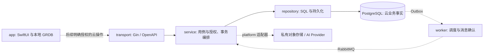

# OOTD 后端架构决策

## 本地数据库与中间件边界

用户 2026-09-14 指定接入后进一步明确：日常开发复用本机已经安装的 PostgreSQL、MinIO、Redis、RabbitMQ，减少容器和配置层。默认连接 loopback 标准端口，已有自定义账号或端口时通过测试进程环境覆盖；测试不解析仓库 `.env`。根 Compose 仅保留显式 `isolated-env` 备用环境，不自动启动，也不清空本机服务或已有卷。

Go 仍只有一个 module/binary；API 继续连接 PG，健康契约不变。连接其他三项的真实用例当前是能力验证，先放 tests，不增加空 platform adapter/worker 或通用事件总线。后续业务按 PG transaction → Outbox relay → RabbitMQ → 幂等 worker → MinIO/PG 结果运行；Redis 丢失不得丢任务。资产字节与元数据分离，不在消息中传照片或签名 URL。

服务协议测试直接连接本机进程，使用随机命名合成资源并注册有界清理；不可达、鉴权失败或协议不符均失败。可选 Compose 使用独立端口、卷和 0600 的忽略凭据文件；停止时默认保留卷，不提供自动 purge。单机、明文 loopback 与本机 MinIO 只构成开发证据，不关闭生产 TLS、HA、支持和删除链门禁。

## 当前MVP组件与代码边界

2026-09-14 复核按 [Design 01 最小技术栈](01-技术选型.md#当前最小技术栈与开源复用) 执行：当前 API 只有配置、连接、HTTP 与两个健康端点及内嵌文档；保持这些真实职责，不因架构图预建 Service/Repository/worker、通用事件总线或任务框架。

- 本地三维开发不要求后端。后端联调仍按既有启动契约运行 Go API + PostgreSQL；不为 Swagger 新增服务或无数据库启动模式。
- Provider 模型质量实验与持久云任务 POC 分开：前者仅在隔离测试素材和既定准入下运行必要调用；后者以及真实任务接纳必须包含事务、Outbox/Inbox、RabbitMQ、恢复与删除。减少部署前置不削弱已接纳任务的承诺。
- Redis 与 MinIO 按 17-10 接入开发验证，不默认依赖 Redis 锁或 Pub/Sub；FFmpeg 只处理实际视频需求。这些组件目前均未接入业务。
- Atlas 首份业务迁移前验证锁定发行版、命令与许可；Community 的能力不能直接按标准发行版文档推断。SQL 约束、空库/升级/失败恢复检查继续保留，未安装的商业 lint 不能写成已通过证据。
- 优先复用官方数据访问、HTTP 和契约库，接口仅服务实际边界。Gorilla mux 在当前代码中用于 kin-openapi 匹配，不是第二个 HTTP 服务；Testcontainers/Moby 用于隔离测试，不因 go.mod 中包名多就删测试或拆 module。

本轮仅统一选型与启用说明，未改变 17-01/17-09 的已批准运行/文档契约；代码、schema 和 API 均未修改。

后端 MVP 分期与测试服务独立边界以 [Design 14](14-后端MVP与测试边界设计.md) 为准。测试独立是构建、配置、依赖和数据所有权隔离，不增加运行时服务。


## 2026-09-12Swagger部署方式复核

状态：调研完成；用户随后要求按 docs/SOP 开始实现，后端内嵌开发文档方案进入 [17-09](../plan/17-09-后端内嵌接口文档执行计划.md)，契约 approved。仅开放显式启用的本机开发文档，不授权生产文档或新的业务 API。

### 结论与原选型原因

Swagger UI 不要求 Docker。原实现采用官方容器，是为快速提供不依赖 API/PostgreSQL 的本地文档页、固定资源版本并减少首次接入对 Go 路由的影响；这是开发工具的交付选择，不是 OpenAPI 或客户端生成的依赖。先前直接把该方式写成默认操作入口，未充分比较内嵌方案，选型过程需要补足。

长期建议：开发联调由现有 Gin API 提供文档页面和它实际使用的契约；Swift 生成器继续直接读取仓库的唯一 YAML。查看文档与生成请求是两个独立动作，生成请求不应要求 Docker、运行后端或浏览器在线。

### GitHub一手资料

| 核查对象 | 上游证据 | 对本项目的含义 |
| --- | --- | --- |
| 官方分发 | [Swagger UI v5.32.15 installation](https://github.com/swagger-api/swagger-ui/blob/v5.32.15/docs/usage/installation.md) 同时提供 npm、Docker 与直接托管 dist 静态文件；Docker 实际启动 nginx 提供 UI | 无需为 Swagger 独立运行容器，也无需为此增加 React/Node 运行服务 |
| 契约兼容 | [Swagger UI README](https://github.com/swagger-api/swagger-ui/blob/v5.32.15/README.md#compatibility) 列出 5.x 对 OpenAPI 3.1.2 的支持 | 可保持现有版本与契约，仅更换静态资源的承载方式 |
| Go/Gin 内嵌 | [Gin 官方 assets-in-binary 示例](https://github.com/gin-gonic/examples/blob/master/assets-in-binary/main.go) 使用 embed.FS、http.FS 与 StaticFS；[Go 1.26.5 embed 源码文档](https://github.com/golang/go/blob/go1.26.5/src/embed/embed.go) 说明编译时嵌入 | 现有 Go/Gin 即可实现，不需要独立 Swagger 服务或额外业务框架 |
| 常见 gin-swagger 用法 | [README](https://github.com/swaggo/gin-swagger/blob/master/README.md) 主要演示注解 → swag init → docs.go/swagger.json/swagger.yaml，介绍为 Swagger 2.0 工作流；[swagger.go](https://github.com/swaggo/gin-swagger/blob/master/swagger.go) 同时允许配置 URL 指向契约，默认 doc.json 从 swag.ReadDoc 读取 | 不能照搬注解生成链路；也不能据此断言 UI 包装器完全不支持外部 OpenAPI。只托管现有契约时，直接用官方静态资源更容易控制版本，包装器价值有限 |
| Swift 生成 | [Apple Generator 1.13.0 README](https://github.com/apple/swift-openapi-generator/blob/1.13.0/README.md) 明确从 YAML/JSON 文档生成，在构建时执行 | 输入是唯一契约，不是 Swagger HTML，也不依赖文档服务器 |
| UI 配置 | [Swagger UI configuration](https://github.com/swagger-api/swagger-ui/blob/v5.32.15/docs/usage/configuration.md) 描述 validatorUrl、supportedSubmitMethods、queryConfigEnabled 等配置 | 换成 Gin 托管后仍需显式保留已定配置，不能依赖容器环境变量自动生效 |

以上通过 GitHub 插件读取，日期 2026-09-12。版本相关文档固定到当前 tag；Gin 示例与 gin-swagger 为当日默认分支快照，只用于论证方式，不作为新增依赖版本锁。

### 仓库核查与方案比较

本小节为替换实施前的仓库快照；当前运行方式见下文“当前内嵌实施契约”，原 Compose 已退役。

- `backend/compose.openapi.yaml` 当前只启动文档 UI，回环端口 18108，只读挂载工作树 YAML；容器没有参与生成 Swift。
- 原显式生成入口调用 Xcode 缓存的生成器并传入本地 YAML/config，没有 Docker 或 HTTP 文档输入；当前仓库已移除脚本封装，改由 Xcode Build Tool Plugin 与直接构建命令验证。
- `backend/main.go` 已通过 go:embed 嵌入同一 YAML，再传给 NewRouter 做校验；可直接复用该字节流提供原始契约，不必创建第二份文件。当前文档容器展示工作树版本，运行后端使用编译时版本；如果改完契约未重建后端，两者可能不同，单一源文件本身不能证明运行版本一致。
- 当前 API 在监听前初始化 PostgreSQL。内嵌后，使用 API 的文档页面也依赖 API 正常启动；不能声称它与原独立文档容器同样不依赖数据库。纯前端生成保持不受影响，不为文档绕过数据库启动或修改健康语义。

| 方案 | 额外运行负担 | 优点 | 代价与适用边界 |
| --- | --- | --- | --- |
| 当前独立 Docker UI | Docker daemon、文档容器与独立端口 | API/数据库未启动也可浏览；官方完整分发容易锁版 | 首次拉取镜像、启停和挂载维护；联调不同源；工作树与运行 API 版本可能不同 |
| Gin 内嵌官方静态资源（建议作为开发联调入口） | 无新增服务，复用 API 进程与端口 | 文档与 API 同源；可展示运行二进制实际契约；保持单二进制 | 增加静态资源体积与升级维护；需要 API 启动；嵌入契约变更后需重建 |
| 后端页面引用 CDN | 无新增服务，但浏览器依赖外网 | 本地资源少，接入短 | 离线不可用、增加第三方运行依赖；不作为本项目默认方案 |
| gin-swagger 包装器 | 若干 Go 依赖，无独立容器 | 有现成路由包装和配置 API | 常见注解工作流不符合唯一契约规则；只做资源托管时不是必要依赖 |

### 可执行迁移建议与验收边界

1. 保留唯一 `backend/openapi.yaml`；锁定官方 dist 的必要 HTML/CSS/JS、许可证与资源哈希，通过 Go embed 打包。只引入文档资源，不创建另一份前端工程，不把整个仓库目录开放为静态目录。
2. 在 transport 注册受配置控制的 `/docs/` 和 `/openapi.yaml`，契约响应复用 main.go 的 apiDocument。开发环境显式启用，默认不注册；生产如需开放继续按根规范另设认证和网络限制，不能把开关本身当作鉴权。
3. 配置由明确的 Config 字段注入，不在 Handler 隐式读环境；启动组装、路由和测试分别更新对应现有文件。`/v1` 业务契约校验不应误拦文档资源，也不应被文档路由绕过。
4. 联调时 same-origin 的 `/v1` 可用于已获准的 Try it out；从关闭状态到启用请求调试需要在执行契约中明确范围，内嵌本身不自动开启。继续禁用外部 validator、授权持久化和 URL 查询配置覆盖。
5. iOS 插件继续读取本地符号链接，生成和编译不要求文档服务器运行；不要改为每次构建获取远程“最新”契约。显式生成脚本仍是辅助检查，现有 MainActor 编译问题独立处理。
6. 新入口验证通过后再退役 Compose 和文档容器管理脚本，历史 17-08 证据保留；新接口验收至少覆盖默认 404、显式启用可读、契约字节一致、静态资源路径限制、原健康路由回归、页面显示和无 Docker 生成。此处定义建议的影响面，不预建新切片或声称已经完成迁移。

以上是 GitHub 调研时的证据范围；随后的实施、测试和退役结果以 17-09 为准，不能用调研代替运行验收。

### 当前内嵌实施契约

`API_DOCS_ENABLED` 默认 false，只接受 true/false；启用时 HTTP_ADDR 必须是回环 IP，不支持对外文档暴露。`main.go` 把 Config 中的 bool 和已嵌入的 apiDocument 传入 transport；`docs.go` 只注册 `/docs/`、必要静态文件、许可证与 `/openapi.yaml`，不开放目录或任意文件路径。根契约字节与 router 校验使用同一版本，原 `/v1` 健康接口不变。

静态资源固定官方 v5.32.15，原始资源随 Go 二进制打包并保留许可证与 SHA256SUMS；初始化脚本禁用请求调试、外部 validator、URL 配置覆盖和鉴权持久化，资源通过同源 CSP 限制。此处无 Service/Repository、数据库 migration、账号或后台任务。默认关闭和回环限制属于本切片边界，线上认证文档仍未实现。

## OpenAPI接口文档与前端生成SOP

当前范围见 [17-09 执行计划](../plan/17-09-后端内嵌接口文档执行计划.md)，历史 Docker 工具记录保留在 superseded 的 17-08。

1. 先修改唯一 `backend/openapi.yaml`，定义稳定 operationId、输入、成功响应与错误结构，通过后端契约校验；不同 HTTP 错误分别提供符合 Handler 的示例。
2. 配置本地 DATABASE_URL，在 backend 目录执行 `API_DOCS_ENABLED=true go run .`，打开 `/docs/`。契约更新后重建/重启，页面与原始 `/openapi.yaml` 对应运行二进制实际版本。
3. iOS 通过既有符号链接与 Build Tool Plugin 生成 Types/Client；使用 `xcodebuild` 直接编译验证，独立于 Docker、文档和 API 的运行状态，不复制到源码或手改 DTO。
4. App 服务适配器使用生成 Client，配置实际 API server URL；View 不直接发网络请求。`/docs/` 是开发文档入口，API base path 仍为 `/v1`。
5. 分别记录契约校验、页面、运行契约一致性、Swift 生成、App 编译与 Go Handler 测试，互不替代。

文件职责：Config 解析 DocsEnabled；main 显式组装；transport/docs.go 提供精确静态路由与原始契约；swaggerui 保存锁定资产及许可证。不存在文档专用 Service/Repository、第二份 YAML、独立部署进程或兼容旧端口。原 Compose 和管理脚本已由 17-09 移除。

## 状态

2026-09-08 后续实施授权：用户要求推送既有基线后开始后端。当前首个切片为 [17-01 运行与健康契约](../plan/17-01-后端服务启动与健康契约执行计划.md)；云业务仍分期，当前 api 实现不建立空 worker/all、账号或数据库表。下文架构是最终边界，各功能按切片启用。

已确认，2026-08-30。

框架与精确版本以 [`01-技术选型.md`](01-技术选型.md) 为唯一事实源；异步任务细节见 [`10-OOTD服务端与异步任务设计.md`](10-OOTD服务端与异步任务设计.md)。

## 后端方案总览

采用前后端分离的 Go 模块化单体。`app/` 负责 SwiftUI 与本地 GRDB 数据，`backend/` 通过唯一 REST/OpenAPI 契约提供后续云能力；一个 Go module、根 main.go、一个 binary 和一个镜像，按 API/worker 角色分进程部署。目录边界用于约束依赖，不为每个业务拆服务或项目壳层。



图中描述目标架构，业务 Service/Repository、消息及外部供应商尚未启用。当前健康 HTTP 直接调用 platform 的窄 Probe 接口，无需空业务转发层。

| 当前已有 | 仍是设计与后续范围 |
| --- | --- |
| 配置校验、PostgreSQL 连接/版本探测、live/ready、请求 ID、受控错误日志、有界退出 | 账号/会话、目的同意、业务 schema、媒体血缘、生成任务、配额、删除编排 |
| Go 单元/契约/race、真实 DB 故障恢复、实际进程失败/退出验证 | RabbitMQ + Outbox/Inbox、Redis、供应商/对象 SDK、同步和远程 Catalog |
| 单镜像构建、非 root/只读资源受限容器验证 | 完整生产 CI、SBOM/许可证/漏洞、容量/TLS/高可用及发布验收 |

业务数据权威来源是 PostgreSQL，媒体字节属于私有对象存储，Redis 只放可重建数据。本地穿搭事实首版留在 app；Three.js 的局部渲染也在客户端，后端不处理实时 morph/换装或布料物理。Swift Client 隔离冲突已由获批 ThenTransport 解决，正式编译证据归验收 17；本地与云业务仍分阶段。

需求映射见 [PRD 17](../prd/17-云端生成与任务管理需求.md#后端服务需求与阶段边界)，逐文件规则、事务/异步和 SOP 见下文；实际状态与证据仅在对应 plan/acceptance 更新。

## 决策摘要

2026-09-08 编码前收敛：沿用既有后端技术基线，以下规范固定未来后端实现的边界。用户已确认首版是本地 3D 穿搭闭环，云端 AI 与多设备同步分期上线；因此“先确定后端”不等于“首版必须启动全部服务”。该次决策只修订文档。随后 17-01 已写入配置、健康和数据库连接代码；本轮按用户要求先补齐目录职责与开发 SOP，不继续扩展业务实现。

- 后端采用 Go 模块化单体，不拆微服务。
- 使用一个 `go.mod`、一个 `main.go`、一个可复现 OCI 镜像。
- HTTP 使用 Gin，数据访问使用 GORM v2 Generics，并为复杂 SQL 保留受控 raw SQL/pgx 逃生口。
- PostgreSQL 是业务事实源；schema 使用 Atlas versioned SQL migration。
- RabbitMQ 承载 AI 与媒体长任务，PostgreSQL Outbox/Inbox 保证业务幂等和可恢复性。
- Redis 只承担可重建缓存、限流和状态通知，不保存唯一业务事实。
- 私有对象存储保存媒体字节，PostgreSQL 保存资产身份、归属、用途、状态、血缘和生命周期。
- OpenAPI 3.1.2 是 iOS 与 Go HTTP 边界的唯一契约。

## 进程与部署边界

同一个二进制支持三种角色：

| `APP_ROLE` | 启动内容 | 使用场景 |
| --- | --- | --- |
| `api` | Gin HTTP、健康检查、同步 API | 生产 API 实例 |
| `worker` | Outbox relay、RabbitMQ consumers、janitor | 生产异步实例 |
| `all` | API 与 worker 共用进程生命周期 | 本地开发、集成测试、小规模 POC |

生产默认把 `api` 和 `worker` 作为同一镜像的独立进程部署，以隔离 GPU/供应商延迟、媒体 CPU、队列积压与用户请求延迟。二者共享代码与数据库契约，不通过进程内 channel 交换业务任务。

这不是微服务：没有独立仓库、独立领域数据库、跨服务 RPC 或不同版本的业务契约。只有资源和故障域分离。

## 目标目录

顶层固定 `backend/` 与 `app/`。后端保持一个 Go module 和根目录 `main.go`，不增加 `server/`、`src/`、`cmd/api/` 或内部项目壳层。以下是本项目的工程选择，不是 Go 官方强制目录标准；Go 支持根目录命令和 `internal` 私有包，[官方布局建议](https://go.dev/doc/modules/layout)作为依据。

仓库根目录的 `docker-compose.yml` 与 `docker-compose-env.yml` 保持标准语义命名，只提供显式 `isolated-env` 备用环境；日常开发和服务测试直接使用本机已安装的 PostgreSQL、MinIO、Redis、RabbitMQ。`.env.example` 仅描述备用容器凭据格式。开发者直接使用 `brew services`、`go test`、`docker compose` 或 `docker build`，不增加脚本封装。后端镜像仍只在 `backend/Dockerfile` 定义，因为 Docker 构建上下文仅包含 Go 后端；不为 iOS 客户端创建容器，也不复制第二份根 Dockerfile。Swagger 随 Go binary 内嵌，不建立独立 Swagger 服务。

### 当前真实结构

2026-09-14 工作树已有以下文件：

```text
backend/
├── Dockerfile / .dockerignore       # 17-07 单镜像构建与上下文限制
├── main.go                         # 组装、启动、信号与退出
├── go.mod / go.sum                 # 唯一模块与依赖锁
├── openapi.yaml                    # 唯一 HTTP 契约
├── .env.example                    # 占位配置说明，不自动执行
├── README.md
├── internal/
│   ├── transport/
│   │   ├── router.go               # 健康路由、校验与错误映射
│   │   ├── docs.go                 # 显式启用的内嵌 Swagger/OpenAPI
│   │   └── swaggerui/              # 锁定的离线文档资产与许可证
│   └── platform/
│       ├── config/                 # typed config 与字段校验
│       ├── database/               # PostgreSQL 连接、版本检查与关闭
│       └── httpserver/             # HTTP 资源边界和有界退出
└── tests/
    ├── runtime_integration_test.go # 真实 PostgreSQL 与实际二进制验证
    ├── services_integration_test.go # 本机四项服务协议验证
    └── container_integration_test.go # 实际本地镜像受限运行验证
```

与后端相邻的仓库级开发入口为：

```text
docker-compose.yml          # 可选隔离环境的标准 Compose 入口
docker-compose-env.yml      # 四项依赖的 isolated-env 备用编排
.env.example                # 备用容器凭据格式，不含可用凭据
```

当前没有业务 Repository、用户表或消息消费者；17-07 已实现本地 OCI 构建与运行验证；依赖出现在 go.sum 不代表能力启用。数据库健康检查只验证连接，不能当作 migration 或业务 schema 验证。

### 按需增长的职责表

| 路径 | 应放内容 | 禁止职责 | 建立时点 |
| --- | --- | --- | --- |
| `main.go` | 配置读取、精确依赖组装、角色选择、启动与逆序清理 | 路由细节、SQL、业务状态机、隐式服务容器 | 已有 |
| `internal/model/` | 纯领域类型、值对象、枚举、状态转换不变量、领域错误 | GORM/JSON tag、HTTP、数据库连接、Provider DTO | 第一个业务用例 |
| `internal/service/` | 业务用例、资源授权、同意和配额判定、事务编排；消费方最小接口 | Gin/GORM/AMQP 类型、网络适配细节、万能 CRUD | 第一个业务用例 |
| `internal/repository/` | GORM record、领域映射、参数化 SQL、owner 过滤、事务端口实现 | HTTP/队列发布/供应商调用、独立业务状态机 | 第一份业务 schema |
| `internal/transport/` | Gin 路由、请求/响应 DTO、格式校验、认证适配、领域错误到 HTTP 映射 | 业务 SQL、业务事务、后台生成任务 | 已有健康路由；按功能加文件 |
| `internal/worker/` | envelope 校验、领取调度、consumer ack/nack、重试调度、relay/janitor 循环 | 复制 Service 的状态规则、无主 goroutine、消息字节中的媒体 | 首个异步切片 |
| `internal/platform/` | 数据库/队列/对象/Provider 的连接与协议适配、配置、日志、监控、进程生命周期 | owner/同意/额度等业务决策、通用工具堆积 | 只创建当前实际使用的适配包 |
| `migrations/` + `atlas.hcl` | 审查过的 SQL、checksum、迁移环境配置 | 自动启动 DDL、第二份 schema.sql、实际凭据 | 首份业务 schema；当前保留说明 |
| 同包 `*_test.go` | 单元、Handler 契约、Repository 集成测试 | 复制一套业务算法作期望值、真实用户夹具 | 随对应代码提交 |
| `tests/` | 跨包、实际进程与多依赖故障测试 | 搬入全部单元测试或另建测试框架 | 已有运行集成测试 |
| `Dockerfile` / `.dockerignore` | 单一镜像构建、产物与权限边界 | 第二套入口、应用启动时迁移、开发密钥 | 进入容器部署切片时 |

文件划分按真实职责：例如 `service/generation.go` 保存生成用例及其消费接口；`repository/generation.go` 保存持久化实现与私有 record；`transport/generation.go` 保存 HTTP 输入输出映射。只有类型确实被多个包消费才放进 `model`，不能机械创建 Entity/DTO/VO/BO 四份同构模型。上述文件名只是放置规则，本轮不创建空文件。

`platform/database` 可以建连接、查版本、执行健康探测；业务 SQL 一律归 Repository。平台层的数据库健康检查属于进程职责，不为它新建 Service/Repository 转发层。HTTP DTO 到领域类型、领域类型到 GORM record 的转换放在各自边界文件内，不增加独立 mapper/factory 包。

### 包边界与增长规则

- 首次实现按上述层内平铺业务文件，不给每个实体复制一套目录树。单个目录就是一个 Go package，文件划分本身不能强制隔离业务模块。
- 当不同业务拥有独立不变量且包级耦合已妨碍审查/测试时，才将对应层拆成 `service/generation` 等子包；由切片记录具体问题与 import 变化，不按目录数量或代码行数机械拆包。
- 不新增 `common`、`utils`、`base`、`manager`、`facade`、`ports` 全局杂物层，不引入反射 DI、自动注册或为单个构造函数包装启动框架。
- 接口由消费方定义。transport 的健康探测接口留在 transport；业务存储/Provider 接口留在 service，具体实现返回领域结果。只在替换实现、测试隔离或技术边界需要时使用接口，不为每个 struct 建接口。
- 业务状态机归 model/service；worker 只调度并调用用例，避免 HTTP 创建、consumer 重试、janitor 清理出现三套状态规则。
- 首个业务切片加入基于 Go import 的分层检查：model 禁止框架依赖，service 禁止 transport/repository 实现及数据库/AMQP SDK，repository 禁止 transport/worker。该检查目前未实现，不能只凭目录树声称架构已被自动验证。

### 现有文件的实现契约

以下路径均相对 `backend/`。本表约束“文件应该做什么”，执行状态和待办完成证据只在 17-01 维护；不因本表出现某项要求便视为已实现或通过。

| 文件 | 必须包含的功能与输入输出 | 实现边界及后续动作 |
| --- | --- | --- |
| `main.go` | `main` 建立日志和进程退出码；`run` 读取配置，建立 signal context，组装数据库、router、listener，启动并收尾 | 只接线，不写 Handler 或业务 SQL。当前仅 api；worker/all 实现时按角色组装，不能用空循环报成功。启动失败和信号退出均须有进程测试 |
| `go.mod` | module 路径、Go/toolchain、实际使用的直接依赖 | 新依赖先回写 Design 01；禁止新 module 或未经选型的同类库 |
| `go.sum` | Go 实际解析依赖的完整校验和 | 随 go mod 操作更新，不手工删校验行，不将出现的间接依赖视为已启用服务 |
| `openapi.yaml` | operationId、输入/输出 schema、错误和安全要求；当前仅两条 health operation | 唯一契约；新增业务先定义并验证，再编码。Swift 编译未通过时不能声称契约交付完成 |
| `.env.example` | 支持的配置名、默认值和无敏感信息的示例 | 与 config 同步；数据库密码只用占位值。应用不执行 shell 环境文件，禁止在示例中加入真实连接串 |
| `AGENTS.md` | 后端编码入口和文件放置约束，继承根目录规则 | 只引用 Design 01/02 和原执行计划，不建立第二套规范 |
| `README.md` | 本地启动、必要依赖、验证命令、当前边界与规范入口 | 不复制第二份版本表、字段 schema 或执行任务状态 |
| `internal/platform/config/config.go` | `Load(getter)` 返回经过校验的 Config 或仅含字段名/受控原因的错误；校验角色、地址、DB URL/TLS、连接池和超时 | 区分未配置与显式空值；不建连接、不打印配置、不包含业务默认额度。新增字段同时补示例与测试 |
| `internal/platform/config/config_test.go` | 默认值、缺失/空值、边界、非法组合、URL/TLS 白名单、错误脱敏 | 通过传入 getter 隔离环境；不依赖开发机真实变量 |
| `internal/platform/database/database.go` | `Open(ctx, cfg)` 返回连接池；配置 pool、首次连通和 PostgreSQL major 检查；`Probe(ctx)`、`Close()` | 失败释放已打开资源；当前 SQL 仅版本探测。第一份 schema 出现时补 schema 兼容设计；不在此加入业务 CRUD/AutoMigrate |
| `internal/platform/httpserver/server.go` | `Serve(ctx, listener, handler, timeout, drain)` 管理 HTTP 超时、监听循环、停止接纳、有界 Shutdown/强制 Close 和错误回收；监听异常时也关闭活动连接 | 不自行读环境或注册业务路由；listener 与服务 goroutine 由本函数拥有，退出不泄漏 |
| `internal/platform/httpserver/server_test.go` | 活动请求完成、取消触发 drain、退出超时强制断开与服务返回 | 使用真实本地 listener 与同步信号；失败路径也清理测试资源 |
| `internal/transport/router.go` | `NewRouter` 校验并装配契约、Gin、request ID、安全响应头、脱敏错误日志；health GET、400/404/405/500/503；`Drain` 切换接纳状态 | 仅通过 DependencyProbe 探测数据库；不 import database 实现。当前短小健康逻辑留在同文件，不提前拆 router/handler/DTO 包 |
| `internal/transport/router_test.go` | liveness 不碰数据库，ready 正常/失败/超时/退出，未知方法/路径/输入，响应 schema 正负例、日志不泄露 | 成功响应和错误响应均与唯一契约核对；不能只断言 HTTP 200 |
| `tests/runtime_integration_test.go` | 隔离 PostgreSQL，构建并启动实际 binary，非法配置/角色/凭据/端口占用的非零退出与脱敏、SIGTERM 退出，数据库 pause/unpause 下 ready 200→503→200、live 保持 200 | 合成凭据、固定镜像、独占资源和有界清理；不接触开发共享/生产数据库。未覆盖场景单列，不把恢复用例扩称灾备验证 |
| `migrations/*.sql` + `atlas.sum` + `atlas.hcl` | schema 唯一来源、migration 评审/升级/恢复步骤 | 首份 schema 获批时成组建立；此前不保留空目录或占位说明 |

### 后续目录的功能与文件落点

本节是开发前的文件放置约定，不是创建列表。当前不存在的文件必须等对应功能进入已批准切片后才创建；同一职责可以先保留在一个业务文件中，不要求逐行拆文件。

| 目录及建议文件 | 包含的具体功能 | 编码前必须确定 | 必须随实现交付 |
| --- | --- | --- | --- |
| `model/identity.go`、`service/identity.go`、`repository/identity.go`、`transport/identity.go` | 账号状态、会话建立/轮换/撤销；验证外部身份后映射内部用户；owner 与会话存储、HTTP 登录/退出映射 | 身份校验协议、token 生命周期、账号注销状态与 API；本地不自动注册云账号 | 登录失败、轮换重放、撤销后访问、跨用户负例；不自写密码/签名算法 |
| `model/consent.go`、`service/consent.go`、`repository/consent.go`、必要的 `transport/consent.go` | 授权目的、政策版本、授权快照与撤回；业务调用消费有效同意 | 同意目的、有效性/撤回语义、记录最小化；不是每个内部规则都需要 HTTP endpoint | 旧政策、目的不匹配、撤回与任务接纳竞态 |
| `model/media.go`、`service/media.go`、`repository/media.go`、`transport/media.go` | 上传意图、finalize 校验、owner/用途/版本/血缘、读取许可 | 类型/字节/像素限制、存储地域、保留期、上传 URL 期限与清理方式 | 越权、重复 finalize、对象缺失、校验失败和孤儿清理；上传开放同时交付删除链 |
| `model/generation.go`、`service/generation.go`、`repository/generation.go`、`transport/generation.go` | 任务状态、输入快照、创建/查询/取消、结果提交与过期拒绝 | 状态转移表、幂等、错误与取消语义、deadline、Provider 不确定结果策略 | 并发创建、同 key 不同请求、过期租约、迟到结果和删除竞态 |
| `model/quota.go`、`service/quota.go`、`repository/quota.go` | 额度预占/释放/结算、成本接纳限制 | 额度单位、计费事件、预占期限、结算幂等及对账 | 与 job/Outbox 同事务验证；重复结算不会多扣，不创建未经批准的付费规则 |
| `model/deletion.go`、`service/deletion.go`、`repository/deletion.go`、`transport/deletion.go` | 删除接纳、隐藏/停止处理、血缘遍历、清理进度与证明 | 删除范围、备份窗口、供应商能力、失败状态及恢复 | 源/派生/缓存/对象版本/供应商清理；重复请求与清理失败恢复 |
| `service/transaction.go`、`repository/transaction.go` | 消费方事务端口、事务内窄 Repository 集合、同连接提交/回滚 | 首个跨表用例需要哪些存储能力；避免泛化事务容器 | 故意在中途失败，验证业务/幂等/额度/Outbox 无部分提交 |
| `repository/outbox.go`、`repository/inbox.go` | 事件持久化、领取、去重、租约/fencing 条件更新 | 唯一约束、领取索引、重试/保留和锁预算 | 真实 DB 并发领取和过期拒绝；不在 Repository 内发布消息 |
| `worker/relay.go`、`worker/generation.go`、`worker/cleanup.go` | 发布已提交事件、消息分派、租约调度、清理循环 | envelope 版本、ack/nack 时点、重试预算、并发上限和停止方式 | broker 断连、重复投递、DLQ、信号退出；业务状态仍调用 Service |
| `platform/messaging/` | RabbitMQ 连接、确认、受控重连和关闭 | topology、quorum queue、prefetch、连接/重试预算 | 真实 RabbitMQ 集成，不实现第二套任务事实源 |
| `platform/objectstore/` | 私有对象签名、读取/写入/校验/删除协议适配 | SDK 精确版本、区域、权限、URL 限制与对象版本策略 | adapter 契约与实际隔离存储删除证明；不做业务 owner 决策 |
| `platform/provider/` | AI Provider 请求、查询、取消与错误归类 | 供应商、地域、处理目的、幂等/查询能力、单次和总预算 | 合成输入、超时/未知结果/删除验证；不把供应商 DTO 传入 Service |
| `platform/cache/`、`platform/observability/` | Redis 的明确缓存/限流用途；trace/metric 初始化与关闭 | TTL/回源上限、失效策略；低基数指标、脱敏与 exporter | 故障降级与观测泄露测试；没有真实使用点不建包 |
| `migrations/*.sql`、`migrations/atlas.sum`、`atlas.hcl` | 业务表、约束、索引、迁移顺序与环境配置 | 获批 schema、锁/回填/兼容窗口、恢复点 | 空库/旧库升级、checksum/drift、约束负例与恢复证据 |
| `Dockerfile`、`.dockerignore` | 单 binary 的不可变镜像，构建/运行阶段与最小权限 | 基础镜像 digest、运行身份、资源限制及构建参数 | 镜像启动/退出、依赖/SBOM/许可证检查；不把密钥和媒体夹具打包 |

跨功能事务由一个明确用例编排，不能让 generation、quota、deletion 的 Service 相互循环依赖。身份/同意/删除的基础设计先于任何真实用户媒体上传；任务、异步、远程 Catalog、同步均不因本表存在而获准提前上线。

远程 Catalog、Wardrobe/Outfit/Wear 同步仅保留逻辑模块边界，目前不分配具体源码文件，也不预建数据库表。其用户行为和同步冲突协议尚须独立切片确定。

### 每个新文件的编码前检查卡

在所属 FF-SS 执行计划的影响面或任务中填写以下信息；直接引用本节已有条目即可，不另建一份“规格”文件：

1. **功能来源**：PRD 需求 ID、用例及为什么现在需要该文件。
2. **路径与包名**：新增/修改哪个文件，已有文件为什么不足；它属于哪个真实职责。
3. **输入与输出**：消费的主体、命令、配置/接口和返回结果/错误；技术 SDK 类型是否越界。
4. **所有权与副作用**：拥有的状态、读写表/对象/消息、事务边界及资源关闭者。
5. **失败与安全**：授权、幂等、超时、取消、重试、删除及脱敏要求；不适用时写理由。
6. **完成证据**：对应测试文件、成功/失败场景、真实依赖要求以及回滚方式。

未明确功能来源或只做无意义转发的文件不创建。变更文件职责时同步本设计；任务进度只更新原执行计划，避免文档中出现两份不同状态。

## 依赖方向

```text
Gin Handler ──> Service ──> Repository interface ──> GORM/PostgreSQL
                      └──> Job publisher interface ──> Outbox
Worker consumer ──> Service ──> Provider/Object store interfaces
main.go ──> 组装以上用例与 repository/platform 具体实现
```

约束：

- Handler 不包含业务规则，不开启数据库事务，不直接访问 GORM。
- Service 不接收 `*gin.Context`、`*gorm.DB`、AMQP Delivery 或供应商 DTO。
- Repository 不回调 HTTP，不发布 RabbitMQ，不执行外部模型请求。
- 外部服务调用在数据库事务之外执行；结果使用短事务和 fencing token 提交。
- Domain struct 不实现 Active Record，也不依赖框架基类或全局容器。
- 上图是调用方向，不是 Service import 具体实现的许可；repository/platform 实现 Service 所消费的窄接口，main 注入。

## HTTP 边界

- 使用 `gin.New()` 并显式注册中间件；中间件顺序由 01 和 10 号设计固定。
- 每个公开 operation 在 `backend/openapi.yaml` 中拥有稳定 `operationId`。
- HTTP request/response 使用手写纯 Go struct，只在 transport 边界携带 JSON/validation tag。
- iOS 由 OpenAPI 生成 Client；Go 不从 OpenAPI 生成 server 或第二份 DTO。
- contract test 必须验证路由、参数、body、状态码和响应 schema。
- 长任务创建返回 `202`；状态读取、取消和删除是独立幂等 operation。

## 数据访问与事务

### GORM 负责

- 单表 CRUD、简单关联、稳定过滤与游标分页。
- 显式字段更新、乐观版本和普通唯一冲突。
- 在同一个 `*gorm.DB` transaction handle 上协调多个 Repository。

### raw SQL / pgx 负责

- 推荐候选的 CTE、窗口函数和执行计划敏感查询。
- Outbox `FOR UPDATE SKIP LOCKED` 领取。
- 批量回填、`COPY`、复杂聚合和 GORM 无法稳定表达的查询。

边界不是“ORM 或 SQL 二选一”。任何 raw SQL 仍在 Repository 内、参数化、接收 `context.Context`、有真实 PostgreSQL 集成测试和执行计划预算。

### schema

- migration SQL 和 `atlas.sum` 是唯一生产 schema 账本。
- GORM model 仅用于运行时映射；`AutoMigrate` 不能修改共享或持久环境。
- 生产迁移由独立部署作业执行，应用身份没有 DDL 权限。
- 破坏性变更使用 expand/contract，并在计划文档记录数据转换、回滚和验证。

## 异步一致性

### 创建任务

同一 PostgreSQL 事务写入：

1. 幂等记录。
2. 业务 job 与资产元数据。
3. 配额或成本 reservation。
4. Outbox event。

事务提交后 Outbox relay 发布 RabbitMQ；broker 不可用不会丢失已提交任务。

### 消费任务

- consumer 使用 message ID 写 Inbox 并领取带 fencing token 的数据库租约。
- 外部 AI、对象存储和 FFmpeg 工作在事务外执行。
- 结果对象先写临时键并校验；随后短事务核对租约、更新任务/资产/成本并写后续 Outbox。
- provider job 使用稳定幂等键；worker 重启优先查询既有供应商任务，不盲目重复计费。
- ack 表示工作已被 PostgreSQL 可靠接管或结果已提交，不表示跨系统恰好一次。

## 媒体边界

- 客户端先做解码、方向修正、裁剪、去 EXIF/GPS 和质量门，再申请上传。
- API 只签发短时、用途受限的对象存储 URL，不代理大图片字节。
- worker 只通过资产 ID 获取已授权输入，不接受消息中的任意 URL。
- 原图、净化图、供应商输入、供应商输出、缩略图和动态帧是不同资产版本。
- 删除任务优先级高于普通生成，必须覆盖对象版本、供应商任务、缓存和派生血缘。

## 配置、日志与可观测性

- 配置来自环境与密钥服务，启动时映射为 typed struct 并完整校验；不引入 Viper。
- 日志使用 `log/slog` JSON；trace/metrics 使用 OpenTelemetry。
- 日志与 trace 只记录稳定 ID、状态、耗时、重试和错误类别，不记录图片 URL、用户文本、令牌或供应商正文。
- 最低健康检查包括 liveness 与 readiness；worker 另暴露消费存活、队列积压、租约过期和 DLQ 指标。
- API 与 worker 共用 trace/correlation ID，便于从用户请求追踪到 Outbox、消息和供应商任务。

## 测试策略

- Service：标准 `testing` 的领域和状态机测试，与所属包同目录。
- Handler：同包 `httptest` + OpenAPI contract test。
- `backend/tests`：独立黑盒包；`services` 连接本机 loopback 服务，`integration` 使用 Testcontainers PostgreSQL，`container` 验证显式构建镜像。测试配置只使用 `THEN_TEST_*`，详见 Design 14。
- Repository：首个业务 schema 后由 integration 测试启动真实 PostgreSQL，验证事务、约束、隔离和 raw SQL。
- Worker：首个异步切片后使用真实 RabbitMQ/Redis 集成测试，覆盖重复、延迟、乱序、断线重连、DLQ 与优雅退出。
- Migration：从空库逐条应用、checksum、旧版本升级、drift 与回滚演练。
- 媒体：固定合成素材验证格式、尺寸、资源上限、FFmpeg 参数白名单和删除血缘。

## 重新评估触发器

- 队列长期积压、单任务 fan-out 或审计重放超过 RabbitMQ 适用范围时，才评估 Streams/Kafka。
- GORM SQL 多次突破延迟预算或升级造成回归时，逐 Repository 转为 raw SQL/pgx，不整体更换架构。
- Redis 仅剩低价值缓存且运维成本过高时删除依赖，不能把业务事实迁入 Redis 来证明其必要性。
- 单 module 的编译、所有权或发布耦合成为可量化瓶颈时，才评估拆服务。
- 多租户隔离审计发现应用层 `user_id` 条件不足时，再评估 RLS 作为纵深防御。

## 编码前固定的模块职责

下表定义逻辑模块，不对应独立进程。`model`、`service`、`repository` 可在需要时按模块建立子包；只有真实用例进入获批切片时才创建代码。

| 模块 | 拥有的规则 / 数据 | 允许启动的阶段 |
| --- | --- | --- |
| Identity | Apple 登录校验、内部用户、设备会话、刷新令牌轮换、退出与注销状态 | 首个云功能；本地用户不创建匿名云账号 |
| Consent | 目的、政策版本、逐次授权快照、撤回状态 | 云处理前；登录不能代替同意 |
| Media | 上传意图、校验、资产版本、用途、血缘、读取授权 | 首次云媒体；不保存全部本地衣橱副本 |
| Generation | 静态/动态任务、输入快照、状态机、供应商执行与恢复 | 对应云生成独立获准后；本地 3D 换装不创建 job |
| Quota | 预占、释放、结算、全局成本停止接纳 | 云生成；技术额度不代表付费权益 |
| DataControl | 删除请求、撤回后的停止接纳、供应商/对象/备份清理证明 | 与首个云数据同时交付，不能晚于上传功能 |
| Catalog | 自有授权角色与服装版本、兼容声明、发布/撤回、下载清单 | 首版由 App 内置资源清单提供；远程资产分发另行启用 |
| Wardrobe / Outfit / Wear | 云端结构化衣物、组合快照、计划、实际记录、反馈 | 多设备同步获准后；首版仅在 GRDB 存在 |
| Sync | 游标、版本冲突、墓碑、设备增量与恢复 | 独立同步阶段；不在生成接口中暗中上传本地数据 |
| Operations | 运行配置、健康、告警、脱敏审计、受控回放、资产发布工具 | 对应后端开始运行时；不建设面向消费者的管理功能 |

首版需要资产制作、许可证和随包发布流程，不需要在线素材商城或完整 Web 管理后台。后续内部管理优先使用鉴权 CLI/部署作业；如确需管理页面，再定义角色、操作审批和审计契约，不直接开放数据库编辑。

### 领域对象与所有权

| 事实 | 首版所有者 | 后续云端边界 |
| --- | --- | --- |
| 角色参数、选中服装、编辑草稿 | Swift 用例 + GRDB | 同步获准才复制结构化快照；JS 状态不作为事实源 |
| 真实衣物与视觉模板关联 | GRDB；两种 ID 独立 | 云生成只获得本次明确选择的必要输入，不推导完整衣橱 |
| rig / morph / 服装模板版本 | 随 App 发布的不可变资产包 | Catalog 管理后续不可变版本；不覆盖已保存历史引用 |
| 计划、实际穿着、反馈 | GRDB，独立实体 | 同步必须保留区分、版本和删除语义 |
| 云身份、同意、任务、配额、删除状态 | 首版不存在 | PostgreSQL 是唯一权威来源 |
| 媒体字节 | 本地受保护文件 | 获授权的云副本存私有对象存储，状态归 PostgreSQL |

### 分层、接口与事务约定

- `main.go` 只做 composition root：读取配置、组装精确依赖、选择角色、启动和退出。使用显式构造函数，不引入全局 service locator、反射 DI 或隐藏单例。
- Service 定义其消费的最小 Repository/Provider 接口及事务端口；实现依赖领域层，领域层不反向 import transport 或 repository 实现。不建包含所有 CRUD 的通用 BaseRepository。
- `WithinTransaction(ctx, callback)` 形式的端口向回调提供事务内的窄 Repository 集合，不向 Service 暴露 `*gorm.DB`、SQL handle 或可在回调结束后使用的连接。业务行、幂等结果、额度账本与 Outbox 必须共享同一连接/事务。
- 跨模块操作通过 Service/显式事务编排；一个模块不绕过另一个模块直接改其表。避免 Service 循环调用，跨域事务由明确的用例协调者拥有。
- Service 返回纯领域结果和可判别错误；Repository 将 driver 错误映射为 not-found、conflict、unavailable 等受控类别。transport 统一转 HTTP，不靠字符串匹配错误决定行为。
- 长任务由 worker 角色拥有，所有 goroutine 有父 context、退出和错误回收；Handler 返回后不继续用请求 context 偷跑任务。
- GORM 泛型 API 已移除 `Save`、`FirstOrCreate` 等含混入口；本项目继续使用显式创建/字段更新和数据库约束，不把可选 CLI 引入为强制依赖。[GORM 官方说明](https://gorm.io/docs/the_generics_way.html)

## API 与数据设计规范

### 契约与编码顺序

1. 在所属 PRD/design 明确用户行为、失败结果、权限、是否离线以及数据生命周期。
2. 在获批切片中列出新增/修改的 operation 与字段，再修改唯一 `backend/openapi.yaml`；Markdown 中的接口族不是第二份 schema。
3. 校验 OpenAPI 3.1.2 及实际使用的 JSON Schema 语义，生成并编译 Swift Client；不要仅通过 YAML 解析便宣称两个工具语义兼容。
4. 实现 Go transport DTO、Service、Repository、Atlas migration 与契约/集成验证；不先手写一套 Swift HTTP model。

OpenAPI `servers.url` 已为 `/v1`，`paths` 使用 `/jobs` 等相对业务路径，组合后才是 `/v1/jobs`，避免重复 `/v1/v1`。身份、上传、任务、删除、未来资产目录和同步分别属于对应接口族；本地角色调参、试衣旋转和基础推荐没有服务端 endpoint。

### 请求、响应与错误

| 项目 | 固定规范 |
| --- | --- |
| JSON 命名 | 业务字段 `snake_case`；Go 导出字段用常规 PascalCase，领域对象不依赖 JSON tag |
| 成功响应 | 直接返回有类型的资源/结果，不统一包一层 `code=0`；列表固定 `items`、可空 `next_cursor` |
| 创建 / 长任务 | 同步资源创建 `201`；持久化接纳长任务 `202`，附 job ID、状态地址与建议轮询间隔 |
| 错误 | 固定 `code`、`message`、`request_id`、`retryable`，可选 `retry_after`；客户端通过 code 本地化，不展示供应商正文 |
| HTTP 分类 | 400 格式错误，401 身份无效，403 已认证但动作不允许，404 不存在或不应泄露的资源，409 版本/幂等冲突，413 过大，415 类型不支持，422 业务输入不满足，429 限流，503 暂不可接纳 |
| 并发编辑 | 可变资源命令携带期望版本；UPDATE 同时匹配 owner、ID、version、可用/删除状态，零行更新返回受控冲突 |
| 幂等 | 有副作用命令显式 key；回放前重新鉴权及授权，不能回放已撤销访问的敏感结果；不重复预占额度 |
| 回调 | 按供应商签名与事件/任务唯一键幂等，不假设第三方会发送本项目的 Idempotency-Key |
| 时间 | UTC RFC 3339 传输；计划/实际穿着单独保留本地日期与原始时区，不能用设备时间作同步排序依据 |
| 分页 | 有界 keyset cursor，稳定复合排序；绑定用户、过滤与排序版本。页大小和请求体上限必须在首个契约中给出具体值 |
| 可空与未知 | 显式 required / null / omission；禁止空字符串、0、false 同时表示未知。枚举扩展要验证旧客户端行为 |

租户授权与幂等重放的严格中间件顺序以 [Design 10](10-OOTD服务端与异步任务设计.md#gin-中间件严格顺序) 为准。云成本预检不替代事务内最终配额检查，读任务状态及取消/删除不因额度耗尽被阻断。[OpenAPI 3.1.2 规范](https://spec.openapis.org/oas/v3.1.2.html)

### PostgreSQL 约束

- 新 OOTD 业务 ID 统一使用应用侧生成的 UUID v4（安全随机源）；API 使用小写带连字符字符串，PostgreSQL 使用 `uuid`，Swift 领域层使用类型化 ID。允许本地离线生成，数据库唯一约束仍必需，ID 不是授权凭据。分页/同步另用明确时间、revision 与稳定排序，不依赖 UUID 排序；既有历史 ID 不因本规则自动重写。选择 v4 是当前无中心离线创建与原生互操作的工程取舍，接受其索引局部性弱于按时间排列 ID，未来按实测再评估。[UUID 标准](https://www.rfc-editor.org/rfc/rfc9562.html#section-5.4)
- 表/列使用 `snake_case`。时间使用 `timestamptz`；尺寸/价格/额度采用明确单位的整数或精确定点值，计费禁用浮点数。JSONB 仅存有版本且经 schema 校验的快照/配置，不作无限制业务杂物箱。
- `NOT NULL`、唯一、外键、CHECK 与必要索引随 migration 提交。用户资源间关系应以复合 owner 约束等方式避免跨用户误关联，不能只检查单个资源存在。
- 索引从真实 owner 过滤、状态过滤和游标排序推导；避免全字段索引、无上限关联查询。热路径写明返回上限、SQL 数量与执行计划证据。
- 归档、待洗是业务状态；同步墓碑和隐私删除是生命周期状态，不能用一个 `deleted_at` 混淆全部行为。
- 已提交迁移不可改写；上线前确认数据库恢复点、锁预算、回填和应用兼容窗。回滚优先回应用兼容版本，不能假设破坏性 SQL 可逆。[PostgreSQL 约束](https://www.postgresql.org/docs/18/ddl-constraints.html)

## 可靠性与部署规范

### 不能留给实现临时决定的故障语义

| 故障 | 固定处理 |
| --- | --- |
| PostgreSQL 不可用 | API 不承诺接纳成功；worker 不 ack 未可靠移交的工作；不能写 Redis 伪装成功 |
| RabbitMQ 不可用 | 已提交任务仍在 Outbox；有限积压内等待，达到接纳上限后拒绝新任务；保留状态查询与删除接纳能力 |
| Redis 不可用 | 缓存 miss 回源受并发限制；普通限流按受限策略降级；高成本新任务可暂停，不能绕过 PostgreSQL 额度 |
| Provider 响应超时且是否接受未知 | 查既有 provider job/稳定幂等键；无法判定则进入受控核对，不自动创建第二次收费调用 |
| 重复、迟到、旧 worker 结果 | 比较状态、版本、租约 fencing 与删除状态；失效结果隔离清理，不覆盖当前状态 |
| 对象已写而数据库失败 | 保持不可见临时对象；janitor 根据无引用与期限清理，不能以对象存在直接报成功 |
| 用户撤回/删除与结果并发 | 撤回或删除先阻止新接纳与展示，迟到派生结果进入删除链；备份恢复也须重放删除约束 |

Publisher confirm 与 consumer ack 是两个独立边界；采用 Outbox/Inbox 是本项目的一致性设计，RabbitMQ 不替项目保证数据库事务或外部 Provider 恰好一次。[RabbitMQ 官方确认语义](https://www.rabbitmq.com/docs/confirms)

### 运行配置与生命周期

- 配置分为非敏感环境参数和密钥引用，启动时一次解析成 typed config，按 `APP_ROLE` 校验所需依赖；`.env.example` 只含占位值。禁用 Viper、运行时任意配置脚本与日志打印完整配置。
- 每个 HTTP/数据库/对象/Provider 调用有连接、请求、读写或执行超时；每类 worker 有并发上限、最大输入、deadline 与重试总预算。有限值随切片固定并可测试，不用无限默认值。
- liveness 只反映进程；readiness 验证该角色必要依赖和 schema 兼容。Provider 暂时熔断通过能力状态和接纳开关表达，避免拖垮健康的读取/删除接口。运维端口不公开敏感依赖信息。
- SIGTERM 后 API 先退出 readiness、停止接纳并有界等待请求；worker 停止领取，按租约安全结束或移交。无需在退出窗口内等待一个完整云生成。
- 生产采用同一不可变镜像的 API/worker 实例、独立迁移作业、私网数据库/队列/缓存/对象权限；先使用受控容器部署，不要求 Kubernetes。Compose/单节点只能证明功能运行，不能宣称生产高可用。
- 镜像非 root、最小权限、固定 digest，依赖/SBOM/许可证及漏洞检查随发布归档。Node/Blender 等资产工具属于构建流水线，不进入 Go API 生产进程。
- `slog` JSON + OpenTelemetry；metrics label 不含 user/job/asset ID 等高基数字段，日志只留必要脱敏 ID。计费、权限与删除审计需可追溯，但不能复制图片、完整提示词、签名地址和令牌。

### 测试与合入检查

后端代码进入后执行 gofmt、`go vet ./...`、`go test ./...`；适用包执行 race 检查。CI 固定工具版本并检查依赖漏洞与许可。Repository/迁移用真实 PostgreSQL，worker 用真实 RabbitMQ，涉及 Redis 的路径验证其故障。以下是不容省略的跨层用例：

1. 两个账号交叉读取/改写/关联/删除，幂等回放也不能越权。
2. 相同命令并发提交只产生一份业务结果/额度预占；不同 body 的同 key 返回冲突。
3. 提交后未发布、发布后未标记、ack 后进程终止都能恢复；过期 worker 无法提交结果。
4. 上传校验失败、租约失效、取消与删除竞态不使媒体复活。
5. OpenAPI 请求/响应、Swift Client 编译与 Go 契约测试同时通过。
6. migration 从空库及历史快照升级；备份恢复后用户删除结果仍成立。

## 编码准入与冻结范围

| 现在固定 | 不得由编码者擅自填写的后续输入 |
| --- | --- |
| Go/Gin/GORM/PostgreSQL/Atlas、单 module、API/worker、OpenAPI、Outbox/Inbox、职责与错误约定 | 云厂商/地域实例、对象 SDK 精确版本、Provider 合同、额度/保留/SLO/容量数字 |
| 首版本地 3D 核心及不上传数据边界 | 资产许可证、参数合法域、覆盖清单与最低设备 POC 证据 |
| 首个云数据必须同时具备身份、同意与删除 | 同步冲突协议、付费/社交/分享等新需求；默认不启用 |

技术选择的唯一版本表仍在 Design 01；选型固定不等于依赖已安装或供应商已通过准入。首个后端生产切片必须先关闭它实际依赖的右列事项，再批准 OpenAPI、schema、执行计划与验收；远期云决策不阻断无云的本地切片。全局编码准入登记在 [产品实施计划](../plan/10-OOTD产品实施计划.md#编码前决策与准入登记)。

## 服务代码规范

本节是所有后端切片的共同实现约束；具体数值、字段与状态仍在所属契约中固定，不通过本节预建业务 API。

| 主题 | 必须执行的规则 | 审查证据 |
| --- | --- | --- |
| 命名 | Go 包用简短小写名；文件表达业务职责；导出名表达用途；业务 ID 与枚举类型化 | 新文件放置理由、公开类型及调用方 |
| 构造与配置 | `New...`/`Open...` 显式接收必要依赖；有资源/校验失败返回 error；配置解析一次并按角色校验 | 缺失、空值、非法组合与未知角色测试 |
| Context | 所有 I/O 首参传递 context；每次外部调用和循环有 deadline/取消所有者；不在普通对象长期存请求 context | 超时、取消、退出时限测试 |
| 错误 | 使用可判别领域错误及 `errors.Is/As`；保留内部原因但对外统一映射；不按 error 字符串决定业务 | not-found/conflict/unavailable 与脱敏负例 |
| 日志 | 边界记录一次结构化结果；错误返回链不逐层重复打印；请求 ID 与 trace ID 区分，request ID 不当身份 | 注入 URL/token/正文/panic 后检查日志和响应 |
| 写入 | 显式字段更新、owner + ID + version 约束、同事务持久化幂等结果与副作用 | 并发重放、零行更新、事务回滚、跨用户负例 |
| 事务 | 外部网络/文件处理不在事务内；仅业务用例拥有事务边界；回调中的 Repository 不逃逸 | 同一事务内失败不出现部分业务结果 |
| 并发与重试 | 无隐藏 goroutine；并发数、单次超时、总预算与停止条件有界；多层不得重复重试 | 重复消息、迟到结果、fencing 与取消验证 |
| 媒体 | 只接受受控资产 ID；消息只携带必要引用；临时输出验证后才发布，孤儿资源有清理期限 | 越权资产、错误格式、清理失败与删除竞态 |
| 时间 | 依赖服务端时间和明确版本；测试通过窄时钟依赖控制时间，不大量 sleep 碰运气 | 租约到期、保留期与时区边界 |
| 测试替身 | 用窄接口的简单 fake 验证 Service；数据库正确性使用真实 PostgreSQL | 不能用 mock SQL 证明约束、事务或迁移成立 |

认证、格式校验、资源授权和业务约束分别属于不同边界。后续业务路由必须遵循 Design 10 的中间件顺序；当前健康路由是明确列出的只读运维例外，不能复制其无认证配置到业务路由。HTTP 中间件做过授权上下文检查，不代表 Service 可以信任客户端传入的 owner。

例如生成任务用例的放置顺序如下（设计示例，不表示该 API 已定义或启用）：

1. transport 按唯一 OpenAPI 解析输入，将认证主体与纯命令交给 service。
2. service 校验 owner、用途同意、资产可用状态与接纳规则。
3. service 在一次事务中写 job、额度预占、幂等结果与 Outbox；Repository 执行约束与 SQL。
4. transport 在持久化接纳完成后返回 202；不在 HTTP 请求中启动 AI 调用。
5. worker relay 发布已提交事件；consumer 经 service 领取租约后调用 platform Provider，结果再通过 service 的短事务提交。
6. 删除/撤回与结果竞争时仍执行相同状态、版本与 fencing 判定，不通过另一条“后台专用”写入路径绕过。

## 后端开发与交付 SOP

### 流程和停止条件

所有角色可以由同一开发者承担，但每个步骤的产物和判定必须可追踪。用户已经批准的动作不重复请求权限；未确定的产品行为、隐私、数据或兼容性改变不能由编码者静默决定。

| 步骤 | 输入与责任 | 操作与产物 | 进入下一步的条件 |
| --- | --- | --- | --- |
| SOP-00 工作区盘点 | 实现者；AGENTS、当前 Git 和工具链 | 保留已有修改，读目录说明，核对版本；记录影响 app/backend/OpenAPI/DB/媒体的范围 | 工具链一致；无覆盖他人改动；已知阻断记录到切片 |
| SOP-02 技术设计 | 实现者与评审者；Design 01/02/对应功能 design | 明确文件职责、领域所有者、依赖图、状态机、事务、API、数据、资源预算及外部依赖 | 选型一致；必须先验证的高风险 POC 已通过或只批准 POC 范围 |
| SOP-01 需求收敛 | 产品与实现者；单功能 PRD | 明确用户动作、非目标、离线性、失败/删除语义及可验收条件 | 需求已批准；本地首版不被云登录或远程目录阻断 |
| SOP-03 切片契约 | 实现者；近期产品计划 | 更新唯一 FF-SS 文件，列 operation、schema 影响、任务、证据、迁移、回滚及完成判定 | 契约 approved；未决输入明确阻断相应任务；同时最多一个任务 in_progress |
| SOP-04 契约与数据预检 | API/数据责任人 | 先改 OpenAPI，检查语法/风格/兼容及 Swift 生成 Client 编译；涉及 DB 时审查 migration、checksum 与升级策略 | 实际使用的工具能编译/验证；不能用 YAML 可解析替代真实客户端验证 |
| SOP-05 最小实现 | 实现者 | 先领域规则和失败测试，再 Repository/适配器、Service、transport/worker 及 main 组装；依赖按真实 import 锁定 | 符合目录和依赖方向；无空实现、重复框架或扩大范围 |
| SOP-06 分层验证 | 实现者与测试者 | 单元、契约、race、真实依赖、迁移和关键故障验证；保存可复现命令与版本 | 适用检查均通过；未适用项说明理由；依赖缺失不能记作通过 |
| SOP-07 评审与集成 | 评审者/仓库维护者 | 审查 diff、依赖与许可证、敏感数据、权限、幂等/删除、文档和回滚；使用规范提交标题 | 契约/代码/验收一致；必需客户端构建通过；合入或推送符合当前授权 |
| SOP-08 发布与复核 | 发布责任人 | 固定镜像、独立迁移、灰度、健康/容量检查、停止开关和回滚演练；关联发布 SHA/digest | 实际环境验证通过才更新 acceptance；CI 通过不等于生产验收 |

PRD/design/契约发生实质变化时，先将受影响执行计划契约退回 draft，并将相关任务 blocked；上游修订和必要批准完成后再恢复，不继续依据旧契约写代码。普通重构和已授权规范落实不额外增加审批流程。

### 可运行命令与尚未建立的门禁

以下命令按现有仓库编写。先在仓库根目录执行：

```sh
xcodebuild -version
swift --version
go version
git status --short
git diff --check
```

进入 `backend/` 后执行：

```sh
gofmt -l .
go mod verify
go vet ./...
go test ./...
go test -race ./...
go test -race -tags=integration ./tests -v
```

`gofmt -l .` 必须无文件输出；有输出时先格式化再检查。集成测试需要 Docker，仅创建隔离依赖。单元/契约测试与真实数据库证据职责不同，不能互相替代。

涉及 OpenAPI 或 app 构建边界时，在根目录直接执行 Xcode 构建：

```sh
xcodebuild -project app/ThenApp.xcodeproj -scheme ThenApp \
  -configuration Debug -destination 'generic/platform=iOS Simulator' \
  -skipPackagePluginValidation build
```

插件校验跳过参数用于已审查并锁定的本地 Swift OpenAPI 构建插件，不授权运行远程动态代码。正式 CI 必须提供等价的受控插件信任配置。

运行 iOS 测试时用 `xcodebuild test` 显式指定专用设备与新的 `-resultBundlePath`，再用 `xcresulttool` 检查结果包。必须有非零注册测试全部通过；跳过、预期失败和空跑不抵扣完整验收。所选测试覆盖、物理能力与发布门禁分别记录，详见 17-01 的测试结果门禁及 acceptance 17。

| 门禁 | 当前状态 | 实施要求 |
| --- | --- | --- |
| 工具链、格式、Go 单元/契约、race、实际 DB 运行测试 | 已有命令与测试 | 每次记录针对哪个代码版本执行；现有结果见 acceptance 17 |
| OpenAPI 风格与破坏性变更自动检查 | 尚无完整独立流水线；当前 Go 测试只覆盖健康契约 | 在首个业务 API 前固定工具/版本、配置、与已发布基线的比较策略；不虚构通过状态 |
| Swift 生成 Client 编译 | 使用 Design 01 已批准的 ThenTransport 方案，当前结果归 17-01 / acceptance 17 | 生成源仅由锁定插件产生，ThenApp 继续 MainActor；每次契约变更均运行真实构建和相关请求测试，不以过往通过抵扣新修改 |
| 分层 import 检查 | 尚未实现 | 第一项业务切片加入，避免空架构测试；检查真实禁止依赖 |
| Atlas 迁移验证 | 尚无业务 SQL / atlas.hcl | 首个 schema 切片锁定执行配置、真实空库/旧库升级、drift、锁与恢复验证；无 schema 时标明不适用 |
| 漏洞、许可证、SBOM、OCI / CI | 尚未完整配置 | 容器/发布切片固定工具和产物记录，发布前必须关闭；不以文档要求代替实际流水线 |

### 数据库变更 SOP

1. 在 design 和切片中列出表的 owner、字段单位、唯一/外键/CHECK、索引、删除与保留语义，先判断是否真的需要服务端持久化。
2. 生成并评审 versioned SQL；migration 与 `atlas.sum` 一起审查。未发布草稿可以修订，已发布 migration 不改写，通过新 migration 修正。
3. 评估 DDL 锁、表重写与回填；需要兼容窗口时先 expand，再发布兼容应用、回填与验证，最后独立 contract。不能在一次应用启动中完成破坏性迁移。
4. 在真实 PostgreSQL 验证空库到最新、旧数据到最新、约束负例、checksum/drift 和失败后的恢复策略。[Atlas versioned migration 文档](https://atlasgo.io/versioned/intro)用于核对工具能力；命令以该切片实际 atlas.hcl 为准。
5. 发布由迁移身份执行，API/worker 无 DDL 权限；应用 readiness 的 schema 兼容校验随首份业务 schema 落地。
6. 恢复优先停止接纳并回滚到兼容应用版本；不可逆数据变化必须有恢复点与前向修复方案，禁止自动 drop/recreate 清库。

### 异步、故障与发布 SOP

- 新异步任务先定义 envelope 版本、唯一事件 ID、业务幂等键、领取租约、fencing、重试总预算、死信原因和人工回放条件，再实现消费者。
- 故障测试至少覆盖“业务已提交未发布”“已发布未标记”“重复消费”“Provider 接受但响应丢失”“过期 worker 返回”“删除后迟到结果”。Publisher confirm 与 consumer ack 分别证明不同边界，不能证明数据库和供应商恰好一次。[RabbitMQ 确认语义](https://www.rabbitmq.com/docs/confirms)
- 回放前再次检查身份/授权、任务终态、删除状态、幂等及额度；回放不是删除 Inbox/Outbox 后重新执行。保留脱敏审计与回放结果。
- 发布前固定镜像 digest、依赖锁、配置引用、迁移范围、应用兼容窗口和验收负责人。先依赖/迁移，再启动角色，再核对健康、关键路径和停止开关；不得自动开放尚未获准的云入口。
- 故障处理按“限制新接纳 → 保留读取/删除 → 定位故障类别 → 恢复依赖/兼容版本 → 对账与清理 → 验证 → 复盘”执行。日志和工单不附真实照片、凭据或可访问资产链接。
- acceptance 至少记录证据 ID、SHA/构建版本、环境、依赖版本、合成夹具、命令、结果、限制与复核人。未提交测试可以留工作树证据，但不能当作已发布 commit 证据。

## 后端实施顺序与当前入口

1. **先完成本次规范整理**：Design 01 为唯一版本表，本文件为目录职责、服务规范和 SOP 的共同事实源；backend README 只提供入口与实际状态。
2. **关闭 17-01 运行基线**：保留已有 Go 配置/健康/数据库/退出实现；核对本规范，解决 Swift Client 编译阻断，再完成该切片合入。当前仅 Go 子集验证通过。
3. **第一项云数据设计与隔离 POC**：先明确身份/同意/删除基础和首份 schema，再推进已登记的媒体 17-02；上传能力开放必须同时具备授权、保留和删除。不得先建全部用户/衣物/穿搭表。
4. **异步 17-03 与生产接入 17-04**：以已验证的数据/媒体边界建立任务、Outbox/Inbox、配额与恢复；生产接入补齐认证、容量、供应商、地域、观测、回滚等门禁。
5. **同步与远程 Catalog 后续独立排期**：本地角色、服装、衣橱、推荐和记录继续由 app 本地事实源负责，不为“后端完整”提前复制数据。

第 3–5 项是既有路线图的依赖说明，不是新增执行计划或生产授权。近期范围变化回写产品计划及原有 FF-SS 文件，不新建与它们竞争的任务清单。

## 被替代的历史决策

本设计替代 2026-08-09 的以下旧基线：

- `net/http` + chi 替换为 Gin。
- 纯 pgx CRUD 替换为 GORM Generics + 受控 raw SQL/pgx。
- 单进程、单部署替换为同一二进制的 API/worker 角色化部署。
- 单一空 `backend/schema.sql` 替换为 Atlas versioned migrations。
- PostgreSQL 进程内 jobs 替换为 RabbitMQ + Outbox/Inbox。
- “无对象存储”替换为云 AI 阶段必须使用私有对象存储。

旧决定保留在 Git 历史中；当前文档不得再将两套方案同时称为“已确认”。

## 17-07 落地记录

`backend/Dockerfile` 与 `.dockerignore` 已落地：锁定 builder digest，静态编译，scratch runtime 仅携带 binary、CA、模块清单。后端门禁直接运行 gofmt、module verify、vet、unit/race/integration；`backend/tests/container_integration_test.go` 按显式本地镜像 ID 验证受限运行，不改变 API。

上述文件不再属于未来占位；逐文件表中的职责仍适用。完整 SBOM/许可证/漏洞、自动 CI、生产部署和 Swift 契约构建仍未关闭，本地镜像实测不覆盖这些事项。当前 17-07 可独立完成，不将 17-01 标为完成。

## 当前任务的设计先行调整

2026-09-08 用户明确指定 design → PRD → plan → implementation → acceptance。沿用已有产品边界提出设计，随后在 PRD 确认行为/非目标，再在原切片固定任务；实质冲突仍先解决，不用技术设计覆盖用户需求。原 SOP-01/02 标识保留，实际顺序调整为 SOP-00 → SOP-02 → SOP-01 → SOP-03 及后续步骤。

17-07 当前解法：测试容器一旦创建出可用句柄，立即注册测试生命周期清理，即使启动/等待失败也执行。使用同目录测试支持文件统一资源所有权，不进入生产 package；清理使用独立有界 context，失败如实报告，不增加自动重试或延长生产超时。GenericContainer 的创建/启动错误可能同时返回容器句柄，不能先 Fatal 再注册释放。此缺口独立于此前 Docker 守护进程超时，不声称代码修复可以消除守护进程故障。

当前测试资源支持文件 `backend/tests/container_support_test.go` 仅在 integration/container tag 编译，负责部分创建与成功创建的清理所有权；不是生产服务包装层。Docker 错误通过 errors.Is 与已锁定 errdefs 分类，不能把任意 inspect 失败当作资源已删除；回归使用独立 Docker API 确认 NotFound。
