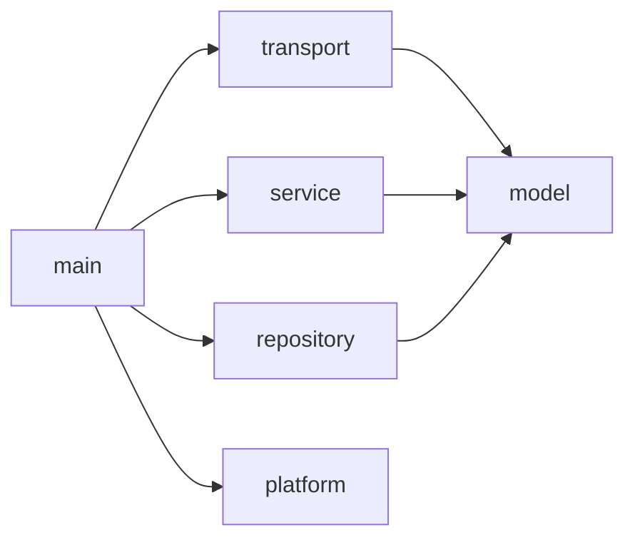
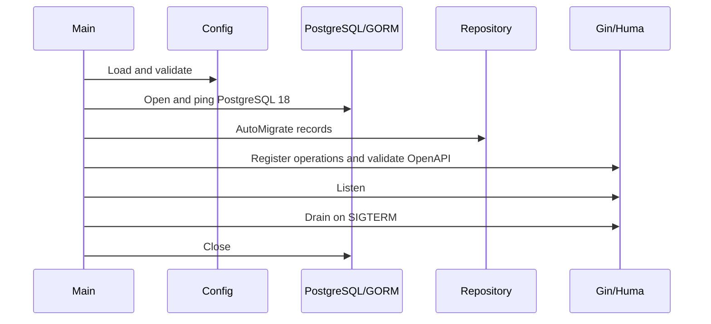

# OOTD 后端架构决策

- 状态：`approved`
- 更新日期：2026-09-14
- 当前阶段：开发 MVP，无需保留历史数据
- 适用范围：`then-server/backend`

## 结论

当前后端采用轻量模块化单体：

```text
Go 1.26 + Gin + Huma + GORM + PostgreSQL 18
```

一个根 `main.go` 组装配置、数据库、Repository、Service、HTTP Handler 和进程生命周期。接口由 Huma operation 与 Go struct tag 声明，在运行时生成 OpenAPI 3.1.2；数据库由 Repository 内 GORM record 声明，在启动监听前集中执行 `AutoMigrate`。

当前不需要以下内容：

- 独立 Swagger 服务或 Docker 文档容器；
- `generate_openapi.go` 和提交到仓库的 `openapi.yaml/json`；
- Atlas、手写 SQL migration 和兼容旧 schema 的迁移代码；
- 微服务、BFF、依赖注入框架、通用 BaseRepository；
- 未进入业务切片的 worker、Outbox/Inbox、远程资产目录和上传 API。

## 调研依据

Go 官方 [module layout](https://go.dev/doc/modules/layout) 说明服务端可以把非公开实现放在 `internal`，单命令项目可直接在 module 根保留 `main.go`。Gin 官方分别提供 [middleware](https://gin-gonic.com/en/docs/middleware/)、[testing](https://gin-gonic.com/en/docs/testing/) 和 [graceful stop](https://gin-gonic.com/en/docs/server-config/graceful-restart-or-stop/) 指南，没有要求统一的企业目录模板。

本次通过 GitHub 与 Firecrawl 检查了成熟开源项目：

- 字节跳动开源的 [CloudWeGo biz-demo](https://github.com/cloudwego/biz-demo) 面向生产用户提供业务示例，使用 handler/service/dal 分工，并在 Easy Note、FreeCar 等示例中使用 GORM。它使用 Hertz/Kitex、多服务和 IDL 生成，适合作为职责边界参考，不适合直接复制到当前 Gin MVP。
- [gin-vue-admin server](https://github.com/flipped-aurora/gin-vue-admin/tree/main/server) 使用 Gin、GORM、Swagger，并拆分 Router、Service 和数据库初始化。它的插件系统、全局容器和大型后台结构服务于更大产品，本项目只保留必要分层。
- GORM 官方 [Migration](https://gorm.io/docs/migration.html) 说明 `AutoMigrate` 会创建缺失的表、列、外键、约束和索引，但不会删除废弃列。结合“开发阶段、无历史数据”的明确前提，当前使用 AutoMigrate 是最小方案。
- [swaggo/swag](https://github.com/swaggo/swag) 可以解析注释，但仍需运行 CLI 并导入生成的 `docs.go/json/yaml`。当前 Huma 已能从实际路由和类型声明运行时生成 OpenAPI，因此切换 Swag 会增加第二套生成链和物化文件。

这些资料不存在一个可直接套用的“大厂 Gin 标准目录”。可复用的共同点是明确职责、单一事实源、显式组装和真实依赖测试。

## MVP范围

### 已实现

- PostgreSQL 18 连接、版本检查和有界健康探测；
- GORM record、账号 schema 自动迁移和事务性 Repository；
- 注册、登录、退出、本人账户读取、修改和删除；
- Gin 中间件、请求标识、结构化日志、404/405、panic 恢复；
- Huma 运行时请求校验及 OpenAPI 3.1.2；
- 内嵌 Swagger UI、运行时 JSON/YAML 契约；
- 单元、HTTP 契约、本机服务、Testcontainers 进程和 OCI 测试边界。

### 尚未进入运行时

Redis、RabbitMQ 与 MinIO 已有本机协议测试，但当前账号 API 不调用它们。只有具体异步任务、缓存或对象业务获批后，才新增对应 platform adapter 和用例，不建立空抽象。

## 目录

```text
backend/
├── AGENTS.md
├── README.md
├── go.mod
├── go.sum
├── main.go
├── internal/
│   ├── model/
│   │   └── account.go
│   ├── service/
│   │   └── account.go
│   ├── repository/
│   │   ├── account.go
│   │   └── schema.go
│   ├── transport/
│   │   ├── account.go
│   │   ├── docs.go
│   │   ├── router.go
│   │   └── swaggerui/
│   └── platform/
│       ├── config/
│       ├── database/
│       └── httpserver/
├── tests/
├── Dockerfile
├── .dockerignore
└── .env.example
```

不为未来功能创建空目录。当前只有一个可执行命令，所以根 `main.go` 比空的 `cmd/api` 更直接；出现第二个真实命令时再评估 `cmd/<name>`。

## 依赖方向



`architecture_test.go` 使用 Go AST 检查核心 import：

- model 不依赖 Gin、Huma、GORM 或外部 SDK；
- service 不依赖 HTTP、数据库、队列、缓存或对象存储实现；
- repository 不依赖 transport、Gin/Huma 或消息/对象 SDK；
- transport 不依赖 GORM、数据库驱动、消息或对象 SDK；
- internal 包不能反向导入 `main`。

### Model

保存领域输入、输出和稳定错误。它不包含 HTTP tag、GORM tag、状态码或 SDK 类型。

### Service

实现注册、认证、本人资源所有权、输入规范化和业务事务编排。Service 定义自己消费的最小 Repository 接口，便于用 stub 验证规则。

### Repository

独占 GORM record、数据库事务、参数化查询和领域映射。数据库约束名称属于 Repository，因为数据库错误映射依赖它们。

### Transport

独占 Gin/Huma、HTTP DTO、Cookie、响应状态和错误模型。Handler 只做协议转换、调用 Service 和映射结果。

### Platform

负责 PostgreSQL 连接、类型化配置和 HTTP server 生命周期。它不决定用户权限或业务状态。

### Main

是唯一 composition root，按顺序加载配置、创建数据库、迁移 schema、组装业务、监听 HTTP，并在信号到来后有界退出。

## 启动顺序



任何配置、连接、迁移、契约或监听错误都会在报告 `api_started` 前终止。错误日志不包含数据库 URL、密码、Cookie 或 Token。

## HTTP与OpenAPI

Huma operation、请求/响应类型及字段 tag 是唯一接口定义。每个接口必须声明：

- 稳定且唯一的 `operationId`；
- method、path、tag 和用途；
- 成功状态及预期错误状态；
- 字段格式、长度、枚举和示例；
- 是否需要 Cookie 会话。

API 注册完成后生成 OpenAPI，并由 kin-openapi 在启动时校验。开启本地文档后：

- `/docs/` 提供内嵌 Swagger UI；
- `/openapi.json` 是 Swagger 和 Umi 的首选输入；
- `/openapi.yaml` 是同一运行时对象的可读表示。

仓库不提交这些运行时响应的副本。修改接口后通过 transport 契约测试检查版本、operation 数、唯一 ID、错误状态和实际响应；前端联调时再从运行 API 生成请求文件。

文档默认关闭。只有 `API_DOCS_ENABLED=true` 且 HTTP 绑定回环地址时才注册文档路由。Swagger 禁用外部 validator、URL 配置覆盖和凭据持久化。

## GORM与数据结构

账号 schema 的唯一声明位于 Repository record：

- `users`：UUID 主键、显示名、创建/更新时间和字段检查；
- `user_credentials`：用户主键/外键、规范化邮箱唯一约束、密码哈希检查；
- `user_sessions`：UUID 主键、用户外键、Token 哈希唯一约束、过期时间与查询索引；
- 用户删除通过数据库外键级联删除凭据和会话。

`repository.Migrate` 集中调用 `AutoMigrate`。Main 在 HTTP 监听前执行它，避免服务在表结构缺失时报告已启动。

当前没有历史数据，因此 schema 变化遵循：

1. 修改现有 GORM record；
2. 更新 Service/Repository 和契约测试；
3. 删除并重建本地开发数据库或测试 schema；
4. 在真实 PostgreSQL 验证约束、事务和启动；
5. 更新 Design、Plan 与 Acceptance。

不增加旧字段探测、双写、回填、兼容视图或迁移版本表。GORM AutoMigrate 不删除废弃列，所以破坏性变更通过重建开发库完成。

当项目出现必须保留的共享或生产数据时，这个前提失效。届时需要新的 Design/PRD/Plan 决定版本化迁移、权限和回滚；当前不提前实现。

## 配置与安全边界

配置只由 `internal/platform/config` 读取环境变量并返回类型化结构。业务包不直接读取环境。

当前关键规则：

- PostgreSQL 必须为 major 18；
- 非 loopback 数据库连接必须使用证书校验；
- 文档开启时 HTTP 只能绑定 loopback；
- 非 loopback HTTP 必须使用 Secure Cookie；
- 健康、错误和日志不回显原始请求正文、Authorization、数据库连接信息或依赖错误；
- 请求和外部 I/O 传递 `context.Context`；
- 资源由创建者负责关闭，退出时先停止接纳再关闭数据库。

## 测试边界

| 层级 | 入口 | 证明内容 |
| --- | --- | --- |
| 包内测试 | `go test ./...` | Model/Service 规则、HTTP 行为、运行时 OpenAPI、配置和依赖方向 |
| Race | `go test -race ./...` | 当前包级并发路径无已发现数据竞争 |
| 本机服务 | `go test -race -tags=services ./tests` | GORM schema、真实 PG 事务/约束，以及本机 MinIO/Redis/RabbitMQ 协议 |
| 进程集成 | `go test -race -tags=integration ./tests` | 空 PostgreSQL 启动迁移、实际二进制、健康、断连恢复、SIGTERM |
| OCI | `go test -race -tags=container ./tests` | 已构建镜像的用户、只读、资源和退出行为 |
| 远程 CI | GitHub Actions | Linux 上的格式、模块、vet、race、integration、build 和 OCI 门禁 |

测试包独立是代码、build tag、资源和数据隔离，不是新增一个 test 服务。

## 开发SOP

### 1. Design

写明用户问题、当前事实、数据所有者、依赖边界、失败语义和非目标。技术选型要引用官方资料或真实开源项目，不能只复制目录模板。

### 2. PRD

把用户可见能力写成可验收需求 ID，明确输入、结果、权限、错误和本期范围。技术机制不替代产品行为。

### 3. Plan与checklist

一个近期切片只解决一条可独立验收的链路，列出：

- 关联 Design/PRD 和需求 ID；
- 修改文件及职责；
- Red 测试或可复现失败；
- 实现顺序；
- 必跑检查与验收证据；
- 明确不做的事项。

### 4. Red → Green → Refactor

先让测试证明缺口，再写最小实现，最后收敛命名、重复和依赖方向。不为将来扩展创建抽象。

### 5. Acceptance

记录具体命令、真实依赖版本、结果、边界和未覆盖项。单元通过不等于真实数据库、浏览器、容器、远程 CI 或生产通过。

### 6. 交付

检查 diff、敏感内容和工作树，只暂存本切片。提交/推送按用户明确要求执行；没有要求时保留可审查工作树。

## 本切片验收清单

- [x] 移除 OpenAPI 物化工具和仓库内 YAML 产物。
- [x] 移除 Atlas 配置、SQL migration 与 checksum。
- [x] 用 GORM record 声明表、唯一索引、检查约束、索引和级联关系。
- [x] Main 在监听前执行集中 AutoMigrate。
- [x] Swagger 与 Umi 使用运行时 `/openapi.json`。
- [x] CI 不再执行生成产物漂移检查。
- [x] 包级测试、vet、真实 PostgreSQL schema/事务和实际进程验证通过。
- [x] 受限 OCI 镜像验证 AutoMigrate 后健康与安全运行边界。
- [x] 移除 iOS 未使用的物化契约输入、ThenTransport 和生成依赖，并通过 Xcode 构建/测试。
- [ ] 远程 GitHub Actions 在提交后运行；本轮未提交、未推送。
- [ ] 生产迁移与保留数据升级不在当前开发 MVP 内。
