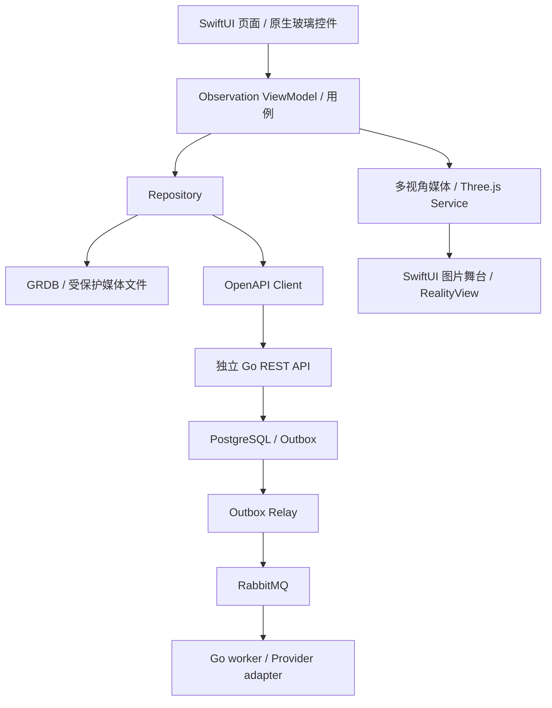
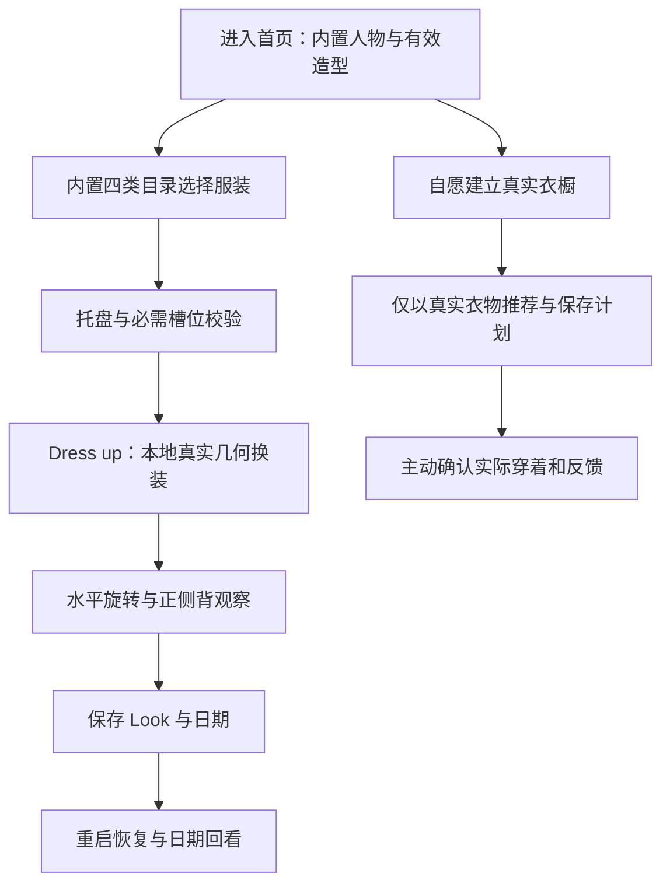

# OOTD 产品总体设计

当前完整能力与分期以 [Design 20](20-OOTD完整产品能力与阶段架构设计.md) 为准；本文只维护页面组织、原生组件和跨域交互规则。Woo 页面地图见 [Design 17](17-Woo页面与三维穿搭UI设计.md)，三套人物共享页面。

## 2026-09-14品牌与固定资产策略

- Logo、AppIcon、favicon、Swagger 品牌图、首批离线角色/服装媒体属于启动必需固定资产，随 iOS App 或 Go 二进制编译打包并进入版本控制；首次运行不下载，也不依赖对象存储。
- iOS 品牌资产统一位于 `Then/then-app/ThenApp/Assets.xcassets`，AppIcon 使用无透明通道的 1024 px 原图，页面标记使用 `BrandMark`；Swagger 品牌资产位于 `Then/then-server/backend/internal/transport/swaggerui`，只通过明确的同源只读路由提供。
- 后续只有体积较大、需要独立发布的角色/服装目录或生成媒体才进入私有对象存储。客户端下载前必须取得版本化 manifest，验证用途、字节数和 SHA-256 后原子写入受保护本地缓存；失败继续使用随包资产，不能让品牌和离线主路径空白。
- 当前对象存储尚未启用，不新增上传 API、匿名远程目录或兼容分支。Logo 与 favicon 选择本地打包即为本阶段定案。

## 2026-09-15当前页面视觉审计与改造基线

完整页面地图、逐页状态、三维画布、组件、动效、无障碍和三份视觉稿统一见 [Design 17](17-Woo页面与三维穿搭UI设计.md)。本节保留当前实现的实测差距，Design 17 作为后续视觉实现的页面级规格。

本轮使用 iPhone 17 / iOS 26.5 现有模拟器，清空当前开发 App 数据后，以正式 Debug 构建走通“默认形象 → 内置衣橱 → 替换上装 → Dress up → 形象参数”主路径。浏览器同时重新打开用户指定的 [Woo 原帖](https://x.com/LerSentAI/status/2090783821452943404?s=20)，确认原帖、53 秒视频及“记录 OOTD、立体形象展示”的公开文本仍可访问。本节只审计实际 App 截图；Woo 逐帧参考事实继续以 Design 18 的参考证据表为准。

| 步骤 | 当前截图 | 健康度 | 结论与改造要求 |
| --- | --- | --- | --- |
| 1. 默认穿搭首页 | [01-home.png](https://github.com/StephenQiu30/then-server/blob/dd35b002dc6e85c983a5c44a784756bdec3f1af2/docs/design/evidence/current-ui-2026-09-15/01-home.png) | 部分健康 | 品牌、全身人物、日期、关联单品、三项底栏和 360 观察均可见，首屏任务明确。工程低模的人脸、手、衣褶、材质和比例未达到目标；信息卡、正侧背胶囊、左右箭头和底栏同时占据下半屏。正式稿让人物成为唯一主视觉，保留原生可访问的离散视角，但降低其视觉权重。 |
| 2. 内置衣橱 | [02-built-in-wardrobe.png](https://github.com/StephenQiu30/then-server/blob/dd35b002dc6e85c983a5c44a784756bdec3f1af2/docs/design/evidence/current-ui-2026-09-15/02-built-in-wardrobe.png) | 结构偏差 | 黑色托盘、数量和蓝色 Dress up 与参考方向一致；当前“分类 Tab + 单张大卡”没有实现已固定的四类同页分组网格，大量空白降低浏览效率。改为 TOPS、OUTERWEAR、BOTTOMS、SHOES 纵向分组，每组紧凑多列卡片；分类控件只作为跳转/筛选辅助，不取代分组。 |
| 3. 选择托盘与应用 | [03-selection-tray.png](https://github.com/StephenQiu30/then-server/blob/dd35b002dc6e85c983a5c44a784756bdec3f1af2/docs/design/evidence/current-ui-2026-09-15/03-selection-tray.png)、[04-dressed-result.png](https://github.com/StephenQiu30/then-server/blob/dd35b002dc6e85c983a5c44a784756bdec3f1af2/docs/design/evidence/current-ui-2026-09-15/04-dressed-result.png) | 交互健康、视觉失败 | 替换同槽位后数量维持 3，托盘与结果缩略图同步，Dress up 返回首页，核心状态闭环正确。移除按钮压在缩略图边缘，点击目标和图像重叠；蓝色衬衫在肩、肘、袖口露出身体。前者通过托盘内独立 44pt 移除目标修正，后者必须回到源资产和内容生产流程修正；P5 真 3D 再通过服装蒙皮、body coverage 和权重检查解决，不在客户端缩放服装兜底。 |
| 4. 形象参数 | [05-appearance-sheet.png](https://github.com/StephenQiu30/then-server/blob/dd35b002dc6e85c983a5c44a784756bdec3f1af2/docs/design/evidence/current-ui-2026-09-15/05-appearance-sheet.png) | 功能基线 | 两项有限参数、恢复默认和完成均清楚，且没有冒充真实量体。原始 `0.00` 数值对普通用户意义弱，半屏玻璃叠在低模人物上使信息层级杂乱。正式稿保留两项受控参数，以“窄/标准/宽”和“薄/标准/厚”表达端点，数值只作为无障碍值/诊断信息；参数变化在同一人物视口即时预览。 |

当前优先级固定为：先替换生产人物与服装资产并完成 body-region 遮蔽，再把衣橱改为四类同页网格，随后收敛首页卡片/观察控件和形象参数面板。只调整阴影、圆角或颜色不能关闭上述三项结构问题。

可见无障碍基础较好：本轮 accessibility tree 能识别品牌、日历、衣橱、三维形象、正侧背、收藏/分享/恢复、托盘逐件移除、Dress up 与两个 slider。截图不能证明完整 VoiceOver 顺序、动态字号、减少透明度/动态效果和物理设备性能；这些继续按 11-03/11-04 与对应 acceptance 验证。

视觉方向仍由本轮 Product Design 三稿选择门禁决定：方向 1 为最接近 Woo 的黑白极简，方向 2 为柔紫三维工作室，方向 3 为时装编辑时间线。用户选定前只固定上述信息架构、状态和问题优先级，不把任一配色或版式写成最终生产规范，也不开始视觉代码改造。

## SwiftUI 液态玻璃组件设计

2026-09-08：用户已确认 SwiftUI、前后端分离及最低 iOS 26；具体组件组合与交互规格为 draft，完成切片契约后实施。精确平台/API 基线见 [技术选型](01-技术选型.md#客户端最终决策与原生液态玻璃)。

### 页面分层与组件清单

角色和衣物是主要内容，液态玻璃用于浮在内容之上的导航与操作层。采用语义颜色、系统字体与 SF Symbols，集中管理品牌强调色、间距和圆角；不在每个 Feature 各自定义一套材质。系统组件已具有玻璃外观时不再叠一层自定义玻璃。

| 区域 / 组件 | SwiftUI 实现 | 产品行为与边界 |
| --- | --- | --- |
| 应用入口 | `TabView` + 每 Tab 的 `NavigationStack` | 首页与衣橱；日历进入 Look/穿搭记录，条件照片动作独立；保留系统返回与状态恢复 |
| 顶部导航操作 | `toolbar`、`ToolbarItem`、系统 `Button` | 编辑角色、筛选、更多；使用系统排列与材质 |
| 角色画布 `AvatarViewport` | P1 SwiftUI 图片舞台；P5 SwiftUI `RealityView` | 渲染背景和人物，加载/失败状态属于原生；生产不引入 Web renderer |
| 角色操作条 `AvatarControlBar` | `GlassEffectContainer` + 原生玻璃按钮 | 正/侧/背视角、重置等离散操作；图标有标签，选中状态不只靠颜色 |
| 换装入口 `OutfitSlotBar` | 悬浮操作表面或玻璃按钮组 | 上装、下装、鞋等已定义槽位；避免整条背景与每个按钮重复玻璃化 |
| 衣物选择 `GarmentPickerSheet` | 系统 `sheet`、`presentationDetents`、网格和筛选控件 | 选择后更新本地草稿；支持关闭/撤销；详细选择内容维持可读背景 |
| 身形调节 `BodyParameterControl` | `Form`、`Slider`、数值标签 | 展示经资产适配验证的有限参数；提供可访问增减操作；不把模型参数冒充真实身体测量 |
| 保存操作 | `.buttonStyle(.glassProminent)` | 单个主要动作“保存搭配”；保存计划、记录实际穿着仍是分别确认的动作 |
| 衣物卡片 `WardrobeItemCard` | `LazyVGrid`、图片、语义文字 | 使用稳定中性背景保持衣物颜色与细节可辨，玻璃不覆盖整张图片 |
| 近似效果说明 | 原生文本及详情入口 | 模板与真实衣物的差别持续可见，不靠短暂动画或颜色表达 |

自定义非按钮悬浮表面可以使用 `.glassEffect(.regular, in: .capsule)`；按钮优先系统样式以保留交互语义。`GlassEffectContainer` 用于需要共同组合的相邻表面，不包裹整个页面制造全屏模糊。跨元素形变只在操作语义明确且无障碍允许时采用，首版无需为展示效果引入复杂 morph 动画。[Apple 自定义视图 API](https://developer.apple.com/documentation/SwiftUI/Applying-Liquid-Glass-to-custom-views)

### 应用与后端职责

新 OOTD 业务 ID 与后端统一使用 UUID v4；离线创建无需服务端分配 ID。Swift 领域模型使用类型化 ID，API 使用规范字符串；旧生活管理主键保持原样，迁移按 PRD 19 决策，不批量改号。完整数据规则见 [后端架构](02-后端架构.md#gorm与数据结构)。

玻璃组件只接收显示状态和事件闭包。ViewModel 管理选择、草稿和保存状态；Repository 管理持久化与同步。API 负责云端权限、任务、配额及共享事实。UI 材质变化不改变媒体同意、所有权或删除链；本次不新增无实际用例支撑的 API。

### 三维叠加、无障碍与性能

- 原生操作区通过布局避开角色关键部位，sheet 展开时调整画布可用区域；旋转手势不得抢走按钮、系统返回或 sheet 拖动。
- `RealityView` 与原生玻璃叠加必须在最低真机实测背景合成、命中、帧时间、内存和热状态，不根据模拟器截图预先保证性能。
- 开启减少透明度时，保证控件具有可读的实色背景；减少动态效果时取消自定义形变和持续旋转；高对比度、浅/深色模式、系统玻璃外观偏好均纳入验证。
- 支持 Dynamic Type、VoiceOver、至少 44pt 点击区域与清晰焦点顺序。体型滑块、视角切换和保存必须能通过无障碍操作完成。
- 避免全屏玻璃、多层模糊和随三维每帧重建 SwiftUI 层级；在同一场景分别测量关闭/开启自定义玻璃后的帧时间、hitch、内存和热状态，按三维 POC 总预算判定。

### 实施与证据

先定义主题和系统导航，再完成 P1 角色控制条/换装面板，P5 按 11-04 接入 `RealityView`。以最低支持 iOS 26 真机验证明暗衣物、繁杂背景、动态字体和辅助功能；模拟器截图只用于布局检查。本节不为被冻结的旧生活管理页面增加装饰，不新增空组件目录。系统验收中的新增检查保持 pending，不能用文档或成功编译代替视觉验收。

## 信息架构

当前按 Woo 可见底栏与页面关系组织原生导航：

| 入口 | 用户问题 | 核心内容与启用条件 |
| --- | --- | --- |
| 首页 | 这套造型怎么样？ | 全身三维、当前 Look、编辑/观察、详情、日期与保存/删除；零录入可用 |
| 衣橱 | 我可以选什么？ | 默认内置四类目录/托盘；“我的衣物”独立管理真实单品，不混淆来源 |
| 中间照片动作 | 想用自己的照片生成效果吗？ | 只在照片能力可用时显示，用户主动进入系统采集/复核；未开放时隐藏，不能伪装已可生成 |
| 首页日期/日历 | 我保存过什么、实际穿过什么？ | 本地 Look 日期回看及真实穿搭簿，明确区分模板造型、计划和实际事实 |

首页与衣橱为一级目的地，照片是动作；穿搭簿通过日期/日历进入，不再新增与 Woo 竞争的第三套一级页面。当前 Today/Wardrobe/OutfitBook 三 Tab 是已有实现，既有测试通过不代表当前 Woo 导航完成。改造须在生产页面切片中处理状态恢复、旧入口和无障碍，不在文档修订时直接改 RootView。

## OOTD-first 冷启动

### 原则

保留原章节锚点，现行默认冷启动已改为零录入内置三维。首屏不先问场合、上传照片或录入衣物；默认有效造型可立即观察、编辑和换装。真实衣橱建档与照片 AI 是自愿分支。

### 首次流程

主激活记录“选衣→应用→观察→Look 原子保存”的首次会话完成率与耗时；保存和重启必须恢复相同版本/参数，不把内存态或旧封面当持久成功。真实衣橱用户从主动建档起另测“两分钟确认至少两件并保存组合草稿”；OOTD 批量尚未开放时不展示其入口。上述指标不能混计，生成预览也不算实际穿着。

### 功能可用门槛

- **内置三维**：零衣物、零照片、零账号、离线可用；上装/下装/鞋为必需槽，外套可选，支持集归发布资产矩阵。
- **真实手工搭配**：允许边选边新增，未知属性可保留；不把模板转成拥有事实。
- **基础推荐**：真实衣橱至少有一条完整可穿路径，即“上装 + 下装 + 鞋”或“连体/连衣单品 + 鞋”。真实衣物可包含当前三维未支持类别；无解时说明缺少项，仍可使用内置选衣。
- **个性化评估**：真实衣物覆盖、实际穿着及明确反馈只用于该分支的价值评价，不作为内置三维、登录或付费门槛。
- **照片预览**：在可选阶段启用后，按本人/18+、输入质量和单独云同意门禁处理；不影响内置三维。

## 90 秒决策路径

在基础推荐门槛满足、上下文可得的情况下，体验目标如下：

| 阶段 | 累计目标 | 用户动作 | 系统责任 |
| --- | --- | --- | --- |
| 打开与确认上下文 | 0–15 秒 | 查看或修改天气、场合、活动量 | 使用缓存和最小摘要，不阻塞于网络刷新。 |
| 查看三个候选 | 15–30 秒 | 比较“稳妥、天气优先、更有风格” | 本地硬过滤后生成结构化候选，首屏不等待云图。 |
| 微调 | 30–75 秒 | 锁定单品、换鞋、更暖/更轻便 | 只重算受影响部分，保留用户已锁定选择。 |
| 保存 | 75–90 秒 | 选定方案并确认准备项 | 原子保存方案和上下文快照，视觉任务可异步继续。 |

目标时间是可用性指标，不允许用隐藏信息、默认同意上传或省略不确定性说明来换取。

## 领域数据与一致性

以下是已批准的逻辑领域对象。物理 GRDB Record、PostgreSQL 表和 OpenAPI schema 仍须通过对应迁移与契约评审落地，不能从本表机械生成：

| 对象 | 责任 | 关键不变量 |
| --- | --- | --- |
| `WardrobeItem` | 用户确认的单品及可用状态 | 推荐只能引用当前 owner 的稳定 ID；AI 建议不能绕过确认成为事实。 |
| `OutfitContext` | 一次决策的最小场景快照 | 保存后不可被来源更新静默改写。 |
| `RecommendationSession` | 候选、锁定项、替换与理由 | 每个候选引用真实可用单品；相同输入可审计模型/规则版本。 |
| `OutfitPlan` | 用户选定的组合和准备状态 | 保存时记录单品 ID 与展示快照；单品后来归档不删除历史。 |
| `WearEvent` | 实际穿着事实 | 与计划分离；没有计划也可记录实际穿着。 |
| `OutfitFeedback` | 舒适、温度和场合反馈 | 允许跳过；不得包含吸引力或身体价值评分。 |
| `AvatarProfile` | 可选数字形象配置 | 缺失或删除不影响衣橱、推荐、穿搭记录。 |
| `TryOnJob` | 可选异步视觉任务元数据 | 不成为推荐事实，不保存第三方密钥或长期公开 URL。 |

衣物当前状态与历史穿搭快照分离。删除衣物照片不应删除用户的历史穿搭事实；历史页改为显示安全占位和当时确认的非图片描述。删除整个衣物实体、穿搭记录或形象的具体语义按 [`../prd/10-OOTD产品需求.md`](../prd/10-OOTD产品需求.md) 和 [`11-OOTD权限隐私与安全设计.md`](11-OOTD权限隐私与安全设计.md) 执行。

## 权限、隐私与安全

1. 首次进入不批量请求照片、相机、日历、位置或通知权限。
2. 用户可用手工输入和风格化形象完成核心流程，照片与云处理不是使用门槛。
3. 人物、面部、衣物照片和可关联日程的穿搭记录按高敏感数据处理；原始照片和派生物有可见删除路径。
4. 照片优先通过系统 picker 获取用户明确选择的单项；不要求完整照片库访问。
5. 端侧先做裁剪、去 EXIF/GPS、质量检查和必要分割；上传前另行展示数据接收方、目的、保留期和删除方式。
6. 原始事件标题、地址、参会人、金额、商户、精确轨迹、照片 URL 和人体特征不得进入日志、推送或分析事件。
7. 用户素材默认不得用于模型训练、广告、画像或向第三方提供；用途变化需要重新同意。
8. 不接受未经授权的他人照片；未成年人和家庭照片场景不在当前范围，只有独立儿童安全/多人授权 PRD 与法律评审通过后才能另行启用。

完整要求见 [`04-数字形象与照片采集设计.md`](04-数字形象与照片采集设计.md) 与 [`11-OOTD权限隐私与安全设计.md`](11-OOTD权限隐私与安全设计.md)。
