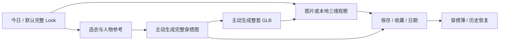

# OOTD 产品总体设计

更新：2026-09-22，设计 `approved`。本文维护页面组织与跨域交互；完整产品和阶段以 [Design 20](20-OOTD完整产品能力与阶段架构设计.md) 为准，逐页状态见 [Design 17](17-Woo页面与三维穿搭UI设计.md)。

## 产品主路径

**完整 Look 图片先显示，已有模型直接查看，缺少模型时按需生成立体展示。** 内置完整 Look 随包离线可用；新穿搭通过图片生成形成新版本。衣橱里的单品是二维图片和结构化信息，不要求每件衣物先有 3D 模型。

内置 Look 的切换是整套资产切换。选衣草稿未生成时不把旧图、旧模型或局部颜色变化标成新穿搭。云失败、未认证或未同意只影响云动作，结构化草稿和本地浏览/保存继续工作。

## 信息架构

| 一级入口 | 内容与主要动作 | 事实边界 |
| --- | --- | --- |
| 今日 | 当前 Look、查看立体、新建穿搭、当日计划/实际记录入口 | 首次默认内置 Look，真实推荐仅来自个人衣橱 |
| 衣橱 | 我的衣物与内置参考分开；分类网格、选衣托盘、录入和管理 | 选参考不代表拥有；无图衣物仍可管理/推荐 |
| 穿搭簿 | 按日期回看 Look、计划、实际穿着和私人日记，类型明确 | 保存 Look 不自动新增 WearEvent 或日记 |
| 发现（条件启用） | 已获准公开内容、关注与互动 | 只有客户端和审核治理可用时显示；不放空 Tab |

账户从头像进入。本人照片是创建穿搭中的可选动作，不占一级 Tab；三套人物共用页面和状态。Web 首片继续 `/register`、`/login`、`/account`，不因本次 iOS 设计新增空 Web 路由。

## 页面与原生组件

SwiftUI + Observation 拥有导航、业务状态、保存与无障碍。系统 Liquid Glass 用于导航和短操作表面，图片/模型本体保持清晰；颜色、字体、尺寸和间距只取根 DESIGN.md，不另建 token。

| 组件 | 职责 |
| --- | --- |
| Look 舞台 | 图片先显示；用户查看模型时嵌入隔离 WKWebView/Three.js；背景、提示和控件属于 SwiftUI |
| 观察控制 | 水平拖动、有界缩放/复位、原生角度按钮；不修改身体或服装数据 |
| 选衣网格与托盘 | 按 TOPS、OUTERWEAR、BOTTOMS、SHOES 等实际内容分组；列数随屏幕，不把四类等同四列 |
| 生成状态区 | 真实阶段、取消、重试、剩余额度/费用；不伪造百分比或成功 |
| 保存与详情 | 原子保存日期、收藏和版本，独立于 renderer ready；失败保留草稿 |
| 照片准备 | 系统 picker、用途说明、端侧净化、确认；不在首次进入时请求权限 |

首版移除体型滑块、骨架/眼部控制和逐件 3D 槽位编辑；这些不再出现在主路径或首发空占位中。已有代码待后续切片迁移，本次只更新设计。

## 状态与一致性

选择草稿、已生成 revision、当前展示、已保存 Look 分开。图片生成成功不等于保存成功；模型完成不等于当前 revision 已切换；收藏成功必须来自持久化。切换快照和模型时校验 owner、revision、SHA-256，旧回调不能覆盖新草稿。

删除 Look 隐藏其私人媒体并继续清理；删除模型可保留图片。共享随包母版不因某个用户删除而损坏；真实衣物、计划/实际记录只按其独立删除语义处理。详细血缘见 [Design 10](10-OOTD服务端与异步任务设计.md) 与 [Design 11](11-OOTD权限隐私与安全设计.md)。

## OOTD-first 冷启动

新安装不问体型、不要求上传、不先建完整衣柜：默认完整 Look → 选择另一套 → 查看立体 → 保存日期 → 重启回看。三个人物预设及各一个默认完整 Look 离线可用；云生成任意新组合不能被包装为离线功能。

真实衣橱是自愿分支。基本推荐要求存在一条可用完整组合（上装+下装+鞋，或连体单品+鞋）；只基于真实衣物过滤，缺项如实说明。用户主动确认“实际穿了”才建立 WearEvent，视觉浏览和分享不触发学习。

## 90 秒决策路径

在真实衣橱已具备可用组合时，目标为确认上下文 15 秒、查看最多三候选至 30 秒、微调至 75 秒、保存至 90 秒。目标用于可用性研究，尚无通过证据；图片和 3D 任务不占据这个同步决策路径。

## 资产、无障碍与设备

品牌、AppIcon、favicon、Swagger 标记及默认 Look 本地打包。个人生成结果使用私有对象存储和受保护缓存，不含运行时 CDN 脚本。首次加载先显示同版本图片；模型失败说明原因并保留图片。

VoiceOver 能完成选择、保存、旋转角度、复位、取消和删除；动态字号不裁切操作，命中区至少 44pt。Reduce Motion 关闭自动旋转/装饰动作，直接操作仍可用。不可见和后台停止绘制，恢复不追赶后台时间。模型及玻璃叠加的帧率、内存和热状态必须在最低真机测量。

## 实现事实与研究证据

现有 App 是一套工程 GLB 的模块切换和微动，正式内容、Look 持久化与云链路未交付。旧工程蓝色上装穿模、人物观感不足的 [2026-09-15 截图](https://github.com/StephenQiu30/then-server/blob/dd35b002dc6e85c983a5c44a784756bdec3f1af2/docs/design/evidence/current-ui-2026-09-15/01-home.png) 属于历史审计；不再据此要求采购模块衣物/眼部包作为首版前置。

Woo 原帖视频只用于验证用户可见流程，未证明其内部渲染技术。参考观察统一保存在 [Design 18](18-Woo立体数字衣橱技术路线研究与决策.md)，不复制品牌、人物或服装资产。
