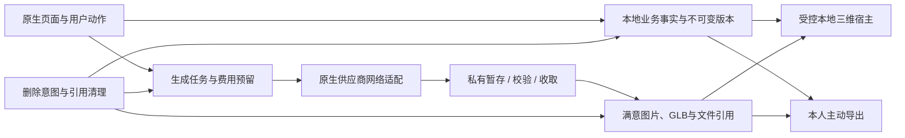

# OOTD 产品总体设计

更新：2026-09-30。当前范围为本人自用的 Woo 式虚拟人偶每日穿搭 App，不公开上线。本文集中维护页面、数据、生成与本地运行设计；需求见 [PRD 10～19](../prd/README.md)，技术选择见 [Design 01](01-技术选型.md)，官方研究、候选与成本见 [Design 29](29-Woo虚拟人偶与自用成本决策.md)。

状态：`scope_confirmed / implementation_pending / real_validation_pending`。本次合并文档不代表旧客户端已迁移、供应商效果通过或本人数据已处理。历史 Plan/Acceptance 的编号、结果与证据按原范围保留。

## 产品主路径

本人照片 → 确认身份/风格参考 → 完整穿搭图 → 本人核对 → 可选整套静态 GLB → 本地保存 → 日期回看与同套复用。

本人参考决定可辨识特征，风格参考决定 Woo 式虚拟表达，Look 输入决定当次衣物。每套是独立完整模型，切换已有 Look 只读本地资产；新衣物组合要生成新产物。生成式参考不能保证同一头部网格或拓扑，不承诺即时模块换衣。

先取得一套本人愿意保留且可旋转的结果，再用五套代表穿搭验证跨套稳定、衣物、满意成本与设备。图片可独立成功，不能抵扣真实三维。具体实验次数、价格快照与测算只在 Design 29 维护，预算和任务规则在 PRD 17 维护。

## 信息架构与页面

一级入口为**今日 / 衣橱 / 穿搭簿**。我的形象、生成任务和设置/预算有明确入口；拍照/导入作为新建动作。首屏没有结果时说明下一步，不插入假人物或假历史。

| 页面 | 设计职责 | 状态与恢复 |
| --- | --- | --- |
| 今日 | 当前日期关联的确认图片；主动查看已有 GLB、新建 Look、记录入口 | 空、仅图片、模型待核对/缺失、离线、失败；旧模型不挂新衣物标签 |
| 我的形象 | 本人照片、确认的人偶参考、独立身份/风格版本 | 无参考、候选待确认、更换、来源删除；更换不覆盖历史 |
| 拍照/导入 | 系统相机/选图、构图与质量提示、原图及处理预览 | 拒绝、云照片未取回、缺脚/遮脸/多人/模糊、取消；未成功导入不创建生成 |
| 衣橱/选衣 | 手工名称、类别、可空图片、状态、分类网格和选衣托盘 | 无图、不可用状态、超参考数；文字草稿可保存，不冒充已合成 |
| Look 核对 | 原输入与人偶图对照，核对本人、风格与关键衣物 | 满意保存、不满意有限重做/改输入；不默认转三维 |
| 生成任务 | 当次阶段、估算/在途/未知/实际费用、尝试余量与恢复 | 未知受理、查询失败、下载过期、取消核对、已付费拒收分开 |
| 立体查看 | 正面、连续旋转、有界缩放、复位与原生辅助控件 | 坏包、资源不足、WebContent 终止；保留图及记录，不自动付费重做 |
| 穿搭簿 | 日期条目、计划、实际、日记分类回看；Look 收藏、复用及改删 | 同日多条、跨时区、无媒体、删除占位；不推导实际穿着 |
| 设置 | 个人 API Key、预算/尝试上限、文件管理、导出和分层删除 | 无 Key、余额/预算不足、在途未知、缺文件、外部清理未确认 |

SwiftUI 管理导航、业务状态、权限、反馈和无障碍；三维宿主只承担观察。样式、品牌和响应式遵循根视觉标准，不在业务设计复制第二份 token。网格列数随可用宽度和字号变化，类别数量不等于列数。系统版本和安装方式按本人设备确认，Liquid Glass 不作为人物实验通过条件。

## 本地架构与职责

```mermaid
flowchart LR
    UI["原生页面与用户动作"] --> Facts["本地业务事实与不可变版本"]
    UI --> Jobs["生成任务与费用预留"]
    Jobs --> Native["原生供应商网络适配"]
    Native --> Stage["私有暂存 / 校验 / 收取"]
    Stage --> Files["满意图片、GLB与文件引用"]
    Facts --> View["受控本地三维宿主"]
    Files --> View
    Facts --> Export["本人主动导出"]
    Files --> Export
    Cleanup["删除意图与引用清理"] --> Facts
    Cleanup --> Files
    Cleanup --> Jobs
```

- 本地库是 Look、日期、任务与费用事实源；媒体存沙盒文件。SwiftData 的实际模型、事务及恢复在目标客户端实施时验证，不把既有 GRDB 记录当作迁移完成。
- 原生网络层持有个人 Key 并访问供应商；三维脚本不发生成请求，不拥有保存/收费权。首版不依赖 Go、PostgreSQL、Kafka、Redis、MinIO 或账号同步。
- 每次输入先冻结版本。网络、下载、生成、展示和用户满意分别记录，任一阶段成功不能伪造下一阶段完成。
- 使用最小供应商适配，分别表达创建、查询、下载及已核验的取消/删除能力；没有能力就明确状态，不预建通用工作流、多云路由或自动回退。

## 人物参考与输入准备

本人目标为正常比例、可辨识脸型/发型/肤色/眼镜/体形、表面与细节简化的 Woo 式人偶。原照片、确认参考、真实侧背和 AI 补图分别标来源；变粗糙度、减面数或加阴影不能代替造型质量。

1. 主动相机/系统 picker 返回后，在其可访问作用域内受控复制到私有暂存；不能长期保存临时 URL，系统云照片未取回时说明等待/失败。
2. 导入会话携带稳定身份及版本标记；取消、重新选图或换输入后，旧回调只能清理自身暂存，不能晋升为新选择。
3. 检查实际格式、解码、帧数、尺寸、方向和完整性，按端点允许范围准备输入。原照与上传副本分开；净化非必要 EXIF，裁剪/主体处理可预览。
4. 质量检查提示具体可修问题，不评价身体或推断身份/年龄；不设通用成年声明流程，实际供应商输入条件另行核验。
5. 衣物是二维照片和本人确认属性。Vision 前景实例不是单件衣物识别；整套照片不自动拆成已拥有单品。参考数量包含所有人物、风格与衣物输入，不静默漏项或增加计费步骤。

确认 AvatarReference 和 StyleProfile 的独立版本后才用作默认；更新建新版本，删除是另一项有影响说明的动作。详细规则归 [PRD 11](../prd/11-数字形象与照片采集需求.md) 与 [PRD 12](../prd/12-数字衣橱与衣物录入需求.md)。

## 数据、版本与日期

| 对象 | 负责的事实 |
| --- | --- |
| AvatarReference / StyleProfile | 独立身份/风格版本、参考图摘要、来源与本人确认 |
| Garment | 稳定单品 ID、当前 revision、可空图片、确认属性与状态 |
| Look | 整套造型身份、标题与收藏；不以日期作生成身份 |
| LookRevision | 不可变参考/风格版本、真实/尝试来源、输入摘要、选衣快照、确认图与确认时间 |
| DateEntry | 原本地日期/时区、当日备注与确定 LookRevision 的引用 |
| RenderAsset | 源图/LookRevision、文件摘要、校验、供应商/模型/参数与满意评价 |
| GenerationJob / CostRecord | 原提交意图、阶段/有效期、供应商身份、尝试、预留/已确认/未知费用 |
| OutfitPlan / WearEvent / Feedback / Diary | 各自意图、实际、可选反馈或私人日记；日期与附件不混为生成事实 |
| CleanupRecord | 最小删除范围、引用与阶段；不能靠保存被删图或形象参数证明清理 |

日期、标题、当日备注和收藏不创建生成版本。相同整套跨日期只增引用；衣物、源图、本人/风格或生成参数变化才构成新生成意图。

Look/计划/实际/日记均需明确保存。照片来源“真实穿搭”只说明素材，不能替代“实际穿了”确认；生成、收藏、复用和写日记不创建 WearEvent。当前单品编辑不改写历史快照；纠正实际可重算有效统计，不擅自回滚衣物当下状态。删除衣物前预览所涉计划/实际，确认期间 revision 变化则重新说明影响。占位不得保留已删私有图片或被要求删除的旧属性。

保存实际记录时，WearEvent、历史快照、本人逐件确认的当前衣物状态变更、相关计划结果与稳定保存命令必须共同成功或共同失败；重复提交同一命令返回原结果。媒体文件就位协议不能替代这项多实体事务合同，详见 PRD 16 的 OUTFIT-REQ-004 / OUTFIT-RULE-018。

## 图片与模型任务

使用 PRD 17 的持久状态：准备 → 提交 → 排队/执行 → 收取 → 技术就绪；另列提交未知、确认失败、过期与本机取消。技术就绪与本人满意分开。

| 阶段 | 设计约束 |
| --- | --- |
| 接纳 | 冻结输入/用途/端点与参数，持久提交意图；预算检查和预留一起完成，重复点击复用同一意图 |
| 创建 | 图片、模型独立主动触发；模型只用有效已确认图片；未知 POST 不自动重发或换供应商 |
| 恢复 | 重启读取原任务；已知 ID 查询原任务，未知身份人工/接口核对；离页不等于外部取消 |
| 收取 | 按供应商窗口下载；查询超时不自动判执行失败；过期说明取回能力，不因临时 URL 消失自动重新计费 |
| 核对 | 正面/45°/背面、头发/肢体/鞋包、风格/衣物/跨套核对；成功但不满意可能已付费 |
| 关联 | 结果只归原 LookRevision；编辑新草稿、切日期或迟到结果不能覆盖新版本 |
| 成本 | 预估、预留、实际、未知不混合；同笔未知不重复加算，但未核实不提前释放；已有资产复用不新建任务 |

本地预算约束 App 发出的消费，不是供应商账户的全渠道硬封顶。停止未来用途、取消当前任务和删除资产分别选择；取消本地等待不冒称外部停止或退款。

本机任务进入 cancelled 后，迟到输出只用于费用核对或受控清理，不能进入满意库或恢复已取消资产。取消不自动删除原照或已有确认图；删除须另行选择并执行影响确认。

## 媒体保存与恢复

照片、满意图和 GLB 共用“受保护暂存 → 完整校验 → 文件就位 → 元数据发布”的恢复协议；跨文件与数据库不能假定天然原子。

- 写前记录操作身份、预期版本、暂存/最终内容标识与阶段；文件准备好后，一次提交稳定引用和业务版本。保存成功必须同时有完整文件和可恢复引用。
- 中断/磁盘不足/校验失败保留旧文件、旧版本及草稿；新结果不能覆盖最后满意成果。重启检查 importing/deleting 等未完成阶段，完成合法发布或清理自身孤儿。
- 删除条目不能级联销毁尚需的文件清理依据；共享资产按真实引用决定影响。清缓存不删满意模型，缺文件不自动重新生成。
- 验证 GLB 类型、摘要、容器/引用及支持的扩展；拒绝意外外部 URI、不可解码或越界资源。文件大小、纹理/GPU 预算按本人样本和设备测量，不继承旧夹具限制。
- 查看 ready 不等于本人已保留；渲染成功不等于保存成功。满足文件/引用持久化后才标记离线可用。

详细行为见 [PRD 11](../prd/11-数字形象与照片采集需求.md)、[PRD 16](../prd/16-穿搭记录与反馈需求.md)、[PRD 17](../prd/17-云端生成与任务管理需求.md)；旧物理实现证据见 11-01、12-03，不作为新存储方案已通过依据。

## 三维宿主与交互安全

Three.js/GLTFLoader 和脚本随包锁定；WKWebView 使用隔离、非持久会话，不成为业务事实源。原生只提供当前展示会话的受控资源句柄及版本，不传 Key、原始路径、远端签名 URL、提示正文或整个记录库。

- 本地资源映射只允许舞台脚本和该会话校验资产；校验路径、MIME、大小与资源集合。CSP 和导航策略拒绝远程脚本、任意跳转及意外网络取物。
- 桥接只接受主 frame、当前 session/revision、白名单消息与有界参数；原生管理加载、ready/error、角度/缩放/复位。旧会话回执不得改变当前状态。
- 原生显示确认、取消、费用、错误和无障碍控件；JS 不决定付费/保存或“实际穿了”。回执依据真实加载完成，不使用倒计时假成功。
- 正面默认、统一尺度/地面/构图、柔和背景与接触阴影；连续旋转必须观察真实几何。不能用角度图片或转场视频抵扣。
- 按交互需要绘制；不可见/后台停止，恢复不补绘后台时间。换模型、退出、删源、context loss 撤销句柄，释放几何、材质、纹理和监听器。
- VoiceOver、大字号、Reduce Motion 可通过原生角度、缩放与复位完成查看；坏模型保留图，恢复加载与新计费生成分开。

首轮只维护 WebGL2/GLB；性能目标以 PRD 10 为准且待真机验证。若正式 Look 在优化资产与生命周期后仍有可复现瓶颈，才以同一模型/hash、设备、相机/灯光和交互比较新的渲染后端。

## 隐私、导出与删除

个人照片默认私有，上传只包含当次明确选定输入和必要参数。原生 Keychain 保管 Key，日志/JS/URL/备份不含凭据。虚拟化或 file_token 不代表匿名或本地处理；处理方及其留存/训练/删除事实按实际档位核验，不伪造 App 已控制供应商行为。

删除前列范围、派生及共享引用，持久最小清理意图，关闭相应读取和新派生，再按可恢复阶段清理本地文件、缓存及可处理外部副本。迟到写入不复活已删内容；删除模型可留图片，删来源/确认图按已说明血缘处理。版本更新不等于删除。

本机已删、外部已请求/确认/未知和本人外部备份分别表示，不承诺固定清除 SLA。私人导出原图、满意图、GLB 和可核对元数据，无 Key；主动系统分享与完整备份分开。仍保有删除账本的受控恢复先应用标记；卸载/全删后的旧外部包无法自动知道后续删除，须预览并由本人明确导入。完整合同见 [PRD 18](../prd/18-隐私与数据控制需求.md)。

## 实施与证据边界

按人物实验 → 最小生成/查看/保存 → 衣橱与日期 → 日常使用推进。新执行切片先映射当前 REQ 和本版设计，再更新 spec/checklist、实施及真实验收；不直接继承旧任务的发布前置或把旧 passed 改成新范围通过。

高级推荐、独立视频、骨骼/眼部/布料、即时换衣为条件/延期能力，分别见 [PRD 13](../prd/13-穿搭推荐需求.md) 与 [PRD 15](../prd/15-动态预览需求.md)。账号、社区、同步和公开上线不属于当前个人范围，不自动恢复为下一阶段。

既有后端/Web 合同保留于 Design 02、15、16、21～28；它们不构成本地 App 依赖。旧工程资产审计见 [系统验收历史证据](../acceptance/10-OOTD产品系统验收.md#历史研究与工程证据)；本地 img2threejs 实际失败与 no-go 见 [试穿验收](../acceptance/14-AI虚拟试穿验收.md#当前-poc-与-demo-验收)，不能改写为新候选待测或用于本人效果通过。

## 历史设计追溯

以下旧设计正文因被现行方案替代或重复而移除，不建立平行 archive 文档，也不回收其编号。原始正文保存在清理前已存在的 Git 提交 `f7a06a8ca7ae5cc39b17e029aeb62e1fd78e114f`；可按原路径查看该版本。既有 Plan/Acceptance 的状态和测试依据仍属原范围，链接迁移不重新批准或验收新方案。

| 原身份/文件 | 承接位置与历史说明 |
| --- | --- |
| Design 04：数字形象与照片采集设计 | 本文输入准备/三维宿主、PRD 11；11-01 的旧实现及 AV 规则证据按原范围保留 |
| Design 05：数字衣橱与衣物录入设计 | 本文媒体/版本、PRD 12；旧账号字段与归档在 Design 22/23、17-20/21/41；本地证据在12系列 |
| Design 06：穿搭推荐设计 | 个人推荐延期见 PRD 13；原本地算法证据在13系列，Web场景合同/页面修改在17-43和Acceptance 13，均不改状态 |
| Design 07：AI虚拟试穿设计 | 本文任务/版本、PRD 14/17；旧供应商/本地工厂按14系列证据，不恢复为默认路线 |
| Design 08：动态预览设计 | 动态能力延期见 PRD 15；旧 MP4/播放器合同按 Acceptance 15，不作为静态人偶前置 |
| Design 09：穿搭记录与反馈设计 | 本文事实/日期、PRD 16/19；旧账号合同在 Design 22/23、17-22/23/34，本地事实证据在16系列 |
| Design 10：服务端与异步任务设计 | 当前个人任务归本文及 PRD 17；旧 PG/Outbox/Kafka 不变量合入 Design 02，云费用/删除合同合入 Design 21 |
| Design 11：权限隐私与安全设计 | 当前个人行为归本文及 PRD 18；旧服务端撤权/清理不变量合入 Design 21，证据在18/19系列；旧公开 SLA 不迁为承诺 |
| Design 14：后端MVP与测试边界设计 | 测试资源与历史分期合入 Design 02，17-11 原证据保留 |
| Design 17：Woo页面与三维穿搭UI设计 | 当前页面与舞台归本文；品牌视觉仍归根 DESIGN.md，不复制 Woo 人物/服装资产 |
| Design 18：Woo立体数字衣橱技术路线研究与决策 | 本轮可见效果/官方候选归 Design 29；旧研究不是 Woo 内部算法证明 |
| Design 19：数字衣橱与虚拟试穿竞品研究 | 当前研究及成本归 Design 29；旧源码/工程资产审计保留于 Acceptance 10，不作新选型依据 |
| Design 20：完整产品能力与阶段架构设计 | 当前范围归 PRD 10/本文，选择归01，金额归29；旧后端资产 profile 和原任务证据保留，三预设六套/公共服务不继续作为前置 |
| threejs-avatar-research.md | 静态 GLB/VRM 边界及候选归29，展示选择归01/本文；旧资产/CI证据归Acceptance 10 |
| webgpu-avatar-assessment.md | 本文保留再评估条件，01维持首轮WebGL2；旧探测/夹具不能证明正式真机效果 |
