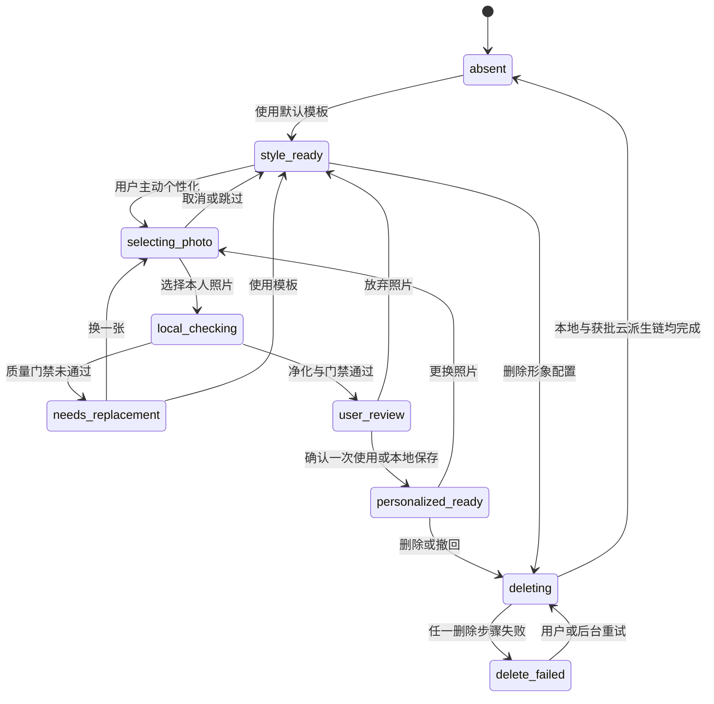

# 数字形象与照片采集设计

## 2026-09-14核心角色合同

承接用户“保持 Woo 一样”的决定及 [完整建模分析](13-三维虚拟形象与服装系统研究.md#2026-09-14核心需求定稿与建模深度分析)，沿用 `then-template-v1` 单一成人 rig、有限离散外观和肩宽/躯干厚度两轴试验域。形象必须为独立可渲染网格；公开演示中的真人结果不构成 Woo 采用 mesh 或本人数字孪生的证据。

1. 当前首版固定站姿、连续水平拖动和正/右侧/背/左侧预设，停止操作即停。按用户最新回复不新增此前建议的单次展示动作；呼吸/眨眼/挥手/行走/持续待机不进入当前片，长期动画目标保留。
2. 人物与服装以同一 rig/rest pose/bind transforms 制作；每件独立蒙皮和 morph，不能仅按骨名重绑。两轴联合参数必须验证，越界拒绝；体型编辑不改变人物身份、不声称量体。
3. 模型美术验收与文件验收独立：正侧背轮廓、脸/手/发/肩/衣领/鞋及中性光照构成样本卡；primitive 技术壳和纯色工程夹具不自动通过 Woo 观感验收。
4. Swift 持有 AvatarProfile/Look 草稿与事务；WebKit 使用 session + revision + applied ACK，暂存场景装配成功后原子显示。保存合法配置不依赖预览成功，但旧 revision 图不能充当新封面。
5. 删除仍严格执行 AVATAR-REQ-021：历史去除私人外观与私有预览，保留真实衣物/穿着事实；公共母版不删除。共享骨架/材质按最后引用释放，退出彻底注销回调。

正式制作推荐可编辑美术母版→glTF 导出→项目校验→App 验证。Blender 为候选工具，不是已批准依赖；现有 Swift 编译器只承担 11-02 工程样本职责。设计研究允许直接评估成熟制作工具，不要求先把另一个工具做失败。

## 2026-09-14默认内置三维形象

默认角色由 App 随包资产与版本化配置创建，首次进入不读取相册、不请求权限、不等待网络。SwiftUI 拥有页面、拖动语义、左右/正侧背控件、保存和错误状态；局部 renderer 只接收有限的角色/服装 ID、颜色、视角和单调 revision。相机入口位于 Woo 式底部中间操作，但只在用户点击后进入照片流程；取消后回到原三维草稿。

渲染失败时显示项目自有静态形象和原生上一/下一操作，并明确“3D 预览暂不可用”；该状态保持穿搭数据可编辑，但不计为三维验收通过。内置资源与用户照片生命周期完全分开，删除用户照片或角色配置不删除共享随包资产。

## 2026-09-13实施顺序更新

用户已明确先实现 Woo 式照片与单品生成流程，同时保留真实 3D 模型及其交互目标，替代旧“本地 3D 完成后才推进云 AI”的顺序。本人照片输入的现有质量/净化/同意/生命周期工作前移；无照片模板、有限参数、直接换装与真实 3D 交互仍需交付。照片生成输出不能当作本人扫描或可编辑网格；自动眨眼/行走等额外动作仍按动作卡收敛。 当前范围由 [PRD 10](../prd/10-OOTD产品需求.md#2026-09-13当前交付目标) 和 [总体设计](03-OOTD产品总体设计.md#2026-09-13当前产品路径) 固定；下文旧阶段描述按历史语境阅读。

## 2026-09-08 方向确认与研究边界

本地三维角色已进入首版，正式功能约束见本文件“本地三维角色设计约束”与 PRD 11。人物骨架和形变研究保留于 [`13-三维虚拟形象与服装系统研究.md`](13-三维虚拟形象与服装系统研究.md)，数值参数与实际性能仍待 POC。原照片流程保留独立门禁，不是三维前置，现有照片 POC 范围不变。

## 本地三维角色设计约束

2026-09-08 首版本地角色范围已确认，承接 AVATAR-REQ-017～019。本节替代此前仅 2D 模板的范围限制，照片流程继续按原独立门禁；renderer 性能及资产数值参数须由 POC 收敛。

- 一个标准 rig 家族、版本化参数字典与许可范围；肤色/发色/发型/面部样式由用户选择，体型仅使用资产验证过的有限 morph 域。不采集真实尺寸，不引入照片人脸重建。
- `AvatarProfile` 作为角色配置逻辑聚合保存稳定 ID、模板/rig/参数 schema 版本、外观选择及 revision；GRDB 物理结构随角色切片批准后建立，不能复用旧 Profile 表硬塞字段。
- 编辑草稿与持久配置分开；保存是短本地事务。渲染命令使用递增 revision，异步完成只允许作用于当前 revision。取消恢复进入编辑前快照，不由 JS 直接写数据库。
- 模型由原生层校验后交给 renderer；脚本/解码器随 App 离线打包，模型中不允许任意 URI、脚本或动态代码。首版只使用 App 内置版本，不建立远程 Catalog 依赖。
- 原生 SwiftUI 提供角色编辑、视角和无障碍控件，Three.js 候选只绘制模型。最低 iOS 26 玻璃叠加、热状态、离线、context lost 和 WebContent 终止列入首个角色 POC。
- 删除配置时同时使其私有缩略图/场景缓存失效；真实衣物、穿搭事实保持独立，共用内置资产不按个人删除动作移除。

研究依据、rig/morph 适配和 POC 预算见 [Design 13](13-三维虚拟形象与服装系统研究.md)，正式需求及验收分别以 PRD 11 和 acceptance 11 为准。只有验证通过且新切片契约批准后才接入生产 UI；不改变 `11-01` 照片 POC 的任务。

## 本地三维角色开发与交付SOP

2026-09-14 近期 POC 方案（approved/in_progress）：[11-02](../plan/11-02-无照片三维角色与静态降级执行计划.md) 将 S1～S4 收敛为一个项目自有成人比例角色、一个 rig、基础遮蔽、至少两件不同几何上装、下装和鞋，以及独立形变、正侧背/受限转台、撤销/保存/恢复/删除。用户已批准无上传三维主路径、内置服装与 Woo 页面复刻并要求开始实现；两项无单位参数的试验域仍只用于 POC 适配矩阵，未批准生产量体含义。模拟器先行，最低设备/真机预算与最终美术仍单独阻断发布。

2026-09-12 根据用户要求完成实施准备审核后制定。本节是 PRD 11 所属角色工作的流程入口；服装制作合同归 [Design 05](05-数字衣橱与衣物录入设计.md#三维服装资产交付sop)，跨功能缺口与实测记录归 [系统审核](../acceptance/10-OOTD产品系统验收.md#2026-09-12三维实施准备审核)，当前顺序与阻断归 [产品计划](../plan/10-OOTD产品实施计划.md#2026-09-12近期推进顺序)。不另建一套角色设计、任务清单或版本表。

流程从本次文档工作开始采用；这不批准尚未定案的动画行为、资产参数或生产切片。下文角色名称表示职责，同一人可以承担多项职责，实际执行人与复核人必须在切片内登记，不能用角色名冒充已有人接单或已完成评审。

### 一、先确定可以验收的体验

开工输入由产品负责人整理，iOS 与技术美术共同复核，放入对应近期切片的“用户可见与状态契约”，不得仅写“参考某软件”。至少包括：

| 输入 | 必须交付的内容 | 未确定时的边界 |
| --- | --- | --- |
| 参考软件 | 名称、链接/版本或用户提供的素材编号；每项参考注明页面、操作、可观察结果和本项目采用/不采用/待定 | 2026-09-13 用户确认 Woo 原帖；[行为对标与路线差异](13-三维虚拟形象与服装系统研究.md#2026-09-13用户参考核实与路线差异) 已记录。来源不授权复制资产，实际动作/首版主路径仍须收敛 |
| 角色视觉 | 风格、比例、脸部表现、发型、服装轮廓、正侧背预览及与参考的差异 | 可以整理合同和通用技术夹具；最终美术与相似度验收等待视觉样张 |
| 调整范围 | 哪些选项离散选择、哪些允许连续变化；默认值、合法域、联合参数限制与不支持提示 | 真实参数域来自样本验证；不得用人体测量单位或未经验证滑块范围代替 |
| 动作范围 | 每个动作的触发、持续、循环、打断、恢复及可用服装集合 | 当前只沿用有限姿态和受限转台；自动呼吸/眨眼、挥手、行走等仍是待定候选 |
| 目标设备与质量 | 最低验证 iPhone、OS/build、可接受画质样张、资源上限及测量方案 | iOS 26 是系统下限，不是最低硬件与性能验收结论 |
| 最小旅程 | 调角色 → 更换两个不同几何的兼容上装 → 正侧背查看 → 撤销/保存 → 断网重启恢复 | 单件服装只能证明展示；只有转相机或换贴图不能证明直接换装 |

动作需要逐项填写如下卡片；未选择的动作不进入生产计划或发布清单：

| 动作卡字段 | 内容要求 |
| --- | --- |
| 目的与类型 | 用户为什么需要；区分相机观察、静态姿态、身体骨骼动作、面部形变，不能混用验收 |
| 资产 | 动作 ID/版本、来源与授权、rig/面部参数版本、时长与实际含义；是否需要服装姿态修正 |
| 播放规则 | 用户触发还是自动触发、是否循环、起止姿态、过渡方式与重复点击策略 |
| 中断与恢复 | 换装、调体型、退出、后台、减少动态效果、低电量、热压力、renderer 终止后的停止与恢复 |
| 质量 | 允许的体型/服装组合；检查全过程的身体/衣物穿插、脚底滑动、面部破损及循环接缝 |
| 用户控制 | 原生操作、VoiceOver 语义、静态替代；暂停与恢复不能只在 JS 中存在 |

现有研究规定“无输入时停止连续动画”。若选择自动待机呼吸/眨眼，必须先显式修订本节、PRD 11 和相关验收，记录与原规则的替代关系；不能将“动画形象”的方向确认直接解读成无限循环动画已经获批。

### 二、按阶段交付及判定

| 阶段 | 进入条件 | 操作与交付物 | 退出证据与不通过处理 |
| --- | --- | --- | --- |
| S0 当前基线 | 工作区、根规范和目录说明已检查 | 运行工具链与架构检查，复现 App 构建；将失败归原切片，将旧入口/schema 记录为历史边界 | 可复现命令、代码版本与错误摘要；构建失败阻断现有 App 集成，不阻断文档/美术准备 |
| S1 范围收敛 | 角色/换装主旅程明确 | 完成上述体验输入、动作卡、影响面；先回写 design，再回写 PRD | 产品行为有明确结论和来源；未知项只阻断依赖它的工作，不让云 Provider 前置于本地角色 |
| S2 近期切片契约 | 上游设计/需求与近期性满足准入 | 在一份 FF-SS 计划写范围、逐文件职责、任务、测试、依赖、迁移、回滚；POC 切片与生产切片分别判定 | 契约 approved 后才编码；仅文档 SOP 完成不自动改变任何切片状态 |
| S3 资产样本 | 样本授权、受限体型/姿态范围与制作工具版本已固定 | 技术美术按 Design 05 交付人物、基础遮蔽、两件不同上装、下装和鞋的兼容样本；依赖/导出工具锁定在 Design 01 | 源文件、运行资产、哈希、兼容清单、格式/视觉校验；未获授权样本不接入 |
| S4 隔离渲染POC | 获批 POC 切片、合格样本、锁版构建、设备/预算记录齐备 | 在隔离测试壳验证加载、调参、真换装、转台、获批姿态与静态降级；使用等价资产对照 Three.js/WebKit 与原生候选 | 画质/安全/性能/离线/恢复报告；只选择一个生产 renderer；任一硬门失败形成 no-go 或缩减方案后复验 |
| S5 本地生产实现 | POC 结论通过，生产切片 approved；现有 App 构建恢复；涉及旧数据时处置分支获批 | 领域与状态规则、Repository/媒体、ViewModel、SwiftUI 入口依职责逐步落地；先复现高风险行为，再实现与整理 | 领域/事务/乱序/删除测试和核心旅程；隔离壳通过不自动批准 RootView 替换 |
| S6 独立验收 | 代码/资产/依赖/场景集合固定，测试构建可安装 | 按 acceptance 11/12/10 验证最低真机、离线、玻璃叠层、异常恢复与历史兼容 | 证据可关联到同一 build 和资产哈希；只有目标发布必选场景全部通过才允许发布判定 |
| S7 交付与回滚 | 相关任务完成，发布限制已写明 | 检查 diff、按路径纳入变更；按用户授权进行提交/推送/发布；复核修改后的实际版本 | 报告测试、未测项、版本与回滚边界；本地命令通过不冒充远程 CI 或生产验收 |

POC 的成功包括“证明当前方案不可行并给出证据”；这种 completed 只描述研究切片完成，不能使失败的 renderer 或资产获得生产准入。

### 三、实现文件与所有权

下列是职责落点，不要求现在建立目录或固定每个文件名。每个实际文件必须在所属切片写明：需求 ID、功能、输入/输出、状态所有者、依赖、副作用、取消/错误、验证和回滚；无真实职责时不创建接口、空包或转发类。

| 落点 | 负责 | 不承担 |
| --- | --- | --- |
| `app/ThenApp/Features/Avatar/Domain/` | 角色参数、版本/合法性、值类型和消费方所需窄协议 | GRDB、WebKit、网络 DTO、GPU 资源 |
| `app/ThenApp/Features/Avatar/` 用例与展示目录 | 编辑草稿、保存/取消、精确依赖注入、原生界面/辅助功能语义 | 在 View 中读文件/库、共享全 App 服务容器、逐帧业务持久化 |
| `app/ThenApp/Features/Wardrobe/` | 真实衣物、视觉关联、兼容选择、组合用例；按实际领域边界建立 | 将模型库误认为用户衣橱、把换装预览写成实际穿着 |
| `app/ThenApp/Data/` | Repository 实现、GRDB record、短事务、集中 migration 与恢复核对 | 从 renderer 回调直接写业务事实、假设数据库与文件提交原子 |
| `app/ThenApp/Services/Rendering/` | renderer adapter、WKWebView、版本化桥接、受限资源句柄、资源释放 | 产品页面/路由、真实 owner/令牌/路径传 JS、推荐或删除事实判定 |
| `app/ThenApp/Services/` 媒体职责 | 原生校验、文件保护、临时句柄、私有派生物与删除 | 用 Web Storage 或 UserDefaults 存敏感角色数据 |
| renderer 资源与制作工具 | 离线 JS/模型/材质和受控导出校验；具体源码/资源路径及打包输入由 POC 计划固定 | 第二套 App、运行时 CDN、远程代码、未经批准的独立生产模块 |
| `app/ThenAppTests/`、`app/ThenAppUITests/` | 可观察状态、事务与真实主旅程 | 用旧生活管理测试计数抵扣 OOTD 验收 |

纯本地角色/换装切片的影响面应明确“OpenAPI、服务端 migration、队列和 Provider 不变”。App 的生成 Client 编译问题归原 17-01 解决；本地业务不为绕过它建立第二份契约、修改 DerivedData、降低整个 App 并发规则或新增包装模块。

### 四、状态与失败合同的检查项

这些是切片必须回答的问题，不在 SOP 中提前生成全部类型和数据库表。状态枚举和数值阈值在获批切片中固定。

| 边界 | 必须固定的可观察规则 | 必须覆盖的失败 |
| --- | --- | --- |
| 编辑与渲染 | 草稿、已保存配置、当前已显示场景分别有所有者；加载/成功/失败/取消有明确 UI；说明渲染未完成或失败时保存是否可用 | 保存错误、取消后迟到回调、重入编辑、快速 A→B→C 后 B 迟到；旧回调不覆盖 C |
| 会话与版本 | 场景 revision 与会话生命周期关联；同一次会话内顺序不能替代退出/重建后的身份校验 | 关闭后回调、重建后旧 revision 碰撞、未知 rig/参数 schema、NaN/无限值与越界参数 |
| 换装原子显示 | 加载校验完成才切换场景；临时失败保留上一可用组合，并显示它不是新选择的结果 | 损坏 GLB、槽位冲突、资源不足、未知模板、仅部分单品有 3D 表示 |
| 文件与数据库 | 保存、失败清理、进程中断后的核对有持久规则；缩略图与核心配置分别判定是否必需 | 文件成功/事务失败、事务成功/派生图失败、磁盘不足、重复恢复；不把私有数据当可丢弃缓存 |
| 删除与历史 | 区分个人配置/派生图、内置共享资产、衣物事实、历史组合中的外观快照；明确删除后哪些字段保留、删除或去关联 | 删除中加载完成、进程终止、共享资产引用、旧构建恢复导致私有外观复活 |
| 生命周期 | Swift 拥有任务取消与会话；退出/后台/热压力/内存告警/renderer 故障时可停止释放并恢复 | GPU/context/WebContent 终止；只有 JS 垃圾回收或暂停页面不足以证明资源释放 |

### 保存失败与角色删除的处理规则

2026-09-12 用户要求修复审核问题。本节落实已有“原生静态替代仍可用”“个人外观可删除”“实际穿着独立”的承诺，关闭 3D-AUD-06/07 的语义缺口；尚未实现对应业务代码，不表示数据恢复或删除验收通过。

- **先校验配置，再保存事实**：只有参数、模板/rig/schema 版本和服装兼容校验通过的草稿可以保存。未知版本、非法参数或冲突组合保持草稿和错误提示，不产生新的有效配置；既有历史记录即使资源不可用也不得删除或重置。
- **渲染失败不阻断有效配置保存**：仅渲染进程/GPU/派生缩略图失败时，原生页面仍允许保存已通过上述校验的结构化草稿。保存结果由 Repository 事务决定；文案分别表达“配置已保存”和“预览暂不可用”，不能以渲染完成回调触发保存。
- **加载时区分两项事实**：资源还未校验完成时不能宣称配置有效；已通过配置/资产清单校验、仅等待显示的草稿可以保存，页面明确预览仍加载中。旧画面标为上一次预览，不能挂到新 revision 或新快照上。
- **事务失败保留草稿**：保存失败不关闭编辑器、不显示成功、不覆盖原持久配置；可重试或取消。私有缩略图为可重建派生物，失败只记待重建状态，不撤销已经成功的配置事务。取消恢复进入编辑前配置并撤销当前会话回调。
- **删除角色覆盖所有私人外观副本**：删除当前角色参数及历史组合中复制的肤色、发色、发型、面部、体型、角色配置引用和其私有派生图/场景缓存；历史组合保留衣物、示意服装参数、日期、场景和穿着事实，角色部分改为不带原参数或可恢复引用的“已删除形象”状态，展示单品拼图/文字。
- **共享内置母版保留**：内置人物/服装字节属于随包共享内容，不随个人角色删除。独立真实衣物、用户手选的服装视觉关联和穿搭事实保留；不能借共享模型重新关联已删除的私人配置。
- **删除可恢复且不复活**：先持久化删除意图并撤销会话/资源句柄，再清理配置副本和私有文件。崩溃重启继续清理；迟到渲染/缩略图不能写回。只保留恢复清理所需的最小标识与状态，不保存已删参数；升级/回滚不能从旧快照重建该角色。物理字段、事务和恢复点随生产切片确定并验证。

这些规则不改变旧生活管理数据处置，也不启用云端删除、照片个性化或新的同步用途。后续实现必须把逻辑字段映射到实际 schema/文件清单，逐一覆盖故障注入；不能只以 UI 隐藏作为删除证据。

### 五、POC与生产验证SOP

1. **固定测试包**：记录 commit/build、工具/依赖/导出版本、源/GLB/贴图哈希、合法参数与服装集合、OS、设备、测试环境。仅使用原创/获授权模板和合成业务数据。
2. **先定判定口径**：在 POC 契约填入包体增量、冷加载、触摸到显示延迟、帧时间/hitch、App 与 WebContent/可观测 GPU 资源、能耗与热状态的测量工具、样本数、统计量和通过阈值。首次探索可只采数；缺数或测不到的指标记 unknown，不能发布通过。
3. **区分测量阶段**：冷加载与热缓存、稳定场景与新旧资源共存峰值、手势动作期间与静止闲置分别测量；玻璃叠层/sheet 打开和关闭做对照。无法可靠计入 GPU/跨进程共享内存时说明统计边界，不直接相加后宣称总内存精确。
4. **覆盖状态矩阵**：默认值、每个参数极值、联合边界/中间点、全部声明兼容姿态/服装和正侧背视角；动作获准时增加全过程检查。静态截图只验证瞬间，不验证动画穿模。
5. **拒绝与恢复**：测试外部 URI、坏哈希、未列举扩展、超限解码、过期句柄/会话、乱序、删除竞态、断网、后台及渲染进程故障。网络记录区分 App 业务/资源外联与 OS 活动。
6. **原生可访问性**：VoiceOver、Dynamic Type、减少动态效果/透明度、增强对比度及低电量/热压力下仍可操作；降级不丢草稿、不冒充当前三维画面，健康设备主旅程仍必须实际三维。
7. **保留证据与复核**：命令、错误摘要和判定直接写入 acceptance；视频/trace 等使用稳定受控 artifact 地址、哈希与保留说明。临时构建目录可用于执行，但不能作为唯一长期证据。执行人和复核结论分别记录，未复核不能填写已复核。

当前可执行基线命令：

```sh
scripts/verify-toolchain.sh
scripts/validate-ios-architecture.sh
xcodebuild -project app/ThenApp.xcodeproj -scheme ThenApp \
  -configuration Debug -destination 'generic/platform=iOS Simulator' \
  -skipPackagePluginValidation -disableAutomaticPackageResolution build
```

上述命令通过后，功能切片再运行对应 Swift Testing/XCUITest 和实际设备验收。首次依赖解析严格遵守锁定清单；失败先记录原因，不使用更新依赖、跳过构建或关闭并发检查伪造绿色基线。

## 原照片设计状态与关联需求

2026-09-13 格式错误修复：真实系统 TIFF 选择曾返回 sourceUnavailable，无法正确指向不支持格式。系统适配现在在声明和预取消检查之后、创建操作与系统加载之前检查 `supportedContentTypes`：必须明确提供 HEIC/JPEG/PNG 中至少一种，未知或仅笼统 image 类型均返回 unsupportedFormat，不尝试兼容转码。声明类型不取代接收文件的魔数/实际类型/帧数校验；动画 PNG 仍在 importer 预检处拒绝。此修改落实已有格式拒绝契约，不新增支持格式或扩大照片能力。

2026-09-13 系统适配实现：`SystemAvatarPhotoPicker` 对每个已选项目创建独立操作，初始化器注入 session store 与预算；工厂只在构造 FileRepresentation 时捕获操作，回调内等待受控复制完成，不保留或交付系统 URL。操作持有 Progress、一次性 continuation 和唯一复制任务；取消先关闭接收，再取消任务并等待清理。交付在状态锁内明确转移所有权，之后由调用方清理；后续 UseCase/ViewModel 仍必须以 generation token 拒绝旧结果。CoreTransferable 会包装回调错误，适配器从自己持有的复制任务恢复稳定失败类型，清理失败不得伪装成取消成功。9 项 Swift Testing 与相同原源码的真实选图 UI 子集通过；iCloud/真机/完整 Host 未完成，详见 [适配证据](../plan/11-01-照片输入与质量门执行计划.md#本轮证据avatar-poc-picker-20260913-01)。

2026-09-13 系统回调核验：真实 PhotosPicker XCUITest 已补齐异步/完成回调两种入口各连续两次选择和选择前取消。四次均确认源文件存在、素材哈希一致且表示构造时捕获值对应本次操作；回调内 TaskLocal 均丢失。实现只可使用明确作用域内的工厂捕获，禁止回调动态查找或全局默认服务；已关闭操作必须拒绝迟到复制/交付，Progress、复制任务和 continuation 有独立所有者。该诊断检查点只证明 SDK 上下文；后续适配器及竞态证据见下段。详见 [系统 UI 证据与接入约束](../plan/11-01-照片输入与质量门执行计划.md#本轮证据avatar-poc-transfer-ui-20260913-01)，SwiftUI PhotosPicker 与文件式导入选择不变。

2026-09-13 文件导入实施细节：`AvatarPhotoFileImporter` 以明确的成年本人确认、会话存储及 POC 预算为输入；未确认或已取消先拒绝，外部文件只读预检并按 64 KiB 缓冲复制到受保护随机名称。拒绝最终路径 symlink/硬链接，核对打开前后文件身份、大小与修改时间，复制后再次验证私有副本，失败仅清理所属会话。它是系统 file representation 回调内的处理内核；接线由下述 SystemAvatarPhotoPicker 完成，系统生命周期证据独立于文件测试。Apple 的 [FileRepresentation](https://developer.apple.com/documentation/coretransferable/filerepresentation) 与 [Photos picker 说明](https://developer.apple.com/videos/play/wwdc2022/10023/) 要求应用管理收到文件的副本和清理，不能直接延后使用临时 URL。证据与剩余任务见 [11-01 文件导入检查点](../plan/11-01-照片输入与质量门执行计划.md#本轮证据avatar-poc-import-20260913-01)。

2026-09-13 ImageIO 实施细节：单帧 JPEG/PNG/HEIC 经文件属性、声明类型/魔数、像素头预检后降采样，把方向烘焙到新建 sRGB 位图。实测 ImageIO 在未传入源元数据时仍自动写出 `eXIf`，因此固定 PNG 输出仅保留 IHDR、sRGB、IDAT、IEND 原始 chunk/CRC，删除其余附属元数据并拒绝未知关键 chunk；不自行解码像素。编码器可能替换文件及属性，所有写入完成后由 session store 重新设置 complete 保护和排除备份；失败不发布句柄。阶段时钟不能中断同步 ImageIO C 调用，最低设备峰值内存与硬时限仍待测，不能宣称已有进程级解码隔离。详见 [净化实施契约](../plan/11-01-照片输入与质量门执行计划.md#2026-09-13imageio净化实施契约)。

2026-09-13 临时存储子集已按 11-01 落地：独立 actor 拥有固定私有根、随机会话与暂存引用；文件系统适配器不持有共享 FileManager。清理失败后禁止会话继续读写，保留范围内重试。模拟器结果与真机保护差异见 [会话证据](../plan/11-01-照片输入与质量门执行计划.md#本轮证据avatar-poc-session-20260913-01)，完整处理管线尚未完成。

2026-09-13 实现说明：已按原获批 [11-01](../plan/11-01-照片输入与质量门执行计划.md) 实现纯 Swift 质量策略子集。领域类型显式 nonisolated/Sendable，技术分数与阈值在调用中注入，缺失或无效信号拒绝通过；不修改 App 的 MainActor 默认隔离。平台分析、真实阈值校准及完整 POC 尚未完成，证据归执行计划和 [验收 11](../acceptance/11-数字形象与照片采集验收.md#2026-09-13照片poc纯领域子集)。

| 项目 | 说明 |
| --- | --- |
| 文档状态 | `approved`，2026-08-30；数字形象与端侧照片采集设计已批准。 |
| 当前需求依据 | [`../prd/11-数字形象与照片采集需求.md`](../prd/11-数字形象与照片采集需求.md) 是本功能直接需求；[`../prd/10-OOTD产品需求.md`](../prd/10-OOTD产品需求.md) 是产品总纲。 |
| 当前实现边界 | 无照片模式、风格化形象、端侧照片准备与本地资产生命周期可按实施计划落地；离机生成仍受 07、10、11 号设计的 POC、供应商、合规与 feature flag 门禁。 |
| 变更要求 | 新增供应商、图片上传、对象存储、模型运行时或处理用途时，必须同步更新技术选型、权限隐私设计、API 契约、实施计划与验收。 |

本文是 [`03-OOTD产品总体设计.md`](03-OOTD产品总体设计.md) 中数字形象边界的已批准细化设计，并与以下功能设计共同实施：

- [`05-数字衣橱与衣物录入设计.md`](05-数字衣橱与衣物录入设计.md)：衣物照片、单品事实与可用状态；人体照片不得混入衣物资产。
- [`06-穿搭推荐设计.md`](06-穿搭推荐设计.md)：结构化推荐只依赖衣橱、场景和用户明确偏好，不以脸、体型、肤色或照片是否存在作为推荐资格或排序信号。
- [`07-AI虚拟试穿设计.md`](07-AI虚拟试穿设计.md)：经用户单次确认后，如何把必要的人体参考与衣物资产交给生成任务。
- [`08-动态预览设计.md`](08-动态预览设计.md)：动态表现是可选派生层，不能反向要求用户提供更多身体照片。
- [`09-穿搭记录与反馈设计.md`](09-穿搭记录与反馈设计.md)：历史记录保存穿搭事实；数字形象缺失或删除后降级为单品拼图。
- [`10-OOTD服务端与异步任务设计.md`](10-OOTD服务端与异步任务设计.md)：达到云能力门禁后的上传、异步任务、临时对象和供应商删除编排。
- [`11-OOTD权限隐私与安全设计.md`](11-OOTD权限隐私与安全设计.md)：OOTD 数据分级、同意、保留、删除、供应商准入与安全总边界。

若本文与 [`../prd/11-数字形象与照片采集需求.md`](../prd/11-数字形象与照片采集需求.md) 或产品总纲冲突，以对应 PRD 为准并重新评审本文；本文批准的是领域语义，不得把概念模型或字段直接当成物理 schema，后者必须通过 GRDB/GORM schema 与运行时 OpenAPI 契约评审。

## 目标

1. 用户不提供任何照片也能使用 OOTD：默认提供本地、风格化、非写实的数字形象，并始终保留单品拼图预览。
2. 用户主动选择个性化时，以最少照片完成可解释的质量检查、端侧净化和用途确认。
3. 在照片离开设备前移除 EXIF、GPS、原文件名、拍摄时间和其他非必要元数据；未经明确同意不上传。
4. 把数字形象限定为穿搭的视觉辅助层，不把它包装成量体、尺码预测、真实合身、布料物理或身体评价能力。
5. 让用户随时切回风格化形象、撤回照片复用同意，并可验证地删除原图副本、净化图、遮罩、缩略图、形象参考、生成结果和云端临时对象。
6. 对模糊、遮挡、多人、异常格式、网络失败和删除失败提供明确且不羞辱用户的恢复路径。
7. 限定为年满 18 周岁的用户上传本人的照片；当前范围不处理未成年人照片、他人照片、名人照片或代他人创建形象。

## 非目标

- 不从照片推断胸围、腰围、臀围、身高、体重、BMI、身体成分、健康状况或服装尺码。
- 不承诺衣物的真实合身度、松紧、垂坠、透明度、长度、触感、色差或布料物理表现。
- 不做人脸识别、身份认证、跨照片人物搜索、长期人脸向量或身体特征向量。
- 不提供吸引力、显瘦、遮缺陷、年龄、性别、种族、肤色等级或“身材好坏”等评价。
- 不自动美颜、瘦身、增高、换脸、改变肤色、改变年龄或性别表达。
- 本设计只承接原创可调三维角色；不实现本人扫描/量体网格、AR 或社交分享。服装三维资产归 Design 05，照片级试穿与 AI 视频分别归 Design 07/08。
- 不扫描用户整个照片图库，不自动导入最近照片，不读取照片中的地点、人物关系或拍摄历史。
- 不默认同步人体照片、数字形象或生成结果，不将用户素材用于训练、广告、画像或模型评测。
- 不为尚未进入实施阶段的条件能力预建生产入口、表、接口、对象存储桶、供应商 SDK、额度或付费入口。

## 设计原则

### 照片永远可选

数字形象不能成为推荐、保存穿搭或查看历史的门槛。任何要求用户“先上传照片才能继续”的页面都违反本设计。无照片时使用：

- 风格化模板形象；
- 衣物单品拼图；
- 结构化穿搭清单和推荐理由。

### 视觉预览不等于事实

所有个性化形象和试穿结果附近固定显示：

> 视觉示意仅用于比较搭配，不代表真实尺码、合身度、垂坠、透明度或颜色。

该说明不能只藏在首次同意或设置页中。辅助功能读取顺序必须在预览之后立即读到说明。

### 最小采集、用途隔离

- 风格化形象不需要照片、相册权限或网络。
- 个性化流程以一张正面全身照为最小输入方案；只有用户主动希望增强脸部相似度且全身照面部信息不足时，才解释原因并提供一张自拍作为**可选**补充。
- 不要求侧面、背面、贴身衣着、内衣或暴露身体。普通日常衣着即可。
- 推荐层不得读取人体照片、分割遮罩、姿态点或外貌属性；照片只服务于用户主动请求的视觉表现。
- 日历标题、参与人、地址、消费数据和精确位置不得与人体图片放在同一请求或同一临时对象中。

### 用户确认优先

AI 或 Vision 只能给出“可用于当前视觉流程”的技术质量判断，不能把推断写成用户事实。照片通过质量检查后仍需用户看见端侧净化后的预览、用途、保存位置和删除规则，再决定一次性使用或保存在本机复用。

## 数字形象模式

| 模式 | 输入 | 默认存储 | 能力 | 限制 |
| --- | --- | --- | --- | --- |
| `style_template` | 无照片；用户选择非写实风格和表现选项。 | 本地保存少量配置。 | 离线、即时、低隐私风险；可展示推荐服装的示意层次。 | 不追求用户外貌、体型或衣物细节写实。 |
| `photo_reference_once` | 一张净化后的全身照；自拍可选。 | 当前会话受保护临时目录。 | 为一次获批的静态预览提供人物参考。 | 完成、取消、失败或过期后删除；不能用于下一次任务。 |
| `photo_reference_saved_local` | 一张净化后的全身照；自拍可选。 | 用户明确确认后保存在本机受保护目录并排除系统云备份。 | 后续预览可复用，用户无需重复选图。 | 不自动同步或上传；删除数字形象时删除全部派生链。 |

`style_template` 是默认且完整可用的模式。`photo_reference_once` 可在端侧照片准备与删除验收通过后进入实现；`photo_reference_saved_local` 还须先固定保留期限、备份排除和撤回体验。任何照片到形象的云端生成都受 POC、供应商、合规和 feature flag 门禁，并须在每个用途首次发生前按 [`07-AI虚拟试穿设计.md`](07-AI虚拟试穿设计.md) 和 [`11-OOTD权限隐私与安全设计.md`](11-OOTD权限隐私与安全设计.md) 取得单独的离机处理同意。

## 用户流程

### 无照片快速开始

1. 用户首次进入 OOTD 时直接看到一个风格化模板和“照片可选”的说明，不触发任何系统权限。
2. 用户可以选择形象风格、肤色表现、发型和展示姿势，也可以完全跳过形象设置。
3. App 使用模板形象或单品拼图展示推荐；推荐质量和可用功能不因用户跳过照片而降低。
4. 用户以后可在“数字形象”设置中切换模板、进入照片个性化或停用形象。

模板选项只用于用户自我表达。系统不依据姓名、照片、日历或历史穿搭自动推断性别、年龄、种族、宗教或身体类型。

### 用户主动添加个人照片

1. 用户在“数字形象”页点“使用我的照片”，页面先展示：照片可选、支持本人且年满 18 周岁、用途、是否离机、保留方式、删除路径以及不做尺码/量体承诺。
2. 用户确认“我是照片中的本人且已年满 18 周岁”。拒绝或不确认时返回风格化模式，主流程不中断。
3. 用户选择“从照片中选取”或未来获批的“立即拍摄”。选择照片时使用系统 Photos picker，只获得用户明确选择的项目；不得为该流程请求整个照片图库访问权限。
4. App 在端侧安全解码、降采样、规范方向、移除元数据，并执行单人、清晰度、遮挡、构图和输入安全检查。
5. 结果为“可继续”时，展示**净化后**的照片预览；结果为“建议更换”时，只说明技术原因并同时提供“换一张”“改用风格化形象”。
6. 只有用户主动选择增强脸部相似度时才出现自拍说明和选择器；跳过自拍不会阻止继续。
7. 用户在最终确认页选择“一次使用”或“保存在本机以便复用”。两个选项都明确显示生命周期；不得默认勾选长期保存。
8. App 创建或更新数字形象。任何云端生成是后续独立动作，不能因为用户保存了本地参考图而自动上传。

### 删除与撤回

1. 用户在数字形象详情点击“删除数字形象”。确认页列出将删除的照片副本、净化图、遮罩、缩略图、形象参考和相关生成媒体，也明确列出会保留的衣橱、推荐结构、历史穿搭事实与反馈。
2. 删除开始后立即隐藏数字形象和所有人体相关媒体，阻止新任务引用，并将形象状态设为 `deleting`。
3. 删除协调器取消等待中的生成任务，遍历本地派生链清理文件与缓存；若曾有获批云任务，再请求服务端和供应商删除。
4. 全链完成后状态变为 `deleted`，界面回到风格化模板或单品拼图。任一步失败则保持不可展示的 `delete_failed`，明确显示“仍在删除，可重试”，不得宣称已删除。
5. 删除 `AvatarProfile` 不删除 `WardrobeItem`、推荐候选、已保存 `OutfitPlan`、穿搭记录或反馈；历史页只移除人体相关媒体并降级为单品拼图。

### 状态机



`user_review` 之前不产生长期文件；`deleting` 和 `delete_failed` 中的资产均不可被 UI、推荐、试穿或动态预览读取。

## 页面、状态与文案

### 页面清单

| 页面 | 主要内容 | 主要动作 |
| --- | --- | --- |
| 数字形象首页 | 当前模板或个人形象、照片可选说明、视觉边界说明、数据位置。 | 切换模板、使用照片、更换照片、停用或删除。 |
| 照片用途说明 | 本人且 18+ 边界、用途、端侧处理、离机情况、保留与删除。 | 继续、返回风格化模式。 |
| 系统照片选择/拍摄 | 系统 Photos picker；未来获批后可调用系统相机。 | 选择一个项目或取消。 |
| 本地检查 | 进度、可取消说明；不展示身体评分。 | 取消。 |
| 更换建议 | 一个主要技术原因、拍摄建议、原照片临时副本清理状态。 | 换一张、使用模板。 |
| 净化预览与保存范围 | 净化后图片、全身照/自拍用途、一次使用或本地复用、删除规则。 | 确认、返回、移除自拍。 |
| 数字形象详情 | 当前模式、来源更新时间、照片是否仅本地、相关媒体数量、视觉边界说明。 | 更换、切回模板、删除。 |
| 删除进度 | 正在停止任务、清理本机、等待云端删除或失败步骤。 | 重试、查看保留项。 |

### 通用状态

| 状态 | 用户可见行为 |
| --- | --- |
| 空状态 | 直接提供风格化模板和单品拼图，不用“资料不完整”责备用户。 |
| 检查中 | 展示有限步骤和取消入口；离开页面不会绕过清理或在后台悄悄上传。 |
| 可继续 | 展示净化预览、用途和保存范围，等待明确确认。 |
| 可修正 | 只给一个优先级最高的技术原因，例如“人物没有完整进入画面”；不列出身体特征。 |
| 受限 | 未确认 18+ 本人照片、多人图、明显不是本人使用场景或不受支持内容，停止照片流程并保留模板路径。 |
| 生成失败 | 保留衣橱和结构化推荐，回退模板/单品拼图，允许稍后重试。 |
| 删除中 | 媒体立即不可见且不可复用；显示尚未完成，不能显示成功 toast。 |
| 删除失败 | 媒体继续不可见；显示失败范围、重试和支持路径，不恢复旧预览。 |

### 建议文案

- 首屏：“照片可选。你可以直接使用风格化形象，穿搭推荐不会因此减少。”
- 选图前：“仅支持年满 18 周岁的本人照片。照片不用于量体、尺码判断、训练或广告。”
- 拍摄建议：“请让一位人物从头到脚完整进入画面，光线均匀，普通日常衣着即可；不需要贴身或暴露服装。”
- 模糊：“照片较模糊，无法稳定辨认人物轮廓。可以换一张，或继续使用风格化形象。”
- 多人：“这张照片包含多个人物。为避免使用他人照片，请选择只有你本人的照片。”
- 删除：“删除会移除你的人体照片和相关预览；衣橱、搭配清单和穿搭记录会保留，并改用单品拼图显示。”
- 预览边界：“视觉示意仅用于比较搭配，不代表真实尺码、合身度、垂坠、透明度或颜色。”

所有文案进入 `Localizable.xcstrings`，支持 Dynamic Type。状态不能只用颜色表示；VoiceOver 先读状态、再读原因和恢复动作，不自动朗读推断出的身体或面部描述。

## 输入质量门禁

质量门禁的唯一目的，是判断输入能否安全、稳定地完成用户请求的视觉流程。它不是审美、身体或身份评分。

### 通用门禁

| 检查 | 通过条件 | 未通过处理 |
| --- | --- | --- |
| 用户声明 | 用户确认照片是本人、本人已年满 18 周岁。 | 不进入选择器或生成；保留风格化模式。不得以人脸模型猜测年龄替代声明。 |
| 格式与安全解码 | 支持获批的 HEIC/JPEG/PNG；能在像素和内存上限内通过缩略图方式解码。 | 拒绝损坏、伪装格式、超限或解码异常文件；删除临时字节。 |
| 人物数量 | 恰好一个主要人物，镜面反射或背景人物不会造成歧义。 | 不自动裁掉他人；提示选择仅含本人的照片。 |
| 清晰与曝光 | 人物主要轮廓可辨，严重运动模糊、过曝或欠曝不会破坏关键区域。 | 说明模糊或光线原因，允许换图或回退模板。 |
| 遮挡 | 用于当前目的的关键区域没有被大面积物体、人物或画面边缘遮挡。 | 提供中性拍摄建议；不要求移除宗教服饰或穿暴露服装。无法满足时使用模板。 |
| 滤镜与几何变形 | 没有使脸部或身体几何明显变化的夸张滤镜、拼贴或强透视变形。 | 说明模型无法稳定使用处理过的图片；不评价美感。 |
| 内容边界 | 普通、非裸露、非性化的本人照片。 | 不处理裸露、性化、未成年人或他人照片；删除临时输入。 |

实施前必须用取得授权的合成或成人志愿者测试集校准阈值，并在最低支持 iPhone 上实测。实现人员不得凭主观选择一个置信度常量并把它解释为人体质量。

### 全身照门禁

- 正面或轻微转身的自然静止姿势；能够站立的用户可自然站立，不要求僵直军姿，使用轮椅或其他辅助器具的用户无需改变自然姿势。
- 常规站立构图应让人物从头到脚完整进入画面并留有少量边缘空间；使用轮椅、假肢或其他辅助器具时，应把用户希望呈现的完整人物与器具一并纳入画面，不以“脚部是否可见”单独判定合格。
- 手臂可以自然放置；若手臂大面积遮挡躯干，提示可能影响衣物边界，但不描述身体形状。
- 普通日常服装即可。宽松服装、头巾、轮椅、辅助器具或行动差异不能被当作“不合格身体”；如果当前模型无法可靠处理，应如实说明能力限制并提供模板，而不是要求用户改变身份表达或辅助方式。
- 背景无需纯色；只要单人分割能够稳定完成即可。不得把居住环境、物品或照片地点用于画像。

### 自拍门禁

自拍不是必填项，只能服务于用户主动选择的“增强脸部相似度”：

- 仅一张包含本人一张脸的近景；脸部主要区域清晰、没有重度几何滤镜。
- 口罩、墨镜或大面积遮挡导致当前能力不可用时，允许跳过自拍并继续使用通用风格化面部。
- 不要求微笑、化妆、特定发型、摘除宗教头饰或符合性别刻板印象。
- 检查过程不得输出年龄、性别、种族、情绪、吸引力、皮肤状态或身份匹配结论。
- 不持久化人脸框、关键点、embedding 或可用于跨会话识别的特征。

### 门禁结果

| 结果 | 含义 | 后续 |
| --- | --- | --- |
| `pass` | 当前用途的必要区域稳定可用。 | 进入净化预览。 |
| `pass_with_warning` | 可用但某个细节可能降低视觉还原。 | 显示中性提醒，由用户决定继续或换图。 |
| `needs_replacement` | 无法可靠生成，或多人/遮挡存在隐私风险。 | 不允许绕过后上传原图；换图或使用模板。 |
| `unsupported` | 格式、设备能力或内容边界不支持。 | 清理临时数据，给出离线模板路径。 |

质量原因只在当前会话内存在；长期只允许保存稳定错误码和用户是否完成流程，不保存身体区域置信度或照片内容描述。若 P0 的零生产日志边界仍适用，不记录任何质量原因到日志、分析或 trace。

## 端侧照片处理管线

```text
Photos picker / 系统相机
        │ 用户只选择一个项目
        ▼
original_import（会话临时、禁止长期保存）
        │ 安全缩略图解码、方向规范、尺寸约束
        ▼
sanitized_source（重新编码并使用元数据白名单）
        │ Vision 单人/清晰度/姿态与分割检查
        ├── segmentation_mask（临时或获批本地派生）
        ├── avatar_reference（用户确认后一次性或本地保存）
        └── thumbnail（本地 UI，禁止系统相册回写）
```

### 处理要求

1. 使用 SwiftUI `PhotosPicker` 获取用户明确选择的单个项目；不得为了本流程调用全图库枚举或请求整个照片库权限。系统 picker 无法返回项目时，提供重试和模板路径。
2. 对输入先读取类型和尺寸，再通过 `CGImageSource` 缩略图路径降采样，避免把超大图片或恶意压缩图片完整解码到内存。准确像素、文件大小和输出尺寸上限在 POC 真机测量后写入获批计划与验收常量。
3. 规范方向和色彩空间后重新编码。输出使用明确元数据白名单，只保留渲染必要的像素方向/色彩信息；不得复制 GPS、EXIF、IPTC、原文件名、创建日期、设备型号、镜头、序列号、编辑历史或 Photos 标识。
4. “移除 EXIF”必须通过重新编码后的文件检查证明，不能只在 UI 隐藏字段或修改扩展名。
5. Vision 只在端侧产生当前任务必要的单人、姿态和分割结果。质量检查完成后释放中间请求、像素缓冲和关键点；不创建可跨会话识别的向量。
6. `original_import` 只存在于内存或随机会话目录，使用 `complete` Data Protection。生成 `sanitized_source` 后立即清理原始副本；失败、取消、场景中断和 App 下次启动都必须清扫。
7. 用户确认本地复用后，长期资产仍使用 `complete` Data Protection、随机不可猜文件名、固定 App 私有根目录和 `isExcludedFromBackup`。SQLite 只保存受控的相对资产 ID，不保存外部路径或用户输入路径。
8. 一次性模式的净化图、遮罩和参考图在任务成功、失败、取消或批准 TTL 到期时删除。精确 TTL 必须按 [`11-OOTD权限隐私与安全设计.md`](11-OOTD权限隐私与安全设计.md) 经隐私、法务和供应商评审固定，不能由供应商默认值决定。
9. 不把照片回写系统相册，不生成共享链接，不进入系统剪贴板、Widget、通知、Spotlight、诊断导出或未获批的数据导出。
10. App 进入 `inactive` 或 `background` 时沿用全局隐私遮罩，系统任务切换快照不得显示人体照片或个人形象。

## 领域模型与数据关系

以下是已批准的逻辑领域概念，不等于物理数据库表；migration 与接口字段仅在对应功能进入实施阶段后增加。

### `AvatarProfile`

表示用户选择的数字形象配置：

- `id`：全局唯一 ID。
- `ownerProfileID`：当前本地资料或未来认证用户。
- `mode`：`style_template | photo_reference_once | photo_reference_saved_local`。
- `templateID` 与用户明确选择的表现配置。
- `primarySourceAssetID?`、`optionalSelfieAssetID?`：仅在照片模式存在。
- `status`：`ready | deleting | delete_failed | deleted`。
- `revision`、`createdAt`、`updatedAt`。

`AvatarProfile` 始终可空。它的缺失、删除或不可用不得影响衣橱读取、推荐计算、穿搭保存和历史事实。推荐系统最多读取 `avatarAvailability` 决定采用哪一种**展示**，不能读取照片或外貌属性参与排序。

### `AvatarSourceAsset`

表示用户明确提供并已端侧净化的图片来源：

- `id`、`ownerProfileID`、`role`（`full_body | optional_selfie`）。
- `retentionMode`（`session_only | saved_local`）。
- `storageScope`（本地能力只允许 `local_protected`；达到云门禁的任务可使用受控临时上传）。
- `contentDigest`：仅用于本机完整性与同会话去重，不得写日志或上传作为跨服务追踪标识。
- `createdAt`、`expiresAt?`、`status`。

不包含原始 Photos 标识、路径、EXIF、GPS、拍摄时间、设备型号、面部向量或身体测量。

### `AvatarDerivedAsset`

用于显式表达删除派生链：

- `id`、`ownerProfileID`、`sourceAssetID`、`derivedFromAssetID?`。
- `kind`：`sanitized_source | segmentation_mask | avatar_reference | thumbnail | avatar_render | try_on_output | dynamic_preview`。
- `storageScope`、`expiresAt?`、`providerTaskID?`、`status`。

每个派生媒体必须能追溯到一个 `AvatarSourceAsset` 或 `AvatarProfile`。禁止产生没有所有者或没有派生根的文件；缓存也必须登记在可枚举清单或放入由根 ID 唯一确定、可整体删除的目录。

`AvatarDerivedAsset` 只表达客户端数字形象领域中的本地视图。若未来资产离机，服务端统一使用 [`11-OOTD权限隐私与安全设计.md`](11-OOTD权限隐私与安全设计.md) 的 `MediaAsset + MediaDerivation` 作为资产与血缘事实源；客户端对象保存映射引用，不另建一套互相竞争的云端派生关系。

### `AvatarProcessingSession`

描述一次选择、净化与确认会话：

- `id`、`ownerProfileID`、`purpose`、`state`、`startedAt`、`expiresAt`。
- 临时目录的受控标识，不保存外部绝对路径。
- 只保存流程恢复需要的最小状态；图片质量细节默认不持久化。

异常启动清扫以 session 清单和固定临时根目录为边界。清扫不接受调用方传入任意路径。

### `AvatarQualityAssessment`

仅为内存值对象，包含 `result`、一个主要稳定原因码和可本地化恢复动作。它不落数据库、不进日志、不进分析，不保存关键点或身体区域描述。

### `ConsentRecord` 与 `DeletionRequest`

两者是已批准的云端处理与删除领域概念；精确字段、期限与物理 schema 仍须在对应 API、迁移和法务/合规评审中确定：

- `ConsentRecord` 仅在确有离机处理时记录同意版本、用途、供应商/地域、保留方式、用户动作和时间；不得把一次试穿同意扩展为训练、同步或无限复用同意。
- `DeletionRequest` 用于跨本机、Then 服务和供应商编排可见撤权、派生枚举、逐层删除、验证和失败重试；状态以 [`11-OOTD权限隐私与安全设计.md`](11-OOTD权限隐私与安全设计.md) 为统一定义，不能用生成任务的 `cancelled` 代替删除完成。

`ConsentRecord`、`DeletionRequest` 只能随对应云端能力的实施阶段落入 GORM record、运行时 OpenAPI 与必要的 GRDB migration；不得建立第二份契约或脱离功能预建表。

### 跨领域关系

| 领域 | 可引用内容 | 禁止耦合 | 数字形象删除后的行为 |
| --- | --- | --- | --- |
| 数字衣橱 | 只可向视觉层提供已确认衣物资产 ID 和展示图。 | 人体图不得成为 `WardrobeItem` 附件；衣物状态不从人体照片推断。 | 衣物及标签完整保留。 |
| 穿搭推荐 | 可读取 `avatarAvailability` 选择模板、个人预览或拼图。 | 不读取脸、肤色、体型、姿态或照片质量作为过滤/排序信号。 | 推荐结果、理由和替换操作完整保留。 |
| AI 虚拟试穿 | 达到启用门禁后按单次任务引用净化参考资产快照。 | 不直接读取 Photos item、原图或日历/财务正文。 | 等待任务取消；人体派生结果删除或不可访问。 |
| 动态预览 | 只基于获批静态资产派生。 | 不额外索取侧面/背面照片，不把视频反推为身体数据。 | 动态媒体删除，静态结构化穿搭保留。 |
| 穿搭记录 | 保存衣物 ID、时间、场景摘要、用户反馈。 | 历史事实不依赖 `AvatarProfile` 存活。 | 页面回退为单品拼图；记录和反馈保留。 |

## 客户端接口与本地存储边界

### 服务边界

| 边界 | 职责 | 明确不负责 |
| --- | --- | --- |
| `PhotoSelectionService` | 调用系统 Photos picker/获批相机并返回一次性输入句柄。 | 不枚举图库、不长期保存 Photos 标识。 |
| `AvatarPhotoPreparationService` | 安全解码、降采样、方向规范、元数据白名单重编码。 | 不上传、不推断人口属性。 |
| `AvatarQualityService` | 端侧单人、构图、模糊、遮挡与分割可用性判断。 | 不评判身体、不识别人、不决定推荐。 |
| `AvatarAssetStore` | 在固定私有根目录写入、枚举、保护和删除资产派生图。 | 不接收任意文件路径、不把图片写入 SQLite。 |
| `AvatarRepository` | 维护形象元数据、revision 与可用性。 | 不直接调用 Photos、Vision、网络或供应商。 |
| `AvatarRenderRepository` | 在批准能力内选择本地模板或创建异步视觉任务。 | 不把生成结果当作衣物/身体事实。 |
| `AvatarDeletionCoordinator` | 隐藏资产、阻断引用、取消任务、遍历本地与获批云删除步骤。 | 不删除衣橱、推荐和历史穿搭事实。 |

View 只负责展示和用户交互；`@Observable` ViewModel 通过这些协议调用领域用例，不直接访问 Photos、Vision、文件系统、GRDB、HTTP 或第三方 SDK。系统和供应商错误转换为稳定、可本地化、可恢复的领域错误。

### 本地存储一致性

- 图片二进制存放在受保护的 App 私有资产目录，数据库只保存随机资产 ID、受控相对位置、所有者、类型、生命周期和派生关系。
- 创建采用“临时写入并校验 → 原子移动到最终目录 → 数据库事务登记”的顺序。数据库登记失败必须删除已移动文件；文件移动失败不得产生可用记录。
- 删除先在数据库事务中把根和派生资产设为不可读的 `deleting`，再清理文件与缓存。文件系统与数据库不能形成真正的跨介质原子事务，因此失败时保留删除任务和最小元数据以重试，绝不重新展示文件。
- App 启动时检查：未登记文件、登记但缺失文件、过期 session、`deleting`/`delete_failed` 状态和残留缓存。孤儿文件直接按固定根目录安全清理；缺失文件只产生脱敏状态，不恢复外部来源。
- 多资料或账号模式获批后，每个 owner 使用独立目录和数据库范围。退出账号前关闭引用并清空内存图像缓存，禁止后一用户读取前一用户媒体。
- 结构化导出默认不包含任何人体照片、形象配置或生成媒体。若后续提供形象配置导出，须通过独立数据流评审；人体图片不得被默认加入导出。

## API、云端与供应商边界

云端照片个性化或 AI 试穿达到门禁并进入实施阶段时，必须先修改 Go transport 的 Huma operation、标注类型和 Repository GORM record，完成运行时契约、数据库、隐私和供应商评审，并遵守：

1. iOS 不持有供应商 API Key，也不直接调用供应商；Then 后端负责认证、授权、幂等、配额、供应商隔离和删除编排。
2. 只上传用户在当前任务确认的 `sanitized_source`/`avatar_reference` 与必要衣物图；禁止上传 `original_import`、EXIF、GPS、原文件名、Photos 标识、日历正文、地址、参与人、消费或位置数据。
3. 创建、查询、取消和删除使用异步任务语义、不可猜 ID、owner 限定、幂等键、超时和有限重试。生成结果不能通过长期公开 URL 暴露。
4. 对象存储按 [`01-技术选型.md`](01-技术选型.md) 使用私有、同地域、S3-compatible 能力；任何临时对象、签名 URL、GPU/模型服务或供应商 SDK 都必须遵循 01、10、11 号设计、GORM schema 与运行时 OpenAPI，不能以临时 POC 绕过生产边界。
5. 上传对象使用短时、单用途、最小权限签名 URL；对象名不含用户 ID、姓名、邮件、原文件名或用途正文。供应商获取成功不代表 Then 可提前删除，必须按失败恢复与删除 SLA 设计完整生命周期。
6. 人体图、参考图和生成结果不得写入 PostgreSQL、日志、trace、分析、推送或死信正文。任务表只保存 owner、任务 ID、状态、模型/供应商版本、时间、费用与稳定错误码等经批准的最小元数据。
7. 供应商默认保留期不能替代 Then 删除承诺。必须验证输入、输出、缓存、备份、人工审核队列和子处理者删除能力，并用合同和技术测试固化。
8. 默认结果下载到本机受保护存储后立即触发云端清理。跨设备同步人体图或生成结果需要新的独立同意，不能复用账号同步开关。

详细异步状态、Outbox 和供应商适配由 [`10-OOTD服务端与异步任务设计.md`](10-OOTD服务端与异步任务设计.md) 负责；视觉生成输入输出由 [`07-AI虚拟试穿设计.md`](07-AI虚拟试穿设计.md) 负责。

## 隐私、安全与内容边界

### 数据分级与保留方向

| 数据 | 分级 | 默认位置 | 默认保留方向 |
| --- | --- | --- | --- |
| 风格模板配置 | 私有偏好 | 本机数据库 | 用户删除或重置前保留。 |
| `original_import` | 最高敏感临时影像 | 内存/本机 `complete` 临时目录 | 生成净化图、失败、取消或异常清扫时立即删除。 |
| `sanitized_source`/自拍 | 最高敏感人体与面部影像 | 一次性临时或用户明确选择的本机受保护目录 | 一次性任务结束即删；本地复用直到用户删除。 |
| 分割遮罩、姿态点、缩略图 | 高敏感派生数据 | 内存或本机受保护目录 | 仅保留当前用途必要部分；关键点默认不持久化。 |
| 形象、试穿、动态预览 | 高敏感可识别生成媒体 | 本机优先；获批任务的云端临时对象 | 用户删除前本机保留；云端按批准 TTL 和完成即删规则清理。 |
| 质量结果 | 私有技术状态 | 内存 | 会话结束释放；不保存身体描述。 |
| 同意/删除状态 | 高敏感操作元数据 | 本机/服务端最小记录 | 按法务、撤回证明和删除 SLA 固定精确期限。 |

### 同意要求

- 选图前说明照片可选、目的、处理位置、是否调用第三方、保留时间、删除入口和无照片降级。
- “在本机复用”“上传以生成一次预览”“同步到其他设备”“用于产品研究/训练”是四个不同目的。当前范围只考虑前两项，且必须分开同意；后两项默认禁止。
- 同意不得与使用衣橱、推荐、保存穿搭或账号条款捆绑。拒绝、撤回或跳过后基础功能完整可用。
- 供应商、地域、保留规则或目的变化时旧同意失效，需要重新说明并确认。
- 撤回后立刻停止新任务和复用；已经生成的本机媒体由用户选择一并删除或切换模板。云端删除按可见状态执行，不以“已提交请求”冒充“已删除”。

### 未成年人和他人照片

- 个性化照片功能只支持年满 18 周岁的用户上传**本人**照片。
- 不接受未成年人照片，即使由监护人上传；不做儿童形象、家庭成员形象或亲子换装。未来若产品需要，必须独立完成儿童安全、监护同意、内容、保留和地区法律评审。
- 不接受伴侣、朋友、客户、模特、名人、网图或任何第三方照片；“我获得对方口头同意”不在当前产品范围内。
- 不使用年龄识别模型证明用户成年，也不保存年龄推断。依靠清晰的用户声明、单人门禁、举报和供应商内容安全共同控制；发现与声明冲突时停止处理并删除临时素材。
- 多人照片不自动裁掉其他人后继续，因为原图已包含未同意第三方；应在端侧停止并清理。
- 不提供换脸、模仿名人、公开链接或可用于冒充他人的导出模板。

### 身体尊重与公平性

- 错误文案只描述画面问题，例如模糊、人物不完整或遮挡，不出现“身材不标准”“过胖”“过瘦”“不适合”等判断。
- 推荐不得把体型、肤色、面部、年龄或照片有无当作场合适配、审美或购买建议的信号。
- 形象模板允许用户主动选择多样化表现，但不从照片自动归类。模板名称使用中性、描述性的视觉语言。
- 对不同肤色、体型、身高、残障、辅助器具、宗教服饰和性别表达测试失败率与失真，不允许只用单一“标准模特”通过验收。
- 生成不得制造意外裸露、身体畸变、改变肤色、擦除辅助器具或宗教服饰。发现异常时不展示为成功结果，并提供删除与报告入口。

### 安全控制

- 照片和派生媒体使用 Data Protection `complete`；显示时进入受控内存缓存，后台立即遮罩并主动释放可释放缓存。
- 资产路径由应用生成，删除器只处理经过规范化且位于固定根目录的路径；拒绝 `..`、符号链接逃逸、外部书签和调用方绝对路径。
- 对媒体实施 MIME/魔数一致性、像素上限、解码超时、内存预算和错误隔离，防止图片炸弹与损坏解码器导致资源耗尽。
- 网络只允许 TLS 和批准域名；签名 URL、图片、人体特征、用户声明和供应商响应正文不得进入日志或 trace。
- 推送、Widget、Live Activity、Spotlight、系统搜索和通知不显示头像、人体照片或试穿图。
- App 隐私清单、App Store 数据披露、供应商 DPA、数据地域和真机网络抓包必须与实际数据流一致；不能把用户主动选图误写成“无数据收集”。
- 测试素材只能使用合成图或有书面授权的成年测试者；不得使用真实用户照片、员工私人相册、网络抓取人物或未成年人夹具。

更完整的威胁模型、删除 SLA、账号删除和供应商准入由 [`11-OOTD权限隐私与安全设计.md`](11-OOTD权限隐私与安全设计.md) 统一约束。

## 失败与降级方案

| 失败或边界 | 行为 | 禁止行为 |
| --- | --- | --- |
| 用户不愿提供照片 | 直接使用风格化模板或单品拼图。 | 降低推荐数量、反复弹窗或暗示推荐不准确。 |
| Photos picker 取消 | 保留现有形象与编辑状态，清理本次临时数据。 | 把取消显示为错误或再次自动打开 picker。 |
| iCloud 项目暂不可下载/离线 | 说明所选项目当前不可读取，允许换本地照片、稍后重试或使用模板。 | 获取全图库权限或绕过净化上传远端引用。 |
| 相机拒绝/受限 | 继续提供 Photos picker 和模板；从设置返回后重读权限状态。 | 首启索权、循环弹窗或阻断 OOTD。 |
| 图片损坏、格式伪装或过大 | 安全终止解码、删除临时字节，给出换图动作。 | 完整解码到内存后才检查、显示底层路径。 |
| 未确认本人 18+ | 停止照片流程，保留模板路径。 | 年龄推断、接受监护人代传或继续上传。 |
| 多人、遮挡、模糊或人物不完整 | 显示一个中性技术原因，允许换图或模板。 | 自动裁掉他人、评价身体、强制拍摄暴露照片。 |
| Vision 不可用或低置信 | 不绕过门禁；回退模板并允许稍后重试。 | 将未检查原图发给云端“让模型试试”。 |
| 本机存储不足 | 删除部分文件和会话目录，保留旧形象，提示清理空间后重试。 | 留下半登记资产或覆盖旧形象。 |
| App 被杀/崩溃 | 下次启动扫描过期 session，先清理再允许新会话。 | 永久保留未知临时图或自动恢复上传。 |
| 网络/供应商失败 | 保留结构化穿搭，显示模板/拼图；允许有限重试或取消。 | 阻断推荐、无限重试、切换未披露供应商。 |
| 生成图失真或冒犯 | 隐藏问题结果，允许报告、删除、换模板；不写入穿搭事实。 | 将失真图自动保存为个人形象或训练素材。 |
| 删除时本机文件失败 | 立即隐藏并标记 `delete_failed`，在固定范围内重试。 | 恢复展示或宣称删除完成。 |
| 云端/供应商删除超时 | 保持删除中/失败状态并显示可理解的下一步；服务端继续有限重试和升级处理。 | 只删除数据库引用、让对象成为孤儿。 |
| 删除过程中存在试穿任务 | 阻止新任务，取消等待任务；已运行任务完成后只进入删除链，不展示结果。 | 任务完成后重新创建已删除形象。 |
| 历史记录引用已删形象 | 保留衣物、场景与反馈，回退单品拼图。 | 级联删除穿搭记录或用旧缓存偷偷展示。 |

## 关键决策与备选方案

| 主题 | 当前决策 | 未采用方案与原因 | 重新评估条件 |
| --- | --- | --- | --- |
| 首次体验 | 默认风格化形象，照片可选。 | 强制上传全身照：阻断冷启动并扩大高敏感数据处理。 | 独立研究证明照片是核心价值且仍能提供等价无照片路径。 |
| 视觉形态 | 2026-09-08 改为首版本地可调 3D 模板角色，静态模板/拼图为替代路径。 | 本人扫描、照片级或视频数字人不进入本地首版。 | 原 2D 优先决定由用户确认替代；三维资产/renderer 的生产接入仍须独立 POC，云能力另按 14/15 门禁。 |
| 照片访问 | 系统 Photos picker 的单项选择。 | 全图库权限、自建图库浏览器：权限过宽且没有必要。 | 只有经批准的批量导入需求无法由系统 picker 满足时。 |
| 最小照片集 | 一张全身照；自拍仅为用户主动增强相似度。 | 默认要求正侧背、多角度或视频：采集负担和身体暴露更大。 | 明确用户价值、端侧门禁和更高等级同意均获批。 |
| 原图处理 | 端侧白名单重编码并立即删除原始副本。 | 云端再去 EXIF、长期保存原图：会先泄露不必要元数据。 | 不重新评估；原图最小化是固定安全边界。 |
| 量体与尺码 | 明确不做，也不从照片暗中派生。 | 从 2D 图估计尺寸/合身：没有标定尺度、服装参数与物理证据。 | 另立 PRD，具有经过验证的测量流程、误差边界和法规评审。 |
| 推荐信号 | 人体/面部数据不进入推荐排序。 | 用体型、肤色或脸做“适合度”：高偏见、难解释且非必要。 | 不重新评估为自动信号；只能增加用户明确输入的风格偏好。 |
| 未成年人/他人 | 仅 18+ 本人。 | 监护人代传、家庭/朋友形象：同意、儿童安全和冒充风险超出范围。 | 独立儿童安全或多人授权 PRD 获批。 |
| 本地保留 | 默认一次性；长期本地复用需主动选择并可删除。 | 默认永久保存/云同步：超出当前必要性。 | 用户研究证明复用价值，并批准具体保留与同步同意。 |
| 删除 | 根资产驱动的显式派生图与可重试删除状态机。 | 只依赖 TTL 或删除数据库行：会留下缓存和供应商孤儿对象。 | 不重新评估删除完整性目标；可替换实现但不能降低可验证性。 |
| 供应商接入 | 后端适配、短时对象和按任务同意，iOS 不直连。 | 客户端内嵌 Key/SDK：密钥、权限和数据流难以控制。 | 只有供应商提供经审计的端侧模型且完全不离机。 |

## 实施顺序与发布门槛

本文已批准按以下顺序分段交付，任何阶段不得为后一阶段预建不可用入口：

1. **研究样机**：首个实施切片为 [`../plan/11-01-照片输入与质量门执行计划.md`](../plan/11-01-照片输入与质量门执行计划.md)，使用合成图和取得书面授权的成年测试素材验证单图输入、门禁、端侧去元数据和临时清理；不接入生产数据库或供应商，Release 入口保持关闭。
2. **本地风格化形象**：无照片、无网络、无新权限，验证用户是否需要形象表现以及无障碍可用性。
3. **本地照片准备**：系统 picker、端侧门禁、一次性/本地复用和完整删除；仍不上传。
4. **静态 AI 预览**：仅在对象存储、供应商、运行时 OpenAPI、数据库 schema、隐私清单和删除 SLA 验收通过，并由 feature flag 开启后接入真实用户流量。
5. **动态预览**：仅在静态预览价值、失真率、延迟、成本与公平性达标，动态供应商/性能/合规 POC 通过，并由独立 feature flag 开启后启用。

每阶段都必须有独立开关和诚实空态。关闭照片或模型能力后，衣橱、推荐、穿搭保存与历史仍正常工作。

## 可执行测试与验收

以下是设计级验收，每项均需记录构建版本、设备/系统、步骤、结果和证据位置；正式发布还须满足 `docs/acceptance/` 中的系统验收。

| ID | 前置条件与操作 | 期望结果 | 证据 |
| --- | --- | --- | --- |
| AV-01 无照片闭环 | 全新安装，拒绝或跳过所有照片入口；创建衣橱、请求推荐、保存并查看一次穿搭。 | 全程不请求相册/相机，不发网络；模板或拼图可用，推荐数量、保存和历史不受影响。 | UI 测试录屏、权限状态截图、网络抓包。 |
| AV-02 渐进披露 | 全新安装进入数字形象页，再点“使用我的照片”。 | 首屏先显示照片可选、18+ 本人、用途、不做量体/尺码、保留与删除；确认前不打开 picker、不创建临时文件。 | XCUITest 元素顺序与沙盒快照。 |
| AV-03 Photos picker 最小访问 | 在包含多张照片的真机图库中只选择一张。 | App 只能读取所选项目；未请求全图库权限，未枚举其他资源，取消后不留副本。 | 真机权限页、代码边界测试、沙盒前后 diff。 |
| AV-04 合格全身照 | 使用一张获授权、单人、清晰、从头到脚完整的成人合成/测试照片。 | 端侧检查通过，展示净化预览；不会要求自拍、贴身衣着或额外角度。 | UI 录屏、稳定结果码、处理时延记录。 |
| AV-05 质量门禁 | 分别选择严重模糊、过曝、人物被截断、强遮挡和夸张几何滤镜夹具。 | 每次只显示准确中性的主要原因；可换图或模板；原图不上传、不进入长期目录。 | 参数化单元/UI 测试及沙盒检查。 |
| AV-06 多人与第三方 | 选择双人、背景人物和镜面多人夹具。 | 流程停止，不自动裁掉他人；提示仅使用本人单人照片并清理临时数据。 | Vision 夹具测试、文件清理断言。 |
| AV-07 成年本人边界 | 不确认 18+ 本人声明，或在说明页选择“不是本人/未满 18 岁”。 | 不打开 picker/相机，不创建任务；仍可使用模板。 | UI 测试、网络零请求证据。 |
| AV-08 自拍可选 | 全身照通过后跳过自拍；再单独测试用户主动添加清晰自拍与遮挡自拍。 | 跳过仍可完成；合格自拍只用于当前相似度目的；不合格可移除且不阻断模板/拼图。 | UI 测试、领域输入快照。 |
| AV-09 元数据净化 | 选择含 GPS、EXIF、IPTC、设备型号、原文件名和拍摄时间的授权夹具。 | `sanitized_source` 中这些字段均不存在；像素方向和必要色彩正确；网络请求中不出现字段或原文件名。 | ImageIO 元数据 dump、哈希与抓包报告。 |
| AV-10 安全解码 | 输入损坏文件、MIME/魔数不符文件、超大像素图和压缩炸弹夹具。 | 在预算内失败，不崩溃、不完整解码、不生成半登记资产；临时目录清空。 | 单元/集成测试、内存峰值和沙盒 diff。 |
| AV-11 一次性生命周期 | 选择一次性模式，分别让后续任务成功、失败、取消和超时。 | 每条路径都删除原始副本、净化图、遮罩、缩略图和参考图；没有启动遗留。 | 四路径集成测试、资产清单与文件系统 diff。 |
| AV-12 异常恢复 | 在选图、净化、写入和确认各阶段强制终止 App，再重新启动。 | 只在固定临时根目录清理过期 session；不自动上传或恢复敏感预览；可重新开始。 | 故障注入测试、启动清扫记录器。 |
| AV-13 本地文件保护 | 保存本地复用参考，锁屏并在首次解锁前后测试读取。 | 目录和文件使用 `complete`，锁屏不可读取；数据库不含图片 blob/绝对路径，资产被排除备份。 | 最低 iOS 26 真机文件属性和锁屏测试。 |
| AV-14 离线/能力失败 | 断网、所选 iCloud 项目不可下载、注入 Vision 失败。 | 显示可恢复原因；不申请更宽权限、不绕过门禁上传；模板/拼图及结构化推荐继续工作。 | UI 测试、网络与调用 spy。 |
| AV-15 删除派生链 | 本地创建全身照、自拍、遮罩、缩略图、形象、静态/动态预览和缓存后删除数字形象。 | 所有人体相关资产不可访问且最终删除；衣橱、推荐、历史记录和反馈保留，历史回退拼图。 | 派生图遍历断言、数据库/文件 diff、UI 录屏。 |
| AV-16 删除失败 | 在本地文件删除、服务端取消和供应商删除步骤分别注入失败。 | 形象立即隐藏，状态为删除中/失败并可重试；任何失败都不会显示“已删除”，重试不误删其他 owner/衣橱数据。 | 故障注入、幂等测试、状态机记录。 |
| AV-17 并发删除 | 生成任务等待或运行时删除形象，并让迟到回调返回成功。 | 新任务被阻止，等待任务取消；迟到结果进入删除链且不重新显示、不复活 profile。 | 服务/客户端竞态集成测试。 |
| AV-18 视觉边界文案 | 查看模板、个人形象、静态试穿、动态预览和历史预览。 | 每一类视觉结果附近都有“不代表尺码/合身/垂坠”等说明；代码与文案扫描无量体、显瘦、遮缺陷或身体评分承诺。 | UI 截图、VoiceOver 顺序、字符串扫描。 |
| AV-19 公平性与异常输出 | 用覆盖不同肤色、体型、身高、轮椅/辅助器具、宗教服饰和性别表达的获授权成人测试集运行门禁与候选生成。 | 分组报告失败率和严重失真；无意外裸露、肤色改变、辅助器具/宗教服饰擦除；不达门槛即关闭照片能力。 | 经隐私批准的离线评测报告和人工双人复核。 |
| AV-20 无障碍 | 使用最大辅助字号、VoiceOver、深色模式、提高对比度和减少动态效果完成无照片与照片流程。 | 关键说明不截断；焦点顺序为状态—原因—动作；状态不只依赖颜色；减少动态时使用静态替代。 | XCUITest、Accessibility Inspector、真机录屏。 |
| AV-21 隐私表面 | 触发后台、任务切换、通知、Widget、Spotlight、分享和诊断路径。 | 人体照片、头像和试穿图不出现在任何未获批表面；后台快照被遮罩。 | 系统截图、静态扫描、通知/Widget 检查。 |
| AV-22 账号隔离 | 在未来获批的多账号测试环境创建两套形象，切换、退出、撤销设备并删除其一。 | owner 查询和目录隔离；后一账号不能读缓存；删除不会影响另一账号或产生跨用户任务。 | 授权矩阵与真实服务集成测试。 |

### 发布阻断条件

以下任一情况存在时，照片个性化必须默认关闭，风格化模式仍可发布：

- 无照片路径不能独立完成推荐、保存和历史查看。
- 端侧去 EXIF/GPS 或异常清扫缺少自动化与真机证据。
- 发现多人图被自动裁剪后上传、未成年人/他人照片路径或年龄推断。
- 任一层使用人体/面部数据做推荐排序、身体评价或尺码/合身承诺。
- 删除不能覆盖缓存、迟到任务、云端输入输出、供应商副本与派生结果，或删除失败会被展示成成功。
- 供应商地域、保留、训练用途、子处理者、删除能力或许可证不明确。
- 不同人群出现严重失真或意外裸露，且没有关闭能力和安全回退。
- App 隐私清单、App Store 披露、隐私政策、网络抓包与真实数据流不一致。

## 实现参数与条件功能门禁

1. 首个发布批次是否只提供风格化形象，还是同时包含本地照片准备；照片始终不是使用门槛。
2. 是否提供系统相机入口，还是首版只使用 Photos picker；任何相机入口仍需按需授权和同样门禁。
3. 是否允许 `photo_reference_saved_local`，以及具体保留期限、导出/备份排除和撤回体验；参数关闭前默认一次性。
4. 个人形象可配置项和视觉风格，如何覆盖多样性且不引入身体标签和刻板印象。
5. 全身照门禁的设备性能预算、像素上限、阈值和支持矩阵；由 POC 数据而非实现者主观确定。
6. 第三方生成服务的启用批次；供应商、数据地域、对象存储、成本、许可证、内容安全和删除 SLA 均需逐项通过上线门禁。
7. 生成媒体是否允许用户主动导出或分享；门禁关闭时只在 App 内本地显示，不提供公开链接。
8. 删除证明、备份清理和供应商不可即时擦除记录的具体期限及用户文案。
9. 公平性测试集来源、授权方式、分组门槛和严重失真关闭阈值。

这些未决参数不改变本文的已批准状态；受影响功能保持关闭，直到参数写入实施计划、验收与必要的隐私/供应商准入记录。任何实现不得偏离 [`01-技术选型.md`](01-技术选型.md) 或以 POC 绕过生产门禁。
