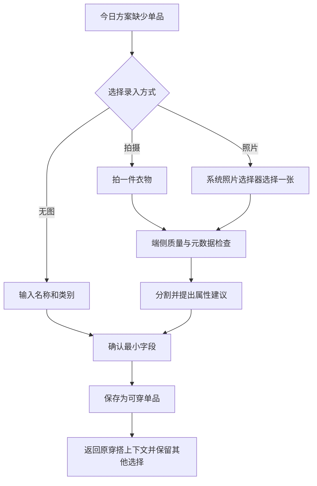
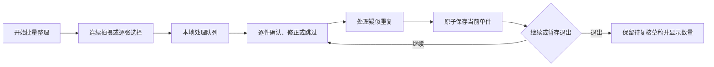

# 数字衣橱与衣物录入设计

## 2026-09-15 内置多视角衣物合同

当前内置目录固定两件 tops、两件 bottoms、两双 shoes，与三套人物形成 24 套有效 recipe。每套 recipe 的衣物已经生成在正/侧/背完整人物图中，并经过逐张审核；客户端不加载服装网格、不叠加透明 PNG，也不在 Dress up 时调用模型。真实用户衣橱仍是独立数据域，不因相似名称自动映射为内置视觉衣物。

本节取代下文 Blender 母版、独立 GLB、rig、morph 和 body coverage 的生产合同。当前技术和发布 SOP 见 [Design 18](18-Woo立体数字衣橱技术路线研究与决策.md)，执行见 [11-03](../plan/11-03-Woo多视角形象与内置穿搭执行计划.md)。下文旧合同只保留 11-02 no-go 证据。

## 2026-09-15内置三维服装生产合同

内置服装与真实用户衣橱继续是两个数据域。首版用户无需上传衣服，App 直接提供通过发布检查的内置服装；真实 `WardrobeItem` 不会因为存在同类模板就自动获得三维绑定或“用户拥有”事实。

正式服装使用 [Design 13 定案](13-三维虚拟形象与服装系统研究.md#2026-09-15市场复核与生产架构定案) 的 Blender 母版链：每件服装在同一角色 rest pose/armature 上制作自己的网格、权重、UV/PBR 和 `shoulderWidth`/`torsoDepth` shape keys，导出独立 plain GLB。MVP 只做两上装、两下装和两双鞋，不做用户图片转三维、任意 rig 重定向或运行时布料求解。

身体遮蔽使用固定语义区域 `torso`、`upperArms`、`hips`、`upperLegs`、`feet`、`ankles`。manifest 声明只是输入；renderer 在完整新组合暂存成功后一次性应用 coverage 并切换画面。身体穿出时必须回到 `.blend` 修衣服留量、权重、shape keys 或 body region，不用全局放大、隐藏整个人体或运行时推顶点兜底。

当前八个工程 GLB 已通过 Khronos 格式验证和 54 场景加载/视角自动化，但蓝色衬衫可见穿模，且工程资产没有可编辑源与正式材质。它们只保留为格式、bridge 和错误回归夹具，不进入内置生产 catalog。正式资产必须同时交付 `.blend` source revision、贴图、许可证、GLB/hash、rig/morph/coverage 清单和人工视觉矩阵。

MVP 发布资产随 App 离线打包；`.blend` 与源贴图在开发期本地持久化并备份到私有 MinIO。远程 catalog、热更新和素材商城后续另立契约，不让对象存储成为首次进入或每次换装的依赖。

## 2026-09-14核心换装合同

本轮根据用户保持 Woo 体验的决定，补足已批准 WARDROBE-REQ-025/026 的执行语义，技术原理与候选内容清单见 [Design 13](13-三维虚拟形象与服装系统研究.md#2026-09-14核心需求定稿与建模深度分析)。

- 内置目录是只读资源事实；真实衣物是用户事实。界面默认允许内置穿搭，模板 Look 不写入真实衣橱或直接复用 16-01 的实际衣物计划保存。来源字段显式区分。
- 首个合法集为上装/外套/下装/鞋；同槽位替换，鞋按一双计数，外套可清空。裙装归下装；连衣裙、帽包饰品和多层外套继续列为内容差距，不以参考出现就默认受支持。
- 托盘是待应用草稿，已应用造型独立。删除必需上装/下装/鞋后提示缺少项，保留上一有效模型及标明未应用；点击 Dress up 只应用完整有效组合。取消恢复已应用组合，加载失败保留可重试草稿，不偷偷换衣或调体型。
- body coverage 只隐藏完全覆盖的身体区域；外套与内层衣物的碰撞另用制作留量、内层遮蔽和显式组合规则解决。领口/袖口不能粗暴隐藏出洞，基础遮蔽不得失效。
- manifest 至少有 ID/版本、slot、rig/rest pose、morph 集/合法域、coverage、格式/几何预算、来源/许可/hash/字节数；服装和缩略图必须来自同一资产版本。
- 54 场景仅为 POC 子集，正式交付按全部声明支持组合、参数联合极值/中间采样、四朝向与连续旋转验收。任一新增衣物或体型域变更重跑受影响组合。

保存固定衣物资源版本、颜色、角色参数快照和日期；合法保存与预览状态分开，删除和重启保持一致。没有静态/几何资产的衣物不可假装已穿在模型上。

## 2026-09-14内置目录与用户衣橱分离

衣橱界面先展示版本化 `BuiltInGarmentCatalog`，再展示用户衣橱；两者可以进入同一选择托盘，但数据来源、删除语义与历史快照不混用。内置条目包含稳定 ID、展示名、TOPS/OUTERWEAR/BOTTOMS/SHOES 类别、槽位、色值、renderer 几何键、兼容 rig、资产版本与许可记录。它们随 App 更新且只读，不写入 GRDB 用户衣物表，也不冒充用户真实拥有。

Dress up 对有序选择先执行槽位与 rig 兼容校验，再以一个 revision 原子提交 renderer；快速 A→B→C 时只接受最新 revision。照片导入按钮留作可选的“我的衣物”扩展，不出现在内置目录的首次完成条件中。

## 2026-09-14首批手工确认属性提案

本节具体取值与写入合同为 `draft`，落实既有渐进建库/确认属性要求，待用户确认 [12-05 执行计划](../plan/12-05-手工衣物属性与确认来源执行计划.md) 后编码；不改变已批准 12-01/03 的交付状态。

首批只增加四项可选信息：正式度（休闲/整洁休闲/正式）、保暖感受（轻薄/适中/偏暖）、雨天适用（适合/不适合）、步行适用（适合/不适合）。每项均可为未知；全部未知仍可创建或保存衣物。数值是用户明确选择的衣物使用判断，不是温度、防水等级或舒适保证，不从照片、名称、类别、三维模板、过去点击或其他属性推断。

入口为既有新增/编辑衣物表单中的可选属性区域；初次不预选，修改保存前仍显示所选值。已知值来源只有本次用户确认，未知值没有来源；当前不创建 AI 建议表、模型版本占位、自由标签系统或第二套录入页面。换图、取消选图及只更改名称/状态必须保留原属性；照片与衣物一起保存时四项同事务写入。

属性变化或清除为未知提升衣物 revision，计划保存前依然复核；已存计划保留当时属性，新建或用户明确复核后的更新才捕获新值。清除当前属性不是删除历史，界面说明这一影响；彻底删除衣物则按现有两种历史策略清空全部新属性或删除相关计划，不新增绕过删除的缓存。完整推荐的颜色、图案、材质、季节、防风及覆盖约束继续待所属后续合同，四项完成不能抵扣整个推荐。

使用现有 `WardrobeInput` 的一个属性值对象，同一受保护 SQLite 库新增 nullable 枚举列；旧 OOTD 衣物/快照均保持未知，不猜测回填。候选 migration 标识 `ootd_wardrobe_attributes_v1` 避免占用 16-02 草案的全局 v5 名称；注册顺序和两片快照写入交点在数据任务前核定，禁止按“表存在则兼容处理”形成双实现。详细列约束、逐文件职责、失败注入和完成判定只维护在 12-05。

2026-09-14 推荐输入依赖补齐：当前 `WardrobeInput` 仍是名称/类别/状态的最小切片，符合 12-01；本文件已定义的其他确认属性尚未实现。为避免推荐层从名称或照片猜测事实，产品路线图新增 `12-05 手工衣物属性与确认来源` 登记，承接与首批推荐场景有关的最小可选属性、未知/用户确认/建议来源区分、清除属性、版本冲突、历史快照和删除。先固定字段/枚举及测试合同，再追加 schema；不修改 12-01/03 的已批准范围，不预建属性空表。具体缺口见 [推荐准入复核](06-穿搭推荐设计.md#2026-09-14推荐实现准入复核)。

## 2026-09-13单件图片持久化与恢复

Woo 衣橱选衣流程需要可靠的图片输入。12-03 先隔离验证文件与 SQLite 的跨资源恢复，再接真实单件图片净化、原生图片 UI 与删除。规范化图和缩略图以随机 photo ID 分组，分别保存用途、SHA-256、字节数及固定相对路径；不存原文件名、系统照片标识、原图或数据库 BLOB。两种图由同一照片组删除，结构化衣物保持独立。

持久化顺序为：数据库登记 importing 意图 → 受保护 staging 目录写完整文件并同步 → 同卷原子移动到 published 目录 → 数据库一次事务把新组设为 ready、旧组设为 deleting 并递增衣物 revision → 清理旧组。只有 ready 可供读取；提交前取消/失败不能替换旧图。重启清理 importing 和 deleting；文件缺失/哈希不符只让照片不可用，不删除衣物。移除照片先事务隐藏并持久删除意图，再清理文件与登记；失败保留 deleting 供重试。删除衣物必须在同一事务标记照片删除，不能级联丢掉清理依据。

隔离 POC 使用真实 SQLite 与合成字节验证中断、重复操作、过期 revision、坏文件、路径拒绝和删除；这些字节只证明存储一致性，不证明图片净化、人物检测、图像质量或真机文件保护。稳定生产 schema 在 POC 通过后纳入 OOTDSchema 的新 migration，不复制已有衣物 migration 或提前改变正式 App 存储。详见 [12-03](../plan/12-03-单件图片导入与媒体生命周期执行计划.md)。

### 生产数据合同

12-03 DATA-01 承接已通过 POC：在原 `wardrobe.sqlite` 追加 `ootd_v2_wardrobe_photos`，不另建媒体数据库。`wardrobe_photos` 每行是规范化图与其缩略图的一组：随机 photo ID 和 thumbnail ID、衣物 ID、importing/ready/deleting、两份 format/width/height/byteCount/SHA-256/相对路径、版本 1、上游明确传入的 catalog_ready 质量与创建时间；缩略图的父项固定为该 photo ID。一个衣物最多一个 ready 组，删除衣物时保留照片行并将 itemID 置空，以免级联丢失待清理文件。不存在原图/人物照片或云派生物字段；本片数据 API 不接受 render_ready 升级。

生产文件固定在受保护 `OOTD/WardrobeMedia`，以 `staging-<UUID>` 和 `photo-<UUID>` 目录隔离，组内只有 normalized.image、thumbnail.image。文件访问逐层检查目录项，拒绝符号链接、硬链接和未知子项；路径从 UUID 派生并复核保存的相对路径，不接受任意外部路径。写入文件完成同步和完整性检查后才发布目录。读取必须由调用方给出字节上限，并检查文件大小、摘要与登记相符；损坏/缺失返回无可用图片，衣物事实不受影响。

导入前预检拒绝已经存在的 staging/published 同 ID 目录，不创建新意图认领或清理这些原有文件；事务内同时检查 photo ID 与 thumbnail ID 在现存照片组间的交叉冲突。预检失败尚无新写入，不伪造待清理记录；已经登记后的中断继续使用持久意图恢复。该边界由单一 actor owner 保证正常任务串行，不声称抵御同进程恶意文件竞态。

`GRDBWardrobeRepository` 是当前唯一存储 owner，继续持有原 DatabasePool；`WardrobePhotoPersistence` 只在 Data 内同步执行 SQL 与文件协议，不新增数据库 owner 或全局 actor。提交前错误立即尝试撤销本次 importing；清理失败保留意图。提交后新图已生效，清理旧图失败返回“保存成功且仍需清理”，不把它当作保存回滚。删除先隐藏/登记，再清理，重试按原照片组 ID 执行，不把旧重试应用到新图。启动恢复删除残留失败时允许无图衣橱可用，保留可查询的清理状态及重试方法。

本轮数据 API 接收上游已经按单件衣物规则确认、净化并编码的值；只验证存储输入结构与完整性，不承担人物识别或把任意图片自动判为 catalog_ready/render_ready。原生选图/净化/预算由 IMAGE-01 完成后才开放用户图片入口。测试可使用合成字节验证数据协议，但不得认领图像处理通过；OpenAPI 与后端不变。

### 单件图编码合同

12-03 IMAGE-01 先实现独立衣物编码器：只接收已由选图服务限制大小的临时 Data 和明确 JPEG/PNG/HEIC 类型，先校验真实格式、签名、单帧、完整性和源像素，再按 EXIF 方向降采样为 sRGB 白底规范化 PNG，从同一规范化像素生成小缩略图。原输入与元数据不写数据库或永久文件；不自动抠图、不把背景移除或衣物识别作为已完成事实。PNG 编码器可能自行生成元数据，因此与现有人物净化器共用严格像素/色彩 chunk 清理工具，不复制人物会话、年龄或同意语义。

输出为待检查的两份编码图，不含 catalog_ready 或 render_ready 自动判断。图片模式/明显人物/无法分离多件/用户确认在后续同一 IMAGE-01 中完成；未通过时不得调用持久化保存，仍可换图或无图新增。当前原生 UI 和图片入口不变。服务无文件、数据库、网络副作用；调用 owner 负责临时输入的取消与释放，不宣称编码函数能够删除系统源或清零所有内存副本。

所有预算由构造参数显式提供：输入字节、源像素、规范化边长、缩略图边长、单栅格字节、两种输出字节、阶段时限；无未测的产品默认值。隔离候选为 20 MiB 输入、48 MP、2048/320 px、16 MiB 单栅格、20 MiB/512 KiB 输出、5 秒；需要实际设备峰值/耗时后才能作为发布预算。阶段时限在原生同步解码前后检查，不能中断 ImageIO 调用，也不能冒充硬内存限额。

实现依据：[Apple 方向变换选项](https://developer.apple.com/documentation/imageio/kcgimagesourcecreatethumbnailwithtransform) 与 [ImageIO 图像目的地](https://developer.apple.com/documentation/imageio/cgimagedestination)。自动验证覆盖方向、尺寸、色彩、透明背景、无源元数据、格式/动画/损坏拒绝、预算/取消及实际 SQLite 保存/重启/删除。原创绘制衣物轮廓仅作编码与显示夹具，不用于宣称 Vision 精度。

### 2026-09-13模拟器继续开发决定

用户在得知当前 Vision/真机状态后要求“先使用模拟器进行开发”。本轮证据表明模拟器显式 CPU 人物/面部请求可运行，自动设备选择与前景分割不可用；下一步基于已验证的人物/面部路径建立独立分析与用户复核，再接选图/保存/删除和 Woo 页面，不继续等待设备连接。计算设备由当前用例显式配置，不增加按旧系统或失败后悄悄切换的兼容分支。

前景实例不等于衣物数；自动分割无法完成时保留原背景并要求用户复核单件/一双鞋，无法安全形成单件素材时换图或无图。不得因为默认 Vision 失败而填零人数或自动保存。人物/多件/商品图原 PRD 边界不改变，生产精度/性能与物理保护验收后续补齐。当前单张合成人物与衣物对照只为开发基线，不是完整安全矩阵。

### 单件图系统文件接收与隔离检测

2026-09-14 身体部位实测边界：新增经人工检查的原创合成 `synthetic-hands-on-shirt`（两只成人手与前臂，无脸/躯干）。正式人物/面部请求在 512px 规范图返回 people=0/faces=0，现有复核进入 needsConfirmation；若用户错误声明没有身体部位，当前规则仍能确认，不能称为自动身体部位拒绝。已增加失败复现并保留完整图片安全矩阵未通过。

隔离比较 [Apple VNDetectHumanHandPoseRequest](https://developer.apple.com/documentation/vision/vndetecthumanhandposerequest)，固定 revision 1、maximumHandCount=2；512px 净化图/1254px 原合成图分别搭配显式 CPU/系统设备选择，四种条件均返回 0。单个合成样本不证明 API 普遍不可用，也不能通过调整 ground truth 抹去失败；本候选不能关闭当前缺口，因此不新增无验证收益的生产手部请求、阈值或设备回退。原图只在测试探针处理，不改变产品的净化边界。后续需更完整的获批身体部位样本与可复现检测方案；此前人工复核不被升级为自动安全保证。

2026-09-15 MVP 契约复核明确：PRD 12 要求自动阻断“明显人物或面部”，并要求所有零检出候选继续完成人工单件复核；它没有承诺自动识别每一处局部身体。`synthetic-hands-on-shirt` 因而保留为检测能力的负样本，用于证明 people=0/faces=0 时不会自动写入、缺少“没有人物或身体部位”的当前图片确认仍无法写入。手部请求四组失败和 MediaPipe 候选未准入继续作为已知边界，不再把未获批的自动局部身体识别写成首版完成门槛，也不以人工确认宣称算法已经判定安全。

系统 FileRepresentation 回调内使用受限文件导入器：lstat→O_NOFOLLOW 打开→fstat 身份核对→64 KiB 分块读取→前后 inode/size/mtime/ctime 核对→关闭源句柄→既有衣物编码器。只返回待检查规范化图/缩略图，不复制人物 session、不落永久原图、不删除系统 provider 文件。源文件必须单链接常规文件；取消、缺失、变化、超字节或阶段预算都不能返回可保存结果。系统选择器的 Progress、重复回调与离开页面所有权由后续适配器/用例单独接通，文件导入器不冒充该流程完成。

人物检测先做 12-03 测试 target 的隔离探针。素材只用本次原创生成且人工检查的虚构成人与既有原创衣物几何图，逐项记录合成来源、用途、预期人数和摘要；不加载真实用户图。先观察 Vision 人物框与前景实例在当前环境的能力/错误，再决定服务接入。前景实例不是衣物计数，零人物检出不是“确定无人”；未校准的检测不能自动授予 catalog_ready，更不能绕过 PRD 12 的单件/本人/商品图三种规则。不得将本次合成子集回填成 11-01 SEC-01 全部完成。

## 2026-09-13无图衣橱首个实现切片

承接用户全流程实施授权及“不保留旧开发数据”决定，12-01 采用全新 OOTD 数据库，先完成无图手工新增、列表/名称搜索/类别和可用状态筛选、编辑、单件明确删除及启动恢复。支持上装、下装、连体/连衣、外套、鞋、包、配饰七类；默认可穿视图，其他状态通过原生筛选可达。今日快速新增与衣橱新增写入同一 Repository，来源分别 quickAdd / wardrobe。

最小数据合同：UUID v4 稳定 id；名称去首尾空白后 1–80 个 Swift Character，拒绝控制字符；类别与 wearable/laundry/lentOut/packed 状态必须明确；createdSource、revision（从 1 递增）、createdAt/updatedAt（UTC 时间戳）由应用控制。当前没有云账号，无需 owner 表；单个受保护 App 数据库为本机衣橱边界。颜色/保暖/正式度等未实现字段不预建、不生成默认事实，归档/旅行匹配/历史快照由 12-02 和记录切片交付，首片不显示这些入口。

草稿在页面会话内，取消不写入；保存成功后才关闭，失败保留草稿。新增命令在一次编辑会话内复用 UUID，同 ID/同内容重复提交返回同一记录，同 ID/不同内容冲突；相同名称不同 ID 保留两件。更新与删除通过 expectedRevision 复核，过期操作不覆盖新值，重新读取并由用户再决定。列表使用 createdAt DESC、id ASC 的稳定排序；搜索是名称文字匹配，用户通配符不改变查询语义。

首份持久化路径为 Application Support/OOTD/wardrobe.sqlite，GRDB DatabasePool + WAL、单处 DatabaseMigrator、显式事务；只有 wardrobe_items 和 GRDB 自身 migration 登记表。目录与 SQLite 使用 complete 文件保护，关闭无业务需要的备份复制；初始化和磁盘操作不在 MainActor。无 legacy schema 探测/迁移/自动清库。打开失败提供重试，保留磁盘现状；重启重复迁移不创建样例。

删除当前无媒体、无历史引用的衣物前明确说明移出衣橱及未来推荐；事务删除后执行 secure_delete 与 WAL truncate checkpoint，清理失败显示可重试状态，不宣称物理闪存/系统备份擦除。再次删除不存在 ID 可继续清理；启动时也完成 WAL 收敛。未来加入媒体或历史时必须扩展删除事务和验收，不能沿用本片无引用假设。

空衣橱直接使用原生空态说明与工具栏新增，不展示无可筛选内容的筛选区；存在衣物时展示名称/类别/状态筛选，过滤无匹配与真正空衣橱区分。列表/编辑表单在辅助字号下使用原生 hard 滚动边界，避免大文字的柔化渐变影响工具栏可读性；保留全部 Dynamic Type 字号，普通字号使用系统自动样式。

2026-09-13 浅色普通字号的真实衣物行审计发现 subheadline + secondary 状态文字对比度不足。类别/可用状态是决策信息，改用系统 primary 前景，继续以字号区分层级；不调大或限制用户字号来绕过审计，浅色与深色分别回归。

本片不改 OpenAPI/ThenTransport、后端或依赖，不实现照片/模型/云账号。领域、Repository、ViewModel、实际模拟器保存/编辑/删除/重启和故障测试均在 [12-01](../plan/12-01-无图衣橱与数据库基础执行计划.md) 追踪；真机文件保护/辅助技术作为发布门禁单独记录。

## 2026-09-08 方向确认与研究边界

首版直接换装已确认，真实衣物与模板映射、适配、快照和失败边界由本文件“本地三维服装设计约束”与 PRD 12 承接。资产研究见 [`13-三维虚拟形象与服装系统研究.md`](13-三维虚拟形象与服装系统研究.md)；数量、合法参数域与性能仍待 POC，不将模板视为真实衣物事实。

## 本地三维服装设计约束

2026-09-08 本地换装已进入首版，承接 WARDROBE-REQ-022～024。首版随包资产是有限兼容集合，不提供任意衣物照片转三维；以下是编码前必须遵循的结构边界。

- `WardrobeItem` 继续表示真实拥有单品；`GarmentVisualBinding` 仅保存模板 ID、版本、颜色/材质参数及近似表示方式。二者不共用主键，不以视觉兼容性过滤推荐。
- 服装发布清单固定 rig 版本、形变参数域、槽位、覆盖区域、可叠穿矩阵和纹理/几何预算。上/下装与连体装等槽位冲突要显式处理，不静默移除真实搭配数据。
- 服装采用作者制作的蒙皮与各自拓扑匹配的 morph；不能把人物顶点位移直接复制到不同拓扑服装。基础遮蔽、覆盖 mask 与有限合法域优先于运行时布料物理。
- 换装先加载校验新资源，达到可显示状态后一次替换当前场景；失败保留原组合和明确错误。快速点击按最新 revision 生效，撤销恢复前一草稿。
- 组合快照同时引用真实衣物版本、角色配置、服装资产版本与显示参数；文件与 GRDB 用持久导入/提交记录恢复核对，不假设文件 rename 和数据库提交是一个原子事务。
- 不支持模板的单品继续以照片/卡片显示，并保留“未完整呈现”说明；不能仅穿上部分单品而宣称三维已完整展示保存组合。
- 发布资产清单与每个体型/姿态/服装组合的检查证据随构建保存；历史引用版本不被静默替换。首版素材更新通过 App 发布，不引入在线运营后台。

2026-09-12 保存与删除缺口已按 [Design 04 处理规则](04-数字形象与照片采集设计.md#保存失败与角色删除的处理规则) 收敛：通过参数/版本/兼容校验的组合可独立于 renderer 保存；旧图不能归入新快照，事务失败保留草稿。角色删除时清除组合中的私人外观副本和角色引用，保留真实衣物/服装示意及穿搭事实，改用单品拼图；不以“历史版本固定”为由保留已删私人参数。物理字段和故障恢复仍随生产切片落地。

资产制作方法与性能研究见 [Design 13](13-三维虚拟形象与服装系统研究.md)，测试步骤见 acceptance 12 新增 WARDROBE-ACC-011～013。衣物状态、历史快照和删除规则仍沿用本文件其余约束。

## 三维服装资产交付SOP

2026-09-12 补齐制作到验收的交接规范，落实 WARDROBE-REQ-022～024；角色整体流程见 [Design 04 SOP](04-数字形象与照片采集设计.md#本地三维角色开发与交付sop)。本节固定交付内容和责任，不批准尚未实测的款式、体型域、工具版本或性能数值。

### 资产包合同

人物、服装、头发、鞋和动作均按来源独立登记；具体 manifest/schema 在近期切片固定，不能直接将下表当作已发布格式。首个最小样本必须能换两件不同几何上装，同时有兼容下装、鞋和基础遮蔽。研究中的 6–10 件、3 个锚点、288 个视图仍是提案，不是必须提前生产的内容量。

| 交付项 | 必填内容 | 主责与接收检查 |
| --- | --- | --- |
| 来源与权利 | 作者/来源、许可文本与证据、修改/商用/随 App 再分发范围、署名要求；动作/贴图不能遗漏 | 产品/资产负责人收集证据；接收方逐项确认，未知不接入；参考软件画面不等于其模型可使用 |
| 制作事实源 | 母版与贴图源文件、source revision、制作软件与导出器版本、导出参数 | 技术美术交付，工程能追溯和重建；工具精确版本只维护 Design 01 |
| 人物与骨架 | rig ID/版本、骨骼命名与层级、坐标/单位、bind pose、蒙皮权重约束、基础遮蔽 | 技术美术与 renderer 负责人以同一运行资产复核，不只看制作工具视口 |
| 体型与姿态 | 参数字典版本、默认/合法域、联合约束、人物和每件服装自己的 morph、姿态修正、支持动作 ID | 不同拓扑不直接复制顶点位移；参数/动作未覆盖时禁止声明支持 |
| 衣物兼容 | 槽位、覆盖区域、遮挡 mask、可叠穿关系、冲突原因、支持的角色/体型/姿态/版本组合 | 衣橱用例可在加载前判定；不能以隐藏真实单品或自动改体型处理冲突 |
| 运行文件 | GLB/贴图/缩略图、哈希/字节数、几何/材质/关节/morph/纹理预算、允许扩展与资源清单 | 原生层核对 hash、格式、尺寸和内存/解码上限；外部资源不在清单则拒绝 |
| 验证与版本 | 兼容矩阵、视觉基准图、坏资产夹具、导出/加载报告、已知缺陷、对应 build | QA 检查整个支持集及中间参数；通过 glTF 格式检查不等于资产质量通过 |

### 制作和接入顺序

1. **先人物母版**：定风格与基础遮蔽，固定 rig、坐标、拓扑、有限参数，再制作依赖它的服装；人物合同变化时标记受影响服装/动作重新验证。
2. **逐件适配**：制作网格、UV/材质与蒙皮；对合法体型、有限姿态完成独立形变和遮挡；有实际需要时使用获准的离线服装制作工具，运行时不增加布料物理解算。
3. **先单件再组合**：验证每件衣物，再检查叠穿、头发/外套、鞋/裤脚和动作过程；缺陷归具体资产版本与参数，不能只记“有时穿模”。
4. **可复现导出**：依锁版工具导出，生成 hash/清单；格式校验后再做项目合同、安全上限与兼容检查；压缩或新增解码器必须重测，不能把桌面加载成功当 iOS 通过。
5. **受控交接**：工程接收来源齐全且通过检查的包，在测试壳验证；未知版本/不兼容返回明确失败并保留旧场景；只加载发布清单内资源。
6. **随构建发布**：首次仅 App 内置包；角色、服装和参数版本随保存快照固定；更新资产前验证旧组合能恢复，必要时保留受引用版本或提供获批迁移，不能静默换掉模型。

### 缺陷分流和重验触发

| 现象 | 首先核查 | 重验范围 |
| --- | --- | --- |
| 静态穿模、浮空、关节扭曲 | rig/bind pose/权重、形变空间、坐标单位和遮挡区域 | 修复资产的所有声明体型、姿态和叠穿组合 |
| 动作中穿模或脸部破损 | 动作与 rig/面部参数版本、纠正形变、受支持组合 | 整段动作、起止/中断/过渡；只看首尾帧不够 |
| 更换后仍显示旧衣服 | 场景 revision、旧会话回调、缓存 key/资产哈希 | 乱序与连续更换、取消、进程恢复，不能只改模型掩盖状态错误 |
| 高峰内存/发热或加载慢 | 纹理/几何/解码、同时保留的新旧场景、未释放资源 | 受影响最低设备、玻璃叠层、反复换装与空闲耗能 |
| 已保存组合无法恢复 | 引用版本、随包清单、持久事务与媒体恢复记录 | 历史构建升级、离线、删除与回滚；不自动重置用户角色 |

商业资产采购、具体工具许可和参考软件素材权利未在本次审核中核实；这里只固定必需的交接证据，不把研究链接视为任何具体资产已获授权。

## 原衣橱设计状态与范围声明

状态：已批准，2026-08-30。

关联文档：

- [`../prd/12-数字衣橱与衣物录入需求.md`](../prd/12-数字衣橱与衣物录入需求.md) 是本功能直接需求；[`../prd/10-OOTD产品需求.md`](../prd/10-OOTD产品需求.md) 是产品总纲。
- [`03-OOTD产品总体设计.md`](03-OOTD产品总体设计.md) 定义 OOTD-first 冷启动、三 Tab、90 秒决策路径和激活门槛。
- [`04-数字形象与照片采集设计.md`](04-数字形象与照片采集设计.md) 定义人物照片和数字形象，不与衣物图片混用生命周期。
- [`06-穿搭推荐设计.md`](06-穿搭推荐设计.md) 只消费用户确认的衣物属性与可用状态。
- [`07-AI虚拟试穿设计.md`](07-AI虚拟试穿设计.md) 定义衣物图片进入可选云端试穿前的额外同意和质量要求。
- [`08-动态预览设计.md`](08-动态预览设计.md) 不负责建立衣物事实。
- [`09-穿搭记录与反馈设计.md`](09-穿搭记录与反馈设计.md) 通过实际穿着回写穿着次数和状态建议。
- [`10-OOTD服务端与异步任务设计.md`](10-OOTD服务端与异步任务设计.md) 只在达到云能力启用门禁的任务中处理必要的短期媒体。
- [`11-OOTD权限隐私与安全设计.md`](11-OOTD权限隐私与安全设计.md) 统一照片、派生资产、保留和删除边界。

本文是 OOTD 数字衣橱与衣物录入的已批准设计。实现按 `docs/plan/` 分阶段落地，GRDB migration、服务端 GORM record、运行时 OpenAPI 与依赖变更必须随真实功能一起评审；衣物图片离机处理仍受供应商、合规、删除与 feature flag 门禁。

## 目标与非目标

### 目标

1. 允许用户从当日一套真实衣物开始渐进建库，不要求首次整理完整衣柜。
2. 让每件衣物拥有稳定身份、用户确认的结构化属性和可解释的当前可用状态。
3. 通过端侧质量检查、去元数据、分割和属性建议降低录入成本，同时保留人工修正。
4. 让基础浏览、手工新增、状态维护和推荐候选在离线时可用。
5. 将衣物照片与人物照片、试穿结果、穿搭历史分开存储和删除。
6. 让待洗、借出、打包和归档等现实状态可靠影响推荐，避免推荐“拥有但现在拿不到”的衣物。

### 非目标

- 不从用户完整照片库、相册分类、社交媒体、购物平台或通知中自动抓取衣物。
- 不根据账单商户、金额或商品标题静默创建衣物；未来账务关联必须由用户逐件确认。
- 不从照片推断真实尺码、人体尺寸、面料成分、保暖等级或洗护要求并当作事实。
- 不建立共享衣橱、家庭衣橱、租赁、二手交易、库存估值或购物清单。
- 不提供搭配社区、品牌目录、商品搜索、导购和联盟链接。
- 不因衣橱未达到“完整度”阻止用户手工记录或保存今日穿搭。
- 不把批量建库、照片级虚拟试穿或云端识别放入 90 秒核心决策路径。

## 设计原则

### 真实状态优先于目录完整

推荐准确度更依赖“这件今天能不能穿”而不是衣柜照片数量。衣物状态应是一等信息，且比算法猜测拥有更高优先级。

### AI 只提出候选

类别、颜色、图案、正式度、季节、保暖和材质均可由端侧或获批模型提出建议，但只有用户确认后才成为 `WardrobeItem` 属性。低置信度字段必须显式标记为未知，不能用默认值掩盖。

### 图片不是衣物本体

衣物可以无图存在；删除衣物照片不删除名称、类别、状态、穿搭历史或用户反馈。衣物 ID 不以图片哈希、文件名或 Photos 标识符作为业务主键。

### 渐进建库与批量整理并存

- OOTD-first 快速添加服务当日决定，字段最少、允许稍后补全。
- 衣橱 Tab 的批量整理服务主动建库，支持连续拍摄、逐项复核和中断恢复。
- 两条入口写入同一领域对象和确认规则，不复制两套衣橱。

## 信息结构

衣橱 Tab 建议包含：

1. **可穿**：默认列表，只显示当前可参与普通推荐的衣物。
2. **分类**：上装、下装、连体/连衣、外套、鞋、包和配饰；首个实施批次按计划明确支持类别，不能为未实现类别预建空入口。
3. **状态**：待洗、借出、已打包和归档。
4. **搜索与筛选**：名称、颜色、类别、季节、正式度和用户标签；未知属性不会被错误排除。
5. **新增**：拍摄、系统照片选择器、无图手工新增和批量整理。

“可穿”是默认工作视图，归档不与待洗混在同一筛选中。归档属于生命周期，其他状态属于现实可用性。

## 用户流程

### 三条录入路径

1. **快速连拍**：平铺或悬挂单件衣物，连续拍摄后只复核异常项，适合主动整理衣橱。
2. **从 OOTD 识别**：从用户主动选择的当日穿搭中拆出多件衣物草稿，适合冷启动和实际穿着记录。被身体、外套或其他衣物遮挡的区域必须标记为不完整，不生成虚构的平铺背面或隐藏细节。
3. **导入商品图或购物截图**：用户明确选择一张自己有权使用的图片并确认该衣物确实属于自己的衣橱；系统裁掉价格、订单、地址等无关区域，不把商品页文案、品牌或尺码自动当作事实。

三条路径最终进入相同的批量确认和去重规则。来源只描述证据路径，不决定推荐权重。

### OOTD-first 快速添加



最小字段：用户可理解的名称、类别、当前状态。若参与推荐，还需满足该类别所需的最小约束字段；未知保暖或正式度不会阻止保存，只会在推荐中降低确定性并显示提示。

快速添加返回原决策会话，不能清空场景摘要、已锁定单品或用户修改。

### 批量整理



批量流程每件独立提交，某张处理失败不会回滚已确认的其他衣物。退出时必须说明哪些已保存、哪些仍是本地待复核草稿、如何继续和如何全部丢弃。

### 状态维护

- 在单品详情、今日方案和穿搭完成反馈中都可标记待洗。
- “借出”可选记录预计归还日期和匿名备注，但不要求联系人权限或联系人身份。
- “已打包”可选关联用户明确选择的旅行上下文；在普通本地推荐中不可用，在相同旅行上下文中可用。
- 归档后不参与新推荐，但历史穿搭仍显示当时快照；恢复后重新进入其最后非归档可用状态或由用户选择状态。
- 状态改变后，已保存的未来方案显示“单品状态已变化”，不会静默替换方案。

### 删除照片但保留单品

用户可选择“移除照片”：删除 App 持有的规范化图、抠图、缩略图和与该照片直接派生的本地视觉特征，保留衣物名称、用户确认属性、状态和历史引用。依赖该图片的未开始试穿任务应取消；进行中云任务按 [`10-OOTD服务端与异步任务设计.md`](10-OOTD服务端与异步任务设计.md) 进入删除/清理状态。

## 拍摄与选择规范

### 拍摄引导

- 一次只拍一件主要衣物，平铺或悬挂，避免与其他衣服重叠。
- 保持全件进入画面，光线均匀，背景与衣物有足够区分。
- 首张默认正面；背面、细节和洗护标可作为可选补充，不作为首版激活门槛。
- 鞋和成对物品允许同一双出现在画面；不把左右鞋误建为两件。
- 避免真人入镜。若检测到明显人物，应提示重新拍摄或明确转入人物照片规则，不能自动把他人身体图存为衣物图。

### 端侧质量门禁

质量检查产生建议状态，不对无法精确判断的内容作绝对声明：

| 检查 | 通过 | 可修复 | 拒绝进入自动处理 |
| --- | --- | --- | --- |
| 清晰度/曝光 | 细节基本可见 | 提示调整亮度或重拍 | 图像无法辨认主要衣物。 |
| 完整性 | 主要轮廓完整 | 用户确认接受裁切 | 无法识别单件主体。 |
| 重叠 | 单件或一双鞋 | 用户手动选择主体 | 多件严重重叠且无法分离。 |
| 人物 | 无明显人物 | 仅手部等轻微遮挡，提示影响 | 包含清晰他人或非预期全身人物。 |
| 背景 | 可分割 | 允许手动修边/保留原背景 | 不阻止无图手工新增。 |

自动处理失败时仍可保存无图单品，不能要求用户反复上传才能完成今日决定。

### 图像处理

1. 通过系统照片选择器或 App 相机接收一次明确输入。
2. 在端侧移除 EXIF、GPS、原始文件名和不必要的拍摄元数据。
3. 纠正方向并生成尺寸受控的规范化工作图。
4. 尝试前景分割，保留可人工接受或重新处理的分割版本。
5. 生成 UI 缩略图；若获批本地相似度模型，再生成模型版本明确的特征。
6. 成功落盘并校验后释放导入原始字节；来自系统照片库的原图仍由系统照片 App 管理，OOTD 不持有永久 PhotoKit 身份。

每个衣物视觉资产都要独立标记用途质量：`catalog_ready` 表示足以浏览和参加推荐，`render_ready` 表示主体、可见区域、分辨率和遮挡达到试穿输入门槛，`unusable` 表示只能保留为待修复草稿。OOTD 拆出的遮挡衣物通常只能成为 `catalog_ready`；只有补拍或真实无歧义素材通过检查后才能升级，禁止通过生成补全把推测内容升级成衣物事实。

通过相机拍摄的图默认只进入 OOTD 本地存储，不自动保存到系统照片库；若未来提供“同时保存到照片”，必须由用户显式选择。

## 页面与状态

| 页面/组件 | 正常状态 | 异常或边界状态 |
| --- | --- | --- |
| 衣橱首页 | 可穿列表、分类、状态摘要 | 首次空、仅无图项目、处理草稿待复核、局部读取失败。 |
| 新增方式 | 相机、照片选择器、无图新增 | 相机不可用、照片选择取消、权限拒绝。 |
| 拍摄引导 | 实时框线或拍后检查 | 模糊、裁切、多人、多件重叠、光线不足。 |
| 属性确认 | 建议字段与置信度、用户修正 | 全部未知、类别不支持、处理模型不可用。 |
| 重复确认 | 两件并排、合并/仍保存/取消 | 旧项目无图、属性冲突、历史均被引用。 |
| 单品详情 | 图片、属性、状态、穿着摘要 | 图片丢失、状态变化、归档、历史引用存在。 |
| 批量复核 | 当前项、剩余数量、逐件保存 | 中断恢复、单项失败、低存储、用户丢弃草稿。 |

所有状态必须有文本和图形表达，不使用缩略图透明度或颜色单独表示待洗、归档等状态。

## 领域数据

以下均为已批准的逻辑领域对象，不等于物理 GRDB Record 或 PostgreSQL 表；后者只通过对应 migration 落地。

### WardrobeItem

```text
WardrobeItem
├─ id / ownerID
├─ displayName
├─ category / subtype
├─ lifecycle: active | archived
├─ availability: wearable | laundry | lentOut | packed
├─ confirmedAttributes
│  ├─ colors / pattern
│  ├─ seasonTags / warmthBand
│  ├─ formalityBand / styleTags
│  ├─ materialText? / coverageTags
│  └─ userConstraints
├─ primaryPhotoAssetID?
├─ createdSource: quickAdd | wardrobe | wearRecord | confirmedPurchase
├─ revision / createdAt / updatedAt
└─ archivedAt?
```

- `materialText` 是用户确认的描述，不等同于成分证明。
- 尺码可作为用户自由文本档案，但基础推荐和试穿不得据此承诺合身。
- `userConstraints` 可记录“不用于正式场合”“下雨不穿”等用户规则，不记录身体贬损描述。

### WardrobePhotoAsset

```text
WardrobePhotoAsset
├─ id / wardrobeItemID
├─ role: normalizedSource | cutout | thumbnail | detail
├─ source: quickCapture | ootdExtraction | productImage
├─ usability: catalog_ready | render_ready | unusable
├─ localRelativePath
├─ pixelSize / contentDigest
├─ derivedFromAssetID?
├─ processorVersion?
├─ protectionClass / createdAt
└─ deletionState
```

路径只能由受控本地资产仓库生成，领域层不接受任意外部路径。`contentDigest` 用于完整性和疑似重复，不作为跨用户全局身份，也不得离机共享。

### AttributeSuggestion

```text
AttributeSuggestion
├─ itemDraftID / field
├─ proposedValue / confidenceBand
├─ modelOrRuleVersion
├─ state: proposed | accepted | corrected | dismissed
└─ reviewedAt?
```

建议与已确认字段分开；重新运行模型不能覆盖用户修正。

### AvailabilityEvent

记录状态从何时、为何变化，用于解释推荐冲突和未来恢复。首个实施批次只需当前状态与最近变化；只有审计、同步或用户价值证据明确时才增加完整历史，并通过独立 migration 与验收落地，不能预建空表。

### DuplicateCandidate

疑似重复仅记录当前复核会话所需的两个稳定 ID、原因和置信区间。默认不自动合并，因为相似的基础款可能确实有多件。

## 一致性与业务规则

1. 保存有效衣物时，名称、类别和当前状态必填；图片、材质、品牌和价格不必填。
2. 用户确认属性优先级高于模型建议；模型升级不得重写已确认字段。
3. 推荐创建候选时读取同一一致性快照中的衣物属性和状态，不能先选中后忽略状态变化。
4. `archived` 项不能进入新候选；`laundry` 和 `lentOut` 默认不可用；`packed` 只对匹配旅行上下文可用。
5. 衣物状态在用户保存方案后变化，方案保留但标记冲突，不能自动替换。
6. 历史穿搭引用稳定衣物 ID 和当时显示快照；后续改名、归档或移除照片不重写历史。
7. 删除衣物实体前必须说明对未来推荐、历史记录、正在进行的试穿任务和派生媒体的影响。
8. 疑似重复只提示；用户明确选择合并前，两件均保持独立。
9. `catalog_ready` 可以参加推荐但不能静默进入试穿；`render_ready` 必须来自真实可见像素和已通过的质量检查，模型补全不得提升该状态。

## 接口与本地存储边界

以下协议用于划分 SwiftUI/ViewModel 与领域、数据和系统边界；具体实现随相应功能阶段进入代码：

```swift
protocol WardrobeRepository {
    func saveDraft(_ draft: WardrobeItemDraft) async throws
    func confirmItem(_ command: ConfirmWardrobeItemCommand) async throws -> WardrobeItem
    func updateAvailability(_ command: UpdateAvailabilityCommand) async throws
    func query(_ filter: WardrobeFilter) async throws -> [WardrobeItem]
    func removePhoto(_ command: RemoveWardrobePhotoCommand) async throws
}

protocol WardrobeImageProcessingService {
    func inspect(_ input: WardrobeImageInput) async throws -> WardrobeImageInspection
    func normalizeAndSegment(_ input: WardrobeImageInput) async throws -> ProcessedWardrobeImage
}
```

- View 和 ViewModel 不直接读写文件、Vision 结果、GRDB Record 或云供应商 DTO。
- 数据库只保存结构化元数据和受控相对资产引用；图片不以 BLOB 混入业务行。
- 规范化图、抠图和缩略图保存在 App 管理的受保护目录，使用随机稳定 ID，不使用用户原始文件名。
- 本地写入采用“临时受控文件 → 完整性校验 → 原子移动 → 元数据事务”的顺序；任一步失败都不能留下指向不存在文件的已确认衣物。
- 本地衣橱与基础推荐不上传衣物图片、特征或标签。只有用户主动触发、已通过门禁的云生成任务，才可按 10、11 号设计把必要净化资产写入私有对象存储并加入 OpenAPI 数据流。
- 若实施多设备结构化衣橱同步，照片缺失必须有无图 UI；不能用同步开关暗中上传原图。

## 权限、隐私与安全

- 进入衣橱不请求相机或相册权限；只有用户选择拍摄时请求相机，照片选择优先使用系统 picker 而非完整库授权。
- 在照片操作前说明：“衣物照片将保存在本机衣橱，直到你移除照片或删除衣物；不会因基础推荐自动上传。”具体文案需独立本地化与 Dynamic Type 验收。
- 人物检测用于防止意外保存身体图，不把检测结果持久化为人物画像。
- 规范化时去除 EXIF/GPS、设备信息和原始文件名；日志、诊断、通知和分析中不得出现图片路径、摘要、颜色组合或自由备注。
- 本地文件保护、后台快照遮罩、导出白名单和安全删除遵循 [`11-OOTD权限隐私与安全设计.md`](11-OOTD权限隐私与安全设计.md)。
- 衣物照片用于 AI 试穿时是新的离机用途，必须逐次或按明确范围重新同意；衣橱录入同意不能替代云上传同意。
- 不索取联系人权限来记录借出对象；不自动识别或持久化衣物标签上的姓名、地址、订单号等无关文字。
- 用户素材不得用于训练、广告、全局相似衣橱或跨用户推荐。

## 失败与降级

| 失败 | 处理 | 不允许 |
| --- | --- | --- |
| 相机拒绝/不可用 | 系统 picker 或无图新增 | 循环弹权限框。 |
| 照片选择取消 | 回到原决策，保留上下文 | 创建空白已确认衣物。 |
| 图像模糊或裁切 | 给出一条可操作建议，允许重拍或无图保存 | 用“失败”而不说明问题。 |
| 分割失败 | 保留规范化图或改用无图卡片 | 伪造完整抠图。 |
| 属性模型不可用 | 仅要求名称、类别、状态 | 写入未知来源默认属性。 |
| 疑似重复 | 并排比较，用户决定 | 自动删除或自动合并。 |
| 低存储 | 当前单件不确认，清理受控临时文件 | 留下数据库引用或扩大删除范围。 |
| 批量处理中断 | 已确认项保留，待复核项可继续或全部丢弃 | 重复创建已确认单品。 |
| 图片文件损坏/丢失 | 显示无图占位，允许重拍 | 删除衣物和历史。 |
| 离线 | 全部基础录入和状态维护可用 | 将网络作为保存门槛。 |
| 云试穿占用照片 | 显示任务并执行取消/删除协调 | 移除 UI 后让云副本无期限存在。 |

## 关键决策与备选方案

### 决策一：渐进建库为默认，批量整理为主动入口

原因：先完成真实 OOTD 能更早提供价值；批量录入仍适合有明确整理意愿的用户。

备选：首次强制拍满 20 件。该方案增加冷启动成本，不采用；只有定向用户研究证明完成率和长期价值明显更高时重评。

### 决策二：最小字段可保存，AI 属性需确认

原因：衣物图片无法可靠证明材料、保暖或正式度；允许未知比错误事实更安全。

备选：后台自动建库并隐藏置信度。该方案会污染推荐且难以纠错，不采用。

### 决策三：本地规范化图与派生图分开

原因：可以移除背景、替换处理版本或只删除照片，同时保持衣物事实稳定。

备选：只保存原图或只保存抠图。只存原图增加显示和隐私负担；只存抠图在处理失真后无法本地修正。是否在极端存储约束下只保留一种版本需通过真实空间测量重评。

### 决策四：归档与现实可用性分离

原因：待洗和借出是暂时不可用，归档表示不再参与日常管理；混为一个布尔值会破坏恢复和历史解释。

备选：单一“隐藏”状态。语义不足，不采用。

### 决策五：重复只提示，不自动合并

原因：用户可能拥有两件高度相似的同款，自动合并会让穿着次数和可用状态失真。

备选：基于图片摘要强去重。只有导入来源存在稳定外部 ID 且产品规则获批时重评。

## 可执行测试与验收

以下是设计级验收；正式发布还须满足 `docs/acceptance/` 中的系统验收并留存证据。

### 场景一：OOTD-first 快速添加

- 前置条件：空衣橱，用户正在一条手工场景决策中。
- 操作：分别用相机、系统 picker 和无图方式添加上装、下装与鞋。
- 期望：每次返回保留原场景和已选单品；三种方式写入同一对象语义；照片不是必填。

### 场景二：属性建议不覆盖用户

- 前置条件：模型建议蓝色、休闲，用户改为蓝绿色、商务休闲。
- 操作：保存后模拟模型版本升级并重新处理。
- 期望：用户确认值保持不变；新建议单独显示，不静默覆盖。

### 场景三：现实状态过滤

- 前置条件：同类鞋分别为可穿、待洗、借出和已打包。
- 操作：在普通场景和匹配旅行场景中请求候选。
- 期望：普通场景只使用可穿鞋；旅行场景可使用匹配的已打包鞋；其他状态不出现且原因可解释。

### 场景四：疑似重复

- 前置条件：录入两件相同款式但状态不同的白 T 恤。
- 操作：触发重复提示并选择“仍保存为两件”。
- 期望：产生两个稳定 ID，状态和穿着历史互不覆盖。

### 场景五：照片删除

- 前置条件：单品有规范化图、抠图、缩略图、本地特征和历史穿搭引用。
- 操作：移除照片但保留衣物。
- 期望：全部直接派生媒体和特征被清理；结构化单品、状态和历史保留；推荐可使用无图卡片。

### 场景六：低存储和中断

- 前置条件：批量处理五张合成图，在第三张原子提交前注入磁盘不足。
- 操作：退出并重启。
- 期望：前两件已确认；第三件没有悬空路径；后两件按明确草稿策略恢复或丢弃；重试不重复前两件。

### 场景七：隐私

- 操作：选择含 GPS/EXIF 的合成图片，完成录入后检查受控目录、数据库、日志、导出和网络。
- 期望：App 保存的工作图无原始元数据和文件名；基础录入无网络请求；图片不进入日志和默认导出。

### 场景八：权限和离线

- 操作：拒绝相机、不给完整照片库权限、关闭网络，使用无图新增并维护待洗/恢复可穿。
- 期望：核心路径可完成；权限拒绝不隐藏衣橱；状态更新即时影响本地候选。

### 场景九：可访问性

- 操作：最大辅助字号、VoiceOver 和深色模式下完成新增、属性确认、状态修改和疑似重复比较。
- 期望：图片均有类别/颜色/名称文本替代；状态不只靠颜色；操作顺序、命中区和错误建议可理解。

### 场景十：基线与云门禁检查

- 操作：检查 migration、OpenAPI、PostgreSQL schema、依赖、生产入口和 feature flag。
- 期望：衣橱结构只覆盖当前实施阶段，不包含购物抓取或空入口；基础录入不产生网络请求，云端图片上传只能由通过供应商、合规和删除门禁的主动生成流程触发。

### 单件图选图交接与复核状态

12-03 的系统选图适配器只接收当前主动选择的 JPEG/PNG/HEIC 文件表示，在系统回调有效期内调用已有有界文件导入器并返回内存中的净化图对；不复制原图、不创建人物会话或读取 Photos identifier。每次选择有独立 operation，持有 provider Progress 和最多一个编码任务；取消、超时或错误取消并等待该任务，重复/迟到回调不可二次交付。provider 包装错误不能掩盖已经观察到的格式/预算错误。总接收时限由用例显式传入，不能把阶段时限当成图库下载总时限。依据 [Apple PhotosPickerItem](https://developer.apple.com/documentation/photosui/photospickeritem) 与 [loadTransferable completion](https://developer.apple.com/documentation/photosui/photospickeritem/loadtransferable(type:completionhandler:))。

复核会话只持有当前净化图及分析结论，不自动写入衣物。检测到人物/面部则拒绝；未检出仍须用户明确确认图片无人物、主要衣物完整且为本人拥有的一件衣物或一双鞋。检测失败不能通过人工开关变成零检出。替换、取消或分析失败清空旧复核同意；只有当前候选和当前确认可构造 catalog_ready 写入值，不可借用上一张确认。前景分割不作为衣物数量事实，保留背景的图片由上述单件规则复核。保存继续使用已实现 Repository 的 UUID/expectedRevision，不由分析服务发起数据库写入。

旧编辑器写入收到明确的衣物 `notFound` 时，清除列表旧项、名称/类别、已存图、候选图和复核同意，进入“衣物已删除”终态，只保留说明与关闭。没有待清理事实时不显示清理重试，也不再接受保存、选图或删除提交。照片不存在/读取失败不等同于衣物删除；普通 I/O 错误仍保留草稿。由本编辑器提交删除且清理未完成时保留原精确身份与重试入口，两类状态分别验证。

人物分析服务固定 HumanRectangles revision 2（upperBodyOnly）与 FaceRectangles revision 3；用例显式选择 CPU 或系统设备分配，失败不自动改设备。先校验规范图实际 PNG 单帧、像素与字节预算，再运行真实请求，任何 nil/错误/取消/阶段时限超出不返回零计数。阶段时限为调用前后检查，不声称能中断正在执行的系统同步推理；最低设备性能与完整检测矩阵尚待验收。两个合成素材只建立模拟器 CPU 开发证据，不能证明遮挡、海报、印花、局部身体等全部准入精度。

### 页面保存的衣物与照片原子提交

12-03 页面接入发现：先调用 create/update 再 savePhoto 会在照片写入失败时留下已变更的衣物，违反当前“保存失败保留草稿、换图失败保留旧图/衣物”的行为。新增衣物附图与编辑换图因此使用同一个 Repository 用例：先持久登记照片 importing 意图并写文件，最终在同一 SQLite 事务中创建/更新衣物、绑定照片、旧图转 deleting、新图转 ready；失败只清理本次照片组，衣物字段和旧图不变。

新增衣物在提交前不存在可见的 wardrobe_items 行。其 importing 记录允许暂不绑定 itemID，ready 必须绑定；追加本地 v3 migration 修正这一约束，v1/v2 标识与 SQL 不改写，已有衣物/照片数据保留。重启对所有非 ready 照片统一恢复清理。UUID 不变的同内容保存可重试，不同字段、source 或图片不得借同照片命令覆盖已提交内容。不是把照片保存失败补偿为删除刚创建的衣物，也不依赖页面生命周期回滚数据库。

### 模拟器图片编辑联调

在已批准的单件入口内接系统 PhotosPicker（仅 images/current encoding）与复核表单。选图只产生页面会话内候选，人物或面部检出不得展示为可保存衣物；零检出仍要求四项单件复核。选图适配组件把已选项目封为精确异步选择协议，页面只发送事件；ViewModel 持有 selection ID、候选和失败状态，SwiftUI task(id:) 取消旧任务，迟到结果由领域 selection ID 再拒绝。退出/后台丢弃未保存候选并隐藏图片，已保存照片不删除。

当前模拟器联调配置明确为 20 MiB 输入、48 MP 源、512 px 规范图、128 px 缩略图、1 MiB 单栅格、4 MiB/512 KiB 输出、5 秒阶段与 60 秒系统交接时限；CPU 分析最多 512² px/4 MiB/5 秒。该开发配置选用已验证的 512 px 检测路径，不代表真实设备生产尺寸/精度/性能预算通过，也不降低完整人物/多件验收门禁。后续 Woo/生成所需素材分辨率按其真实输出要求调整并重测，不将此规格当成最终高清试穿规格。

字段与新图片通过原子保存提交。已有照片的“移除照片”是独立明确确认、立即生效的删除动作，衣物保留；它不等待字段保存，也不因随后取消表单而复活。清理失败立即隐藏照片，保留精确照片 ID 和重试入口；回读 revision 只更新编辑基线，不覆盖仍未保存的字段。图片不可读/丢失时显示可恢复状态，无图编辑仍可用。所有新增用户文本进 String Catalog，真实图片页面与 Woo 分类网格/选衣托盘分别验收。

有效照片记录与图片字节分开读取；验证过的照片 ID 在字节读取前登记到编辑状态。即使目录结构、文件权限或文件类型导致读取抛错，仍保留“移除照片”的精确对象，错误只影响图像显示。删除先登记意图、再清理；障碍尚未排除时隐藏记录并提供原 ID 的重试，不能依赖成功解码图片才能执行删除。

## 2026-09-13分类网格实施边界

重新查看用户提供的 [Woo 演示](https://x.com/LerSentAI/status/2090783821452943404?s=20) 第 30.8 秒：浅色背景、类别分组、小图四列、整件衣物留白展示。按上衣、外套、下装、连体、鞋、包、配饰排列已有类别；空类别不展示。原生 SwiftUI 网格使用真实已保存衣物和受保护缩略图，保留名称、可用状态、搜索和筛选；点击进入现有编辑页。无图或不可读图用中性占位，仍可编辑，不虚构衣物图。

常规字号使用自适应小图列；辅助功能字号单列，名称换行。缩略图只经 WardrobePhotoRepository 有界读取（512 KiB），ViewModel 解码；以衣物 revision 刷新，离开/后台清空且拒绝迟到读取，不新增全局缓存或媒体副本。无数据模型、API、后端或上传变化。已有 IMAGE 的净化、复核和保存子检查点支持独立开发浏览页面；完整图片安全矩阵仍是整片验收前置。此排期细化承接用户已授权的 Woo 页面复现及模拟器开发，不变更产品或隐私契约。
