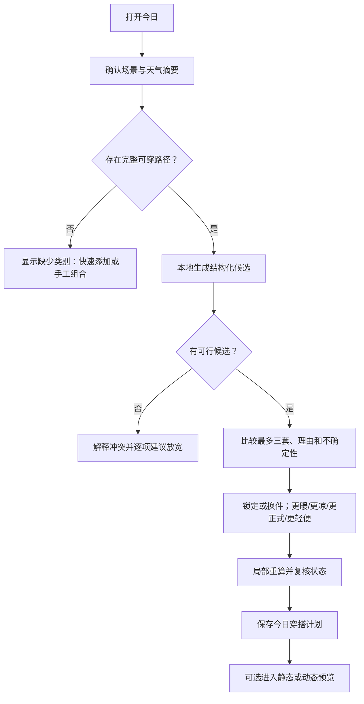

# 穿搭推荐设计

## 2026-09-14推荐实现准入复核

当前产品代码已支持手工选择真实衣物并保存计划，但尚未实现结构化推荐。以下是本次源码与需求对照结果，不是新的算法、字段默认值或执行计划批准：

| 输入或能力 | 当前机器事实 | 实施归属与完成前提 |
| --- | --- | --- |
| 今日场景 | [RootView](https://github.com/StephenQiu30/then-app/blob/main/ThenApp/App/RootView.swift) 当前只有手工新建计划/添加衣物入口，没有结构化场景控件或推荐结果 | `13-01` 固定手工场景枚举、未知态、日期/原始时区、来源及会话退出清理；具体输入需有真实消费路径，不能先堆放无作用控件 |
| 衣物确认属性 | [WardrobeInput](https://github.com/StephenQiu30/then-app/blob/main/ThenApp/Features/Wardrobe/Domain/WardrobeModels.swift) 只有名称、类别和当前状态；没有颜色、正式度、保暖或活动适配字段 | 衣橱主题补齐手工确认属性切片 `12-05` 的合同与测试；未实现属性保持未知，不从名称、照片、类别或视觉模板补造事实 |
| 归档与已打包匹配 | 当前状态枚举含 wearable/laundry/lentOut/packed，但 [OOTDSchema](https://github.com/StephenQiu30/then-app/blob/main/ThenApp/Data/Database/OOTDSchema.swift) 没有独立 lifecycle 或已打包上下文匹配事实 | `12-02` 固定状态/归档及匹配语义；`13-02` 不能把 packed 默认当作可穿，也不能凭场合名称推断匹配 |
| 保存场景与推荐依据 | [OutfitPlanInput](https://github.com/StephenQiu30/then-app/blob/main/ThenApp/Features/Outfits/Domain/OutfitPlanModels.swift) 只保存 `contextSummary` 文本；当前 16-01 快照没有结构化上下文、策略或理由版本 | `13-04` 接入保存前须固定结构化上下文与最小理由快照、原子保存、历史不改写、删除和追加迁移；不能解析自由文本摘要充当已确认约束 |
| 学习信号 | 当前没有实际穿着/反馈实现；16-02 仍是待确认合同 | `13-03` 无历史时明确未个性化；未来只消费实际穿着或独立、可撤回的结构化反馈，收藏/换件/保存计划/媒体操作不形成偏好 |

首个无图本地推荐仍按完整目标推进：手工场景与真实可用衣物 → 硬约束和无解说明 → 少量确定性候选与解释 → 局部调整和保存复核。只实现类别组合不能抵扣正式度、防雨、活动、未知态和来源验收；只增加场景表单也不能记为推荐闭环。首批字段、枚举和规则应由当前实际场景所需的最小集合决定，颜色/材质等非必要信息继续可选，不要求一次填满衣橱。

本次同时纠正下文旧评分表的偏好证据列，使其遵守已批准 PRD 13 `RECOMMEND-REQ-012/016`；原“明确收藏、换件”不是长期学习来源。权重仍是研究假设，未获得策略和测试证据前不作为已批准算法写入代码。审计与门禁见 [验收 13](../acceptance/13-穿搭推荐验收.md#2026-09-14推荐数据与学习边界审核)。

## 文档状态与范围声明

状态：已批准，2026-08-30。

关联文档：

- [`../prd/13-穿搭推荐需求.md`](../prd/13-穿搭推荐需求.md) 是本功能直接需求；[`../prd/10-OOTD产品需求.md`](../prd/10-OOTD产品需求.md) 是产品总纲。
- [`03-OOTD产品总体设计.md`](03-OOTD产品总体设计.md) 定义三 Tab、OOTD-first 冷启动、90 秒决策和两条产品闭环。
- [`04-数字形象与照片采集设计.md`](04-数字形象与照片采集设计.md) 的数字形象不是推荐前置条件。
- [`05-数字衣橱与衣物录入设计.md`](05-数字衣橱与衣物录入设计.md) 提供用户确认的衣物属性和当前可用状态。
- [`07-AI虚拟试穿设计.md`](07-AI虚拟试穿设计.md) 只把已选结构化方案转换为可选视觉预览。
- [`08-动态预览设计.md`](08-动态预览设计.md) 不参与候选排序或真实性判断。
- [`09-穿搭记录与反馈设计.md`](09-穿搭记录与反馈设计.md) 提供实际穿着结果和可解释反馈。
- [`10-OOTD服务端与异步任务设计.md`](10-OOTD服务端与异步任务设计.md) 约束未来可选云任务，不是基础推荐依赖。
- [`11-OOTD权限隐私与安全设计.md`](11-OOTD权限隐私与安全设计.md) 统一约束场景摘要、画像、日志和删除。

本文是 OOTD 穿搭推荐的已批准设计。基础推荐固定本地优先并按 `docs/plan/` 分阶段落地；GRDB migration、策略版本和验收证据必须随实现同步更新，不能以远程生成替代本地核心路径。

## 目标与非目标

### 目标

1. 从用户真实拥有且当前可用的衣物中，在 90 秒主路径内给出少量可执行方案。
2. 先满足用户硬约束，再用天气、场合、活动量、个人偏好和轮换需求排序。
3. 每套方案说明“为什么适合”“哪里不确定”，支持锁定单品后局部换件。
4. 在断网、天气过期、日历未授权、无数字形象和视觉生成失败时仍能完成基础推荐。
5. 用用户实际穿着和明确反馈渐进个性化，不根据身体、人口属性或消费能力推断偏好。

### 非目标

- 不推荐用户未拥有的虚构单品，也不把导购商品混入衣橱候选。
- 不预测真实尺码、合身、垂坠、透明度、保暖数值或医学意义上的冷热风险。
- 不评价身材、年龄感、吸引力、显瘦、肤色优劣或社会地位。
- 不把生成图片的美观程度当作排序事实；基础排序不等待静态或动态预览。
- 不读取完整日历标题、备注、参会人、精确地址、路线坐标、账单或购物历史。
- 不用无限信息流、连续重抽或随机奖励延长决策时间。
- 基础推荐不接入远程大模型、向量服务或推荐 SaaS；新的天气供应商或云端排序只有在独立数据流、隐私、成本和架构变更评审通过后才能启用。

## 推荐原则

### 事实、约束和偏好分层

- **事实**：衣物身份、类别、当前状态和用户确认属性；系统建议不能静默覆盖。
- **硬约束**：用户明确排除、场合着装要求、必须防雨、必须便于步行、已锁定单品等；不满足就不能进入候选。
- **软偏好**：颜色倾向、轮换、熟悉度、风格探索和历史舒适反馈；只能影响排序。
- **不确定信息**：未知保暖、天气缓存过期、场合由系统推测等；降低置信度并显示，不等同于不满足。

用户显式输入的优先级始终高于系统摘要，最近一次针对当前会话的修改高于历史偏好。系统不得为提高“推荐命中率”暗中放宽硬约束。

### 少量、多样、可比较

默认最多展示三套：

1. **稳妥**：综合约束满足度最高，优先复用已验证舒适的组合。
2. **天气优先**：在满足场合的前提下，更重视温度、降水、风和步行量。
3. **更有风格**：在所有硬约束通过后，增加颜色、层次或轮换多样性。

衣橱只能组成一套或两套时，展示真实数量并说明限制，不复制同一方案伪装选择。三个标签描述优化方向，不是对用户审美的价值评判。

## 输入边界

### 场景摘要

推荐只接受经用户确认的最小 `OutfitContext`：

```text
OutfitContext
├─ localDate / timeWindow / timeZone
├─ occasionKind / formality / dressCode
├─ indoorOutdoor / expectedWalking / activityLevel
├─ weatherBand / precipitation / wind / UV
├─ temperaturePreference
├─ userHardConstraints
└─ sourceKind / sourceUpdatedAt / confidence
```

- 无日历权限时，用户选择场合、正式度和时间段即可。
- 普通当日推荐只使用城市级天气或手工天气，不要求精确位置。
- 天气必须携带来源更新时间；过期后仍可使用，但需显示“基于较早天气”。
- 系统从日程或出行派生的场景必须先展示摘要供用户确认，不把原始正文传入推荐层。
- 用户已保存方案后场景变化，系统只提示差异并提供“保留”或“重新推荐”，不静默替换。

### 可选自然语言输入

“明天下雨，见客户但别太正式”之类的输入只用于生成 `OutfitContext` 草稿。首版优先使用结构化控件；未来若引入语言模型，必须满足：

- 输出受固定 JSON Schema 和枚举约束，无法解析时回退结构化表单；
- 把解析结果展示给用户确认，不把自由文本直接传给候选生成器；
- 语言模型不能选择衣物、创造衣物 ID、放宽硬约束或给候选排序；
- 推荐解释仍由 `reasonCode` 和本地化模板生成，语言模型不得编造不存在的证据；
- 自由文本的离机处理、保留、日志和删除需另行批准，基础推荐不依赖该能力。

### 衣橱快照

一次推荐绑定生成时刻的衣橱快照，至少包含：

- 衣物全局 ID 和本地版本；
- 生命周期与可用状态；
- 用户确认的类别、颜色、季节、正式度、保暖、活动适配和标签；
- 字段是否未知、是否仅为未确认建议；
- 最近实际穿着和明确反馈的可用聚合，不包含原始照片像素。

未确认的 AI 属性不得作为硬过滤事实。候选打开或保存前必须重新检查相关衣物状态，避免把刚标记待洗、借出或归档的单品保存为今日决定。

## 候选生成与排序

### 阶段一：硬过滤

按以下顺序过滤，便于返回可解释冲突：

1. 当前用户、`active` 生命周期、当前上下文中可用；
2. 满足一条完整穿搭路径：“上装 + 下装 + 鞋”或“连体/连衣 + 鞋”，外套和配饰按场景可选；
3. 满足用户明确排除、已锁定单品、覆盖需求和 dress code；
4. 满足场合所需正式度与活动需求，例如大量步行时的鞋类硬约束；
5. 用户将防雨、防风或保暖声明为“必须”时，满足相应已确认属性。

天气建议默认是软约束；只有用户确认“必须防雨”等要求后才升级为硬约束。系统不能把有限模型推断包装为安全保证。

### 阶段二：组合生成

- 先按所需角色取可用单品，再基于类别兼容、用户排除和已确认搭配冲突生成组合。
- 候选只保存衣物 ID 和版本引用，不生成新的“虚拟衣物”。
- 控制组合搜索上限；衣橱较大时先按上下文适配粗排每个角色，再组合，不对全部笛卡尔积穷举。
- 已锁定单品始终固定；若与新硬约束冲突，返回冲突而不是偷偷解锁。

### 阶段三：可解释评分

候选首版建议使用可版本化的确定性评分，不由语言模型直接决定顺序：

| 维度 | 初始权重 | 证据 | 说明 |
| --- | ---: | --- | --- |
| 场合适配 | 30% | 正式度、dress code、活动类型 | 已作为硬约束的部分不重复奖励。 |
| 天气与体感 | 25% | 温度带、雨、风、用户冷热反馈 | 未知属性降低置信度，不伪造数值。 |
| 活动适配 | 15% | 室内外、预计步行、活动量 | 鞋与外层优先受影响。 |
| 用户偏好 | 15% | 用户主动确认的实际穿着；独立且可撤回的结构化反馈 | 收藏、换件、保存计划、跳过和媒体操作均不自动产生偏好；无证据时明确未个性化。 |
| 组合协调 | 10% | 已确认颜色、图案、层次规则 | 规则可解释、可覆盖。 |
| 轮换多样性 | 5% | 最近实际穿着 | 不惩罚用户反复穿喜欢的衣物。 |

初始权重是待研究假设，必须记录在 `RecommendationPolicyVersion`，经离线测试和可用性研究后才能调整。调整不能回写或重解释历史推荐；历史记录保留当时版本和理由快照。

### 阶段四：多样性选择

从通过硬约束的高分组合中分别选取三个方向，并限制组合间的重复。衣橱较小时允许共享核心单品，但至少替换一个对用户可感知的角色；做不到时减少候选数量。任何多样性处理都不能让低于硬约束的方案入选。

候选量较大时使用版本化的 MMR（Maximal Marginal Relevance）选择：在归一化基础分与“和已选方案的最大相似度”之间取平衡。相似度只由共享衣物角色和用户已确认的颜色、图案、层次标签计算，不读取人物照片或生成图。系数、相似度定义和回退规则写入 `RecommendationPolicyVersion`，避免为了凑足三套而牺牲硬约束。

## 用户流程

### 从“今日”完成一次决定



基础推荐应在上下文和衣橱快照就绪后目标 p95 两秒内首屏可交互；视觉预览不是该性能指标的一部分。

### 候选卡信息层级

首屏每套只展示：

- 方案方向、衣物缩略图或无图色块、当前可用状态；
- 最多三条具体理由，例如“有雨：使用已确认防水外套”“步行较多：选择舒适反馈更好的鞋”；
- 最多两条关键不确定性，例如“这件针织衫的保暖属性未确认”；
- “选这套”“换一件”“为什么”三个主要动作。

“适合你”“AI 推荐”不是有效理由。详细页可展开证据来源、上下文更新时间和评分维度，但不展示易造成虚假精确感的总分百分比。

### 锁定与局部换件

- 用户点按衣物可锁定，再选择更暖、更凉、更正式、更休闲、更轻便或手工替换。
- 重算只改变未锁定角色，保持当前页面、上下文和其他锁定项。
- 替换列表只展示当前可用且满足硬约束的单品，并解释被排除单品的首要原因。
- 所有修改形成会话内可撤销操作；退出前未保存修改不写入长期偏好。

### 无可行方案

冲突页按以下优先级给出解决路径：

1. 显示缺少的类别或不可用状态；
2. 显示相互冲突的用户硬约束或锁定单品；
3. 提供一次只放宽一个约束的预览，并明确改变了什么；
4. 提供快速添加、改变衣物状态或转入手工搭配。

系统不得自动忽略 dress code、防雨等用户硬约束，也不得推荐购买作为唯一解决方案。

## 页面、状态与失败降级

| 状态 | 用户看到 | 可恢复动作 |
| --- | --- | --- |
| 衣橱不足 | 缺少的完整路径和当前数量 | 快速添加、无图新增、手工组合。 |
| 场景不完整 | 未知字段及其可能影响 | 手工补充或继续低置信度推荐。 |
| 天气过期/无网络 | 最近更新时间，不冒充实时 | 使用缓存、手工选择天气、稍后刷新。 |
| 正在生成 | 结构化骨架，不展示虚假结果 | 可取消并转手工组合。 |
| 无可行候选 | 具体冲突和逐项放宽建议 | 修改约束、状态或添加衣物。 |
| 锁定项冲突 | 哪件锁定衣物与哪条约束冲突 | 保留并改约束，或明确解锁。 |
| 衣物状态已变化 | 受影响单品和变化时间 | 替换、恢复状态或保留为仅计划。 |
| 推荐引擎失败 | 原衣橱和上下文仍可用 | 重试或手工搭配；不进入无限加载。 |
| 视觉预览失败 | 结构化方案和理由完整保留 | 重试预览、查看单品拼图或直接保存。 |
| 历史偏好不足 | 使用通用规则并说明未个性化 | 继续使用；实际反馈后渐进改善。 |

若推荐执行超过两秒，界面先展示可手工组合的已过滤衣物；超过五秒进入可恢复失败态并记录不含敏感内容的本地诊断码。

## 领域数据

以下是已批准的逻辑领域对象，不等于物理数据库表或接口 schema；GRDB/Atlas migration 与 OpenAPI 只在相应功能进入实施阶段后落地：

### `RecommendationRequest`

- `id`、`createdAt`、`localDate`、`timeZone`；
- `contextSnapshot`：最小场景摘要和值来源；
- `wardrobeSnapshotId`；
- `lockedItemIds`、`userOverrides`、`requestKind`；
- `policyVersion`、`status`、`failureCode`。

### `WardrobeSnapshotRef`

- `id`、`capturedAt`；
- `itemId`、`itemVersion`、`availabilityAtCapture`；
- 只保存保证历史可解释所需的版本引用和确认属性摘要，不复制图片。

### `OutfitCandidate`

- `id`、`requestId`、`directionKind`、`rank`；
- `items[]`：`role`、`wardrobeItemId`、`itemVersion`、`locked`；
- `scoreComponents`、`reasonIds`、`uncertaintyIds`；
- `validAgainstSnapshotAt`、`policyVersion`。

### `RecommendationReason`

- 稳定 `reasonCode`；
- 关联上下文字段和衣物确认属性；
- 本地化模板参数；
- `evidenceKind`、`confidence`。

原因保存结构化码而不是模型自由文本，保证可测试、可本地化并避免敏感正文进入日志。

### `ConstraintConflict`

- `constraintCode`、`sourceKind`、`affectedRoles`；
- `blockedItemIds`；
- `safeRelaxationOptions` 和预期影响；
- 不包含原始日历或位置正文。

### `RecommendationSession`

- 会话内的生成、锁定、换件、撤销和选择事件；
- 用户主动保存方案时，只有解释该计划所必需的摘要进入计划记录；保存行为本身不产生学习信号。
- 长期学习只消费主动确认的实际穿着或独立、可撤回的结构化反馈；会话换件、收藏和媒体操作不转换为偏好。
- 未保存会话按短期数据清理，不将每次浏览当成偏好；实际穿着或反馈被纠正/删除后，从剩余有效证据重建。

### `RecommendationPolicyVersion`

- 规则版本、评分权重版本、支持的类别和原因码版本；
- 变更说明和生效范围；
- 只允许新请求使用新版本，不重排历史结果。

## 接口与本地存储边界

### 领域协议

通过以下领域接口隔离 SwiftUI/ViewModel 与数据层：

```text
RecommendationContextProvider.confirmedContext(for:)
WardrobeRepository.snapshot(for:)
OutfitRecommendationService.generate(request:)
OutfitRecommendationService.recompute(session:change:)
OutfitPlanRepository.save(candidate:contextSnapshot:)
```

协议只描述领域数据，不暴露 GRDB Record、EventKit 对象、天气供应商 DTO、OpenAPI 生成类型或模型供应商响应。

### 本地优先

- 场景确认、硬过滤、组合、排序、解释、锁定和保存均应能在本地完成。
- 基础规则与策略版本随 App 提供；远程配置不得在未经版本固定和回滚验证时改变硬约束语义。
- 推荐会话、候选和反馈按用户本地数据处理；图片仍由衣橱或数字形象资产层管理。
- 不为本地基础推荐预建云推荐 API、向量数据库、对象存储或远程特征表。

### 可选云能力

若后续以测量证据证明云端排序有必要，必须先更新产品需求、[`10-OOTD服务端与异步任务设计.md`](10-OOTD服务端与异步任务设计.md)、OpenAPI、Atlas migration、计划和验收，并满足：

- 本地基础推荐仍可用；
- 上传的是最小枚举特征和不可逆请求 ID，不上传原始日历正文、精确位置、人物照片或账务；
- 明确用户同意、幂等、取消、超时、保留和删除；
- 远程失败不能覆盖本地已确认方案。

## 隐私与安全

- 基础推荐不请求相机、照片、日历或精确位置权限；权限只由具体入口按需申请。
- 推荐层不接收人物照片、人体尺寸、面部特征、联系人、账务或消费能力。
- 日历和出行仅提供用户确认的枚举摘要；天气优先使用城市级信息。
- 日志不得记录衣物名称、用户标签、事件正文、地点、方案构成或自由文本反馈；只允许聚合耗时、结果数量和安全错误码。
- 分析事件不得包含稳定衣物 ID；需要漏斗时使用会话级随机标识和枚举状态。
- “清除推荐历史与学习”应删除保存的会话摘要和派生偏好，不删除衣橱事实或已明确保存的穿搭记录，除非用户同时选择。
- 所有推荐理由必须能够回溯到用户输入、确认属性或明确规则，禁止用不可解释人口画像补全。

完整同意、保留、导出和删除链遵循 [`11-OOTD权限隐私与安全设计.md`](11-OOTD权限隐私与安全设计.md)。

## 关键决策与备选方案

### 决策 1：结构化推荐先于生成式视觉

- **选择**：先生成真实衣物 ID 组合，视觉预览只消费已选方案。
- **备选**：让生成模型直接输出一张“今日造型”。
- **原因**：前者可检查库存和状态、可解释、离线可用，也不会让不存在的衣物混入决定。

### 决策 2：硬过滤后评分

- **选择**：不满足用户硬约束的组合永不进入排序。
- **备选**：所有组合统一评分，让高总分抵消约束失败。
- **原因**：防止模型用“更好看”覆盖 dress code、活动或用户明确排除。

### 决策 3：默认三套而非无限推荐流

- **选择**：最多三套有明确方向的候选，数量不足时诚实减少。
- **备选**：不断刷新、随机重抽或瀑布流。
- **原因**：服务 90 秒决策，降低选择负担，也便于比较推荐理由。

### 决策 4：用明确反馈学习，不用身体或消费画像

- **选择**：学习实际穿着、冷热、舒适、场合合适度和用户主动偏好。
- **备选**：从人物照片、年龄、账单或品牌价格推断风格。
- **原因**：明确反馈更相关、可撤回，且显著降低敏感推断和歧视风险。

### 决策 5：未知属性降低确定性而非默认排除

- **选择**：除硬约束所必需字段外，未知属性进入候选但显示不确定性。
- **备选**：要求补全全部属性后才能推荐，或用模型猜测填满。
- **原因**：支持渐进建库，同时不把猜测包装成事实。

## 可执行测试与验收

以下是设计级验收；正式发布还须满足 `docs/acceptance/` 中的系统验收并留存证据。

### REC-01 只推荐真实可用单品

- 前置：衣橱含 8 件可穿、1 件待洗、1 件归档衣物。
- 操作：生成当日推荐并查看所有候选和替换列表。
- 期望：所有衣物 ID 来自当前用户衣橱；待洗和归档衣物均不出现；不生成新商品。

### REC-02 完整路径门槛

- 前置：只有上装和鞋，没有下装或连体单品。
- 操作：请求推荐。
- 期望：不伪造完整方案；明确显示缺少类别，并提供快速添加和手工组合。

### REC-03 硬约束不可被高分覆盖

- 前置：用户设定“必须防雨”，只有一件已确认防雨外套。
- 操作：生成并多次换件。
- 期望：所有候选保留该硬约束；尝试排除该外套时显示冲突，只有用户明确放宽后才可继续。

### REC-04 锁定后局部重算

- 前置：已有三套候选。
- 操作：锁定上装，依次选择“更暖”和“换鞋”，然后撤销一次。
- 期望：上装始终不变；只重算未锁定角色；撤销恢复前一版本；上下文不丢失。

### REC-05 不确定信息可见

- 前置：一件候选针织衫的保暖属性未知，天气缓存超过产品定义时限。
- 操作：生成天气优先方案。
- 期望：界面同时显示衣物属性未知和天气更新时间；理由不声称实时或精确保暖。

### REC-06 场景变化不静默覆盖

- 前置：用户已保存户外午餐方案，随后来源摘要变为有雨。
- 操作：重新进入今日。
- 期望：旧方案仍存在；显示摘要差异；只有用户选择重新推荐后才生成新方案。

### REC-07 无权限与离线降级

- 前置：拒绝日历、照片和位置权限，设备离线，衣橱有完整可穿路径。
- 操作：手工选择场合和天气并请求推荐。
- 期望：本地生成、解释、换件和保存全部可用；不反复弹权限请求。

### REC-08 状态竞态复核

- 前置：生成候选后，在另一页面将其中一件衣物标记待洗。
- 操作：返回并保存该候选。
- 期望：保存前检测版本/状态变化，阻止无提示保存，提供替换或恢复状态。

### REC-09 无可行组合解释

- 前置：用户锁定休闲鞋，同时 dress code 要求已确认的正式鞋；衣橱无其他正式鞋。
- 操作：请求重算。
- 期望：返回锁定项与 dress code 的具体冲突；一次只提供一个明确放宽选项；不自动解锁。

### REC-10 性能与取消

- 前置：目标最低支持真机、500 件合成衣物、缓存上下文。
- 操作：连续发起、取消和重新发起 30 次推荐。
- 期望：结构化候选生成 p95 不超过 2 秒；取消后不覆盖新会话；超过 5 秒进入可恢复失败态；无悬空任务。

### REC-11 语言与公平性

- 前置：覆盖不同数字形象模式、无人物模式和多种衣物属性的合成数据。
- 操作：检查所有原因、冲突和空态文案。
- 期望：不出现显瘦、遮丑、肤色优劣、年龄感、吸引力或消费层级判断；理由只引用上下文、衣物和明确反馈。

### REC-12 可访问性

- 前置：开启 VoiceOver、加粗字体、最大 Dynamic Type 和“减弱动态效果”。
- 操作：完成确认上下文、比较、锁定、换件和保存。
- 期望：不依赖颜色区分候选；读出衣物角色、状态、理由和不确定性；放大后主要动作不被截断；无需动态预览完成决定。

### REC-13 基线与范围验收

- 操作：检查 migration、OpenAPI、依赖、导航、推荐数据流和后续隔离原型。
- 期望：本地推荐只使用已确认的真实衣物与最小上下文；没有预建云推荐、向量数据库、导购、订阅或容量权益，也没有把人物照片发送给推荐排序。
