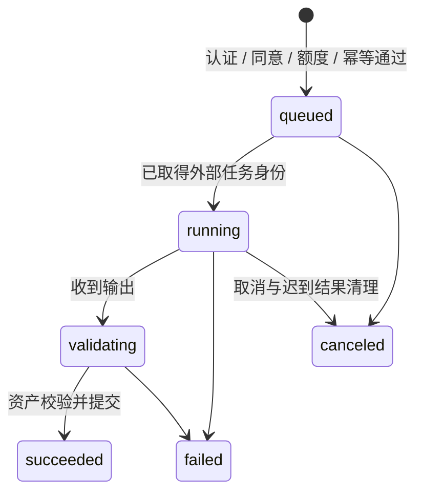

# 完整穿搭图与按需三维生成设计

更新：2026-09-24，设计 `approved_with_gates`，真实生成实现 `pending`。产品需求归 [PRD 14](../prd/14-AI虚拟试穿需求.md)，当前完整架构归 [Design 20](20-OOTD完整产品能力与阶段架构设计.md)。本文件取代原单件试穿作为唯一主链的设计，保留单件作为质量对照。

## 输入、输出与两个独立动作

输入是一份不可变 Look 草稿快照：人物 preset/revision 或经准备的本人照片、明确选衣 ID/revision、合格参考图和当前同意。人物+衣物参考图按 Provider 上限校验，暂不自动多轮拼接，也不将无图衣物假装送入生成。

动作一 `image` 产生完整 Look 图片，经过收取、格式/安全/质量校验后成为可确认的结果；图片可以单独保存、收藏、日期关联和主动分享。动作二 `model` 只从用户已确认、仍有效的图版本产生静态 GLB，不重新提交本人原照和所有单品参考。两个用途分别说明实际接收方、发送内容、地域、保留和费用。

## Provider 验证顺序

开发和测试采用本地优先路线：图片默认使用确定性的 `fixture` Provider；需要视觉质量验证时，只接入一个有明确 HTTP/进程合同的本地图片服务。`then-server` 不把 Codex CLI 当作图片 Provider：Codex 可以编排本地任务或生成受控参数，但必须由实际的图片服务返回图片字节，不能让业务依赖交互式 CLI 或未定义的工具调用。

三维路线固定为本地 `img2threejs`。上游的核心输出是可审查的 TypeScript/`THREE.Group` 工厂，不直接等同于带纹理静态 GLB；因此 worker 需要在同一受控工作目录执行固定版本，经过 Three.js 导出/材质烘焙，再执行 GLB 容器、纹理、面数、字节和外部 URI 校验。托管转换器或 `plugin-img2glb` 的远端 TRELLIS 依赖不进入默认测试路径，若启用必须重新走 Provider、地域、预算和删除门禁。

云端图片/模型 Provider 保留为后续生产候选，不在本地 POC 中自动回退。若本地图片服务或 `img2threejs` 工具不存在，任务必须失败关闭并保留可诊断状态，不切换到云服务。

首个 Go adapter 只实现 submit、query、fetch 和实际存在的 cancel/delete 能力；不伪造供应商支持的删除/取消。不把 SDK 引入 App，API key 只在服务端配置中使用。输入输出 URL、照片正文及密钥不得写日志。

## 任务与版本

公共任务状态与工作阶段分开；外部提交结果不明、正在取消、删除清理进度有独立记录，不能塞成“成功”。PostgreSQL 保存输入快照与 provider_task_id，worker 可重启后查询；Kafka 只唤醒处理。服务端对账后才能决定是否重新提交，避免计费 POST 在网络超时后被无条件重试。

模型去重键含 owner、Look/revision、图片 SHA-256、Provider/model 与规范化参数。同键有效任务直接返回；已完成且资产仍可用时返回已有模型。图片或参数变化产生新指纹；旧版本晚到不修改当前 Look。输入在执行中被删除或同意撤回时，事务立即撤销关联任务的访问并建立清理记录；能证明尚未提交的任务同时取消并释放预留额度，可能已被外部受理的任务保留取消/对账事实。迟到结果不得发布，只能进入精确对象版本清理。

## 资产收取与发布

Provider 输出 URL 只作为短期收取位置，服务端限制允许来源/重定向、大小与超时后下载；防止任意地址读取。图片重新解码并净化；GLB 按 Design 20 验证容器、buffer/accessor、纹理、预算、外部 URI 和扩展。保存私有 MinIO 固定对象版本，再原子提交媒体与任务结果；数据库失败则保留可追踪待清理对象，不泄漏孤儿。

成功不是“供应商返回文件”；必须先完成技术、安全与质量检查。用户核对保留行为独立于任务 succeeded，不改写衣物、推荐偏好或实际穿着。质量投诉与失败原因用于能力治理，不能当偏好信号。

## App 与失败处理

SwiftUI 显示参考、真实状态、取消/重试及费用；App 接入所需认证/媒体/任务 Client，由运行时 OpenAPI 生成或封装，View 不直连 Provider。图片 ready 后返回结果页，模型阶段继续独立任务卡。网络不可用时可保存本地草稿，联网后重新检查同意和额度，不自动发起之前未确认的计费请求。

下载图片/GLB 至临时目录，字节/hash/内容验证后原子安装受保护缓存。缓存失效、低存储、弱网、GLB 解码失败保持图片；更换 Look 不复用上一模型标签。模型显示不依赖动画 clips、眼部或逐件服装蒙皮。

## 删除与成本闭环

复用 Design 10/11 的资产血缘、Outbox、幂等清理与账号删除。取消请求先隐藏未发布结果，外部不能即时停止时如实说明；已经发生的供应商费用独立记账，不承诺取消退款。删除图片可达模型，删模型可保留图片；原图/模型输出不可跨 owner 共享缓存。

上限按任务类型、用户配额与总预算分别控制。初次 POC 每样本最多两次计费尝试是止损建议，正式数值在账号价格核验后冻结。首次成功理论价、失败放大和最低充值分开，不拿网站订阅价当 API 成本。

## 质量和交付

先代表完整图与 GLB，再六套内置资产与至少 12 组生成输入；检查身份/衣物/图案/四肢、正侧背合理性和连续观察。单图推断背面不能宣传真实扫描。小样本只用于进入集成，真实用户人群质量、照片公平性、许可、地域与删除还须独立关闭。

实现 [14-01](../plan/14-01-完整穿搭图与按需三维生成执行计划.md) 时与 11-05 共享同一 Look/revision 合同，不新增平行 TryOnResult 数据库。逻辑概念在实际 Go 类型/GORM record 中一次定义，接口以 Huma 运行时 schema 为准。验收 TRYON-ACC-001～008/011/012 与 CLOUD-ACC-012 目前 pending；已有私有图片 worker 不抵扣真实生成 E2E。
