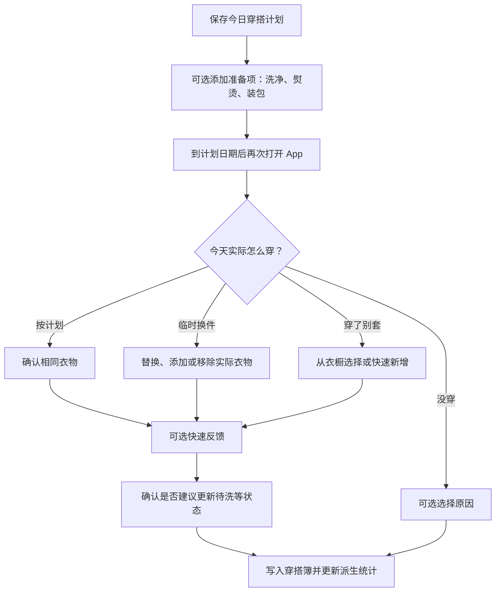

# 穿搭记录与反馈设计

## 内置造型与真实记录分离

此为 Design 03/04/05/13 最新研究的记录侧落点，映射 PRD 16 `OUTFIT-REQ-009`。零自有衣物用户的首页保存对象是模板 Look：固定选择、角色/服装版本、外观快照、日期与原始时区；不复用 OutfitPlan/WearEvent 的真实衣物语义。Look 使用稳定业务 ID，预览是可删除派生资产，基础模型是共享只读资产。

Swift 用例校验配置/槽位/版本并提交本地事务；预览 ACK 不决定保存是否成功。重复保存防重复写、失败保留草稿，封面只接收同一 revision。再次应用不改变 Look 身份，切换观察角度不切历史记录；资源缺失显示不可用，不能静默替换款式。删除 Look 清理其私有预览；删除角色按 AVATAR-REQ-021 清除各 Look 的私人外观与引用，保留独立服装示意/日期，禁止旧回调复活。

日期/日历入口分清“造型”和真实计划/实际记录；模板日期不是实际穿着时间证据。真实推荐和穿着次数仍只使用拥有事实与 WearEvent；从模板转成真实计划需要明确选择真实 WardrobeItem 并校验状态，不能按名称或外观自动关联。

11-02 仅实现隔离配置保存/恢复验证；生产 Look 的表、版本/删除合同在 POC 后实际生产切片定义，不在本次预建 migration，也不修改 16-01 已批准的真实计划数据合同。验证见 OUTFIT-ACC-011，目前 pending。

2026-09-14 时间线分页恢复：追加仅属于一次明确的“加载更早”请求；在请求开始时消费意图。页面重新读取按当前存储事实替换首屏，不能因为上一次分页而保留已删除计划或旧取消状态。保持原日期/创建时间/ID 游标规则，不引入缓存或新数据模型。真实 SQLite 复现与回归归 16-01 TEST-01。

2026-09-15 详情状态定位：详情中的取消操作位于长页面底部，确认后状态与日期语义位于顶部。状态从 active 变为 cancelled 时，页面必须把详情顶部滚入视口，让用户立即看到结果并从稳定视口继续阅读；不靠改色、缩字或测试手势掩盖不可见状态。该行为只改变详情呈现位置，不改变取消事务、计划快照或删除规则。

2026-09-14 删除边界复核：计划详情或编辑器持有旧快照时，Repository 已确认计划不存在（`notFound`）必须清除场景、单品选择和旧快照，转入仅可关闭的已删除状态。读取、刷新、保存和取消均适用；已删除对象不得以新建命令重新提交。普通 I/O 失败继续保留草稿供重试；本机删除已提交、仅物理清理待重试时只保留不透明清理标识。该修复落实已有删除与防复活契约，证据由 16-01 管理。

2026-09-12 角色删除的历史快照处理统一遵循 [Design 04](04-数字形象与照片采集设计.md#保存失败与角色删除的处理规则)：清除私人角色外观及引用/派生预览，保留独立衣物与穿搭事实，以拼图/文字展示；历史快照不作为重建已删除外观的来源。此规则将在对应生产数据切片中映射到物理字段与事务，不改旧生活管理数据。

## 文档状态与范围声明

状态：已批准，2026-08-30。

关联文档：

- [`../prd/16-穿搭记录与反馈需求.md`](../prd/16-穿搭记录与反馈需求.md) 是本功能直接需求；[`../prd/10-OOTD产品需求.md`](../prd/10-OOTD产品需求.md) 是产品总纲。
- [`03-OOTD产品总体设计.md`](03-OOTD产品总体设计.md) 定义默认内置造型旅程及真实衣橱分支，日期/日历进入 Look 和穿搭簿。
- [`04-数字形象与照片采集设计.md`](04-数字形象与照片采集设计.md) 定义人物照片和数字形象删除后的历史降级。
- [`05-数字衣橱与衣物录入设计.md`](05-数字衣橱与衣物录入设计.md) 定义衣物身份、状态、归档和照片删除。
- [`06-穿搭推荐设计.md`](06-穿搭推荐设计.md) 只消费明确、可解释的实际穿着反馈。
- [`07-AI虚拟试穿设计.md`](07-AI虚拟试穿设计.md) 的生成结果不是“实际穿着”证据。
- [`08-动态预览设计.md`](08-动态预览设计.md) 的观看、停留和分享不等同于偏好反馈。
- [`10-OOTD服务端与异步任务设计.md`](10-OOTD服务端与异步任务设计.md) 约束未来同步和派生媒体清理。
- [`11-OOTD权限隐私与安全设计.md`](11-OOTD权限隐私与安全设计.md) 统一约束记录、自由文本、分析和删除。

本文是 OOTD 穿搭记录与反馈闭环的已批准设计。基础记录、反馈与历史按本地优先路径实施；GRDB migration、服务端 GORM schema、运行时 OpenAPI、通知和同步数据流只能随对应阶段与验收一起落地。

## 目标与非目标

### 目标

1. 清楚区分“计划穿”“实际穿”和“穿后感受”，避免把保存、浏览或生成当成真实偏好。
2. 让用户在几秒内确认实际结果，必要时记录临时换件、未穿和原因。
3. 在“穿搭簿”中按日期回看、复用和修正历史，同时面对衣物或照片状态变化仍可理解。
4. 用温度体感、活动舒适度、场合匹配和是否愿意再穿等明确反馈改进推荐。
5. 让穿后状态维护成为可确认建议，而不是自动把衣物标为待洗。
6. 基础记录、查询、编辑、删除和反馈在离线时可用。

### 非目标

- 不用生成图片、动态预览观看时长、点赞或停留时间自动认定“实际穿过”。
- 不要求用户拍当日自拍、打卡、分享或保持连续记录。
- 不提供公开动态、社交排名、审美评分、身材变化、卡路里或健康判断。
- 不把“未穿”“换掉”解释为对身体、外貌或单品的永久负面评价。
- 不提供衣物折旧、库存估值、洗护服务、购物复购或品牌忠诚分析。
- 不建立长期原始位置轨迹来证明实际穿着，也不使用后台定位触发反馈。
- 不使用 Time Sensitive/Critical Alerts，不为反馈默认推送；普通提醒、多设备同步或媒体备份只有通过各自独立数据流与权限评审后才能启用。

## 核心语义

### 计划不等于实际

| 概念 | 回答的问题 | 是否计入穿着次数 | 是否作为个性化证据 |
| --- | --- | --- | --- |
| 模板 `Look` | 我保存的内置服装造型是什么？ | 否 | 否；不证明拥有或实际穿着。 |
| `OutfitPlan` | 我准备在何时、什么场景穿什么？ | 否 | 只表示当时选择，不表示体验。 |
| `WearEvent` | 我在某天实际穿了哪些衣物？ | 是 | 是，且允许用户修正或删除。 |
| `OutfitFeedback` | 实际体感和场合结果如何？ | 不重复计数 | 是，按反馈维度使用。 |
| 试穿/动态预览 | 视觉上想象效果如何？ | 否 | 否；媒体保留或收藏不产生推荐证据，只有独立且可撤回的明确反馈可参与学习。 |

推荐保存、加入日程、生成试穿、查看详情、停留和分享都不能创建 `WearEvent`。穿着次数只从未删除的实际穿着事件派生。

### 反馈不是考试

- 主反馈可在一次确认中完成，所有细项可跳过。
- 不展示“反馈完整度”、连续天数或红点追问。
- 用户可编辑或删除过去反馈，派生偏好随后重算。
- “今天没穿”是正常结果，应帮助理解冲突而不是惩罚用户或衣物。

## 信息架构

“穿搭簿”由首页日期/日历进入；与模板造型回看明确分区，真实记录包含：

1. **时间线**：默认按本地日期显示计划、实际穿着和状态标记。
2. **日历**：按月查看哪天有计划、实际穿着、反馈或未穿；不读取系统日历即可使用。
3. **收藏/可复用**：用户明确收藏的组合和近期穿着，不以 AI 分数自动收藏。
4. **详情**：当时场景快照、计划与实际差异、单品快照、反馈、准备项和编辑/删除。

空态只引导“从今日保存第一套”或“记录今天实际穿的”，不插入示例记录冒充用户历史。

## 用户流程

### 从今日方案到实际反馈



结果确认应支持“一键按计划穿了”；只有发生差异时才展开衣物编辑。反馈跳过后仍保存实际穿着，不用反馈完整度阻塞。

### 无计划记录实际穿着

1. 在穿搭簿或今日选择“记录今天穿了什么”。
2. 从可穿衣物中选择完整或部分组合，也可快速添加无图单品。
3. 确认本地日期、时区和大致场景；场景可留空。
4. 可选填写快速反馈并保存。

部分记录是合法事实，例如只记住外套和鞋；界面标记“部分记录”，推荐学习只使用已确认部分，不补造未知衣物。

### 复用历史穿搭


“再次穿这套”创建新计划并保留来源引用，不复制为新的衣物或直接创建实际穿着。归档、已删除、待洗或借出的衣物必须在确认前显示。

### 穿后状态确认

- 保存 `WearEvent` 后可以提出“是否把这些衣物标为待洗”的逐件建议。
- 建议可基于用户为该单品设置的维护偏好，但默认不自动变更状态。
- 用户确认后，衣物状态和 `WearEvent` 在同一业务事务中写入；取消或失败不产生半更新。
- 外套、鞋或用户设置为“无需每次清洗”的衣物默认不预选。
- 状态建议不是洗护专业建议，不根据模型推断面料做高风险提示。

## 快速反馈设计

### 第一级：实际结果

必选其一，或暂时跳过整次确认：

- 按计划穿了；
- 换了几件；
- 穿了别套；
- 最后没穿。

若“最后没穿”，可选原因只用于改善流程：天气变化、场合变化、衣物不可用、临时改变主意、其他。系统不把单次原因永久归因到衣物。

### 第二级：体验维度

实际穿着后均为可选：

| 维度 | 候选值 | 推荐如何使用 |
| --- | --- | --- |
| 温度体感 | 偏冷 / 舒适 / 偏热 | 在相似天气和活动量下调整保暖偏好。 |
| 活动舒适 | 不舒服 / 还可以 / 很舒服 | 只影响相似活动和相关单品。 |
| 场合匹配 | 太休闲 / 正合适 / 太正式 | 调整该场合的正式度偏好。 |
| 是否愿意再穿 | 愿意 / 不确定 / 暂不 | 影响组合熟悉度，不自动归档衣物。 |

可选问题标签包括鞋不适、层次不便、雨天不合适、口袋不足和需要维护。自由文本默认不参与模型学习，除非未来有单独、可撤回且明确说明用途的同意。

### 反馈解释

当反馈影响后续推荐时，可以显示可撤销说明，例如“你在 8–12℃且步行较多时两次觉得偏冷，因此这次增加一层”。不能显示虚假因果，也不能用单次反馈形成永久规则。

## 状态模型与失败降级

### 计划状态

`OutfitPlan.lifecycleStatus` 使用单一主状态：

```text
active ──> completed
   ├────> notWorn
   └────> cancelled
```

- `active`：已保存但尚未确认实际结果。
- `completed`：已关联至少一个有效 `WearEvent`。
- `notWorn`：用户明确确认未穿；可选原因与状态分开。
- `cancelled`：用户在日期前或无需结果时取消。

`contextChanged`、`itemUnavailable`、`preparationPending` 是可同时存在的派生提示，不作为互斥主状态。纠正结果时通过事务重新计算计划状态，不保留互相矛盾的标记。

### 常见状态与降级

| 状态 | 用户看到 | 可恢复动作 |
| --- | --- | --- |
| 计划日期未到 | 计划与准备项，不询问实际结果 | 编辑、取消或等待。 |
| 到期未确认 | 非阻塞的“实际怎么穿”入口 | 确认、稍后或永久跳过本次。 |
| 场景已变化 | 当时与当前摘要差异 | 保留、修改或取消计划。 |
| 衣物已不可用 | 受影响的单品和状态 | 替换、恢复状态或保留仅作计划。 |
| 只记得部分衣物 | 明确“部分记录” | 保存已知部分，稍后补充。 |
| 衣物照片已删 | 无图色块与文字快照 | 保留记录，可为当前衣物重添照片。 |
| 数字形象已删 | 单品拼图/文字记录 | 历史事实不依赖人物图。 |
| 来源日历事件已删 | 保留用户确认的最小场景快照 | 编辑快照，不重建原始事件正文。 |
| 反馈跳过 | 实际穿着照常保存 | 以后可补填，不重复打扰。 |
| 本地写入失败 | 保留未提交表单和安全错误提示 | 重试或导出诊断码；不产生半条记录。 |
| 断网 | 全部本地流程可用 | 若同步能力已通过门禁，联网后再同步。 |

默认不通过推送追问穿着结果。若普通提醒通过独立权限与数据流评审，只能在用户为具体计划显式启用后创建本地通知，支持单次关闭；不使用位置证明、后台定位或 Time Sensitive/Critical Alerts。

## 领域数据

以下是已批准的逻辑领域对象，不等于物理数据库表、OpenAPI schema 或 migration；后者只随对应功能的实施阶段落地。

### `OutfitPlan`

- `id`、`localDate`、`timeZone`、`timeWindow`；
- `sourceKind`：推荐、手工组合或历史复用；
- `sourceRecommendationId` / `sourceWearEventId` 可空；
- `contextSnapshot`：最小场景摘要和更新时间；
- `items[]`：计划时的衣物引用与快照；
- `lifecycleStatus`、派生提示、创建/修改时间、版本；
- 可选 `localCalendarLinkRef`，不得进入云同步或分析。

### `OutfitPlanItemSnapshot`

- `wardrobeItemId`、`itemVersion`、`role`；
- 保存时的显示名称、类别、主要颜色和可用状态；
- 可选当前缩略图引用，不复制人物照、原始衣物图或生成图；
- 记录用户当时锁定或替换事实。

快照用于解释历史，不把后来修正的衣物属性倒灌到过去。图片仍使用独立资产生命周期，删除图片后快照必须能无图显示。

### `WearEvent`

- `id`、`outfitPlanId` 可空；
- `localDate`、`timeZone`、可选时间段；
- `recordCompleteness`：完整或部分；
- `actualItems[]`：实际衣物引用、角色和保存时快照；
- `sourceKind`：按计划、修改计划、无计划手工记录、历史补录；
- `createdAt`、`updatedAt`、`version`、`mutationId`。

编辑 `WearEvent` 必须重算相关衣物的穿着统计，不能通过增量计数留下重复或负数。删除后派生统计和推荐证据一并移除。

### `OutfitFeedback`

- `id`、`wearEventId`；
- `thermalComfort`、`activityComfort`、`occasionFit`、`repeatIntent` 可空；
- `issueTags[]`、可选自由文本；
- `createdAt`、`updatedAt`、`version`；
- 每个字段有明确“未回答”，不能把空值解释为中立。

### `PlanOutcome`

- `outfitPlanId`；
- `outcomeKind`：按计划、已修改、穿了别套、未穿、取消；
- `reasonCode` 可空；
- 若有实际穿着，关联 `WearEvent`；
- 不重复保存推断出的衣物偏好。

### `OutfitPreparationItem`

- `id`、`outfitPlanId`、`kind`：清洗、熨烫、装包或用户自定义；
- `dueAt` 可空、`isCompleted`；
- 不自动读取洗护标签或创建通知；通知是未来独立授权行为。

### `PreferenceEvidence`

- 由有效 `WearEvent` 和结构化 `OutfitFeedback` 派生，可重建、可删除；
- 记录上下文桶、证据维度、样本量、最近更新时间和规则版本；
- 不保存身体、年龄、消费层级或自由文本推断；
- 样本不足时不展示确定性结论。

## 本地存储与接口边界

### 本地事实源

- 计划、实际穿着、结构化反馈、准备项和派生偏好默认保存在 OOTD 自有本地领域存储。
- GRDB Record 只能存在于 Data 层；View、ViewModel、推荐层和系统日历层只接触领域模型。
- 保存 `WearEvent`、计划结果、反馈和用户确认的衣物状态变更需要显式事务。
- 缩略图、人物图、原始衣物图和生成媒体不写入数据库 BLOB；记录只保存受控资产引用。
- 派生穿着次数和偏好可以缓存，但必须能从未删除事件重建并校验。

上述边界通过对应 GRDB migration、服务端 GORM record、数据计划和验收逐步落实；当前无历史服务端数据，schema 由集中 `AutoMigrate` 建立，不能在业务代码中分散迁移。

### 概念接口

```text
OutfitPlanRepository.save / update / cancel / list
WearEventRepository.confirm / correct / delete / list
OutfitFeedbackRepository.save / clear
WardrobeRepository.applyConfirmedPostWearStates
PreferenceEvidenceBuilder.rebuild
```

接口使用领域 ID、版本和幂等 `mutationId`，不暴露 GRDB、EventKit、通知对象、OpenAPI DTO 或媒体供应商类型。

### 日历边界

- 穿搭簿自己的日期索引不依赖 EventKit。
- 若用户从系统事件创建计划，本地只保留重新定位所需的不透明关联和用户确认的最小场景快照。
- 事件标题、备注、参会人和精确地址不复制到穿搭记录，也不进入分析或未来云端。
- 来源事件删除或权限撤回不删除用户主动保存的穿搭计划；只移除或失效本地关联。

### 服务端与同步

首个本地实施阶段不需要服务端。若多设备同步通过独立数据流评审并进入实施，必须先更新 Huma operation/GORM record、[`10-OOTD服务端与异步任务设计.md`](10-OOTD服务端与异步任务设计.md)、执行计划和验收，并明确冲突规则：

- 计划、实际事件和反馈分别版本化，不以设备时间决定胜负；
- `mutationId` 幂等，删除使用 tombstone 并覆盖派生证据；
- 自由文本、日历不透明关联和本地媒体默认不上传；
- 纠正实际穿着后，服务端和各客户端必须重建统计而非重复加减计数。

## 隐私、安全与删除

- 穿搭历史可暴露生活规律、活动和位置线索，应按敏感个人生活数据处理。
- 不记录精确位置、轨迹、原始日历正文或“到场证明”；日期和场景只保留完成用户任务所需粒度。
- 自由文本不进入分析、日志或推荐模型；日志禁止包含衣物名称、组合、日期、日历关联和反馈正文。
- 分析只记录聚合漏斗枚举，例如“计划已保存”“结果已确认”，不携带稳定计划或衣物 ID。
- 用户可分别清除推荐学习、某条反馈、某次实际穿着、某个计划或全部穿搭簿；删除后相关派生统计必须重建。
- “归档衣物”保留历史关联；“移除衣物照片”删除媒体但保留记录文字快照。
- “删除衣物所有数据”必须明确告知受影响历史，并提供两种结果：用不含原属性的“已删除单品”占位保留其他历史，或同时删除受影响的计划/实际记录。不能在不可见派生表中继续保留该衣物属性。
- 删除数字形象不删除衣物、计划或反馈；历史页面降级为单品拼图或文字。
- 若用户清除全部 OOTD 数据，应覆盖主记录、派生偏好、媒体引用、分析待发送队列和未来获批同步 tombstone/清理任务。

完整规则遵循 [`11-OOTD权限隐私与安全设计.md`](11-OOTD权限隐私与安全设计.md)。

## 指标与防误导约束

产品指标应围绕真实闭环：

- 计划保存后 48 小时内确认实际结果的比例；
- 被确认实际穿着的方案比例，而非试穿生成或查看次数；
- 实际穿着中“按计划”与“临时换件”的分布；
- 自愿结构化反馈完成率和跳过率；
- 相似上下文中“温度舒适”和“场合正合适”的趋势；
- 复用历史方案后成功实际穿着的比例；
- 反馈提示关闭率、删除率和重复打扰投诉。

不得用连续打卡、上传照片数、生成媒体数或停留时长作为主要成功指标。指标看板必须区分“计划”“实际”和“预览”，不能合并为“穿搭完成”。

## 关键决策与备选方案

### 决策 1：计划、实际、反馈分为独立实体

- **选择**：三者独立关联，各自可编辑、删除和同步。
- **备选**：一个 `OutfitRecord` 用状态覆盖全部阶段。
- **原因**：现实中计划和实际经常不同；独立实体避免保存方案就虚增穿着次数，也支持纠正与审计。

### 决策 2：主动确认实际穿着

- **选择**：用户一键确认或手工修正。
- **备选**：用位置、相机自拍、日历结束、预览行为或时间到点自动判断。
- **原因**：主动确认准确、可撤回，不需要高敏感传感器和错误的行为推断。

### 决策 3：结构化轻反馈优先

- **选择**：冷热、活动舒适、场合匹配和再穿意愿四个可选维度。
- **备选**：星级总分、自由文本为主或“好看/不好看”二元反馈。
- **原因**：结构化维度能直接解释推荐调整，减少身体和审美价值判断，也易本地化和删除。

### 决策 4：穿后状态由用户确认

- **选择**：实际穿着后逐件建议，用户确认才标待洗。
- **备选**：所有实际穿过衣物自动待洗。
- **原因**：衣物维护差异大，自动变更会快速损害衣橱状态可信度。

### 决策 5：历史快照与实时衣物引用并存

- **选择**：保留当时的最小文字快照，同时引用当前衣物和独立媒体。
- **备选**：历史始终展示当前属性，或完整复制所有图片和衣物数据。
- **原因**：前者能解释过去且避免媒体重复；删除图片或归档后仍可读，并可执行彻底删除。

### 决策 6：默认应用内回访，不默认推送

- **选择**：计划日期后下一次打开 App 时非阻塞询问，可永久跳过该次。
- **备选**：每次计划结束自动推送或用后台位置触发。
- **原因**：降低打扰和权限需求，反馈不是完成主任务的强制步骤。

## 可执行测试与验收

以下是设计级验收；正式发布还须满足 `docs/acceptance/` 中的系统验收并留存证据。

### LOG-01 保存计划不计实际穿着

- 前置：某件上装穿着次数为 3。
- 操作：保存、编辑并取消一个包含该上装的未来计划。
- 期望：穿着次数始终为 3；推荐证据中不新增实际穿着。

### LOG-02 按计划穿着的一键确认

- 前置：当天存在完整 `active` 计划。
- 操作：选择“按计划穿了”，跳过所有体验反馈并保存。
- 期望：只创建一个 `WearEvent`；计划变为 `completed`；每件实际衣物派生次数增加一次；反馈空值不被解释为中立。

### LOG-03 临时换件保留计划与实际差异

- 前置：计划包含 A 上装，实际改穿 B 上装。
- 操作：选择“换了几件”，把 A 替换为 B 并保存。
- 期望：计划快照仍显示 A；实际事件显示 B；只为 B 计数；后续解释可见差异。

### LOG-04 未穿不惩罚衣物

- 前置：当天有计划。
- 操作：选择“最后没穿—场合变化”。
- 期望：计划变为 `notWorn`；无 `WearEvent`、无穿着次数；不自动降低所有方案衣物偏好。

### LOG-05 无计划的部分记录

- 前置：用户只记得当天外套和鞋。
- 操作：从穿搭簿新增实际穿着，选择两件后保存。
- 期望：保存为 `partial`；不补造上装或下装；推荐只使用已确认的两件事实。

### LOG-06 场景和衣物变化提示

- 前置：未来计划的天气摘要变化，且一件衣物被标待洗。
- 操作：打开计划。
- 期望：分别显示 `contextChanged` 与 `itemUnavailable`；不静默替换或取消；用户可复核、换件或保留。

### LOG-07 复用历史重新验证

- 前置：历史方案含一件已归档衣物。
- 操作：选择“再次穿这套”。
- 期望：不直接创建实际穿着；创建新计划前指出归档衣物，并要求替换或明确恢复。

### LOG-08 穿后状态原子确认

- 前置：实际穿着包含上装、外套和鞋。
- 操作：只勾选上装“标为待洗”，在一次测试中保存成功，在另一次注入数据库失败。
- 期望：成功时事件和上装状态同时提交，其他衣物不变；失败时事件、反馈和状态均不产生半更新，表单可重试。

### LOG-09 照片与数字形象删除降级

- 前置：一条历史记录同时引用衣物缩略图和数字形象预览。
- 操作：删除衣物照片，再删除数字形象及其派生媒体。
- 期望：所有相关媒体不可访问；历史仍以文字/色块和单品角色展示；实际穿着与反馈不丢失。

### LOG-10 衣物彻底删除

- 前置：一件衣物出现在多个计划和实际事件。
- 操作：选择“删除衣物所有数据”，分别测试保留占位与同时删除受影响历史。
- 期望：前者历史只显示无原属性占位，后者相关计划/事件和派生统计删除；两者都不残留照片、标签或隐藏推荐证据。

### LOG-11 反馈纠正与重建

- 前置：两次相似天气反馈为“偏冷”，派生偏好已更新。
- 操作：把一次改为“舒适”，删除另一次。
- 期望：偏好从剩余有效证据重建；无重复加减；后续解释显示真实样本量或回到不足状态。

### LOG-12 幂等与重复确认

- 前置：保存实际穿着时模拟超时并用同一 `mutationId` 重试。
- 操作：连续提交两次相同请求，再尝试新建高度相似记录。
- 期望：重试只产生一个事件；新记录提示可能重复但允许用户确认确实一天穿了两次。

### LOG-13 日期与时区

- 前置：用户跨时区旅行，计划创建于上海，实际穿着确认于洛杉矶。
- 操作：记录当地日期并返回月历查看。
- 期望：计划和实际分别保留原始时区；穿搭簿按用户选择的本地日期展示，不因 UTC 转换移到错误日期。

### LOG-14 离线与进程中断

- 前置：设备离线。
- 操作：编辑实际衣物与反馈，在提交前杀进程，再重开恢复并保存。
- 期望：未经提交的草稿按产品规则恢复或明确丢弃；已提交事务完整；核心流程不要求网络。

### LOG-15 不打扰与权限

- 前置：用户未开启计划提醒，并对一次结果选择“跳过”。
- 操作：等待计划结束并多次重开 App。
- 期望：不创建通知、不请求定位、不反复显示该次反馈；穿搭簿仍可手动补录。

### LOG-16 可访问性

- 前置：开启 VoiceOver、最大 Dynamic Type、加粗字体和“减弱动态效果”。
- 操作：从时间线进入计划，确认换件、填写反馈并删除记录。
- 期望：计划/实际状态不只靠颜色；每件衣物读出角色和状态；删除影响说明可完整阅读；无需媒体或动效完成流程。

### LOG-17 基线与范围验收

- 操作：检查 migration、OpenAPI、依赖、生产 Tab、通知类别和后续隔离原型。
- 期望：只存在当前实施阶段需要的穿搭记录与反馈结构；没有预建社交、订阅、云媒体备份、后台位置证明或 Time Sensitive/Critical Alerts，普通提醒和同步在各自门禁关闭时不可用。

## 2026-09-14实际穿着切片待确认设计

本段为 16-02 的 `draft` 细化，尚未批准编码；既有已批准需求及 16-01 行为不变。16-01 已有真实计划、快照与删除基础，下一步补齐主动确认实际结果、无计划/部分补录、纠正/删除与穿后状态原子写入。结构化体验反馈归 16-03，真实 AI/三维仍沿原路线推进。

- 到今天或过去日期的计划详情提供“按计划穿了”“换了几件”“穿了别套”“最后没穿”。详情先展示计划日期、单品及“仅记录以下单品”的部分记录说明；数据未变化时“按计划穿了”一键提交，默认不改衣物状态，可事后补全。换件/别套打开复核页，明确“实际穿了”才写事件；按计划发生变化或删除也必须进入复核，不能造出已删除衣物。“最后没穿”不创建事件；已有事件时先展示关联记录并要求纠正，不能同时保留未穿和实际穿着。
- 今日和穿搭簿提供无计划实际记录，日期只允许今天或过去；1～20 件真实衣物，可明确标为部分记录。当前待洗/借出/收纳状态不否定过去穿着，保存前展示当前差异并确认；不为历史记录强制恢复可穿。场景可空、最多 120 字，只在本机回看。
- 保存确认页逐件提供“保持当前状态/标为待洗”，全部默认保持，不根据类别或材质自动选中。实际事件、单品快照、计划结果、幂等结果和明确选择的当前状态在同一 SQLite 事务提交；任一版本变化或写入失败全部回滚。
- 同一天单品集合相似度（交集数/并集数）至少 0.8 时提示已有记录；忽略顺序和正在编辑的自身。用户仍可明确记录第二次穿着；提交事务再核对重复集合及 revision，确认后出现新记录须再次确认。幂等重试先识别同一命令，不弹重复提示或重复增加次数。
- 实际事件编辑/删除后，次数按剩余有效事件查询，不保存增减计数器或空的偏好缓存。删除实际事件不自动逆转当前衣物状态，因为其后可能已有洗衣或手工修改；界面说明此边界，用户可在衣橱明确改状态。这是本段需确认的纠正规则。
- 计划只有一个公开主状态 active/completed/notWorn/cancelled。关联至少一个有效事件为 completed；删掉最后一个关联事件恢复 active；清除未穿结果恢复 active。已取消计划无结果入口。删除计划保留独立实际事件并清除来源计划引用；删除实际不删除计划。计划后续被编辑时保留实际快照，只有来源 revision 与现存计划相符才展示原计划差异，否则明确原计划已修改。
- 衣物彻底删除的影响预览同时列计划与实际条数；用户选择清除历史单品信息或删除相关历史。前者清除两类快照中的原属性、ID 与照片引用，后者删除直接包含该衣物的计划及实际事件，再重算仍存在计划结果；不得因来源关联扩大到不含该衣物的独立实际记录。照片替换/移除同时失效两类历史图片引用，保留文字，旧详情收到 notFound 后立即清空。

物理表、逐文件责任、重复确认集合、迁移/回滚和验收矩阵统一归 [16-02 执行计划](../plan/16-02-实际穿着与穿后状态执行计划.md)。文档明确之后再请求本段与计划合同确认，不以路线图登记代替批准。

## 2026-09-13手工计划切片设计细化

2026-09-14 选衣布局细化：以 Design 03 新核实的 WOO-REF-04 为参考，16-01 编辑器按既有类别分组展示真实衣物网格，支持临时类别过滤；过滤只改变可见项，不清空已选 ID 或更改顺序。顶部已选区展示计数、真实缩略图/无图名称与逐件移除，取消选择同时更新网格标记；最大辅助字号改为单列及页内已选区。复用既有 1～20 件、变化复核、不可穿确认和原子保存规则，不增加推荐、AI 生成或新数据表。

顶部已选区的视觉按参考继续收敛为黑底圆角卡片、白色文字与移除标记，留出页面边距；使用不透明高对比内容背景，不依赖透明度表达可读信息。系统玻璃导航/保存仍保留。辅助字号继续页内原生已选行。已选区作为包含独立子控件的辅助功能容器，identifier 对应整个区域，不能错误落在计数文字上而低估其遮挡范围；不合并掉逐件移除按钮。

以下为已批准本地计划能力的 16-01 实施合同，用户已于 2026-09-13 确认，不改变 AI/3D 的完整目标。当前衣橱已支持真实单件与缩略图；先补“选衣物 → 保存计划 → 日期回看 → 编辑/取消/删除”，为 Woo 选中组合及未来静态结果提供真实所属计划。推荐、实际穿着、反馈、提醒、云端生成和 3D 分别沿既有计划实施，不预建空状态或虚假入口。

- 今日与穿搭簿提供原生“安排穿搭”；从真实衣橱多选，已有照片可显示缩略图，无图不受阻。未完成或不可用的三维/AI 按钮不展示。
- 保存今日或未来的公历日期与用户创建时的 IANA 时区；可选场景摘要，不读系统日历。跨时区后仍按该记录的原始日期浏览，显示原始时区，不按 UTC 午夜重排日期。编辑过去计划可改组成/摘要或移到今日以后，不将旧记录自动变成实际穿着。
- 1～20 件为首个有界输入预算，可为部分组合；同一衣物不得重复。当前非可穿衣物可用于未来计划，但保存时须显示并主动确认逐件可用性差异；不强制修改衣物状态。保存事务重新核对每件衣物 revision，发生变化整单拒绝并要求重新查看，不静默替换。
- 每件保留当时名称、类别、状态、衣物版本及排序。照片引用只指向当时可读取的 ready 资产；现有读取与引用 ID 不一致时无图显示，不将新照片伪装成旧图，不复制媒体文件。未实现的颜色/体型/场景属性保持未知，不预填。
- 计划 active/cancelled 分离于未来 WearEvent；取消保留标记记录，永久删除清除计划和快照，绝不改穿着次数。草稿只在当前编辑会话存在，退出丢弃需明确提示，提交失败保留草稿。
- 删除明确发生版本冲突时，旧删除意图失效；用户刷新查看最新版本并重新确认后，使用新的 revision 和 mutation ID 删除。结果不明或已提交但清理待重试时保持原命令，用幂等结果恢复，不能把这两类失败混为一谈；刷新本身不自动删除内容。
- 衣物彻底删除前列出受影响计划数量：用户选择清空该单品所有快照属性并保留无内容占位，或同时删除受影响计划。两条路径与衣物删除/照片删除意图写入同一事务；保留占位不能残留名称、类别、版本、媒体 ID 或当前衣物引用。
- `ootd_v4_outfit_plans` 只追加新表/索引，不改 v1/v2/v3；复用当前 DatabasePool/WAL owner，经独立 OutfitPlanRepository 协议访问。幂等收据不含原始快照，删除后只留防复活所需不透明删除身份。具体表、文件、失败与测试见同编号计划。

发现并修正一处上游矛盾：本文件原“收藏试穿/动态预览作为弱偏好”违反 PRD 14/16 与当前隐私规则，已改为媒体操作不推断偏好；没有据此引入新的学习行为。


### 2026-09-14计划原生页面实施细节

首次创建的存储响应不明时，显式“刷新并复核”须按当前会话已有 planID 查询。若找到初始 revision 1，保留用户当前日期/选择/摘要草稿，接上已提交计划，并让下一次明确保存使用新的更新命令；不能再以 expectedRevision=nil 重复创建。若计划已有后续版本，保留草稿并要求关闭后重新打开核对，不静默提升编辑基线。未找到计划时保留新建草稿；重试仍受数据库删除标记与幂等约束，刷新不执行写入。读取失败继续保留草稿并显示错误。

辅助字号下，紧凑日期按钮的中文日期存在横向固有宽度越界。日期字段使用 ViewThatFits 按实际可用横向宽度测量原生紧凑控件；放不下时显示完整换行标签和展开的原生图形日历。标准字号保留原紧凑控件，不按固定字号阈值替换整个字段；辅助字号下既有边界和裁切审计必须通过。两种展示绑定同一日期、Gregorian calendar 和原始时区，日期/保存业务规则不变；不缩小用户字体，也不采用会与页面垂直滚动争抢手势的内嵌滚轮。验收同时检查控件与标签不超屏、日期选择和原计划保存旅程。

16-01 的编辑使用原生 Form 内的 DatePicker、TextField、Picker 和 Toggle，时间线使用日期分组 List；只读详情由 ScrollView 内自然高度的 VStack 卡片承载。最大辅助字号的已选区由单个 Form 行中的自然高度 VStack 承载，标题与逐件移除控件作为一组布局。编辑页改用 ScrollView 的试验在最大字号下被日期控件撑宽，已撤回；不限制用户字号来掩盖布局问题。详情卡片保留独立标题、日期/时区、状态、单品快照与至少 44pt 的原生操作按钮，禁止固定文字高度或裁切。衣物选择提供名称、类别、可穿状态和明确选中语义；最大辅助字号下图片与文字改为上下布局。分组标题使用卡片内独立标题行并保留 VoiceOver header trait，文字随 Dynamic Type 换行；场景标签、长度提示与输入区域分开，避免依赖长 placeholder；采用语义前景色、原生玻璃工具栏和清晰滚动边缘。历史缩略图只接受保存时同一有效资产 ID，替换或删除不会显示新图冒充旧图。

计划弹窗独立遮盖后台快照并隐藏原内容的无障碍树，离开前台解除文本焦点；不能只依靠根页面遮罩。编辑会话中的 plan revision 不因刷新而自动提升，外部改动要求关闭后重读；用户尚未保存的草稿继续保留供核对。删除后的内存快照/选择/摘要与媒体显示清除，只保留幂等清理所需不透明标识。

自动无障碍审计的可见视口、原始失败附件和人工/真机边界分别记录在 16-01 和 acceptance 16，原生组件不自动等于无障碍验收通过。
