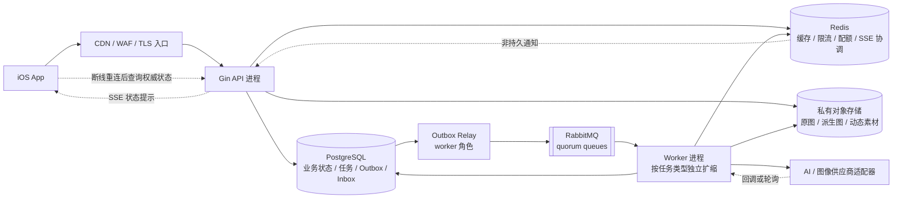
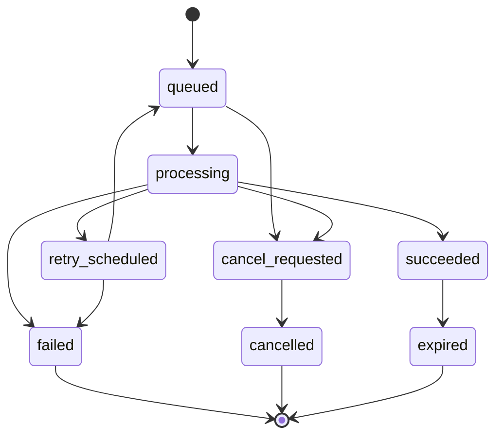

# OOTD 服务端与异步任务设计

## 2026-09-13实施顺序更新

用户已明确先实现 Woo 式照片与单品生成流程，同时保留真实 3D 模型及其交互目标，替代旧“本地 3D 完成后才推进云 AI”的顺序。账号/授权、逐次同意、私有上传、任务恢复和云删除随首个静态生成闭环前移，按本文现有职责准入。不默认上传完整衣橱、不建立隐含同步，不让云任务承载设备上的模板调参/观察。Provider、地域和生产配置须有实际验证。 当前范围由 [PRD 10](../prd/10-OOTD产品需求.md#2026-09-13当前交付目标) 和 [总体设计](03-OOTD产品总体设计.md#2026-09-13当前产品路径) 固定；下文旧阶段描述按历史语境阅读。

## 文档状态

2026-09-08 收敛：用户已确认本地 3D 首版、云端分期。本文的云任务与配额体系不承载本地调参或换装；后端模块和编码规范统一见 [Design 02](02-后端架构.md#编码前固定的模块职责)。首版不建立匿名云身份、云衣橱表或远程 Catalog。后续首次云上传必须同时交付授权、同意、删除链和恢复，不能先上线上传再补隐私控制。

- 状态：已批准，2026-08-30。
- 适用对象：面向 C 端的 OOTD 产品服务端与异步任务；本地体验阶段不依赖后端运行。
- 决策日期：2026-08-30。
- 核心选择：Go + Gin、GORM v2 Generics、PostgreSQL、Atlas versioned SQL、Redis、RabbitMQ quorum queue、事务 Outbox/Inbox、私有对象存储；新 GORM CLI 不作为强制依赖。
- 进程边界：一个 Go module、一个 `main.go`、一个二进制和一个 OCI 镜像，通过 `APP_ROLE=api|worker|all` 选择角色；生产以同镜像的独立 API/worker 进程部署、扩缩和回滚。
- 契约：单一 OpenAPI 3.1.2 文档，仍遵循 3.1 系列语义。

> 本架构已批准，但服务端能力按实施计划启用：本地衣橱、推荐和记录阶段不启动 Go、RabbitMQ、Redis 或对象存储；第一个云端 AI 生成能力进入受控 POC/发布时，才按本文建立完整后端链路。供应商、地域、删除、成本、SLO 与 feature flag 门禁未通过时，不得接入真实用户流量。

## 关联 PRD 与设计

本功能直接需求是 [云端生成与任务管理需求](../prd/17-云端生成与任务管理需求.md)；[OOTD 产品需求](../prd/10-OOTD产品需求.md) 是产品总纲。

本设计与以下已批准设计共同组成 OOTD 设计集：

- [OOTD 产品总体设计](03-OOTD产品总体设计.md)
- [数字形象与照片采集设计](04-数字形象与照片采集设计.md)
- [数字衣橱与衣物录入设计](05-数字衣橱与衣物录入设计.md)
- [穿搭推荐设计](06-穿搭推荐设计.md)
- [AI 虚拟试穿设计](07-AI虚拟试穿设计.md)
- [动态预览设计](08-动态预览设计.md)
- [穿搭记录与反馈设计](09-穿搭记录与反馈设计.md)
- [OOTD 权限隐私与安全设计](11-OOTD权限隐私与安全设计.md)

当前技术事实来源：

- [技术选型](01-技术选型.md)
- [后端架构](02-后端架构.md)
- [OOTD 权限隐私与安全设计](11-OOTD权限隐私与安全设计.md)

若上述文档与本文发生冲突，产品行为以已批准 PRD 为准；技术变化必须先更新技术基线，不得通过实现静默决策。

## 目标与约束

### 目标

1. 支撑数字形象、衣物分析、穿搭推荐、静态试穿、动态预览和数据删除等耗时不同的工作流。
2. 让同步业务写入与异步任务创建具备原子性，任务可重试、可审计、可取消、可恢复。
3. 面向 C 端流量提供鉴权、用户级授权、限流、配额、幂等、回压和隐私删除能力。
4. 保持一个 Go module 和清晰的模块化单体边界，暂不把业务拆成微服务。
5. 通过版本化 SQL、契约测试和真实依赖集成测试，使数据库与 API 变更可评审、可回滚。
6. 将照片、人体与生成结果按高敏感数据处理，不让队列、日志、缓存或公开 URL 扩大暴露面。

### 非目标

- 不承诺 RabbitMQ 或跨系统处理“恰好一次”；目标是至少一次投递、幂等效果。
- 不把 Redis、RabbitMQ 或对象存储当作业务事实源。
- 不在数据库事务中执行模型调用、对象上传、消息发布或其他网络请求。
- 不在首版引入微服务、Kafka、Kubernetes、分布式事务、事件溯源或多主数据库。
- 不用 AI 预览推导真实尺码、体型结论、健康属性或服装物理效果。
- 不默认保存人脸向量、人体测量、原始 EXIF/GPS 或供应商可识别的长期训练素材。

### 质量属性

具体数值由实施计划、容量模型和验收文档固定，云能力上线前至少要确定：

- API 可用性、生成任务成功率、任务排队时长和端到端 p95 SLO。
- 单用户与全局日/月生成配额，以及成本熔断阈值。
- 照片、派生图、失败任务和审计信息各自的保留期限。
- RPO、RTO、跨可用区策略和供应商故障时的降级目标。
- 删除请求完成时限和可验证证据。

## 已批准技术基线与启用阶段

[`01-技术选型.md`](01-技术选型.md) 和 [`02-后端架构.md`](02-后端架构.md) 已替代旧生活管理产品的 chi、纯 pgx、`backend/schema.sql`、PostgreSQL 轮询任务和无对象存储决定。新功能不得继续沿用旧基线，也不得让两套同类框架长期并存。

| 决策面 | 已批准选择 | 启用边界 |
| --- | --- | --- |
| HTTP | Gin，使用 `gin.New()` 显式组装中间件 | 第一个云端 API 开始实施时启用；不保留 chi 路由并行栈 |
| 数据访问 | GORM v2 Generics；复杂路径使用 Repository 内命名 raw SQL/pgx | GORM CLI 不是强制依赖；只在生成稳定、版本锁定和 SQL 可审查时按需采用 |
| Schema | `backend/migrations/*.sql` + `atlas.sum`，Atlas versioned workflow | 物理结构只随真实功能 migration 增加；禁止 `AutoMigrate` 修改共享或生产环境 |
| 运行形态 | 一个 Go module、一个 `main.go`、一个二进制和一个镜像；`APP_ROLE=api|worker|all` | 本地/集成测试可用 `all`；生产以同镜像的 `api`、`worker` 进程独立扩缩 |
| 异步任务 | PostgreSQL 任务状态 + Outbox/Inbox + RabbitMQ quorum queue | 第一个云端 AI 生成能力进入 POC 时启用；本地核心不依赖队列 |
| Redis | 短 TTL 缓存、限流、SSE 通知和可重建协调 | 云端生成阶段按需启用；任何权威状态仍在 PostgreSQL |
| 文件 | 私有、同地域、S3-compatible 对象存储 | 云端生成阶段必须启用；本地衣橱不因技术选型自动上传 |
| API | 单一 `backend/openapi.yaml`，OpenAPI 3.1.2 | operation 随实施功能增加并先完成 iOS Client 与契约测试 |

分阶段运行边界：

1. **本地体验**：只运行 SwiftUI、GRDB、Vision 和结构化推荐；Go、RabbitMQ、Redis、对象存储和第三方 AI 均不运行。
2. **静态试穿 POC**：隔离环境运行 `APP_ROLE=all` 或同镜像的 API/worker、PostgreSQL、RabbitMQ、Redis、对象存储和单一 Provider；只处理合成或书面授权样本。
3. **云端生成首发**：生产使用同镜像的 `APP_ROLE=api` 与 `APP_ROLE=worker` 独立进程；只有供应商、地域、删除、成本、SLO、OpenAPI/Atlas、安全和合规验收通过后开启真实流量。
4. **规模化**：只按 SLO、积压、成本和故障证据扩容，不提前拆微服务、分库分表或更换技术栈。

## 系统架构



### 组件职责

| 组件 | 责任 | 不负责 |
| --- | --- | --- |
| Gin API | HTTP 协议、鉴权上下文、OpenAPI 校验、幂等入口、签名上传意图、同步命令与查询 | 长耗时生成、自动改 schema、直接持有照片内容 |
| Application Service | 业务不变量、事务编排、状态机、授权决策 | HTTP/RabbitMQ 细节和供应商 SDK 类型 |
| PostgreSQL | 业务事实、任务状态、幂等结果、Outbox/Inbox、审计索引 | 大文件本体、瞬时广播 |
| Outbox Relay | 租约领取待发布事件、发布确认、重试和发布状态 | 创建业务事实或绕过事务补事件 |
| RabbitMQ | 持久任务分发、消费者隔离、回压缓冲、DLQ | 任务最终状态、长期归档、恰好一次 |
| Worker | 领取任务、调用供应商、处理媒体、提交结果、补偿与删除 | 接受公网用户请求、持有未界定的无限重试 |
| Redis | 短 TTL 缓存、令牌桶/滑动窗口、配额快速计数、SSE 跨实例通知 | 用户、任务、幂等结果、权限或删除状态的事实源 |
| 私有对象存储 | 加密保存原图、处理后图片、生成结果和短动态素材 | 公开 CDN 源、业务元数据权威 |
| Provider Adapter | 隔离模型供应商 API、错误、配额、回调与删除能力 | 将供应商 DTO 渗透进领域模型 |

## 模块和目录

目录随真实代码与 migration 逐步创建，不为未实施功能填充空文件：

```text
backend/
├── main.go
├── go.mod
├── go.sum
├── openapi.yaml
├── atlas.hcl
├── migrations/
│   ├── README.md
│   ├── atlas.sum
│   └── YYYYMMDDHHMMSS_name.sql
└── internal/
    ├── model/
    ├── service/
    ├── repository/
    ├── transport/
    ├── worker/
    └── platform/
```

约束如下：

- 唯一 `main.go` 负责配置加载、依赖组装、`APP_ROLE` 分支、统一生命周期和退出码；业务规则不进入入口。
- 同一个编译产物和镜像通过 `APP_ROLE=api|worker|all` 运行，不创建 `cmd/api`、`cmd/worker`、`cmd/migrate` 或第二个服务入口。
- `worker` 内按 `relay/media/avatar/tryon/motion/deletion/recovery` 组织消费者；生产进程可通过配置只启用指定消费者集合。
- Atlas 由受控部署作业执行，应用启动不迁移，应用数据库身份不拥有 DDL 权限。
- `model` 是纯 Go struct；不依赖 Gin、GORM 会话、AMQP delivery 或供应商 DTO。
- 新 GORM CLI 不是目录或构建前置条件；若未来对少量查询启用生成，必须精确锁定版本、限定输出目录并由 CI 检查 SQL 与生成漂移。

## 用户流程或系统流程

### 媒体上传与确认

1. iOS 请求上传意图；API 完成鉴权、配额预检和用途校验。
2. API 创建 `media_asset` 的 `pending_upload` 记录，返回短时、单对象、限大小的签名上传信息。
3. iOS 直接上传到私有隔离区，不经 API 中转大文件。
4. iOS 调用 finalize；API 验证对象存在、版本、大小、摘要和声明用途，在同一 PostgreSQL 事务中将资产置为 `uploaded` 并写入媒体检查 Outbox。
5. relay 通过 RabbitMQ 触发媒体 worker。worker 检查 magic bytes、解码安全、像素上限、恶意内容、EXIF 清除和质量门禁。
6. 合格文件写入新的规范化对象键；事务更新 `media_asset`、记录派生关系并写后续 Outbox。原始临时对象按保留策略删除。
7. 任何步骤失败都保留可解释状态，客户端可重新上传；不得仅因 Redis 或 SSE 丢消息而丢任务。

### 推荐与 AI 试穿

1. iOS 在 GRDB 衣橱、最小场景摘要和本地反馈上生成结构化候选；基础推荐不调用后端，也不依赖试穿完成。
2. 用户主动触发试穿时，iOS 只提交已选 Outfit 修订和必要资产引用；API 使用幂等键创建 `generation_job`，冻结最小输入快照、处理策略版本和成本预算，并在同一事务写 Outbox。
3. worker 获取任务租约，按资产 ID 获取短时读取凭证，调用供应商；队列消息和日志不携带签名 URL。
4. 供应商同步返回、轮询或回调最终都收敛到同一状态机；回调按供应商任务 ID 幂等。
5. worker 将结果写入隔离对象键，验证后在事务中更新任务、资产、成本与 Outbox。
6. SSE 只提示“状态可能变化”；iOS 随后通过 REST 查询 PostgreSQL 权威状态。
7. 静态试穿失败不影响结构化推荐；动态预览失败不影响静态结果，边界分别见 [AI 虚拟试穿设计](07-AI虚拟试穿设计.md) 和 [动态预览设计](08-动态预览设计.md)。

### 删除

1. API 事务立即把目标资源标记为不可见/待删除，写删除请求与 Outbox；查询路径从此不再返回内容。
2. 删除 worker 清理原始对象、派生对象、缓存、供应商副本和未完成任务，逐项记录非敏感结果。
3. 暂时失败按受限退避重试；达到上限进入删除专用 DLQ 并触发高优先级告警。
4. 全部完成后事务更新删除请求；审计仅保留证明所需的不可逆标识、时间和结果，不保留已删除正文或 URL。
5. 备份中的删除遵循已批准的备份过期与恢复后重放策略。

## 页面与状态

后端对客户端暴露有限、稳定的异步状态，不泄露供应商内部阶段：



状态规则：

- `queued` 表示 PostgreSQL 已持久化任务，不代表消息已经到达 RabbitMQ。
- `processing` 必须带数据库租约、attempt 和 worker fencing token；过期租约由 recovery 扫描。
- `retry_scheduled` 包含稳定错误类别和下次可尝试时间，不向客户端暴露堆栈或供应商密钥。
- `succeeded` 只在结果对象校验通过且数据库提交成功后出现。
- `cancel_requested` 是协作式取消；供应商已接受请求时不承诺立即停止，迟到结果必须删除或隔离。
- `failed` 只用于达到策略上限或不可重试错误；人工重放创建新 attempt 并保留因果链。
- 客户端超时、SSE 断开或页面退出不会取消服务端任务。

## 领域模型和数据流

### 数据模型概要

以下是云端能力可能需要的逻辑聚合。物理表只随当前实施功能通过 Atlas migration 增加；本地衣橱、推荐、穿搭和反馈仍以 GRDB 为事实源，未启用同步时不得为了填满本表把完整本地数据上传。最终字段约束由 PRD、OpenAPI 与 migration 共同确定。

| 实体 | 关键字段与约束 | 隐私与生命周期 |
| --- | --- | --- |
| `wardrobe_item` | 全局 ID、`user_id`、类别、颜色/季节/正式度、可用状态、版本 | 查询必须限定用户；软删除只服务同步，最终执行隐私清理 |
| `wardrobe_item_asset` | 衣物与媒体关联、用途、质量等级、主素材标记 | 不在衣物表保存公开 URL |
| `avatar_profile` | `user_id`、状态、模型版本、当前资产 ID、同意版本 | 原始人体图和派生图分开保留；默认不存人体测量 |
| `outfit` / `outfit_item` | 场景、组成单品、推荐/实际来源、版本 | 推荐与实际穿着不可混写；反馈见 09 号设计 |
| `recommendation_run`（条件） | 仅在多设备同步或云排序另行获批时保存输入摘要、规则版本、候选与解释 | 本地基础推荐不创建该表；只保留最小场景摘要，不复制日历正文或精确地址 |
| `generation_job` | 类型、状态、输入快照摘要、provider、provider_job_id、attempt、租约、错误类别、成本 | 不保存照片二进制、签名 URL、供应商密钥 |
| `media_asset` | 所有者、用途、对象键、版本、hash、MIME、大小、状态、`retention_until` | 对象键不可公开；原始、规范化、输出和动态素材分别计时 |
| `media_derivation` | 源资产、派生资产、处理器与版本 | 支持级联删除和可追溯重建 |
| `idempotency_record` | 用户、operation、key hash、request hash、状态、响应引用、过期时间 | 唯一约束为 `user_id + operation + key_hash` |
| `outbox_event` | 事件 ID、聚合 ID/版本、类型/版本、payload、状态、attempt、租约 | payload 只放资源 ID 和必要元数据 |
| `inbox_message` | consumer、message ID、job ID、状态、attempt、首次/末次时间 | 唯一约束为 `consumer + message_id` |
| `consent_record` | 用户、用途、文案版本、同意/撤回时间 | 不允许 worker 从缓存推断同意 |
| `deletion_request` | 范围、状态、截止时间、分项结果 | 删除是独立高优先级工作流 |

统一规则：

- ID 使用全局唯一值；时间以 UTC 保存，必要时另存原始时区。
- 每个用户数据表都包含 `user_id` 或可经不可绕过的外键链归属用户。
- 更新使用乐观版本或显式状态条件，防止迟到 worker 覆盖新状态。
- 业务字段、状态、索引、外键和检查约束在版本化 SQL 中明确表达。
- 对象存储只保存内容；PostgreSQL 保存用途、归属、状态、生命周期和对象版本。
- RabbitMQ payload 不包含图片字节、长期 URL、令牌、原始日历正文、精确位置或敏感提示词。

## API 与存储设计

### OpenAPI 3.1

- `backend/openapi.yaml` 是 iOS、Go Handler 和 Swagger UI 的唯一契约；不新增 Swagger 注解、第二份 YAML/JSON 或生成 Go server。
- 固定 OpenAPI 3.1.2；每个 operation 使用唯一稳定的 `operationId`，公开业务路径继续使用 `/v1`。
- 长任务创建返回 `202 Accepted`、稳定任务 ID、状态 URL 和建议轮询间隔；结果未完成时不返回虚假成功。
- 创建、finalize、生成、取消、删除和供应商回调全部定义幂等语义。
- schema 明确 required、nullable、枚举、格式、单位、长度、上传限制和安全示例。
- 错误体包含稳定错误码、安全消息、`request_id`、可重试标志和可选 `retry_after`，不泄露内部 SQL、对象键或供应商响应正文。
- 列表使用稳定游标；游标绑定用户、过滤条件和排序版本。
- Swagger UI 生产默认关闭；需要开放时必须身份认证和网络限制。
- 契约先于 Handler 和 iOS Client 修改；iOS 继续由 OpenAPI 生成 transport types，再映射为领域模型。

### Gin 中间件严格顺序

生产使用 `gin.New()`，禁止依赖 `gin.Default()` 的隐式顺序。启动前先配置可信代理网段；未知或未配置环境默认不信任转发头。

| 顺序 | 中间件 | 关键要求 |
| --- | --- | --- |
| 0 | 边缘 TLS/WAF 与 Gin trusted proxies 配置 | 只信任已知负载均衡地址；客户端 IP 不直接信任任意 `X-Forwarded-For` |
| 1 | Request ID、trace context | 拒绝畸形 trace；生成服务端 `request_id` 并回写响应 |
| 2 | Panic recovery | 捕获后返回统一 500；不打印敏感 request body |
| 3 | 安全响应头、CORS、预检 | CORS 精确 allowlist；`OPTIONS` 预检可在鉴权前结束 |
| 4 | 访问日志与 HTTP 指标 | 记录路由模板而非原始 URL；默认脱敏，覆盖后续完整耗时与状态 |
| 5 | 请求体、Content-Type、编码与超时门禁 | 在绑定前限制字节、字段和解压比例；图片不通过 JSON 上传 |
| 6 | 全局/IP 粗粒度限流 | 防止匿名滥用；Redis 故障使用受限本地兜底或边缘策略 |
| 7 | 身份认证 | 校验签名、issuer、audience、expiry、key ID 和撤销策略 |
| 8 | 账号状态、App Attest/设备风险 | 封禁、注销、风险状态和 token 版本检查；设备证明只参与滥用风控，不替代用户鉴权 |
| 9 | 用户级请求限流 | 作用域为已认证用户和 operation；状态查询、取消、删除不受生成额度耗尽阻断；配额接纳在首次业务事务内判定 |
| 10 | OpenAPI 请求校验 | 校验 path/query/header/body；未知字段策略由契约固定 |
| 11 | 资源与动作授权 | Service/Repository 校验 `user_id`、归属与撤回/删除状态；同 key 重放也必须验证，不接受客户端 owner |
| 12 | 幂等获取/回放 | 用户 + operation + key 和 request hash 判定；相同请求返回授权范围内的原结果引用，不重新占额度；不同请求返回 409 |
| 13 | Handler / Service | Handler 只做协议转换，Service 控制事务和业务规则 |
| 14 | 统一响应与契约观测 | 错误映射、响应头、测试环境响应 schema 校验；生产不记录响应正文 |

测试必须证明顺序没有被路由组或局部中间件绕过。签名上传、供应商回调和内部健康检查使用独立路由组，但每组要明确其认证与限流替代策略。

2026-09-08 顺序修订：原“幂等回放 → 授权”可能提前返回已撤销资源，故统一改为先授权再回放。取消/删除的重复调用可依据本用户最小墓碑返回已完成状态；这不允许回放被删除的媒体正文或旧签名 URL。请求级限流仍对重试生效，业务额度不重复预占。

### 鉴权与授权

- 后续云端以 Sign in with Apple 作为主账号入口；首版先体验保持纯本地，不创建匿名云主体。首次云生成或同步前登录，但登录本身不上传本地数据；匿名云账号及合并不进入当前范围。
- 移动端只持有短期访问令牌和可轮换刷新凭据；供应商、数据库、RabbitMQ、Redis 和对象存储密钥不下发客户端。
- 访问令牌必须校验 `iss`、`aud`、`exp`、`nbf`、算法和 `kid`；密钥轮换保留有界重叠期。
- refresh token 仅保存不可逆 hash，并按设备维护可轮换 token family；检测到旧 token 重用时撤销整族会话。设备会话撤销和账号删除由 PostgreSQL 记录；Redis 可以缓存撤销版本，但缓存 miss 不能等价为授权。
- App Attest / DeviceCheck 只用于识别自动化滥用、伪造客户端和高风险设备；它们不能充当账号身份，也不能绕过资源归属检查。
- `user_id` 只来自验证后的服务端身份上下文。每个 Repository 方法显式接收用户作用域，查询和更新都包含归属条件。
- 首版不默认使用 PostgreSQL RLS；若审计发现应用层隔离不足，再经 Atlas、连接池上下文和迁移评审把 RLS 作为纵深防御。
- 管理和 DLQ 回放使用独立身份、最小权限和双人审批，不复用 C 端访问令牌。
- 供应商回调使用签名、时间窗、防重放和来源校验；回调只更新预先存在且归属匹配的 provider job。

### HTTP 幂等

1. 对有副作用的 operation 要求 `Idempotency-Key`；服务端保存 key 的不可逆 hash。
2. 作用域固定为 `user_id + operation_id + key_hash`，并保存规范化 request hash。
3. 首次请求在 PostgreSQL 事务中创建 `in_progress` 记录、业务行和 Outbox；成功响应只引用已提交结果。
4. 相同 key、相同 request hash 返回原状态或原响应；相同 key、不同请求返回 `409 IDEMPOTENCY_CONFLICT`。
5. 并发首次请求由唯一约束和行锁串行化，不依赖 Redis 锁保证正确性。
6. 超时客户端重试不会重复扣配额或创建任务；计费记录与业务状态在同一事务结算。
7. 幂等记录的 TTL 不得短于客户端最大重试窗和相关业务保留期；删除语义另行定义。

## GORM、raw SQL 与 pgx 边界

### 选择

- 新代码使用 GORM v2 Generics API（`gorm.G[T]`），不用传统 `Save`、`FirstOrCreate` 等语义含混接口。
- 新 GORM CLI 不作为强制依赖。只有少量重复查询确有收益，且生成结果稳定、版本锁定、SQL 可审查时，才可从显式接口生成 helper；不采用旧 `gorm.io/gen` 的整套 DAO 层。
- GORM model 是应用映射，不是生产迁移执行器；Repository 仍是唯一数据访问边界，Service 不拼接查询。
- GORM PostgreSQL 驱动底层基于 pgx 的 `database/sql` 驱动；连接池上限按 API、各 worker 和迁移作业总和统一预算。

### ORM 适用范围

GORM Generics 用于：

- 单表 CRUD、明确外键关系和小规模预加载。
- 简单过滤、稳定分页、乐观锁条件更新。
- 在同一 `*gorm.DB` 事务句柄上的多 Repository 操作。
- 小批量写入、唯一冲突和普通审计元数据。

禁止：

- 在 Handler 或 model 上使用 Active Record 风格数据库调用。
- 隐式加载无上限集合、循环内查询或未审计的 association cascade。
- 使用字符串拼接列名、排序、表名或原始条件。
- 依赖 struct 零值推断更新意图；patch 必须使用显式字段集合或专用输入类型。
- 用 hook 隐藏跨聚合写入、Outbox 或外部副作用。

### raw SQL / pgx 逃生口

以下场景优先采用命名 raw SQL，并配集成测试和 `EXPLAIN (ANALYZE, BUFFERS)` 基准：

- CTE、窗口函数、`LATERAL`、复杂聚合和推荐候选排序。
- `FOR UPDATE SKIP LOCKED` 的 Outbox/任务领取。
- 大批量更新、`COPY`、分区维护或对执行计划敏感的热查询。
- GORM 无法清晰表达、生成 SQL 不稳定或性能预算超限的查询。

边界规则：

1. 事务内 raw SQL 优先通过当前 GORM transaction handle 的 `Raw` / `Exec` 执行，确保仍在同一连接与事务；可选生成 helper 也必须接收该事务句柄。
2. 直接 `pgx.Conn` / `pgx.Tx` 只用于需要 pgx 专有能力的独立 Repository；该 Repository 必须完整拥有事务。
3. 同一个原子用例不得同时使用 GORM 事务和另一个 `pgxpool` 事务；二者不会自动成为同一事务。
4. 若同时保留 `database/sql` 池和直接 `pgxpool`，必须分别限额并在容量模型中计入 PostgreSQL 总连接数。
5. 每条 raw SQL 使用参数绑定和 allowlist 排序字段；禁止把用户输入传给 `fmt.Sprintf` 形成 SQL。
6. 查询文件与方法有稳定名称、owner、计划基线和超时；ORM 与 raw 路径不能重复实现同一业务规则。

### 生产风险护栏

- 开发环境启用慢查询阈值；日志设置参数化输出，禁止打印实参、照片键、提示词和身份数据。
- 对 `Preload`、批量操作、软删除、零值更新、唯一冲突和 association 写入建立回归测试。
- 所有查询传递 `context.Context` 与截止时间；禁止无界扫描和无上限分页。
- CI 使用真实 PostgreSQL，不用 SQLite 代替 PostgreSQL 事务、锁、类型和索引行为。
- GORM 版本精确锁定；若按需启用 CLI，其版本与生成结果同样必须锁定并 code review，不使用未固定的 `@latest` 作为 CI 输入。
- CLI 生成输出不稳定、缺少所需 lint 或升级频繁破坏代码时，立即使用手写 Repository raw SQL/pgx，不增加第二套强制生成层。

## Atlas versioned SQL 迁移

### 事实源与流程

`backend/migrations/*.sql` 与 `atlas.sum` 是生产 schema 的唯一变更账本。GORM model 是运行时映射；数据库实际结构由已审核的版本化 SQL 推进。

1. 开发者修改 model 和必要的 SQL 设计。
2. Atlas 在一次性 dev database 中根据前一版本与期望状态生成候选 diff。
3. 人工检查 DDL、锁级别、全表重写、索引、默认值、数据回填、兼容窗口与回滚。
4. CI 校验迁移目录 checksum，并从空库逐条应用；再把应用 model 与最终数据库做 drift 检查。
5. 先执行 expand 迁移，再发布兼容读写代码，后台回填并验证，最后单独执行 contract 迁移。
6. 生产由受控 Atlas migration job 执行；应用二进制不拥有 DDL 权限，启动时只校验 schema 版本范围。
7. 破坏性 DDL 默认阻断；需要审批、备份/恢复点、锁时间演练和明确前向修复或回滚方案。

`AutoMigrate` 只允许临时本地、可丢弃数据库探索，并同时满足 `APP_ENV=local` 和显式 `DB_EPHEMERAL=true`。测试、预发、生产、共享开发库和应用启动一律禁止；CI 应扫描生产入口不存在 `AutoMigrate` 调用。

### 历史 `schema.sql` 替代状态

旧 `backend/schema.sql` 空壳已由 `backend/migrations/` 替代，不再作为事实源，也不得重新创建并与 migration 双写。第一个真实 OOTD 领域结构以不可变 baseline migration 引入，并在空 PostgreSQL 18 数据库逐条应用验证。

如果实施前发现任何已有服务端业务库或历史数据，不得直接把 baseline 标记为已应用：必须先盘点实际结构与数据，新增转换、兼容、校验、恢复点和停止条件，并在脱敏快照副本演练。数据迁移默认使用可恢复的前向修复；不可逆转换需在实施计划中列出备份恢复与回滚窗口。

## 事务边界与 Outbox/Inbox

### 原则

- 一个用户命令涉及多张业务表、幂等记录、配额结算和异步事件时，全部在一个 PostgreSQL 事务中提交。
- Outbox 与业务事实同事务写入；RabbitMQ 发布不在该事务内。
- worker 的状态、Inbox、结果元数据与新 Outbox 在短事务中提交；模型调用和对象存储 I/O 在事务外。
- 所有状态转换使用期望旧状态、版本或 fencing token 条件，受影响行数不为 1 即视为并发冲突。
- 隔离级别按用例确定；默认 `READ COMMITTED` 配合唯一约束/行锁，真正需要跨行不变量时才使用更强隔离并处理序列化重试。

### 创建任务事务

```text
BEGIN
  锁定/创建 idempotency_record
  校验用户、同意、资产状态与数据库中的最终配额
  INSERT generation_job(status = 'queued')
  INSERT quota_ledger / cost_reservation
  INSERT outbox_event(message_id = event_id)
  完成 idempotency_record 的结果引用
COMMIT
```

提交成功即表示任务不会丢失：即使 RabbitMQ 暂时不可用，relay 仍可从 Outbox 恢复。提交失败则业务任务和事件都不存在。

### Outbox relay

1. 短事务用 `FOR UPDATE SKIP LOCKED` 领取一批 `pending` 行，写 `lease_owner`、`lease_until` 和 attempt 后提交。
2. 事务外按 event ID 发布持久消息，启用 publisher confirms 和 mandatory return。
3. 收到 broker confirm 后，短事务将 Outbox 标为 `published`。
4. publish 后、标记前崩溃会重复发布；消费者必须以 message ID 幂等。
5. 租约过期的 `publishing` 行回到可领取状态；退避、最大 attempt 和告警由数据库记录。
6. 不永久删除最近 Outbox；按审计与恢复窗口分区/归档，清理策略经批准后执行。

### Inbox 与长任务

1. 消费者收到消息后开启短事务，以 `consumer_name + message_id` upsert Inbox，并尝试用 fencing token 领取 `generation_job` 租约。
2. 若任务已终态或同一消息已完成，提交后直接 ack；若有有效租约，不并发执行第二次。
3. 成功持久化 Inbox 和任务租约后即可 manual ack，把恢复责任转交给 PostgreSQL；不得依赖长时间 unacked delivery 保存工作。
4. worker 在事务外调用对象存储/供应商，并定期续租；每次外部调用携带稳定 provider idempotency key。
5. 结果对象先写确定性临时键并校验。随后短事务核对 fencing token，更新任务/资产/成本、完成 Inbox、写状态 Outbox。
6. 数据库提交后再清理临时对象；提交失败留下的孤儿由 janitor 按无引用和 TTL 清理。
7. worker 在供应商接受后崩溃时，recovery 依据过期租约重新投递；优先查询既有 provider job，禁止盲目创建第二个收费任务。

因此端到端语义是“可能重复投递和调用，但业务效果幂等”。任何文案和监控都不得声称跨 PostgreSQL、RabbitMQ、对象存储与供应商的恰好一次。

## 队列拓扑与投递语义

### 拓扑

使用 RabbitMQ 团队维护的 `github.com/rabbitmq/amqp091-go`。生产队列为 durable quorum queue，建议三副本跨三个故障域；exchange、queue、binding 由版本化策略声明并在启动时以幂等方式核验。

| Exchange / queue | routing key 示例 | 消费者 | 说明 |
| --- | --- | --- | --- |
| `ootd.jobs.v1` topic exchange | `media.inspect.v1` | `ootd.media.inspect.v1.q` | 解码、清理 EXIF、质量与安全检查 |
| `ootd.jobs.v1` | `wardrobe.analyze.v1` | `ootd.wardrobe.analyze.v1.q` | 衣物抠图、分类、颜色和候选属性分析；结果必须保留用户确认状态 |
| `ootd.jobs.v1` | `avatar.generate.v1` | `ootd.avatar.generate.v1.q` | 数字形象生成 |
| `ootd.jobs.v1` | `tryon.generate.v1` | `ootd.tryon.generate.v1.q` | 静态试穿 |
| `ootd.jobs.v1` | `motion.render.v1` | `ootd.motion.render.v1.q` | 动态预览，低于静态任务优先级 |
| `ootd.jobs.v1` | `asset.delete.v1` | `ootd.asset.delete.v1.q` | 隐私删除，高优先级独立容量 |
| `ootd.jobs.v1` | `account.delete.v1` | `ootd.account.delete.v1.q` | 账号删除编排，跟踪数据库、缓存、对象、供应商和派生资产的分项结果 |
| 每个主队列的 retry exchange/queue | 固定 30 秒、5 分钟、30 分钟层级 | 原消费者 | TTL 到期后 dead-letter 回主 exchange；不使用热 requeue |
| `ootd.dlx.v1` + 每类 DLQ | 原 routing key | 仅受控回放工具 | 保存不可自动恢复或超过次数的消息 |

消息 envelope 至少包含：

- `message_id`（等于 Outbox event ID）、`message_type`、`schema_version`。
- `aggregate_id`、`aggregate_version`、`job_id`。
- `occurred_at`、`correlation_id`、`causation_id`、`traceparent`。
- 最小 payload；只引用数据库资源 ID，不携带对象签名 URL、图片、token 或敏感正文。

### 保证与限制

- producer 使用 publisher confirms；只有 confirm 后才标记 Outbox published。
- publish 使用 mandatory，未路由消息视为失败并告警。
- consumer 使用 manual ack；ack 时点是工作已经可靠转交 PostgreSQL 或结果已提交。
- 消息可能重复、延迟和乱序；聚合版本、状态条件、Inbox 和 provider idempotency key 共同去重。
- 不依赖全局 FIFO。确需同一聚合顺序时使用聚合版本拒绝迟到写入，不用单消费者限制全系统吞吐。
- quorum queue 配置 delivery limit 和 DLX；达到上限必须进 DLQ，不能静默丢弃。
- 需要无损 dead-letter 时显式配置 `dead-letter-strategy=at-least-once` 与 `overflow=reject-publish`，并监控目标 DLQ 可用性和源队列容量。
- retry 使用有界退避和抖动；业务校验、权限撤回、素材删除等永久错误不重试。
- `amqp091-go` 连接与 channel 的重连、拓扑重声明、confirm 等待和优雅退出由平台封装负责；断线后不复用旧 channel 状态。

## Redis 边界

### 允许用途

- 短 TTL、可重建的衣橱/推荐读缓存；key 含用户、版本与过滤条件。
- IP 和用户级 token bucket/滑动窗口限流。
- 生成配额的快速预检与短时 reservation 提示；最终账本在 PostgreSQL。
- API 多实例之间的 SSE 状态通知、在线连接路由和去重提示。
- 短时防抖、热点保护和 circuit breaker 协调。

### 禁止用途

- 不保存唯一的用户、任务、同意、授权、幂等响应、费用、删除或媒体状态。
- 不以 Redis Pub/Sub 作为任务队列；其通知可丢失且不可重放。
- 不用分布式锁替代数据库唯一约束、行锁、租约或 fencing token。
- 不在 key/value 中存照片、签名 URL、访问令牌、日历正文、精确位置或供应商响应正文。

### 故障降级

- 缓存失败：绕过 Redis 读取 PostgreSQL，并用请求合并和并发上限防止缓存击穿。
- SSE 协调失败：断开或发送重连提示；客户端使用带抖动轮询查询 PostgreSQL。
- 普通读限流失败：边缘 WAF 与实例内有界限流接管。
- 付费生成配额失败：保守 fail-closed 或只允许 PostgreSQL 原子校验，不能无限 fail-open。
- Redis 恢复后从 PostgreSQL 重建缓存，不做反向回灌。

## 私有对象存储

上传 URL 只表示短期写入能力，不能证明对象安全，也不是天然一次性凭据。finalize 必须绑定 upload intent、owner、用途和具体对象版本，复核实际长度、hash、格式与状态，再由受控处理产出不可变可用资产；未验证对象不能被渲染或发送 Provider。相同 key 可在有效期内被再次上传的存储实现，要使用不可变复制/版本锁定等办法消除“校验后覆盖”的竞态。撤回/删除先阻止服务端新签发和读取，再执行物理清理；不能声称撤销数据库记录就即时撤回已签出的 URL。[S3 预签名 URL 说明](https://docs.aws.amazon.com/AmazonS3/latest/userguide/using-presigned-url.html)

URL、对象 key 与凭据始终留在原生媒体层和后端；Three.js 仅获得短期无业务语义的资产句柄。首版内置公共模板资产与用户私有照片分开建模和清理，删除一个人的配置不得删除所有用户共用的模板发布版本。

- bucket、object 和所有派生文件默认 private，禁止 public-read ACL。
- 使用服务端生成的短时、单方法、单对象签名 URL；限制 Content-Length、Content-Type、校验摘要和有效期。
- 上传进入 quarantine 前缀；finalize 后仍须进行 magic byte、解码、像素数、文件炸弹、恶意内容和 EXIF 检查。
- 原图、规范化图片、供应商输出、缩略图和动态帧使用不同用途与 lifecycle；不能用同一个“永久图片”策略。
- 数据库保存 opaque object key、version ID、hash、用途和 `retention_until`；API 不返回长期对象键。
- 服务端读取时使用最小权限角色；供应商需要拉取时签发最短有效期 URL，并记录用途和供应商任务，不写日志。
- 静态加密使用云 KMS/CMK；生产、预发、测试 bucket 和密钥隔离，禁止使用真实用户素材作为夹具。
- 对象覆盖关闭或使用版本化键；内容寻址/确定性键必须包含用户隔离和用途，避免跨用户存在性泄露。
- lifecycle 只是兜底，业务删除由 deletion worker 主动执行并验证；供应商副本也纳入删除证明。
- CDN 如用于输出，必须使用私有源、短时授权和禁止缓存敏感原图；首版可不引入 CDN。

## 失败、恢复、回压与 DLQ

### 失败分类

| 类型 | 示例 | 行为 |
| --- | --- | --- |
| 可重试瞬时错误 | 网络中断、429、供应商 5xx、broker 暂不可用 | 指数退避 + 抖动，受 attempt 和 deadline 限制 |
| 用户可修复 | 图片模糊、遮挡、格式不支持 | 任务失败为稳定业务错误，保留已完成成果并提示重传 |
| 永久业务错误 | 同意撤回、资产已删、无权限、状态冲突 | 不重试，执行必要清理 |
| 容量/成本错误 | 配额用尽、队列超阈值、成本熔断 | 新建请求 429/503 + Retry-After；已接纳任务保持可恢复 |
| 毒消息/程序错误 | 反复 panic、schema 不兼容 | 有限重试后 DLQ，告警并冻结自动回放 |

### 回压

- API 同时检查用户配额、全局 cost budget、目标队列 ready 数和 oldest-message age；超过硬阈值不再接纳付费任务。
- worker 对每个供应商配置独立并发 semaphore、速率和超时；RabbitMQ prefetch 与单任务内存/耗时匹配，不追求一次拉满。
- 静态试穿、动态预览和删除使用不同队列与部署；删除不被低优先级动态渲染饿死。
- 对象存储和数据库设置连接/并发上限；总连接预算小于 PostgreSQL 可用连接并保留运维余量。
- 队列配置 max-length/max-length-bytes 与 `reject-publish`；Outbox 保留未发布事实，broker 满时 relay 退避而非丢消息。
- 超过最大可接受排队时间时，取消尚未开始的非必要动态任务并退还 reservation；不能取消用户删除。

### DLQ 与人工恢复

- 每类队列有独立 DLQ 和告警，记录 message ID、错误类别、attempt、首次/末次时间，不复制敏感 payload 到工单。
- 回放前先修复根因、验证消息 schema、检查用户是否已删除/撤回同意，并用 dry-run 列出影响。
- 回放生成新的控制记录但保留原 message ID/causation 链；Inbox 与业务状态保证不会重复提交结果。
- 批量回放有速率、并发和停止阈值；需要审批与审计。
- 无法安全回放时把任务终结为可解释失败，执行对象清理和配额退款。

### 恢复循环

worker 的 recovery 角色定期扫描：

- 过期的 job/outbox 租约。
- provider 已完成但本地状态未提交的任务。
- 无数据库引用且超过 TTL 的孤儿对象。
- `cancel_requested`、`deletion_request` 超过 SLA 的记录。
- 已发布但长期无终态的任务。

扫描使用游标、批量上限和 `SKIP LOCKED`，多个实例可并行；恢复本身写 Outbox，不直接绕过正常消费者。

## 部署与扩缩

### 部署单元

- API：同一二进制以 `APP_ROLE=api` 运行，无状态、多副本、面向公网，只依赖短请求路径。
- worker：同一二进制以 `APP_ROLE=worker` 运行，无公网入口；可通过消费者配置把 `relay/media/avatar/tryon/motion/deletion/recovery` 分配给不同 Deployment。
- 本地开发、集成测试和小规模隔离 POC 可使用 `APP_ROLE=all`。
- API 与 worker 来自同一 Git revision、Go module、编译产物和 OCI 镜像；不同版本仅允许在已定义消息/API 兼容窗口内共存。
- Atlas migration job 在应用发布前运行 expand 迁移；contract 迁移独立审批并晚于旧版本下线。
- RabbitMQ、PostgreSQL、Redis 和对象存储优先使用同地域托管服务；RabbitMQ quorum 成员跨故障域，避免双节点伪高可用。

### 扩缩信号

- API：请求并发、CPU、p95、连接池等待，不以 RabbitMQ backlog 扩缩。
- 各 worker：对应队列 ready/unacked、oldest age、任务耗时、供应商限额和成本预算联合决定。
- relay：Outbox pending 数/age 和 publish confirm 延迟。
- deletion：最老删除请求 age 是硬 SLO，不与生成 worker 争抢配额。
- scale-to-zero 只允许非关键、可延迟角色；relay、recovery 和 deletion 保留最小副本。

### 发布与退出

1. 先完成兼容 expand 迁移。
2. 发布支持旧/新消息 schema 的 worker，再发布 API producer。
3. 观察错误、DLQ、Outbox age 和成本后逐步放量。
4. contract 迁移在旧 producer/consumer 全部退场后执行。
5. 退出时 API 先停止接收并完成有界请求；worker 停止拉取、取消未开始任务、完成或释放租约，并关闭 channel/connection。
6. 超过退出时限的任务不 ack；若已经 ack 并转交 PostgreSQL，则由租约 recovery 恢复。

## 可观测性

### 统一关联

HTTP request、幂等记录、Outbox、RabbitMQ message、Inbox、job、provider job 和对象处理使用：

- `request_id` / `correlation_id`：一次用户意图。
- `causation_id`：导致当前事件的前一事件。
- `message_id`：Outbox 全局事件 ID。
- `job_id`：客户端可见任务 ID。
- W3C `traceparent`：跨 API、relay、consumer 和供应商适配器传播；不把用户 ID 放入 baggage。

### 指标

- HTTP：按 operation/status 的请求率、错误率、p50/p95/p99、限流/幂等命中。
- PostgreSQL：连接池等待、事务耗时、慢查询、锁等待、deadlock、migration version/drift。
- Outbox/Inbox：pending、oldest age、publish attempts、duplicate、expired leases。
- RabbitMQ：ready、unacked、redelivery、confirm latency、consumer utilization、DLQ 和 rejected publish。
- worker：按 job type/provider 的排队、处理、成功、重试、取消、成本和租约过期。
- Redis：命中率、延迟、eviction、连接、限流降级和 Pub/Sub 断线。
- 对象存储：上传/下载失败、孤儿、删除 age、生命周期积压和 egress。
- 供应商：429/5xx、p95、回调延迟、成本、熔断状态和输出安全失败。

### 日志与追踪

- 结构化日志仅使用不可逆或随机标识；不得记录 access/refresh token、签名 URL、对象键全值、图片、金额明细、日历标题、精确地址、人体描述或供应商响应正文。
- SQL 日志参数化，错误归类而非输出完整 SQL 参数。
- trace sampling 对失败和慢请求提高采样，但敏感字段在生成 span 前即删除。
- 告警必须绑定 runbook：Outbox age、DLQ、删除超时、迁移失败、队列拒绝、成本异常和供应商错误预算耗尽。

### SLO 与告警建议

最终阈值由容量测试批准。至少采用多窗口 burn-rate 告警，并区分：

- API 接纳可用性。
- 已接纳任务在承诺时间内进入终态的比例。
- Outbox 到 broker 的延迟。
- 删除请求在承诺时限内完成的比例。
- 生成成本和异常内容率。

单个第三方供应商故障不能触发无界重试或告警风暴；熔断后向用户返回可恢复状态。

## 权限、隐私与安全

本节是服务端最低要求，更完整边界见 [OOTD 权限隐私与安全设计](11-OOTD权限隐私与安全设计.md)。

- 人体、面部、穿衣照片和生成结果按高敏感数据处理；用途必须与可撤回同意绑定。
- 当前范围只接受年满 18 周岁用户本人的已授权照片；第三方或未成年人照片不提供云处理，除非未来另立儿童安全/多人授权 PRD 与合规设计。
- 相册选择和本地预处理遵循最小权限；服务端不得要求上传原始 EXIF/GPS。
- 原始日历正文、参与人、精确地址和账务明细不得与人物照片共同发送供应商；只传最小场景摘要。
- TLS 覆盖客户端、broker、Redis、数据库、对象存储和供应商连接；内部身份使用短期凭据或工作负载身份。
- 数据库、备份和对象存储静态加密；高敏感密钥由 KMS 管理，按 API/worker/迁移角色拆分权限。
- API worker 无权执行 DDL；migration job 无权读取对象正文；媒体 worker 只访问对应用途前缀。
- 队列管理面、Redis、数据库和对象存储不暴露公网；生产调试入口默认关闭。
- 输入实施解码限制、MIME/magic byte 双验、像素与帧数上限、恶意文件扫描和提示词/内容安全检查。
- 输出检查身份漂移、不合理裸露、身体变形与违法内容；失败结果隔离且不用于训练。
- 默认禁止供应商用用户素材训练；合同需要数据地域、保留、分包商、删除、事件通知和审计权。
- 导出与删除覆盖主数据、派生数据、缓存、队列待办、对象、供应商副本和恢复流程。
- 安全事件日志不能复制敏感正文；管理员查看素材必须经过逐次授权、理由、审计和最小展示。

## 测试策略与验收

### 测试分层

| 层级 | 必测内容 |
| --- | --- |
| 单元 | 状态机、配额、幂等 request hash、错误分类、退避、授权、删除范围、消息 schema |
| Repository 集成 | 真实 PostgreSQL 的约束、锁、隔离、`SKIP LOCKED`、租约、乐观并发、游标和 raw SQL 计划 |
| Migration | 空库全量、从发布版本逐步升级、生产快照副本、checksum、drift、expand/contract 和失败恢复 |
| API 契约 | OpenAPI 3.1.2 校验、operationId、状态码、错误体、iOS Client 重新生成编译、破坏性变更 |
| 消息集成 | 真实 RabbitMQ quorum queue、confirm/return、重复、乱序、断线、redelivery、retry TTL、DLQ |
| Redis 集成 | 缓存失效、限流原子性、故障降级、Pub/Sub 丢失和 SSE 重连补查 |
| 对象存储 | 签名范围、超大/伪 MIME/文件炸弹、版本、加密、隔离、生命周期、级联删除 |
| 供应商契约 | 超时、429/5xx、回调重放、幂等 key、迟到结果、取消、删除和 schema 漂移 |
| 端到端 | 上传—检查—推荐—试穿—动态预览—反馈—删除，包含 App 退出和断网 |
| 性能与韧性 | 峰值接纳、队列积压、数据库连接耗尽、broker/Redis/provider 故障、worker 滚动升级 |
| 安全隐私 | 越权、IDOR、token 重放、签名 URL 滥用、SQL 注入、日志泄露、删除证明 |

不使用 SQLite 代替 PostgreSQL，不用内存 fake 作为 RabbitMQ quorum 行为的唯一证据，不使用真实用户照片、日历、账单或位置作为测试夹具。

### 云能力架构验收清单

本设计已批准；以下证据全部存在后，云端生成能力才可从隔离 POC 放量到真实用户：

- [ ] 旧 chi/纯 pgx/`schema.sql`/PostgreSQL jobs 基线没有被新代码继续引用，仓库只存在一套当前技术事实源。
- [ ] 10 号产品总纲、17/18 号单功能 PRD、当前实施计划、验收和隐私/供应商准入记录一致且均在有效期内。
- [ ] OpenAPI 只保留一份，异步状态、幂等、错误和删除协议可生成并编译 iOS Client。
- [ ] 从空库、上一发布和脱敏生产快照副本执行 Atlas migrations 成功，drift 为零。
- [ ] 生产入口不存在 `AutoMigrate`，应用数据库角色没有 DDL 权限。
- [ ] GORM CRUD 和 raw SQL 边界有代码所有者；热查询达到计划与延迟预算。
- [ ] 业务写入与 Outbox 原子；模拟每个崩溃窗口均无丢任务、无重复业务效果。
- [ ] RabbitMQ confirm、mandatory return、manual ack、retry、delivery limit 和 DLQ 演练通过。
- [ ] Redis 完全不可用时，权威状态仍可查询，付费生成不会绕过最终配额。
- [ ] 同一二进制/镜像的 `APP_ROLE=api|worker|all` 行为，以及 API/worker 独立扩缩、滚动升级和优雅退出演练通过。
- [ ] 对象从上传、供应商处理到派生/备份删除的全链路证据可验证。
- [ ] 中间件严格顺序有自动化测试，匿名、跨用户和幂等冲突均被拒绝。
- [ ] 供应商故障、队列满、数据库连接耗尽和 DLQ 批量回放均有 runbook 与停止条件。
- [ ] 日志、trace、metrics、消息与工单扫描不包含受限敏感字段。

### 最低故障注入场景

1. PostgreSQL 提交前后分别杀死 API。
2. Outbox publish 前、confirm 后、标记 published 前分别杀死 relay。
3. worker ack 前后、供应商接受后、本地结果提交前分别杀死 worker。
4. 重复投递同一 message 100 次，结果、扣费和对象引用只能生效一次。
5. RabbitMQ 拒绝 publish、失去少数节点、DLQ 不可路由并恢复。
6. Redis 全部不可用，验证缓存、SSE、限流和付费配额各自的降级策略。
7. 对象上传一半、伪造 MIME、hash 不符、结果对象成功但数据库提交失败。
8. 用户处理过程中撤回同意、取消任务或删除账号，迟到回调不得恢复内容。
9. 新旧 API/worker 版本同时运行，验证消息 schema 和数据库 expand 兼容。
10. 迁移执行中断或锁等待超阈值，能够安全停止并恢复服务。

## 备选方案与决策

| 决策 | 已批准选择 | 备选 | 当前取舍 |
| --- | --- | --- | --- |
| HTTP | Gin | chi | Gin 中间件生态和工程约定适合新 C 端服务；禁止长期并存两套路由 |
| ORM | GORM v2 Generics；CLI 可选 | Ent、Bun、sqlc/pgx | GORM 上手与生态成熟，Generics 减少部分类型风险；仍用 Repository 和 raw SQL 抑制隐式行为，CLI 不作为基线依赖 |
| Schema | Atlas versioned SQL | `schema.sql` 声明式、Goose/Flyway | C 端持续演进需要可审计历史与 expand/contract；代价是迁移纪律和工具链增加 |
| 异步 | RabbitMQ quorum + Outbox/Inbox | PostgreSQL jobs、SQS、Kafka | 第一个云端生成阶段需要路由、回压、重试隔离和独立 worker，因此固定 RabbitMQ；纯本地阶段不运行队列 |
| Cache/协调 | Redis | PostgreSQL/实例内缓存 | 适合跨 API 实例限流和 SSE 通知，但被严格排除出事实源 |
| 文件 | 私有对象存储 | 本地磁盘、数据库 bytea | 大媒体生命周期、签名访问和扩缩需要对象存储；由此引入重大隐私与删除成本 |
| 部署 | 同 module/二进制/镜像，`APP_ROLE` 分进程 | 单一 `all` 进程、微服务 | 生产分离资源与故障域，同时保留模块化单体；本地可用 `all`，暂无业务理由拆微服务 |
| 投递一致性 | 至少一次 + 幂等 | 分布式事务/“恰好一次”承诺 | 跨 PostgreSQL、broker、对象存储和供应商无法现实地提供端到端恰好一次 |

### ORM 备选说明

- **Ent**：schema-first、生成类型和隐私规则强，适合团队愿意接受代码生成中心化的场景；但生成/升级成本和 raw SQL 绕过 hook/privacy 的审计风险更高。
- **Bun**：SQL-first、对复杂 SQL 透明，迁移 pgx 团队较自然；类型化关系和生态约定不如当前选择统一。
- **sqlc + pgx**：SQL 可预测、性能与事务透明，是 GORM 查询不可控时的首选回退；代价是查询文件和映射工作增加。
- **纯 pgx**：最小抽象、控制力最高；仅在特定 Repository 有明确性能或能力证据时作为受控逃生口，不替代已选 GORM CRUD 基线。

### 再评估触发器

- 日任务量和积压长期低于 PostgreSQL jobs 可轻松承载范围：移除 RabbitMQ/Redis，回归简单架构。
- 单个 quorum queue 接近超长 backlog、超大 fan-out 或审计重放需求：评估 RabbitMQ Streams/Kafka，而不是无限扩大队列。
- 云环境提供更适合的托管队列且运维成本显著更低：评估 SQS 等服务，但保留 Outbox/Inbox 和幂等协议。
- GORM 生成 SQL 反复突破延迟预算或升级造成高频回归：逐 Repository 切换到 sqlc/pgx 或手写 raw SQL；可选 CLI 不稳定时直接停用，不影响基线。
- 多租户隔离审计发现应用层 `user_id` 约束不足：评估 PostgreSQL RLS 与连接上下文策略。
- 数据规模需要分区、读副本或冷热分层：先以查询/容量证据评估，不提前分库分表。
- Redis 成为高可用与成本负担且用途仅剩可选缓存：删除依赖，不能因已投入而保留。
- 供应商要求长期公开 URL、训练权或无法满足删除/地域：更换供应商或停止功能，不降低隐私边界。
- API 与 worker 发布耦合成为主要瓶颈，且团队已具备独立契约治理能力：再评估拆 module/服务。
- 需要精确尺码、3D mesh 或实时视频：必须新增 PRD、模型/许可/算力/安全评审，本设计不自动覆盖。

## 生产风险与待决事项

以下参数不改变架构已批准状态，但必须在相关云能力 POC 或真实流量开启前关闭：

1. 若选择启用新 GORM CLI，固定版本、生成稳定性、维护策略和升级窗口；不启用时直接使用 GORM/raw SQL，不阻塞实现。
2. Atlas edition、CI lint 能力、生产执行身份和不可逆迁移审批流程。
3. RabbitMQ 托管服务版本、三故障域 quorum、策略声明和灾备恢复能力。
4. Redis 限流的精确算法、集群时钟/热点 key、故障时 fail-open/fail-closed 清单。
5. 对象存储和 AI 供应商的数据地域、跨境、保留、训练、删除和分包商条款。
6. 各任务 SLO、最大运行时、重试次数、成本 reservation 与退款规则。
7. SSE 连接规模、移动网络重连策略和轮询退避。
8. 用户撤回同意、账号删除、备份恢复和迟到供应商回调的竞态。
9. 若发现旧 Then 服务端账号或同步数据，明确盘点、保留/删除、迁移和最小权限隔离方案；没有证据时不假定可以共库。
10. POC、内部测试、灰度和生产各环境的 feature flag、流量比例、停止条件与回滚责任人。

## 一手资料

- [Gin 官方安全最佳实践](https://gin-gonic.com/en/docs/middleware/security-guide/)
- [Gin 官方 Trusted Proxies](https://gin-gonic.com/en/docs/server-config/trusted-proxies/)
- [GORM Generics 官方说明](https://gorm.io/docs/the_generics_way.html)
- [GORM CLI 与旧 Gen 的官方比较](https://gorm.io/cli/cli_vs_gen.html)
- [GORM Migration 与 Atlas 集成](https://gorm.io/docs/migration.html)
- [GORM Security](https://gorm.io/docs/security.html)
- [Atlas：Declarative 与 Versioned Migrations](https://atlasgo.io/concepts/declarative-vs-versioned)
- [RabbitMQ Quorum Queues](https://www.rabbitmq.com/docs/quorum-queues)
- [RabbitMQ Publisher Confirms](https://www.rabbitmq.com/docs/confirms)
- [RabbitMQ 团队维护的 amqp091-go](https://github.com/rabbitmq/amqp091-go)
- [Redis Pub/Sub 投递语义](https://redis.io/docs/latest/develop/pubsub/)
- [PostgreSQL SELECT / FOR UPDATE / SKIP LOCKED](https://www.postgresql.org/docs/current/sql-select.html)
- [OpenAPI Specification 3.1.2](https://spec.openapis.org/oas/v3.1.2.html)

## 实施与启用边界重申

本文与 01、02 号设计共同构成已批准技术基线，可以按实施计划提交实现。批准不等于所有云能力默认开启：本地阶段不运行云基础设施；静态试穿和动态预览只有在各自 POC、供应商、合规、安全、成本、SLO 与删除验收通过，并由 feature flag 开启后才可处理真实用户数据。任何 schema、OpenAPI、iOS 生成配置、Go 入口或基础设施改动必须与当前实施功能、迁移和验收证据一起提交。
