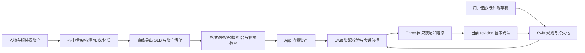
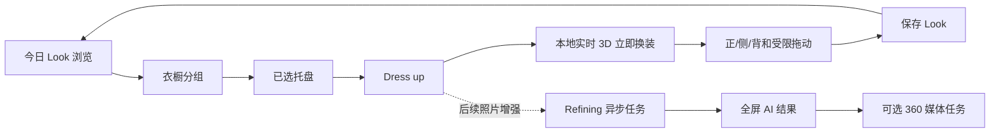
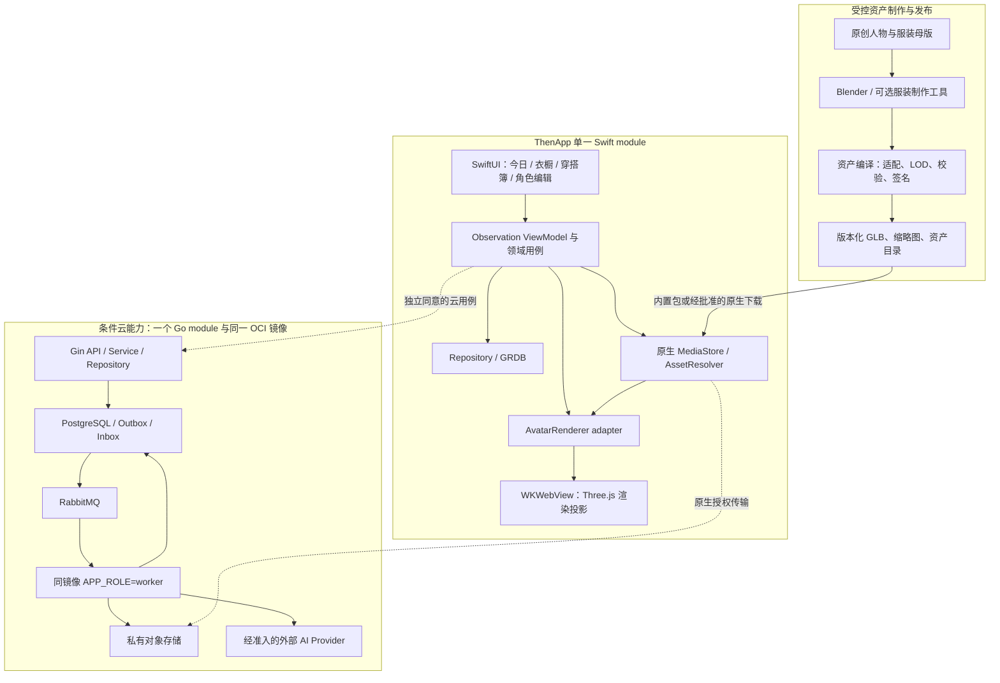
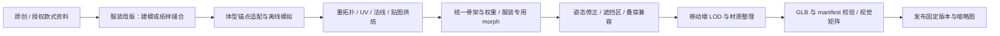
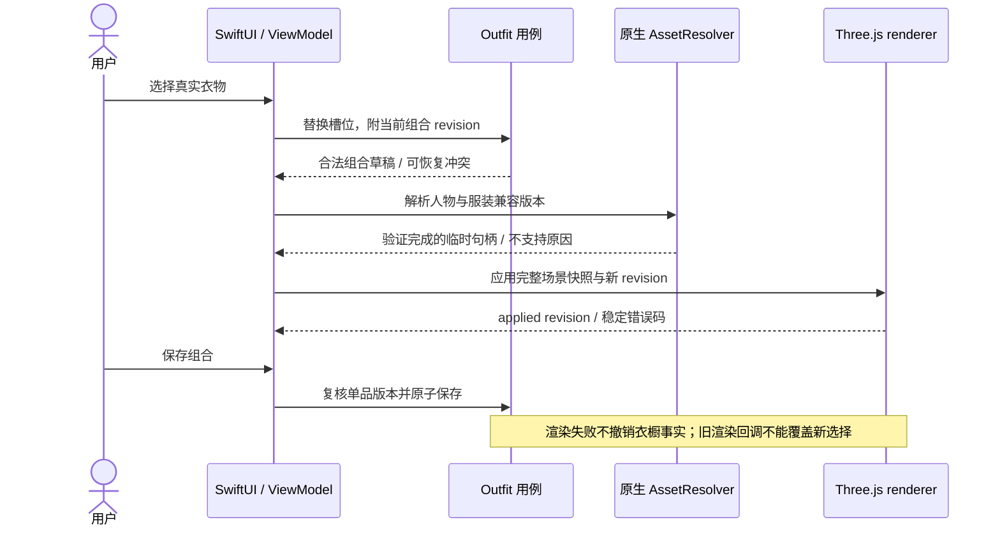
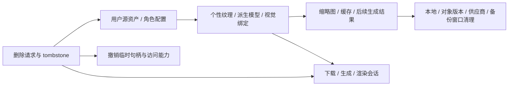
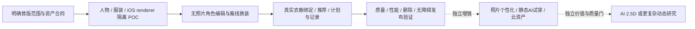

# 三维虚拟形象与服装系统研究

## 2026-09-14核心需求定稿与建模深度分析

### 当前决定与证据等级

用户本轮强调三维为最核心功能，并明确“先保持和 Woo 一样的实现”。本次将其固定为：**沿用 Woo 可见的人物穿搭观感、信息层级与交互，不添加新的角色表演；同时保留此前已确认的零衣物上传、内置服装和真实三维模型能力。**“一样”描述用户体验目标，不能证明或要求复制 Woo 未公开的内部算法。

- 已固定：无上传入口、Woo 可见页面、可配置角色、真实服装几何换装、多朝向观察、本地保存/恢复/删除；正式行为归 PRD 10/11/12。
- 本轮不采纳此前提出的单次展示动作。呼吸、眨眼、挥手、走路、舞蹈、连续待机均未进入首版；有动作的长期目标保留，新增时再定义动作卡。左右观察或相机转动不算身体动画。
- 待实测：角色美术样本、实际体型合法域、组合矩阵、最低硬件、预算达成情况。它们是实现与验收输入，不能用“需求已固定”宣称完成。
- 待技术变更批准：Blender 正式美术制作工具链。现有 Swift 原创生成器只属于 11-02 的工程 POC，不能被当作已证明能实现 Woo 画质的产品建模方案。

证据标记：**O** 为本轮直接看到的界面；**A** 为作者公开声明；**I** 为工程推断；**R** 为 Then 自身需求。O/A 不揭示内部实现，I 不写成竞品事实，R 不伪装成 Woo 原有功能。

### Woo 本轮逐状态分析

2026-09-14 重新打开原帖，用浏览器原生视频进度条定位并保存实际截图。截图保留 X 页面及视频原构图，无透视矫正、AI 补画或重新生成；源视频有手机模型、镜头推拉及字幕遮挡，因此只能量取当前可见区域，不能作为 1:1 的像素坐标模板。图片仅为设计研究证据，不进入 App、测试素材、生成模型输入或公开品牌资产。

| 步骤 | 证据/时刻 | 页面信息与主要动作 | 体验评估及不能证明的内容 | Then 固定映射 |
| --- | --- | --- | --- | --- |
| 1 | O，[首页](evidence/woo/look-home.jpg)，约 1 秒 | 全身人物占主要面积；浅底、极淡季节字样；品牌、日历/菜单、左右箭头 | 穿搭视觉焦点清楚；浅色字样对比弱，不能据此评价读屏。视频中的人不等于实时 mesh | 首页直接显示内置角色和默认搭配；装饰字不承载必要信息 |
| 2 | O，[造型详情](evidence/woo/look-detail.jpg)，约 10～11 秒；[总览](evidence/woo/look-overview.jpg)，约 15～16 秒 | 色点、日期、关联衣物小卡、分享/删除；人物和信息面板保持上下关系 | 单品与整体结果关联清楚；截断名称/图标语义依赖实机核对；箭头是否切 Look 或切朝向不能只看图标决定 | 日期、关联单品、收藏/删除对应实际保存事实；角度控件与 Look 浏览使用不同状态和可访问名称 |
| 3 | O，[照片造型正面](evidence/woo/photo-look-front.jpg)，约 20～21 秒 | 白底全身真人形象、Create 360°、日期及色点 | 可见结果和入口；这帧不证明已点击 360 或生成成功 | 照片结果为可选增强，默认内置三维无此依赖 |
| 4 | O，[照片造型侧面](evidence/woo/photo-look-side.jpg)，约 25～26 秒 | 同套衣着的侧向结果，背景/面板相似 | 确认多朝向视觉；来源可能是视频、离散图或 mesh，尚未公开 | Then 的侧面由同一三维资产实时渲染；不承诺照片背面真实 |
| 5 | O，[分类衣橱](evidence/woo/wardrobe-categories.jpg)，约 30～31 秒 | TOPS、OUTERWEAR、BOTTOMS、SHOES 同页纵向排列，每组多个缩略图 | 类别浏览成本低；截图不能证明每行横向滚动、空态或分类准确率 | 复现同页分类结构；内置目录先可用，真实用户衣橱保持独立来源 |
| 6 | O，[选择托盘](evidence/woo/wardrobe-selection.jpg)，约 35～36 秒 | 顶部黑色托盘、数量 3、单品缩略图及移除按钮、蓝色 Dress up | 当前选择和下一步清晰；遮挡部分列表，小移除按钮需在原生保证点击区 | 同槽位替换、逐件移除和完整性校验；Dress up 提交本地草稿，无假 AI 等待 |
| 7 | O，[Styling 状态](evidence/woo/tryon-styling.jpg)，约 40～41 秒 | 暗色背景、中央人物、Styling your selected pieces、底部已选单品 | 处理对象明确；未见取消、超时或失败恢复，不能推断其支持情况 | 后续真实 AI 任务才使用此界面；当前本地加载只表达真实加载 |
| 8 | O，[生成结果](evidence/woo/tryon-result.jpg)，约 45～46 秒 | 独立全身结果页、关闭、心形、下载、分享图标 | 结果聚焦；心形可能为收藏，不等于自动保存；动作结果未逐一演示 | 收藏/保存/下载/分享区分；本地 Look 与 AI 媒体分别实现，未完成能力不能用可点击假按钮交付 |
| 9 | O，[360 入口与底栏](evidence/woo/create-360.jpg)，约 50～51 秒 | Create 360°、日期、色点、分享/删除；首页/相机/衣橱底栏 | 下一生成动作可发现；输出类型、耗时、价格与失败流程未知 | 真实模型观察与 360 媒体生成分开命名、计费和验收 |

作者在 [9 月 9 日回复](https://x.com/LerSentAI/status/2097638948067525116) 表示内购版本审核中（A，本轮直接读取）。这只能证明当时的作者表述，不证明当前已上架、价格、付费额度、地区或订阅规则。评论中的社交/电商建议不是 Woo 已交付功能。

未被完整演示的范围：首次引导、账号、人物创建/编辑、照片完整采集和复核、单品详情、分类纠错、日历、菜单、收藏列表、删除确认、离线、异常恢复、内购、360 完整输出。需要安装包/可访问产品或后续资料才能补齐对标；目前使用 Then 既有 PRD 补足自身必要状态，明确标 R。

### 复刻完成的定义

“全部页面/功能”保留在完整产品目标，不等于首个 3D 切片包含所有云功能。冻结三层交付：

| 层 | 内容 | 完成证据 |
| --- | --- | --- |
| 核心三维 | 内置人物与服装、编辑外观、直接换装、观察、Look 保存/恢复/删除、离线和无障碍 | 真实 App 的几何/状态/数据/错误旅程通过 |
| Woo 可见体验 | 首页、信息面板、分类衣橱、托盘、照片输入、真实生成中、结果、收藏/导出分享、日期浏览与 360 入口 | 有证据的状态逐页映射；照片/云/导出按相应功能契约分期实现，未完成项继续记为未交付 |
| Woo 未公开体验 | 隐藏页面和失败状态、供应商、算法、商业化 | 当前未知；有证据后补映射，不做无依据的一比一声明 |

模型资产不同使人物区域不适合做整屏像素相等判断。页面比较须对齐 viewport、内容状态、系统字号和 UI 几何；人物另按正侧背、服装轮廓、材质、轮廓完整度和光照验收。宣传片的手机边框、透视角度和字幕不属于 App 页面。

### 三维核心系统的组成



核心复杂度在 B/D：网格能加载不意味着好看，人物能变形不意味着衣物同步合身，站姿无穿模不意味着动作无穿模。Go/OpenAPI 不参与本地每次旋转或滑块更新；首版安装包资产和 GRDB 足够完成主路径，后端继续承担独立云任务。

### 建模路线比较与选择依据

| 路线 | 得到什么 | 优点 | 本项目必须补的工作 | 结论 |
| --- | --- | --- | --- | --- |
| 人工/原创制作可编辑母版 | 可控拓扑、骨架、权重、UV、材质和形变 | 最容易固定风格与服装适配，长期增加服装可复用 | 技术美术样本、权重修正、导出/视觉规范 | 正式人物首选制作方式；Blender 为工具候选 |
| 明确授权的成品角色 | 较快得到成熟人物外形 | 缩短从零雕刻时间 | 骨架改造、拓扑/morph、服装适配与逐项许可核验 | 可研究，未采购/导入，不把网络模型直接当成可交付资产 |
| Swift 程序化网格 | 可重复的测试人物、权重和坏资产夹具 | 格式与边界测试可控 | 正式人物外形、衣褶、脸/手/发美术质量无保证 | 11-02 工程 POC；不是强制的最终生产建模工具 |
| 图片/文字生成 3D | 初始 mesh、纹理或其他三维表示 | 能辅助外形探索 | 拆分身体/服装、重拓扑、对称/背面修正、rig、蒙皮、morph 和授权 | 不能直接替代可换装母版流程 |
| 照片虚拟试穿 | 二维穿搭结果 | 容易表达照片级衣着视觉 | 生成任务、模型授权/成本、身份一致、删除；不存在天然骨架 | Woo 照片增强候选，与本地三维分开 |
| 多视图视频/3D Gaussian | 多视角视觉或视图表示 | 可展示“立体感” | 衣物槽位、稳定人物拓扑、骨架和可控变形不能自动得到 | 不作为真实可编辑换装交付 |

公开例子：[Microsoft TRELLIS](https://github.com/microsoft/TRELLIS) 提供 image/text 到 mesh、Gaussian 等表示，仓库运行要求包含 NVIDIA/CUDA 环境。它的生成能力不构成 `then-template-v1` 骨架、可分离服装和形变适配的保证；把输出变成我们可用资产仍需上表的后处理。这是对项目要求的工程判断，没有在当前 Mac/iOS 上运行该模型，也没有准入其全部依赖和素材。

### 人物母版：应制作和交付哪些东西

1. **视觉目标**：按 Woo 的完整成人穿搭观感整理本项目人物正/侧/背样张；头身比例、脸/发、手、鞋、站姿、服装风格在同一套图里评审。没有得到可审阅样本前不承诺“写实数字人”或把现有胶囊人偶作为目标。
2. **几何**：身体主体使用连续、可变形拓扑；肩、腋、肘、髋、膝有足够边环；不靠大量相交球体构成最终裸露部位。修正法线、缝隙和重复面；不要求每个衣服网格封闭，衣领/袖口是正常开口。
3. **骨架**：一个成人 rig 家族；root/pelvis/spine/chest/neck/head、左右上臂/前臂/手、大腿/小腿/脚满足基础站姿和后续有限姿态。首版无手指逐关节控制、面部骨架和实时 IK 产品功能；关节总量由资产预算限制。
4. **制作姿态与展示姿态分离**：rest pose 固定后用于人物和所有服装导出；首页展示使用统一站姿。不在换一件衣服时修改 rest pose，也不把自动重新计算 bind matrices 当作修复错资产的方法。
5. **基础遮蔽**：不可关闭的基础服装层与身体独立检查；移除上装/外套、坏资产、切换中间帧、遮挡 mask 更新和渲染失败都不能导致意外暴露。
6. **离散外观**：肤色、发色、发型、面部样式使用资源清单定义的稳定值；先做少量风格一致选项。自定义 UI 不生成虚假的已支持选项，也不据此推断用户身份或身体属性。
7. **文件交付**：源资产/生成源码、人物 GLB、rig 说明、morph 字典、静态替代、预览图、导出版本/参数、授权与 hash。仅交一张 PNG 或不可编辑视频不能验收。

### 骨架、蒙皮与体型形变的实现细节

[glTF 规范](https://registry.khronos.org/glTF/specs/2.0/glTF-2.0.html#skins) 定义 joint 索引/权重、inverse bind matrices 和 morph target；以下是 Then 在标准之上收窄的项目约束。

- **不能只比较骨骼名字**：验证骨骼顺序、父子关系、单位、坐标轴、rest transforms、inverse bind matrices 和 mesh bind transform。相同名字但 bind pose 不同会出现衣物漂移和扭曲。
- **同一服装自己的权重**：每顶点最多 4 个有效关节，权重非负且归一化；零权重、越界 joint、NaN 拒绝。由最近点/自动权重传递只是初值，腋下/肩部/腰口需修正。
- **两个无单位体型维度**：肩宽与躯干厚度；POC 的 `[-0.25, 0.25]` 是配置范围，不是百分比、厘米或真实体重。生产范围由覆盖矩阵验证后确定，超界拒绝。
- **正负形变实现**：若 runtime 只用非负 target 权重，每轴可做正/负两个 target，参数按符号映射到对应 target；正负 target 不是新增用户滑块。人物、头发关联区域与每件服装分别有自己的 delta 和法线处理。
- **联合形变**：单轴无穿模不代表两个最大值相加仍正确；验证两个参数联合极值和中间采样。若需要大量联合 corrective targets，优先收窄合法域或修母版，禁止临时把用户输入夹到另一数值却不显示。
- **不改变骨长**：首个体型域尽量保持关节中心/骨长稳定，通过局部表面 morph 调整轮廓。四肢长度和大范围身高不进入首个编辑器；需要关节重定位时必须同时更新服装与动画合同。
- **装配**：每个独立服装 GLB 在制作期用同一 rig 导出；runtime 校验一致后将 skin 绑定到身体 skeleton。`SkeletonUtils.clone` 只克隆已有骨架关系，不会把任意服装变成适配资产；其 geometry/material 会按引用复用，不能把 clone 当作资源完全独立。[Three.js r185 源码](https://github.com/mrdoob/three.js/blob/r185/examples/jsm/utils/SkeletonUtils.js)

### 服装制作、叠穿与穿模处理

- **首批内容**：沿用四类目录并保证两件几何不同的上装；首个完整美术清单建议为 2 上装、1 外套、2 下装、2 双鞋，七件是候选内容预算，最终款式随样本清单锁定，不把颜色变化计成不同模型。
- **槽位**：上装、外套、下装、鞋各最多一个；鞋按一双计一项。裙装归下装；连衣裙跨上下装、帽包首饰和多层外套暂不进入当前有限集，Woo 出现的包等保留内容差距，不能宣布全部复刻。
- **制衣**：对统一 base body 建立衣领/袖口/下摆/裤腰/鞋口；身体外扩只适合初稿，不能代替衬衫领型、裙褶、外套层次和鞋楦。法线/低成本纹理表达小褶皱，轮廓必须由几何表达。
- **绑定**：贴身衣随对应骨骼蒙皮；裙摆需要更谨慎的权重，站姿可以预制轮廓但不能据此支持行走。鞋跟脚骨/蒙皮一致，不出现脚掌穿出、脚底悬浮。
- **人体遮蔽**：用预定义身体区域的面集合或独立 body submesh 隐藏被衣服完全覆盖部分；基础遮蔽另受保护。项目优先几何区域方案，新增像素 ID 贴图/定制 shader 要独立评审。
- **衣服之间的穿模**：身体 mask 只能隐藏身体，不能解决外套与衬衫相交。内外层轮廓留量、预定义内层遮蔽区域和有限组合矩阵共同解决；敞领、袖口处不粗暴整块隐藏。
- **禁止补丁式处理**：不对全人物等比放大衣服、不在 runtime 反复推开顶点、不偷偷瘦身、不用取消背面剔除遮丑、不把不支持的搭配换成另一件衣服。
- **选择语义**：托盘表示草稿；同槽位替换、外套可清空，取消回到已应用组合。缺少必需上装/下装/鞋时显示缺少项并保留上一可用画面；基础遮蔽不是一件已选择服装。

### 材质、灯光、镜头和美术质量

模型之外，Woo 的干净白底、全身轮廓、柔和阴影及服装配色共同决定观感。正式资产不得只验三角形数：

| 部分 | 制作规则与验收重点 |
| --- | --- |
| 材质 | PBR metallic/roughness；布料金属度/粗糙度有合理差别，避免塑料皮肤。可调色使用有明确染色区域的材质参数，不覆盖 logo/鞋底等固定细节 |
| 纹理 | 11-02 工程样本保持纯色；正式贴图为候选变更，先验证内嵌 PNG/JPEG 的色彩空间、分辨率、解码峰值和许可证，再考虑压缩。不得默认增加 KTX2/Draco/WASM |
| 头发 | 首批使用雕塑式几何或简单不透明发束；透明发片排序、头发物理、皮肤次表面散射都需单独成本验证 |
| 灯光 | 统一中性灯光、背景和接地阴影；内置 HDRI 若使用须验证来源/体积，首个样本可不用；图片缩略图与主场景用同一色彩配置 |
| 镜头 | 固定高度/俯仰/焦距或正交尺度；按同一资产全集的边界框留足头顶、手和鞋空间，不能每件衣服自动改变人物大小；0/90/180/270° 和连续 yaw 对照 |
| 质量 | 正侧背脸/手/肩/腰/鞋完整；无颈部断缝、衣领悬空、肘部塌陷、裙摆穿腿、鞋底悬浮、面闪烁和材质翻面；变形和旋转中也需成立 |

纹理预算必须看解码后的 GPU/CPU 内存：例如一张 2048×2048 RGBA8 原始像素为 16 MiB，完整 mip 链约 21.3 MiB；PNG 文件很小并不意味着运行内存很小。这是容量计算示例，不是 Then 已测资源消耗。

### 运行时、状态与数据

1. Swift 保存 `AvatarProfile` 与 `LookDraft`；渲染器仅持有可丢弃场景。`AvatarProfile` 描述外观，`Look` 描述选择与当时外观快照，`OutfitPlan`/`WearEvent` 描述计划/实际事实，`GeneratedMedia` 是可选照片结果。
2. 内置 `GarmentAssetID` 与用户 `WardrobeItemID` 永远分开；一个可分享的模板造型不证明用户拥有或实际穿过该衣服。模板 Look 不直接写入以真实衣物为前提的 16-01 保存用例。
3. 每次操作增加 revision；Swift 校验完整配置和槽位，校验 GLB/hash/版本后给当前 session 临时句柄。解析和装配在暂存场景完成，所有资源准备好再整体切换，返回当前 session/revision 的 applied ACK。
4. A→B→C 的迟到 A/B 不得覆盖 C；失败保留上一有效场景并明确新预览未应用。保存合法结构化配置可以成功，但没有相同 revision 的预览图就不绑定旧封面。
5. 保存固定 template/rig/garment/参数版本与日期/原始时区；重复保存入口防重复写，事务失败保留草稿。MVP 不做云同步和旧生活管理兼容，不等于可以不保护当前 OOTD 保存结果。
6. 删除 Look 删除对应私有预览；删除角色按 AVATAR-REQ-021 清除历史中的私人外观引用，保留真实衣物/穿着事实。共享内置模型不按个人删除操作移除；删除世代与 session 失效防止迟到生成复活。
7. 渲染资源按所有权释放：独占 garment geometry/material/texture 可在替换后释放，共享 skeleton/material/纹理只能在最后使用者退出时释放；退出页面解除 handler、mixer、RAF、render target 和临时句柄。删除 scene child 不等于释放 GPU 资源。[Three.js 官方释放说明](https://github.com/mrdoob/three.js/blob/r185/manual/en/how-to-dispose-of-objects.html)
8. 后台、Reduce Motion、故障/热压力按原生策略停止绘制或静态替代；恢复用 Swift 配置重建，不沿用损坏 JS 状态。第一版没有持续待机动画，无交互时停止连续绘制。

### 资产生产与交付 SOP

| 阶段 | 输入 | 实际产物 | 不通过时处理 |
| --- | --- | --- | --- |
| S1 参考和需求 | 本文截图、PRD 11/12、用户“保持 Woo”决定 | 页面状态映射、角色正侧背美术要求、服装清单、明确排除项 | 来源缺失记 unknown；不得虚构竞品页 |
| S2 美术样本 | 单个人物、一套代表衣服、目标画风 | 原始模型/样张与 App 同光照三视图 | 调整资产；不用格式通过抵扣美术不合格 |
| S3 rig/morph | 固定骨架、rest pose、参数字典 | body 和衣物权重、morph、coverage 与单位检查 | 修源资产，拒绝任意 rig 自动兼容层 |
| S4 导出与校验 | 可编辑源/确定性工程夹具、锁定导出工具 | GLB、manifest、来源、hash、格式/预算报告 | 报错定位到资产及字段；不运行未知资源 |
| S5 隔离 renderer | 通过 S4 的真实资产 | 换装、转台、ACK、失败和资源释放证据 | 保留上一个可用状态，修实现后复验 |
| S6 业务接线 | POC 通过与生产数据契约 | 原生编辑器、Look 事务/快照、删除恢复 | 不把 JS localStorage/内存数组用作正式存储 |
| S7 验收 | 固定 build、资产哈希、环境、状态矩阵 | 自动化报告、逐状态截图/录屏、未通过项 | 回到对应源头修复；明确模拟器与发布边界 |

工具决定按 Design 01 单独锁版。**上一轮“必须先把 Swift 生成器做失败才允许评估 Blender”没有工程依据，本轮取消该限制。**可以直接进行只读工具/资产可行性评估；引入生产工具或改变 11-02 资产来源前按既有契约流程变更。当前本机 `Blender --version` 返回 5.2.1 LTS / build `9e2066aef7ef`，只说明已安装；官方网页本轮读取失败，GitHub README 的版本摘要也不能用来确认该二进制来源，未据此批准、安装或运行建模脚本。

### 测试矩阵与 SMART 完成条件

- **技术最小矩阵**：原 11-02 的 2 上装 × 9 体型采样 × 正/侧/背 = 54 张，只证明该样本子集。
- **完整内容矩阵**：按实际 manifest 枚举所有合法组合。若最终采用 2 上装 × 2 下装 × 2 鞋 × 外套有/无，共 16 套；9 体型采样 × 4 朝向为 576 静帧。这里为七件候选清单的算例，不能把示例计数当成已执行测试。
- **连续检查**：两参数各最小/默认/最大之外，在全部合法组合上作 21×21 参数网格检查及滑块扫动/360 yaw 录屏；几何相交检测作为辅助，仍人工复核领口、袖口、腰口、裙摆和鞋口。采样通过不等于数学证明全域无穿模；发现问题修形或显式收窄域。
- **错误矩阵**：坏 hash、截断 GLB、外部 URI、未知扩展、无穷数、越界索引、非法权重、错 rig/bind pose、无 morph、预算超限、进程/context lost、会话乱序和删除迟到。失败可定位、可恢复且不冒充成功。
- **性能提案**：沿用 11-02 的 ≤80k triangles、≤8 material slots、≤30 draw calls、≤64 joints；冷开 p95≤2s、换装 p95≤300ms、触摸呈现 p95≤100ms、10 分钟 p95 帧间隔≤33.3ms、合计候选峰值≤300MiB。这些是待实测门槛，记录硬件/画质/DPR、App/WebContent/GPU 口径，模拟器不能验真机热/能耗。
- **体验验收**：首次离线进入→选另一件上装→Dress up→正侧背→保存→杀进程→恢复→删除→重开无复活；新用户不被账号/照片/自有衣物阻断。最大字号、VoiceOver、减少动态效果、深色、低电量/热压力均有可操作路径。
- **SMART 工作方式**：每个检查点开始前登记负责人、输入哈希、可验收产物、时间盒和退出条件；可用 1 个工作日评审人物样本、1 个工作日核对代表服装 rig/morph、1 个工作日跑隔离装配作为估算，结束即记录通过/失败及差距。没有样本和测量前不许承诺全功能工期，也不因超时降低画质或跳过检查。

### 需求追踪与本轮完成边界

| 固定内容 | 设计事实源 | 需求/验收 | 近期执行 |
| --- | --- | --- | --- |
| Woo 页面和导航语义 | Design 03 本轮状态补充 | PRD 10 当前主路径；逐页对照仍待 App 验收 | 11-02 页面/模拟器任务；云页面各归其功能 |
| 人物、形变、站姿观察与数据 | Design 04 本轮核心合同 | AVATAR-REQ-017～024；AVATAR-ACC-010～017 | 11-02 工程 POC；正式美术/生产接线不因研究完成而通过 |
| 内置目录、槽位、适配与来源 | Design 05 本轮核心合同 | WARDROBE-REQ-022～027；WARDROBE-ACC-011～016 | 11-02 资产/状态/矩阵任务 |
| 照片、生成、360、导出/分享 | Design 04/07/08/10 | PRD 11/14/15/17 的独立需求；参考可见导出目标尚需正式契约修订 | 保留完整目标，未开启供应商流量 |

本轮交付的是参考证据、核心需求与实施分析。没有新增模型、动画、schema、API 或生产依赖；没有将 3D、美术或 Woo 全量复刻标记完成。


## 2026-09-14 Woo 页面与三维实现复核

### 审核结论

本轮按 Product Design 的 journey audit 方法重新观看用户给出的 [Woo 演示](https://x.com/LerSentAI/status/2090783821452943404?s=20)，并逐项核对当前 ThenApp 的页面、渲染代码和随包资源。结论分为三层：

1. **Woo 已直接展示的是一条照片生成产品链**：浏览既有 OOTD、从衣橱选择单品、执行 `Dress up`、等待 `Refining your new look`、查看/收藏/下载/分享结果，并在结果页提供 `Create 360°` 入口。
2. **Woo 演示没有证明其使用可编辑实时三维模型**：视频中可见离散朝向和 360 入口，但没有展示连续自由旋转、骨骼姿态、体型 morph、mesh 换装、GLB 资产或 360 任务的最终输出。把这段演示直接解释为实时 3D 技术没有证据。
3. **Then 当前已经有实时 WebGL 交互，但仍是程序化几何原型**：人物和衣物由 Three.js 的球体、胶囊体、圆柱体和挤出几何即时拼成，可以拖动旋转并替换不同几何；仓库内没有 `.glb`/`.gltf`、`GLTFLoader`、`SkinnedMesh`、骨骼、蒙皮权重或体型 morph。因此当前结果证明了 SwiftUI ↔ WKWebView ↔ Three.js 的纵向通路，尚未证明正式三维人物和服装资产链。

当前最新产品决定是：**用户无需上传本人照片或衣服即可使用内置虚拟形象和内置服装进行实时三维换装**。Woo 的照片生成和 360 媒体保留为后续可选增强，不再作为首个可用版本的前置。页面层级可以按 Woo 可见结构复现；项目使用自己的品牌、人物、服装、文案和图标资产。

### 页面与状态逐帧核对

下表时间来自约 55 秒的 X 嵌入视频，本轮于 2026-09-14 在浏览器内定位并暂停复核。它是宣传视频的页面审核，不等于已安装 Woo 后遍历所有分支。此前检查点没有保存参考截图；本轮已通过浏览器截图接口直接保存并检查，见本文顶部的新证据。视频透视/字幕仍限制像素差分的有效性。

| 状态 | 近似时刻 | 可直接观察的页面内容 | 交互/状态含义 | Then 当前映射 | 差距与判定 |
| --- | ---: | --- | --- | --- | --- |
| `WOO-AUD-01` 今日主视觉 | 0～1 秒 | 左上品牌、右上日历/菜单、中央全身人物、左右圆形箭头、下方日期/颜色/单品摘要、底部三入口胶囊 | 进入后立即浏览当天 Look | `AvatarStudioView.look` 已有相同信息骨架 | 人物完成度、间距、底部卡片尺寸仍未达到参考；P1 |
| `WOO-AUD-02` 多朝向浏览 | 约 7～15 秒 | 同一套造型出现正面、侧后/背面等不同朝向 | 箭头用于切换观察方向 | 当前 Three.js 画布支持拖动 yaw 和左右按钮 | Woo 只证明离散视图；Then 需要补固定正/侧/背语义和角度归一化；P1 |
| `WOO-AUD-03` Look 详情 | 约 13 秒、29 秒 | 人物、日期、颜色点、相连的单品缩略图、收藏/分享/删除、左右切换 | 一个已保存 Look 与其单品关系 | 主页面已有日期、颜色、单品、收藏/分享/重置外观 | 当前状态只在内存，删除实为恢复默认；需要 GRDB Look 与真实删除语义；P0 |
| `WOO-AUD-04` 照片输入结果 | 约 22～25 秒 | 真人全身照片经抠图/风格化后置于白底，关联日期和单品，并显示 `Create 360°` | 照片是 Woo 的输入/结果媒介之一 | Then 已有独立照片质量 POC，但不作为无上传主路径前置 | 后续若启用，必须保持照片同意、质量、Provider、成本和删除门；当前不做占位闭环 |
| `WOO-AUD-05` 数字衣橱 | 约 33 秒、48 秒 | 按 TOPS、OUTERWEAR、BOTTOMS、SHOES 分组的白底单品网格，顶部出现已选数量 | 浏览并组合已有服装 | 内置衣橱已覆盖四类和六件随包单品 | 当前采用分类 Tab + 两列大卡片，参考是同页纵向分组 + 横向密集单品；要按参考重排；P1 |
| `WOO-AUD-06` 已选托盘 | 约 36 秒 | 黑色圆角托盘、数量、三个缩略图、逐件移除、蓝色 `Dress up` | 形成待应用的穿搭草稿 | 已有黑色托盘、移除和 `Dress up` | 尺寸与位置接近，但当前每类选择/冲突规则仍需明确；P0 |
| `WOO-AUD-07` Refining | 约 42 秒 | 全屏暗色遮罩、中央人物预览卡、`Refining your new look` 状态、底部已选单品 | 后台生成任务进行中，原页面不可误操作 | 无上传实时 3D 应直接应用，不需要伪造等待；云 AI 后续使用独立任务状态 | 不能为了复刻视觉给本地换装增加假加载；云路径必须有 queued/running/failed/cancelled/succeeded；后续切片 |
| `WOO-AUD-08` 全屏结果 | 约 45 秒 | 白底全身生成图，左上关闭，底部收藏、下载、分享 | 检查一次生成结果并决定保存/导出 | 当前无独立结果确认页 | 无上传主路径将结果表现为实时角色；AI 路径后续再加入结果资产和删除链；P1/后续 |
| `WOO-AUD-09` 360 入口 | 约 22 秒、51 秒 | Look 页出现黑色 `Create 360°` 按钮；视频未展示点击后的输出 | 这是独立生成动作，而非当前画面已是可编辑 3D 的证明 | Then 当前实时角色可以本地连续水平旋转 | 文案应区分“旋转查看角色”和“生成 360° 媒体”；不得互相冒充；P0 |

演示未展示首次启动/引导、角色自定义、日历详情、菜单设置、空衣橱、单品详情、保存确认、删除确认、生成失败/重试、离线、权限拒绝、360 生成中及 360 最终结果。这些页面不能从宣传视频补画后宣称“一比一”；Then 应按自身已批准 PRD 和系统状态补齐，并在后续取得 Woo 实际安装包或新增参考证据时再做视觉映射。

### 页面旅程与产品拆分



这张拆分明确两个不同结果：本地内置服装必须立即改变角色 mesh；照片 `Refining` 则是将来受控的异步媒体任务。二者可以在视觉上共享衣橱托盘、日期和结果卡，但不能共享含糊的“立体”状态。

### 当前代码事实与根因

| 层 | 当前事实 | 已证明 | 未证明/根因 |
| --- | --- | --- | --- |
| SwiftUI 页面 | `AvatarStudioView.swift` 包含 Look、内置衣橱、选择托盘和底部导航；`AvatarStudioModel` 保存选择、已应用单品、yaw 与 renderer 状态 | 页面骨架、无上传入口和基本无障碍标签可运行 | 页面和领域状态集中在单文件；Look 未持久化，分享/删除仍是演示语义 |
| WebKit 边界 | `ThreeAvatarView.swift` 使用非持久数据存储、`avatar://` 随包协议、导航阻断和结构化 JSON 配置 | 离线 renderer、受限页面宿主和 Swift → JS 配置传递可运行 | 没有 session ID、applied revision 确认、消息大小/枚举/有限数校验，也未完整释放 WebGL 资源 |
| Three.js renderer | `avatar.js` 使用 `WebGLRenderer`、正交相机和指针拖动；每次换衣清理旧 geometry | 真实 WebGL 几何变化和连续水平旋转 | 全部对象是 primitive mesh；无资产加载、骨骼动画、蒙皮、morph、纹理/LOD/遮蔽合同 |
| 三维资产 | 当前只有六张服装 PNG、静态 fallback 和 Three.js 源码 | 服装目录缩略图和故障图可随包工作 | 没有 GLB 人物、GLB 服装、骨架家族、源资产、编译器或项目资产 manifest |
| 证据 | 已有模拟器首页、衣橱、换上衬衫三张截图和基础测试 | 当前纵切在指定模拟器可见 | 尚无 54 场景矩阵、正式人物逐角度图、穿模清单、GLB 校验、资源/真机/恢复证据 |

当前最关键的根因不是 Three.js API 缺少，而是**正式人物和服装资产合同尚未落地**。Three.js 的 `SkinnedMesh` 需要 skeleton、每个顶点的 skin index 和 weight，常规做法是由 `GLTFLoader` 导入制作好的模型；它不会把服装 PNG 自动变成可蒙皮衣物。[Three.js SkinnedMesh](https://threejs.org/docs/pages/SkinnedMesh.html)、[GLTFLoader](https://threejs.org/docs/pages/GLTFLoader.html)

### GitHub 与公开实现调研

本轮通过 GitHub 仓库、许可证和官方规范核对“人物资产从哪里来、服装如何共享骨架、穿模怎样控制、照片试穿能否直接商用”。公开信息没有披露 Woo 的模型格式、渲染器或 Provider，本节只用于确定 Then 自己的实现路径，不把相似项目倒推成 Woo 的内部方案。

| 公开项目/规范 | 已验证能力与授权 | 对 Then 的结论 |
| --- | --- | --- |
| [`mrdoob/three.js`](https://github.com/mrdoob/three.js) | MIT；官方 `GLTFLoader` 支持 glTF 2.0，`SkinnedMesh` 支持 skeleton/skin weights，`SkeletonUtils` 提供 clone/retarget 工具 | 继续使用 Design 01 已锁定的 `0.185.1`；版本较新不构成中途升级理由。MVP 只接入随包 `GLTFLoader` 和必要依赖，不引入远程 addon |
| [`KhronosGroup/glTF-Blender-IO`](https://github.com/KhronosGroup/glTF-Blender-IO) 与 [`glTF-Validator`](https://github.com/KhronosGroup/glTF-Validator) | Khronos 官方导入导出与校验工具；Validator 可检查 GLB 结构、buffer、skin/animation、数值和扩展错误 | 可作为正式美术资产的候选导出/第一层格式门；格式通过仍不能代替 Then 的 rig、morph、coverage、预算和视觉矩阵校验 |
| [`donmccurdy/glTF-Transform`](https://github.com/donmccurdy/glTF-Transform) | MIT；提供可复现的 glTF prune、dedup、resample、纹理处理和压缩工具 | 只作为后续构建时优化候选；当前切片禁止未锁版 Node 工具和压缩解码器，因此不进入 11-02 运行依赖 |
| [`makehumancommunity/makehuman`](https://github.com/makehumancommunity/makehuman/blob/master/LICENSE.md) | 程序为 AGPL；仓库说明其随包 base mesh、targets、clothes 等图形资产为 CC0，但第三方资产可有独立许可证 | 仅作为人物母版和 morph 研究参考；当前 11-02 仍交付项目原创 Swift 输出。后续若另行批准使用，必须只取明确属于随包 CC0 的导出结果并逐项保存来源，不把 AGPL 程序代码放入 App/后端，也不采用来源不明的社区资产 |
| [`shrekshao/gltf-avatar-threejs`](https://github.com/shrekshao/gltf-avatar-threejs) | MIT；演示服装/头发共享 skeleton、rigid attachment、身体区域遮蔽和导出 GLB | 借鉴“共享骨架 + body region mask + 固定槽位”模式；项目长期未更新且采用自定义扩展和手工流水线，不作为依赖或资产格式 |
| [`nirholas/three.ws` garment manifest](https://github.com/nirholas/three.ws/blob/main/specs/GARMENT_MANIFEST.md) | Apache-2.0；公开 manifest 包含 slot、model hash/size/triangle count、skeleton/bind pose/bone mapping、occlusion、license/source 等字段 | 借鉴合同字段和加载前拒绝思路；Then 只支持一个 `then-template-v1` 标准骨架，不实现任意 rig 重定向或公共服装市场 |
| [`pixiv/three-vrm`](https://github.com/pixiv/three-vrm) / [VRM 1.0](https://vrm.dev/en/vrm1/) | MIT 库；在 glTF 上增加 humanoid、expression、look-at、spring bone、MToon 和元数据 | 首版不需要跨应用 VRM 互操作、表情系统、弹簧骨骼或 MToon；直接使用受限 GLB 能减少运行代码和资产合同。需求变化时再评审 VRM，不先引入 |
| [`Zheng-Chong/CatVTON`](https://github.com/Zheng-Chong/CatVTON) 与 [`yisol/IDM-VTON`](https://github.com/yisol/IDM-VTON) | 都能作为照片虚拟试穿研究基线；仓库代码/权重明确使用 CC BY-NC-SA 4.0，且依赖人体解析、DensePose/OpenPose 等额外链路 | 不能直接用于商业 App 生产后端。它们输出二维生成图，也不生成可编辑三维人物/服装。照片增强只能另选可商用 Provider/模型与数据集，并走 PRD 14/15/17 的隐私、成本和删除门 |

上轮研究后的 MVP 决策如下（工具评估流程以本文顶部本轮修正为准）：

1. **运行格式用 plain glTF 2.0/GLB，不采用 VRM 或自定义扩展。** 一个 `then-template-v1` 固定骨架、固定 rest pose 和固定骨骼顺序，人物与内置服装在制作期完成兼容，不建设任意资产自动重定向平台。
2. **运行时只解决装配，不负责“生成服装”。** `GLTFLoader` 加载已校验的 body/garment；服装绑定同一 skeleton、同步获批 morph、应用 body coverage mask，整个 revision 完成后再原子切换画面。
3. **manifest 是加载前合同。** 每件服装至少记录 ID/版本、slot、rig、morph 集、coverage region、GLB hash/字节数、三角形/材质/关节预算、来源和许可证；未知项、hash 不符或预算超限在 Swift 层拒绝。
4. **当前 11-02 POC 继续使用已批准的 Swift 确定性资产编译器。** GitHub 调研验证了 Blender/Khronos 流水线适合后续正式美术资产，但 Design 01 当前未锁定 Blender，执行中不得静默换工具链。本轮深度复核已取消“必须先做失败才能评估”的限制；正式美术方案可直接评估，生产工具变更仍须锁版并修订契约。
5. **照片试穿与 360 媒体独立分期。** 本地三维角色的 360 查看采用 camera/root 的受限转台；照片结果的 `Create 360°` 需要另一个多视图或视频生成任务，不能用当前开源照片试穿模型或旋转一张二维图冒充。

据此，当前建议的核心技术链是：`Swift 领域状态 → 资源 hash/manifest 校验 → 本地 GLTFLoader → 共享 skeleton 装配 → morph/coverage → revision ACK → SwiftUI 保存与降级`。它直接关闭现有 primitive 原型的根因，同时把非商用 AI、任意 rig、VRM 功能和实时布料留在范围之外。

### 首版真实三维建模方案

首版用一个标准角色家族和预适配内置服装。这里的“真实三维”指运行时存在可连续观察的 mesh、骨架和服装几何；它不表示扫描本人、精确量体或实时物理布料。

1. **人物母版**：在统一 T/A rest pose 建立项目原创成人比例 base mesh；固定坐标、米制单位、正面方向、骨骼名、层级、bind pose、UV 和材质槽。先完成一个角色，不同时做多人种/年龄/写实数字人矩阵。
2. **骨骼与蒙皮**：人物使用同一 skeleton；身体、基础遮蔽服和需要随姿态变形的服装都输出 `JOINTS_0`/`WEIGHTS_0`。glTF 规范用 skin、joint hierarchy 和 inverse bind matrices 表达 Linear Blend Skinning；首版每顶点最多四个有效权重并归一化。[Khronos glTF 2.0](https://registry.khronos.org/glTF/specs/2.0/glTF-2.0.html#skins)
3. **有限体型参数**：只做肩宽和躯干厚度两个受限 morph。人物与每件服装分别制作自身拓扑对应的 morph target，不能把人物顶点增量直接复制给不同拓扑的衣服。参数超界在 Swift 领域层拒绝。
4. **服装母版**：当前 POC 先由已批准的 Swift 确定性编译器交付两件不同几何上装、一件下装和一双鞋；所有服装在相同 rest pose 和骨架合同下制作并验证。正式美术资产若经契约变更批准使用 Blender，Armature modifier/vertex group 也只是绑定方法，自动权重之后仍需人工修正腋下、肩部、腰口、裙摆和鞋踝。[Blender Armature Modifier](https://docs.blender.org/manual/en/latest/modeling/modifiers/deform/armature.html)
5. **叠穿与穿模**：使用固定槽位优先级和 body coverage mask 隐藏被服装完全覆盖的身体区域；首版限制姿态和服装组合。裙摆、长发和宽袖通过离线修形与允许动作集控制，不引入实时布料求解器。
6. **材质与贴图**：首个验证资产使用少量 PBR 材质和受控贴图；先测未压缩内存，再决定单一纹理压缩路径。缩略图是 UI 资产，不能替代 3D 服装材质和网格。
7. **GLB 与 manifest**：人物、服装可以独立 GLB，但必须共享 `then-template-v1` rig 合同。manifest 固定 asset ID、版本、适用槽位、rig、morph、coverage、hash、字节数、三角形、材质和授权来源；未知扩展、外部 URI、坏 hash 或超预算在进入 renderer 前拒绝。
8. **运行时装配**：随包 `GLTFLoader` 解析已验证的 GLB，建立 body `SkinnedMesh`，给服装绑定兼容 skeleton，按 revision 原子替换服装、同步 morph、更新 coverage，并显式释放 geometry/material/texture。SwiftUI 持有选择、保存和删除事实，JS 只投影当前场景。
9. **动作与观察**：MVP 只需站姿、正/侧/背按钮和停止式水平拖动。眨眼、呼吸和走路必须是后续明确动作卡；转动 root/camera 不算身体动画。

### MVP 缺口优先级

| 优先级 | 必须关闭的缺口 | 完成证据 |
| --- | --- | --- |
| P0 | 用正式 GLB + `GLTFLoader` 替换 primitive 人偶；落地 `then-template-v1` skeleton、两件不同几何上装和有限 morph | GLB/manifest/hash、正侧背、两上装 × 9 参数组合、无穿模清单 |
| P0 | 将角色/服装/角度/Look 保存到 GRDB；删除、重启和迟到 revision 不改变事实 | 领域/Repository 测试、杀进程恢复、删除后重开证据 |
| P0 | 补 renderer session、revision ACK、输入校验、加载失败、WebContent 终止和资源释放 | bridge 测试、错误夹具、恢复录屏、资源稳定性报告 |
| P1 | 按 Woo 重排衣橱为同页纵向类别与横向单品；主视觉和底部卡片做同视口视觉复核 | 模拟器逐页截图、Dynamic Type/VoiceOver/Reduce Motion 检查 |
| P1 | 建立项目原创人物、头发、材质、灯光和服装视觉标准 | 资产来源、制作版本、审美评审和最终截图 |
| 后续 | 照片输入、Refining、AI 结果、下载/分享、Create 360° 媒体 | 独立 Provider/隐私/成本/删除 spec 与异步任务验收 |

### 执行 SOP

本轮不新增第二份执行计划，继续以已批准的 [11-02 无照片三维角色与静态降级执行计划](../plan/11-02-无照片三维角色与静态降级执行计划.md) 为唯一 checklist。执行顺序固定为：

1. 固定页面状态图、资产合同和首批组合矩阵。
2. 产出人物/服装 GLB、manifest、来源与确定性校验报告。
3. 先做恶意/错误资产拒绝，再把 `GLTFLoader` 接入隔离 renderer。
4. 完成 skeleton 绑定、服装替换、morph、coverage 和资源释放。
5. 接入 GRDB 草稿/已保存 Look、删除和重启恢复。
6. 在模拟器跑 54 个组合、页面视觉、无障碍、后台/WebContent 恢复和零非预期网络。
7. 真机可用后补资源、热、GPU、物理保护和最低设备门禁；模拟器结果不替代发布验收。

只有 P0 的资产、状态、bridge 和恢复证据通过后，当前程序化人偶才能被正式角色替换；仅改善圆柱/胶囊体外观不会关闭根因。

## 2026-09-13用户参考核实与路线差异

用户本轮提供的参考是 **Woo—你的立体数字衣橱**，作者 LerSent，原帖 [2090783821452943404](https://x.com/LerSentAI/status/2090783821452943404)。帖子页面显示发表于 2026-08-21；2026-09-13 通过正常 Chrome 页面读取作者正文并直接观看约 55 秒的嵌入演示。未下载媒体、未登录或操作社交按钮，未把评论区的建议作为产品要求。此前“参考软件身份未确认”已由这个明确输入解除。

本次为宣传演示的可观察行为核对，不是已安装 App 的完整体验测试；帧时刻以浏览器 video.currentTime 读取，属于近似定位。现有视频未披露服务端、供应商、资产格式、离线能力、渲染器或生成成本，不能由立体外观推断其采用 GLB、实时蒙皮或 Three.js。

| 参考证据 | 可直接观察的行为 | 对 Then 的映射与边界 |
| --- | --- | --- |
| WOO-REF-01，约 1 秒及多处 | 大幅人物穿搭主视觉，左右切换箭头，日期与颜色摘要 | 对应角色/穿搭浏览；可借鉴信息层级，不复制对方人物、服装、图标或字样 |
| WOO-REF-02，约 15 秒及 23/53 秒 | 同套造型的不同朝向展示；存在 `Create 360°` 按钮 | 证明参考包含多角度/360 展示入口；不能证明任意自由相机、可编辑网格或身体骨骼动画，更不能据此批准呼吸/眨眼/行走循环 |
| WOO-REF-03，约 23 秒 | 字幕说明上传自己的全身照片，人物造型与日期联动 | 参考的照片输入是重要路径；与 Then 已批准首版“无照片、无上传、无账号的本地模板”有明显范围差异 |
| WOO-REF-04，约 27～35 秒 | 造型下方关联单品；衣橱分 TOPS/OUTERWEAR/BOTTOMS；选中三件单品后出现 `Dress up`；字幕说明 AI 自动分类 | 对应衣橱类别、用户选择与试穿请求；AI 建议仍须用户确认，不把演示中的任意商品视为用户真实拥有 |
| WOO-REF-05，约 41～48 秒 | 出现人物输入卡、已选单品与 `Refining your new look` 等处理状态，随后展示另一套穿搭；字幕说明搭配到照片、可转为立体形象 | 更接近“照片 + 单品 → AI 试穿结果 → 可选 360 展示”的可观察流程；没有证据证明是本地服装网格立即替换。与 PRD 14/15/17 的条件生成路径相关 |
| WOO-REF-06，多处 | 分享与删除图标可见 | 只确认入口可见，未执行其完整行为；Then 现行首版不提供分享/导出，参考不自动改变该承诺 |

### 当时路线比较与后续修正

2026-09-13 曾先向用户呈现 A/B 差异，用户当时选择 Woo 照片流程优先并保留真实 3D。用户随后在 2026-09-14 进一步明确：主路径不要求用户上传本人照片或衣服，使用内置虚拟形象和内置服装即可换装。因此本节保留决策演进，当前执行以本文顶部的 2026-09-14 复核和 11-02 已批准合同为准；照片生成转为后续可选增强。

| 路径 | 可交付的核心体验 | 需要实现与验收 | 当前结论 |
| --- | --- | --- | --- |
| A：本地模板 MVP | 无照片调模板 → 选择内置兼容服装 → 正侧背查看 → 保存/离线恢复 | 原创或获授权模型/服装、有限参数、renderer POC、最低真机与删除；不依赖 AI 供应商 | **当前主路径**，由 11-02 执行 |
| B：Woo 式照片结果 | 本人照片 + 已拥有单品 → 风格化试穿结果 → 用户另行请求 360 展示 | 回写 Design 04/07/08/10、PRD 10/11/14/15/17/18 与产品计划；明确图片/视频/网格的真实输出、Provider、授权、同意、成本、任务恢复和删除；先静态，再独立验证 360 | 后续可选增强；未批准 Provider 和生产流量，不阻塞 A |

共同且可继续的工作：真实衣橱、状态、选择与结构化穿搭记录、本地隐私和 OpenAPI 工具链。动作、资产域、实际输出形态和最低机型仍需收敛；“参考身份和主路径已确认”不等于三维或云生成生产准入通过。

## 1. 原三维方案研究与阅读方式（2026-09-08历史）

- 研究日期：2026-09-08。
- 产品方向：用户已明确选择“可调外观与体型的 3D 虚拟角色，能直接换装”作为首版方向。
- 后续范围收敛：用户确认本地 3D 闭环首发，云端 AI/同步分期；首版资产随 App 发布。角色/服装正式规则已回写 PRD 11/12 的新增需求与 Design 04/05；本研究保留替代方案、资产生产方法和待实测数值，不再作为唯一需求入口。
- 技术方案状态：`draft`。本文交付顶层分析、推荐架构、资产生产方式、实施顺序和拟议验证标准；不表示已完成人物模型、换装实现、真机 POC 或供应商准入。
- 适用范围：iOS OOTD 产品中的模板人物、数字服装、实时换装，以及与真实衣橱、推荐、记录、媒体生命周期的关系。
- 文档职责：跨 PRD 11/12/15 的研究与决策记录。具体功能设计仍归属 [Design 04](04-数字形象与照片采集设计.md)、[Design 05](05-数字衣橱与衣物录入设计.md) 和 [Design 08](08-动态预览设计.md)；精确技术版本只维护于 [技术选型](01-技术选型.md)。
- 当前边界：本地角色/服装由 Design 04/05 承接，Design 08 只负责后续 AI 2.5D；远程资产下载与同步在本文出现时按后续能力阅读，不成为首版依赖。

**用户已确认 SwiftUI 客户端 + 独立 Go 后端，最低 iOS 26，使用原生 Liquid Glass。** 在此平台基线上，三维候选采用 Three.js 局部渲染、标准人物骨架与有限体型参数、预制可适配服装资产和本地衣橱数据。首个技术验证应直接证明“调角色 → 换衣服 → 转动查看 → 保存组合 → 离线恢复”，不以 AI 静态照片试穿上线作为前提。平台最终决策见 [技术选型](01-技术选型.md#客户端最终决策与原生液态玻璃)，UI 组件与三维叠加边界见 [总体设计](03-OOTD产品总体设计.md#swiftui-液态玻璃组件设计)；三维实现本身仍须 POC。

Three.js 提供场景、相机、材质、骨骼蒙皮和动画运行能力；它不会自动把一张人物照片或衣服照片变成质量合格、可以相互适配的换装模型。项目的核心工程投入是人物与服装的资产标准、变形适配和移动端质量控制。Three.js 的蒙皮对象需要已有骨架、顶点关节索引和权重，通常从模型文件导入。[Three.js SkinnedMesh](https://threejs.org/docs/pages/SkinnedMesh.html)

本文中的选型比较是基于一手资料的工程判断；资产数量、工期、性能和成本数值均为**待 POC 校准的提案**，不是实测结果。建议先读第 2–5 节确定范围，再读第 6–11 节理解实现，最后用第 12–17 节安排验证与交付。

## 2. 当前仓库与新方向的差异

### 2.1 已核对的工程事实

以下保留研究开始时的 2026-09-08 快照。2026-09-12 复核：后端已存在健康接口、运行与容器基线，不能继续按“空后端”理解；iOS 仍为旧入口，三维资产/renderer 未实现，App 构建再次复现生成 Client 并发错误。当前证据见 [系统实施准备审核](../acceptance/10-OOTD产品系统验收.md#2026-09-12三维实施准备审核)，角色与服装实施按 [Design 04 SOP](04-数字形象与照片采集设计.md#本地三维角色开发与交付sop) 和 [Design 05 SOP](05-数字衣橱与衣物录入设计.md#三维服装资产交付sop)。

| 范围 | 2026-09-08 当前事实 | 对新方案的影响 |
| --- | --- | --- |
| 工具链 | `scripts/verify-toolchain.sh` 通过：Xcode 26.6、Swift 6.3.3、Go 1.26.5 | 本轮不替换现有工具链 |
| iOS | `ThenApp` 已有 SwiftUI 工程，`RootView` 仍为旧生活管理五 Tab；尚无 Avatar、Wardrobe 或 Three.js renderer 实现 | 应新增 OOTD Feature 与隔离 POC，不把现有工程误报为换装原型 |
| 后端 | 已有 `go.mod`、OpenAPI 和说明；`backend/openapi.yaml` 为 `paths: {}`，没有业务运行时代码 | Go 架构是目标设计，云服务仍需实现 |
| 三维依赖 | 文档锁定 Three.js 候选版本；尚无产品 JS 构建、服装库、骨架或资产编译流水线 | 首个 POC 要验证整条链路，不能只验证 canvas 显示 |
| 执行计划 | `11-01` 是照片输入质量门隔离 POC；`19-01` 是历史发布事实与数据盘点草案 | 二者均未授权三维换装；照片 POC 不是无照片三维路线的必需依赖 |
| 数据迁移 | 仍有旧 GRDB migration 和生活管理代码 | 独立 POC 可先行；替换生产入口前仍需历史数据处置决策 |

工程依据：[iOS 说明](../../app/README.md)、[RootView](../../app/ThenApp/App/RootView.swift)、[后端说明](../../backend/README.md)、[唯一 API 契约](../../backend/openapi.yaml)、[现有产品计划](../plan/10-OOTD产品实施计划.md)。首次三维研究开始时工作区干净；后续平台复评保留其未提交文档修改，本次仍只修改文档。

### 2.2 决策变化必须明确记录

| 既有批准范围 | 本轮方向及处理 |
| --- | --- |
| 数字形象以非写实 2D 模板或拼图为主 | 用户已确认研究真正的三维模板角色；详细参数、交互和发布要求仍需从本文收敛到 PRD 11 / Design 04 |
| PRD 10 排除真实 3D 人体网格 | 应区分“原创可编辑角色 mesh”与“本人量体/数字孪生”；前者进入新路线，后者继续不承诺。旧条款不能直接用来否决已确认的新研究方向 |
| PRD 15 / Design 08 面向 AI 生成帧组成的 2.5D | 保留为独立云增强；三维角色使用 mesh、rig 和服装组件，不复用帧序列的真实性承诺与任务模型 |
| Three.js 只在 M5 动态预览对照 POC 中考虑 | 新增前置的三维人物/服装研究路线；无需先等待云端静态试穿生产开放 |
| 根规范禁止未经评审启用人体 mesh、自由相机、物理布料 | 本轮完成重新评审所需方案；只建议受控模板 mesh 和受限转台观察，不同时引入自由飞行相机、人体扫描、实时布料 |
| 既有本地核心 GA 可在没有三维能力时发布 | 新“虚拟形象换装版”的发布标准必须包含三维主旅程；只完成衣橱列表不能声称交付本轮目标。运行中仍须保留无障碍与故障静态路径 |

方向确认不等于把所有技术细节标记为 `approved`。本轮在相关文档顶部标明新旧范围；实施前逐条回写正式 PRD、design、acceptance 与根协作规范，保留历史决策及已存在的稳定编号。无需为远期工作预建执行计划。

## 3. 产品应该提供怎样的体验

### 3.1 保留的本地三维旅程

1. **建立角色**：选择模板，调整肤色、发型、面部样式和有限体型参数；无需上传照片、登录或输入真实身体尺寸。所有外观调整由用户主动进行。
2. **建立真实衣橱**：手工添加已有衣物，可选衣物图；确认类别与可穿状态。没有 3D 资产也能录入和推荐。
3. **建立视觉对应**：对支持的类别选择最接近的三维服装模板和颜色。用户确认这是“相似款示意”，真实单品照片和事实字段继续独立保存。
4. **直接换装**：选择上装、下装或连体装、鞋等，角色立即使用兼容服装资产；支持受限水平转台和正/侧/背预设视图，不等待模型 API。
5. **比较与保存**：切换已拥有单品、撤销、保存结构化组合。试衣预览、收藏和保存都不自动成为实际穿着记录。
6. **日常使用**：推荐从真实可穿衣物生成，角色用于视觉比较；用户主动确认“实际穿了”后才形成穿着事实与反馈。

建议仍采用今日、衣橱、穿搭簿三个 SwiftUI 一级入口：今日展示角色与当前搭配，衣橱负责单品及视觉对应，穿搭簿负责计划与实际记录；角色编辑器作为独立页面进入，不让 WebKit 建立另一套导航。

### 3.2 四种视觉结果分别表达

| 结果 | 数据来自哪里 | 能表达什么 | 不能据此宣称什么 |
| --- | --- | --- | --- |
| 模板 3D 角色换装 | 用户选择的外观参数、标准人物与服装资产 | 可交互角色、整体轮廓、配色与大致风格 | 本人精确体型、真实衣物背面、尺码、真实垂坠 |
| 单品照片/拼图 | 用户确认的真实衣物图 | 实际录入单品的可见细节 | 在用户身上的合身效果 |
| 静态 AI 试穿 | 经独立同意的人物和衣物照片 | 照片级视觉参考 | 可自由编辑的三维拓扑、量体结果 |
| AI 2.5D 动态预览 | 静态结果的生成视图/帧 | 视觉动效和离散视图 | 真实扫描、真实背面或任意视角真实性 |

**能转到角色背面，只说明该三维模板有背面几何。** 若用户只录了衣服正面，模板背面必须继续标为示意，不能称为恢复出的真实款式。三维渲染支持度不参与推荐过滤；视觉不支持时继续展示该真实衣物的照片或卡片。

### 3.3 首版建议范围

| 进入首版候选 | 延后评估 |
| --- | --- |
| 一个骨架家族；少量中性体型锚点；有限范围肩宽、躯干饱满度；整体视觉高度缩放 | 任意体型、独立四肢长度、大范围关节位置变化、精确人体参数 |
| 肤色、发色、少量发型和面部模板；始终有基础遮蔽服 | 照片恢复本人面容、面部识别、写实皮肤扫描 |
| T 恤、衬衫、简单外套、直筒裤、简单裙装、鞋的有限兼容集 | 超宽袖、多层透明薄纱、拖地长裙、复杂长发碰撞、任意叠穿 |
| 静止站姿、少量烘焙姿态、转台观察、替换和撤销 | 行走时的实时布料、自由舞蹈、AR 身体追踪 |
| 内置最低资产包，已下载资产离线可用 | 默认云同步、公共分享、用户上传任意 GLB/脚本、开放素材商城 |

初始资产数量可以从 1 个 rig、3 个体型锚点、6–10 件服装母版、2 个发型开始验证。它们是降低验证规模的提案，不是正式承诺的内容量；首版表达覆盖范围需要产品与美术一起审查。

## 4. 技术选型与取舍

### 4.1 分层技术选择

| 层 | 建议选择 | 为什么 | 当前状态 |
| --- | --- | --- | --- |
| 产品页面与状态 | SwiftUI + Observation，feature-first + MVVM + Repository | 与现有 iOS 方向一致，系统交互和无障碍有单一所有者 | 沿用基线 |
| 三维运行时 | 优先验证 Three.js `WebGLRenderer`，经 WebKit 嵌入 | glTF、skinning、morph 与材质生态适合可控换装画布 | 新用途待 POC |
| 人物建模与最终整理 | Blender；原创/明确授权的母版 | 固定 rig、UV、拓扑、体型形变、LOD 与可复现导出 | 新资产工具待锁版 |
| 复杂服装制作 | CLO 或 Marvelous Designer 二选一按样衣 POC 决定 | 纸样、缝合和离线布料模拟能改善服装母版；简单服装可只用 Blender | 可选制作工具，非 App 依赖 |
| 运行时资产 | glTF 2.0，以 GLB 为交付封装；配项目 manifest | 可描述 mesh、PBR、skinning、morph、动画；项目另外约束适配和版本 | 资产合同草案 |
| 本地事实与媒体 | GRDB + 系统 SQLite；受保护文件 | 角色参数、衣橱、组合离线可保存；媒体字节与业务数据分离 | 沿用基线并扩展领域模型 |
| API / 服务端 | 单一 OpenAPI；Go + Gin + GORM + PostgreSQL + Atlas | 继续使用已有模块化单体设计 | 云阶段按需实施 |
| 云长任务 | RabbitMQ + Outbox/Inbox；私有对象存储；受限 Redis | 用于未来个人资产加工、AI 生成和删除，不参与每次本地换衣 | 条件启用 |
| 构建 | TypeScript 静态构建 renderer，锁定 JS 依赖；资产编译独立于业务服务 | 可复现、可审计、禁止运行时下载代码 | Node、包管理器、构建器及资产工具版本需写回 Design 01 |

Three.js 当前文档说明 `WebGLRenderer` 使用 WebGL 2，并已不再支持 WebGL 1；最低设备必须实测该能力。[WebGLRenderer](https://threejs.org/docs/pages/WebGLRenderer.html) 仓库现有候选 `three@0.185.1` 的 npm 元数据在本轮核实存在且声明 MIT；本文不增加第二份版本表，也不以在线最新版文档替代锁定版本的构建验证。[npm 元数据](https://registry.npmjs.org/three/0.185.1)

### 4.2 为什么优先 Three.js，仍需对照 RealityKit

| 候选 | 与本产品匹配的能力 | 主要代价 | 建议 |
| --- | --- | --- | --- |
| Three.js + WebKit | glTF 装配、材质、骨骼与形变，自定义换装逻辑直接；可以复用资产检查工具 | Swift/JS 边界、WebContent 进程资源、WebGL 能力、CSP 与解码器维护 | 用户偏好和现有方向下的首选 POC |
| RealityKit | Apple 原生实体/组件与 SwiftUI 结合，免去 JS bridge | 资产格式转换、目标 iOS 26 的骨骼/形变能力和材质一致性仍需验证 | 最有价值的 iOS 对照候选；不能事先宣称一定更快 |
| Babylon.js | 完整场景、骨骼、morph、PBR 及工具生态 | 同样需要宿主与资产治理，改用它不会解决服装适配本身 | Three.js 存在具体能力缺口再评估 |
| Unity / Unreal 等完整引擎 | 适合更重的角色、动画、场景制作 | 引入完整引擎、原生嵌入和额外构建/资产体系，改变现有项目边界 | 当前单角色换装范围不建议；未来需求升级时另作验证 |
| 直接自写 Metal renderer | 最大程度控制 GPU 与资源 | 需自行承担加载器、动画、材质及渲染工具维护 | 没有实测瓶颈证据时不采用 |

Apple 已公开 RealityView 在 iOS 的使用方式，因此不能把 RealityKit 误判为只能用于 visionOS；仍应逐项检查最低系统可用 API。[Apple WWDC24](https://developer.apple.com/videos/play/wwdc2024/10103/) Babylon.js 官方列出骨架、morph、PBR 等能力，证明它是可比候选，不代表本项目已有性能数据。[Babylon.js specifications](https://www.babylonjs.com/specifications/)

POC 对照使用同一人物母版、同一服装、同等贴图和观察动作；允许为 RealityKit 导出匹配资产，但必须记录转换后的面数、形变与材质差异。只评估两个实际候选，不维护两套生产 renderer。如果 Three.js 在资产预算内仍无法达到最低设备或安全门槛，应收敛原生路线或缩减资产复杂度，而不是不断叠加重试。

### 4.3 glTF、VRM 与 USDZ 的位置

glTF 支持标准网格、蒙皮和形变；角色身份、服装槽位、体型兼容及删除关系仍需要项目领域模型，不能寄希望于格式自动提供。[Khronos glTF 2.0](https://github.com/KhronosGroup/glTF/blob/main/specification/2.0/Specification.adoc)

- GLB：推荐首个 renderer 的唯一交付封装；全部 buffer 与纹理内嵌或在经批准 manifest 内列举，首版优先内嵌。
- `.blend`、纸样工程、贴图源文件：制作事实源，不由 App 加载；与交付 GLB 关联固定 source revision。
- VRM：只有出现头像生态互操作的明确需求才研究，不因“虚拟角色”自动引入额外规范和运行时。
- USD/USDZ：仅在 RealityKit 对照 POC 或未来原生 renderer 选定时进入转换合同；不让客户端同时支持多个任意格式导入器。

### 4.4 客户端平台是独立决策

SwiftUI 和 Flutter 的选择不改变人物母版、服装适配与 GLB 的必要性。Flutter 路线可共享 UI 和 Dart 用例，并让同一 Three.js renderer 在两端 WebView 运行；原生系统能力、WebView 安全/资源加载、GPU/进程异常和设备测试仍分别实现。Impeller 不接管 Three.js 的 WebGL 场景。若采用 Flutter，UI 候选固定为官方 Material 3、品牌业务组件与局部 Cupertino 适配，配 Riverpod/go_router；页面组件对应和使用边界见 [Flutter UI 组件方案](01-技术选型.md#flutter-条件路线的-ui-与应用层组件)。

本节 Flutter 内容是最终决策前的历史备选，比较依据保留于 [Design 01 平台复评](01-技术选型.md#客户端平台选型复评swiftui-与-flutter)。当前执行路线已明确为 SwiftUI/GRDB 和 iOS 26，以下架构图不再以 Android 时间表为待定条件，不维护第二套 Flutter 产品 UI。

## 5. 顶层系统架构



三个边界必须保持清楚：

1. **资产生产边界**把人体与服装制作成经过验证的可运行数据。这是内容生产/CI 工具链，不是新增第二个业务后端或微服务。
2. **iOS 业务边界**拥有用户选择、衣物事实、状态、下载、文件保护、缓存与删除。即使 renderer 崩溃，角色配置和搭配不能丢失。
3. **渲染边界**只把已批准的参数和资产画出来。它不决定用户拥有哪些衣服，不直接请求业务 API，不保存用户身份或衣橱。

首个内置资产版本不需要后端在线。后续资产目录下载是单独能力，是否匿名、是否需要账号、哪些数据离机必须另定契约；不能为本地换装强制登录。公开基础母版与用户专属纹理/派生资产分开管理。

## 6. 人物应该如何建模

### 6.1 首选标准模板，后续再做照片个性化

| 人物来源 | 优势 | 缺口 | 本项目位置 |
| --- | --- | --- | --- |
| 原创或合法授权的统一拓扑模板 | 骨架、UV、形变与服装可控；无需照片 | 需要美术制作，外观覆盖受内容库限制 | 首版主线 |
| 单张照片驱动模板参数建议 | 输入简单，可辅助外观选择 | 遮挡、姿势、衣服影响估计；不得输出身体测量事实 | 模板路线稳定后的可选研究；需单独同意 |
| 单图或多视角人体重建 | 可能提供更个性化的可见表面 | 背面不确定、拓扑不可直接复用、输入成本与隐私更高；仍需重拓扑和服装系统 | 首版排除 |
| SMPL/SMPL-X 等参数化人体 | 为人体形状/姿态研究提供参数模型 | 授权、敏感尺寸、身体代表性与衣服适配需专门处理 | 不作为默认可商用资产来源 |
| NeRF / Gaussian Splatting 等外观重建 | 可表现多视角外观 | 外观表示不自动产生独立服装、规范骨架和可编辑服装拓扑 | 对首版直接换装无必要；后续研究不等于否定其所有可动画变体 |

这里对照片重建局限的结论是针对“可持续换装的产品资产”作出的工程判断，不是断言研究方法不能生成三维效果。

### 6.2 人物母版合同

由技术美术先交付一个可追溯的人物母版，约定：

- 坐标：米制、右手系、Y 轴向上，角色朝向统一；坐标转换在资产编译阶段完成，App 不按每件资产猜测修正。
- 拓扑：每个 topology version 内，顶点顺序、UV、身体区域索引稳定；修改拓扑不能沿用旧 morph、遮罩或适配文件。
- 骨架：固定名称、层级、rest pose、关节顺序和 inverse bind matrices；不同资产中的同名骨头不自动意味着可以共享 skeleton。
- 蒙皮：首版统一 Linear Blend Skinning，每顶点最多四个有效权重且归一化；不用制作端独有的变形模式掩盖运行时差异。
- 部件：身体、发型、鞋与服装分别管理；基础遮蔽层始终可用，模型缺失时不出现意外裸露。
- 材质：固定有限 PBR 配置，颜色/法线/粗糙度贴图用途明确，不把任意 shader graph 从外部导入 App。
- 授权：记录作者、来源、合同/许可证、可修改和 App 分发范围；每个版本与生产源文件关联。

CLO/MD 官方指出其不兼容 Dual Quaternion 和 Weight Blend，并建议独立的发型、鞋和配饰资产。因此最终验收必须以交付 GLB 的运行效果为准，而不只看制作软件视口。[CLO Creating Avatar](https://support-connect.clo-set.com/hc/en-us/articles/45304313038233-Creating-Avatar)

### 6.3 外观和体型参数

**先实现少量可控参数，再逐步扩大形变空间。** 建议把体型编辑分为三类：

| 参数 | 实现方式 | 验证要求 |
| --- | --- | --- |
| 肤色、发色、发型、面部样式 | 材质参数、独立部件或已制作模板 | 参数在允许范围内；不依据照片或性别自动调整 |
| 肩宽、躯干饱满度等有限体型变化 | 人体专用 morph；必要时分体型锚点 | 人物和各服装都必须有同一语义下的专用适配；连续滑杆只开放验证过的域 |
| 整体视觉高度 | 人物、骨架、衣服、鞋统一等比缩放并重设相机取景 | 不作为真实身高记录；不单独缩放身体导致衣物错位 |

四肢比例变化会影响关节位置、bind pose 与服装；首版不把它当普通身体 morph 开放。肩宽等参数也必须保持肩关节与网格对齐；超出固定骨架可支持的域时，应使用经过完整适配的体型锚点，或另行验证骨架校准，不能只移动皮肤顶点。每项参数记录 `parameterSchemaVersion`、合法范围、依赖约束和默认值；不允许外推。不以“更瘦/更美”为默认目标，也不将用户外观选择输入推荐排序。

形变顺序建议：基础网格 → 体型 morph → 经批准的姿态修正 → 骨骼蒙皮 → 整体变换。这里的姿态纠正权重可以由姿态驱动，但顶点增量须制作在蒙皮前的网格局部空间；不能直接把制作工具中的蒙皮后位移当作 GLB morph 使用。最终矩阵顺序和修正空间必须由技术美术与 renderer 用同一测试资产锁定。人物与衣物可以共享“肩宽”语义，**不能直接复用不同拓扑上的顶点增量**。

### 6.4 动画与观察

2026-09-12 用户提出动画形象，实际动作与参考软件尚未明确；自动呼吸/眨眼等如进入范围，需要按 Design 04 动作卡显式修订下述无输入停止规则，当前不自动批准持续循环。

首版先把站姿和换装做好。姿态是有限、版本化的内容，不接受任意关节编辑；没有输入时停止连续动画。转台仅改变观察角度，不改变搭配事实。正、侧、背预设由原生控件提供，拖动结束即停，不自动循环或惯性旋转。React、React Three Fiber 或网页路由不进入产品 UI。

## 7. 服装应该如何建模和适配

### 7.1 衣橱记录与三维服装分开

一件真实衣物对应 `WardrobeItem`；可渲染服装属于 `GarmentAssetVersion`；两者用单独的 `GarmentVisualBinding` 关联。建议支持以下视觉来源：

- `templateApproximation`：用户选中的相似模板，颜色与轮廓仅作示意。
- `authoredReplica`：基于授权资料专门制作的视觉复刻，仍不提供尺码/物理保证。
- `photoOnly`：只有真实衣物图，三维表示缺失。

模板目录不能向真实衣橱自动插入商品。示例资产只能在清楚标为“体验示例”的临时模式中使用，离开模式不产生拥有事实、推荐结果或实际穿着记录。正式搭配中的单品仍必须由用户确认拥有。

### 7.2 从母版到服装资产



简单 T 恤和直筒裤可以在 Blender 制作；复杂褶皱和纸样更适合服装制作工具。但离线模拟只帮助形成母版和可烘焙的变形，不能让 Three.js 自动继承专业布料模拟器。

Marvelous Designer 2026.0 官方已支持 glTF/GLB 导入导出，并区分服装动画、人物关节动画、缓存及附加元数据。**不能把“支持导出 GLB”当作“已经符合本项目动态换装合同”**；纸样或物性 extras 也不意味着 Three.js 内置对应求解器。[MD glTF/GLB 文档](https://support.marvelousdesigner.com/hc/en-us/articles/55686813557913-glTG-2-0-glTF-GLB-File-ver-2026-0)

### 7.3 服装随体型变化

1. 在每个体型锚点上重新适配服装，保留款式应有的松量和廓形。
2. 将适配结果转为本服装拓扑上的 shape/morph；保证各形变目标与该服装基础网格一致。
3. 将权重绑定到项目 rig，人工复核肩、腋、肘、腰、胯和裆部；权重自动转移只作为初稿。
4. 对批准姿态制作纠正形变；衣物的正确外形可能需要多个参数联合修正，不能假设所有 morph 可任意线性叠加。
5. 建立“体型参数域 × 姿态 × 服装层组合”的支持声明；没有覆盖的组合返回不支持，不强行放大衣服或修改角色参数。

离线 fitting 工具也有前置条件：例如 CLO 自定义 avatar 的 re-drape 需要适当 fitting suit，自动结果不正确时需要人工修正。[CLO Fitting Suit](https://support.clo3d.com/hc/en-us/articles/24451580024601-Create-an-Avatar-Fitting-Suit-ver-7-3)

### 7.4 槽位、叠穿和穿模

| 问题 | 建议处理 | 不足以解决问题的做法 |
| --- | --- | --- |
| 上装 + 下装与连体装冲突 | Swift 领域规则先计算互斥槽位，用户确认替换；renderer 接收完整有效组合 | 让 JS 隐藏其中一件，数据库仍存冲突组合 |
| 身体穿出不透明衣服 | 离线适配、专用 body coverage mask、关节纠正共同处理 | 无差别隐藏全部身体，造成袖口/领口洞或意外裸露 |
| 上衣穿出外套 | 明确 layer 兼容、内层局部遮挡与专用纠正 | 只改 renderOrder；深度排序不能修复几何相交 |
| 透明衣料 | 首版限制支持，未来单独制定几何、排序及内层策略 | 按不透明衣料遮掉身体和内层 |
| 裙摆与腿相交 | 限定姿态与款式；离线修正与允许动作集 | 宣称骨骼蒙皮等价真实裙摆物理 |
| 鞋与脚、发型与外套冲突 | 对齐锚点与固定兼容规则；不支持时保留真实单品卡片 | 随机缩放、永久偏移或悄悄换成其他单品 |

渲染不支持必须只影响视觉：显示“这组单品暂不能完整三维展示”，保留真实搭配和调整入口。不能因为模型不兼容就把该衣物排除出真实穿搭推荐。

### 7.5 一张衣服照片的实际可用范围

首版可从照片辅助建议类别、主色，再由用户选取模板；复杂图案、logo、背面与材质仍可能未知。平面照片含光照、透视和遮挡，不能直接当作正确 UV 贴图铺到任意服装。建议初期只提供颜色/有限图案模板，不自动宣称复刻。

照片到三维服装若进入后续研究，需要依次解决分割与净化、款式/版型判定、几何重建、背面不确定性、UV/材质、重拓扑、rig/体型适配、许可证与人工复核。模型 API 只能覆盖其中一部分，结果必须通过相同资产准入流程。

## 8. 资产合同与发布流水线

### 8.1 两种 manifest，各有明确权限

| 合同 | 内容 | 可见范围 |
| --- | --- | --- |
| 原生资产 manifest | 稳定资产 ID、版本、用途、owner/共享范围、来源与许可证、内容 hash、大小、格式、兼容、血缘、删除状态 | Swift / 服务端；只下载当前用例所需字段 |
| renderer 场景描述 | 协议版本、会话代次、场景 revision、无业务语义的临时句柄、有限参数、局部节点关联与资源预算 | 当前 WebKit 会话；不用数据库 ID、对象 key、真实路径或 signed URL |

原生资产 manifest 的候选字段：`assetVersion`、`sourceRevision`、`rigFamily`、`rigVersion`、`bindPoseHash`、`topologyVersion`、`parameterSchemaVersion`、`supportedParameterDomain`、`poseSetVersion`、`slot`、`layer`、`coverageMaskVersion`、`compatibilitySetVersion`、`LOD`、`files`、`licenseEvidenceRef`。这是字段职责提案，不是第二份 API schema；实现时 HTTP 结构只进入 `backend/openapi.yaml`。

资产 hash 验证内容完整性，发布签名/可信目录负责证明来源，两者不可互相替代。签名密钥轮换、过期/撤销行为、离线保留策略必须在实际下载切片明确。

### 8.2 编译与验证流程

1. 接收制作源版本与授权证据，拒绝来源不明的人物、贴图和动作。
2. 统一单位、朝向、骨架与材质，应用选定的导出配置；去除制作工具私有 extras、作者本地路径和无关元数据。
3. 生成每个支持体型/姿态需要的服装 morph、遮罩及兼容清单。
4. 生成 LOD 和贴图，复核减少面数后 UV、骨骼权重、morph 与 coverage 的对应关系；不对带 morph 网格盲目 decimate。
5. 运行 glTF 规范校验，再运行项目资产合同校验。规范合法只说明格式正确，不证明穿模、权限和预算符合项目要求。[Khronos glTF Validator](https://github.com/KhronosGroup/glTF-Validator)
6. 对完整声明兼容集生成标准视图并复核；失败资产不得进入正式目录。
7. 生成 GLB、缩略图、manifest、hash、来源记录与校验报告；固定编译器、导出器、解码器和工具版本。
8. 签名发布，先在隔离包验证，再随 App 内置或由原生层下载；激活新版本必须原子切换，失败恢复旧有效版本。

### 8.3 资产加载安全

首版只加载自有或已审核的资产，不开放任意用户模型。仍必须处理畸形输入和供应链损坏：

- 限制 GLB 压缩前/后大小、buffer/accessor 越界、顶点/关节/morph 数量、纹理维度、动画时长和解码时间。
- 禁止外部 HTTP、任意本地 URI、路径穿越、未知必需扩展、可执行内容和嵌入 HTML；内嵌 data URI 也不能跳过大小/格式校验。
- 首个 POC 使用最小 glTF 功能集和普通纹理；压缩采用测量后选择的单一路线，避免同时装入多个大解码器。
- 压缩方案候选为 meshopt/Draco 中的一种几何压缩与 KTX2 纹理；每个解码器的 worker、WASM、CSP、内存及供应链独立验证。没有必要的压缩扩展不启用。
- 下载到隔离临时文件，验证后原子发布；不把半下载或验证失败的资产写成 ready。

Three.js 的 GLTFLoader 可以配合压缩扩展；KTX2Loader 涉及本地转码器及 Web Worker。项目不能照搬文档里的 CDN 路径。[GLTFLoader](https://threejs.org/docs/pages/GLTFLoader.html)、[KTX2Loader](https://threejs.org/docs/pages/KTX2Loader.html)

## 9. SwiftUI 与 Three.js 如何配合

### 9.1 建议的职责划分

| 边界 | 职责 |
| --- | --- |
| `AvatarEditorViewModel` | 外观编辑、合法参数、撤销、保存、用户可见错误 |
| `OutfitPreviewViewModel` | 真实单品选择、局部替换、组合版本、保存前复核 |
| `AvatarRepository` / `WardrobeRepository` | 领域状态和本地事务；未来同步仍从这里进入 |
| `AssetResolver` / `MediaStore` | 选择兼容版本、原生下载、验证、保护文件、缓存与删除 |
| `AvatarRenderer` 协议 | prepare、apply scene、受限视图控制、suspend、dispose；错误与能力回报 |
| `ThreeJSAvatarRenderer` | 唯一 WebKit adapter；结构化桥接、渲染会话和投影重建 |
| JS renderer | GLB 装配、材质与形变、骨骼姿态、draw；不持久化业务状态 |

这些名称是拟议边界，不表示文件已经存在。不创建巨型 `AppEnvironment` 承接所有服务；不让 View 直接读文件或调用 JS。

### 9.2 一次换装的数据流



每次变化由 Swift 生成完整场景目标，renderer 只能确认是否已显示相同 revision。快速连点换衣时合并尚未执行的更新，迟到加载结果按 revision 丢弃；同时在资源层释放被取消加载占用的对象。不要让每帧骨骼矩阵经 bridge 往返。

保存成功由数据库事务决定；显示成功由 renderer 确认决定。若当前保存的搭配尚未渲染完成，UI 应保留明确状态，不能用旧画面标记新搭配已展示。

### 9.3 bridge 与本地资源的 POC 重点

- 消息包含 `protocolVersion`、随机 `sessionToken`、`generation`、`requestId`、`sceneRevision`、枚举 `command` 和有界参数；禁止可执行字符串、供应商正文和任意对象。
- Swift 校验消息来源、主框架、会话代次、类型、大小、频率与 revision；关闭旧会话后立即拒绝其回调。
- 原生层将临时资产句柄映射到已经验证的字节，WebKit 不获得用户 ID、令牌、文件路径、对象 key 或 signed URL。bridge 不传 base64 图片/模型正文。
- HTML/JS 随 App 固定打包；优先单一静态 bundle，避免动态 import、在线模块解析和运行时生成脚本。
- `WKURLSchemeHandler` 是候选本地资源通道；必须在最低系统验证 fetch/图像读取、MIME、CORS、取消、请求大小和所需 Range 行为，不能仅凭桌面浏览器示例认为可用。[Apple WKURLSchemeHandler](https://developer.apple.com/documentation/webkit/wkurlschemehandler)
- 自定义 scheme 不是完整网络防火墙。导航、弹窗、下载、远程 subresource 和 loader 的 URL 解析都需分别阻断，配合 CSP 与网络证据。
- glTF 内嵌纹理加载可能使用 `blob:` 图像；压缩解码器可能使用 worker/WASM。需要逐项设计最小 CSP allowlist。禁止通过加入宽泛 `unsafe-eval`、任意 `blob:` 脚本或公网域名让测试勉强通过；若固定构建不能满足，关闭该解码路径或重新评审实现。
- 使用非持久 `WKWebsiteDataStore`；它只约束 WebKit 数据存储，不能替代原生文件保护、资产删除和生命周期处理。[Apple WKWebsiteDataStore](https://developer.apple.com/documentation/webkit/wkwebsitedatastore?changes=lat_3_5)

以上资源通道与 CSP 是高风险待验证点，本轮未运行。若不成立，输出具体 capability failure 并回到原生静态路径，不尝试远程网页、临时 localhost 服务或隐蔽网络代理绕开边界。

### 9.4 生命周期与静态路径

渲染状态建议为 `unprepared → preparing → ready`，异常进入 `fallback`，页面退出进入 `disposed`。离开页面、进入后台、内存告警、热压力、WebContent 终止、context lost 或删除当前资产时均停止渲染并回收当前会话。

释放应覆盖 animation loop、mixer 引用、geometry、material、texture、render target、image bitmap、worker、blob URL、message handler、临时句柄与 renderer。清理共享资源必须由引用所有者管理，不能删除仍被当前场景使用的纹理。Three.js 要求显式释放部分 GPU 资源，JS 垃圾回收本身不足以完成清理。[Three.js Cleanup](https://threejs.org/manual/en/cleanup.html)

Reduce Motion、VoiceOver、低电量或 GPU 不可用时，按现基线提供 SwiftUI 静态图、正/侧/背或上一/下一等原生操作；不能仍在后台持续转动角色。缓存缩略图须带场景 revision；与当前组合不一致时退回单品拼图，不展示旧角色冒充当前搭配。

## 10. 领域数据、本地持久化与云接口

### 10.1 建议领域实体

| 实体 | 核心内容 | 权威位置与不变量 |
| --- | --- | --- |
| `AvatarProfile` | 角色 ID、模板版本、外观参数、参数 schema、revision | 默认本地 GRDB；用户选择不等于身体测量 |
| `AvatarAssetVersion` | 人物拓扑、rig、morph、材质与来源 | 资产目录；只读固定版本，不使用文件名作为业务 ID |
| `WardrobeItem` | 真实衣物事实、状态、用户确认属性、版本 | 本地衣橱；三维缺失不影响存在和推荐资格 |
| `GarmentAssetVersion` | 服装几何、层、体型/姿态域、遮罩与版本 | 资产目录；不代表用户拥有该款商品 |
| `GarmentVisualBinding` | 衣物 ID、视觉资产版本、近似/复刻类型、用户确认、局部参数 | 用户本地数据；原图与模板可以分别删除 |
| `OutfitSnapshot` | 稳定单品引用与当时事实快照 | 本地事务；后续归档不改写旧记录 |
| `AvatarLookSnapshot` | 人物版本、视觉 binding 版本和已保存展示参数 | 可选视觉快照；媒体删除后允许不可重建，不伪装完整恢复 |
| `MediaAsset` | 用途、相对路径、hash、版本、血缘、生命周期 | 字节在保护文件/私有对象存储；不存 SQLite BLOB |
| `GenerationJob` / `ConsentRecord` | 后续云生成的状态、处理目的与准入版本 | 云阶段 PostgreSQL 为权威；不同于本地 render session |
| `DeletionRequest` / tombstone | 删除范围、世代、进度与失败证据 | 本地或云删除系统；阻止迟到结果复活 |

### 10.2 保存与恢复

- 编辑草稿有所有者，可取消；点击保存时将角色或视觉绑定更新与相应 revision 放入同一 GRDB 事务。
- 新资产文件以持久导入记录管理 `staging → verified → published`：先登记导入意图，写临时区并校验，原子移动后再提交可用索引。文件系统与 GRDB 不构成同一原子事务；启动恢复按导入登记双向核对受控临时/正式资产目录，清理或隔离移动后尚未登记的文件，补全可证明一致的导入。缺文件记录稳定错误，不静默重建用户配置；必须注入“移动完成、数据库提交之前”的崩溃验证。
- 缓存 key 包含人物、服装、体型参数、姿态、材质和 renderer 的版本。内置内容包、已安装离线模型及已保存角色/组合仍需使用的版本有独立安装和引用状态，不作为普通 LRU 缓存淘汰；用户专属源数据和不可重建派生物也不能按缓存清理。只有可重建缩略图等缓存使用 LRU，当前场景资源额外 pin。卸载离线包必须明确受影响角色/组合；低存储先清可重建缓存，再拒绝新安装或提示用户卸载，不能暗中破坏已承诺的离线能力。
- 更新人物 rig/拓扑采用新版本并行存在，批量验证服装兼容后才切换；未知版本不得把旧 morph 套到新顶点。
- 数据库迁移追加新 identifier，不修改既有 migration；先确定旧生活数据的隔离/保留路径。
- 未来同步使用服务端 revision、冲突和 tombstone 规则，不能仅靠客户端时间最后写入；本轮不默认启用同步。

### 10.3 云能力如何接入

服务端继续遵守 [后端架构](02-后端架构.md) 和 [异步任务设计](10-OOTD服务端与异步任务设计.md)。云接口候选按业务能力划分为“资产目录/版本读取、用户角色与视觉绑定同步、媒体上传 finalize、生成任务、删除状态”；它们只作为研究清单，尚未向 OpenAPI 增加 operation。

本地换装不调用后端。后续加入生成时，在同一 PostgreSQL 事务中写入同意/配额关联、任务、幂等结果与 Outbox；relay 经 publisher confirm 发布，worker 使用 Inbox、租约和 fencing 调用 Provider，结果通过资产验证后提交。重复投递只允许幂等业务效果，删除世代或任务取消优先于迟到成功。

Go worker 负责编排，不在 API 请求中运行三维重建或 DCC。制作端 Blender 自动化属于 CI/内容工具；未来如需自托管 Python/GPU 推理服务，必须明确它改变“一业务二进制/镜像”的哪个边界，重新更新 Design 01/02，不能在本次方案里悄悄引入第二套生产服务。

## 11. 隐私、删除与资产授权

### 11.1 数据按来源和目的分开

无需照片的模板编辑不需要相机、照片库权限或云生成同意；人物照片仍严格沿用成年本人规则。手工体型/外观参数也属于私人角色数据，不能用于健康、身材评价或用户画像，不进入日志或默认遥测。

内置原创母版不属于某个用户，但用户参数、与真实衣物的绑定、渲染缩略图、专属纹理和派生模型有独立 owner 与用途。不能因“只是 3D 模型”降低照片派生资产的敏感等级。后续云处理、同步、分析和分享分别评审；本轮不启用媒体导出或公开链接。

### 11.2 删除链



- 删除角色：先阻止新任务/渲染并撤销会话，再删除该角色配置和私有派生物；不删除其他用户或内置母版。
- 删除一张衣物照片：沿血缘删除由该照片产生的纹理/模型/缩略图；由用户独立手选的模板绑定是否保留按其来源和删除范围判定，不假设所有视觉都依赖照片。
- 删除视觉绑定：保留用户选择保留的衣物事实和结构化历史；界面如实显示视觉缺失。
- 删除真实衣物：按正式历史保留规则处理历史快照；不能靠级联删表破坏真实穿着记录。
- 删除与加载竞态：资产 resolver、下载完成、renderer 回调和 worker 写回都复核删除世代；只删磁盘文件而保留 GPU 纹理或迟到副本不算完成。

备份、对象版本、供应商副本与云清理延迟按 [隐私设计](11-OOTD权限隐私与安全设计.md) 进入独立状态；本地即时不可访问与所有副本清理完成不能混为同一结果。

### 11.3 商业授权的具体边界

推荐先用原创委托人物与服装，并在交付范围里包含源工程、修改、形变、换装组件化与 App 内分发权。购买工具不自动获得其素材库或第三方角色资产的同等权利。

| 对象 | 本轮查证与采用原则 |
| --- | --- |
| Three.js | npm 元数据声明 MIT；仍需保留许可证并分别检查 addons/解码器与资产 |
| Blender | 工具 GPL 与用户创作作品的许可不同；第三方导入内容仍按自身许可审查。[Blender License](https://www.blender.org/about/license/) |
| CLO / Marvelous Designer | 制作工具与所购人物、服装、纹理的内容许可分别检查；本轮不以个人订阅报价制定公司采购预算 |
| SMPL-X Model | 官方模型许可主要面向非商业研究，商业使用需另行许可；不作为默认可商用模板。[Model License](https://smpl-x.is.tue.mpg.de/modellicense.html) |
| SMPL-X Body | 特定 body 输出子集有单独 CC BY 4.0 许可；不能把它扩展到形状生成工具和完整模型。[Body License](https://smpl-x.is.tue.mpg.de/bodylicense.html) |

如果未来采用 AI/重建模型，应分别核对代码、权重、训练/评估数据、依赖和输出条款；公开论文或 GitHub 可下载不能作为商用结论。生产用户资料不用于训练或评测。

资产下载只允许数据，不能成为远程脚本或热更新通道；App 审核相关约束实施前按当时规则复核，不以本轮研究承诺审核结果。[Apple App Review Guidelines，2.5.2](https://developer.apple.com/app-store/review/guidelines/#software-requirements)

## 12. 性能预算与质量指标提案

### 12.1 初始预算

以下数字只用于尽早发现不合适的架构，必须在最低支持真机 POC 校准后写入正式执行计划。最低系统为 iOS 26 不等于所有设备有相同内存和 GPU；应先明确支持名单中性能最弱的机型与存储配置。

| 项目 | 初始提案 | 测量方式 |
| --- | --- | --- |
| 屏幕内完整角色 | 主 LOD 总计不超过 80k triangles、8 个材质槽、30 次 draw call；中低 LOD 进一步降低 | 统计含服装、发型、阴影 pass 的完整场景，不能只报人体 |
| 骨架/形变 | 最多 64 个有效关节、每顶点 4 权重；每个 mesh/primitive 同时活跃的体型/纠正 morph 先限 8 个 | 编译报告 + 运行时资产断言，另计全角色全部 morph 数据及加载峰值；不是 glTF 的通用上限 |
| 贴图 | 通常 1K，必要部位最多 2K；先控制材质数与透明层 | 记录解码后大小、mipmap 与 GPU 上传峰值 |
| 默认离线内容包 | 建议增量压缩体积不超过 30 MiB | 以 App 构建结果和资产包实测；不把源工程大小当下载大小 |
| 已缓存冷开角色 | p95 首个可用三维画面不超过 2 秒，先显示静态内容 | 从原生进入预览到匹配 revision 的首帧；至少 30 次冷开 |
| 已缓存单件替换 | p95 点击到新衣物呈现不超过 300 ms | 至少 100 次随机替换；同时记录编译/解码与主线程阻塞 |
| 拖动反馈 | p95 触摸到呈现不超过 100 ms；最低设备目标稳定 30 fps | 真机事件、帧时间和录屏；高档设备可选 60 fps |
| 帧与卡顿 | 活跃操作 p95 帧间隔不超过 33.3 ms；超过 100 ms 的帧低于 1% | 同时记录原生 UI 和渲染，连续 10 分钟 |
| 内存 | 建议相对静态页面增量峰值不超过 150 MiB；候选整体占用预算 300 MiB | Instruments 覆盖 App、实际参与的 WebContent/WebKit/GPU 进程及图形分配，记录可归因 footprint 与共享内存口径，避免遗漏或重复相加；最终门槛按最低机型调整 |
| 退出回收 | 100 次进出/换装后无持续增长；静置释放后相对首次稳定基线增长不超过 10% | 同样工作负载和等待窗口，记录资源计数、进程存活与图形资源 |
| 电量/热 | 无操作不持续 draw；后台停止；10 分钟操作不进入 serious/critical 热状态 | 记录温度环境、电量、热状态和 energy，不能只报 FPS |

例如一张未压缩 RGBA8 的 2048 × 2048 贴图为 16 MiB，完整 mip 链约 21.3 MiB；数张贴图就可能超过 GLB 文件压缩体积很多。这是尺寸计算，不是设备测量。几何压缩减少传输，不自动减少解码后的内存。

### 12.2 优化顺序

先减少不可见模型、材质/透明层、贴图尺寸与无输入 draw，再控制 DPR、灯光和阴影，之后才评估几何/纹理压缩与预编译。禁止首次同时加入后处理、实时阴影、多灯、透明长发和布料求解，再用大幅画质降级掩盖预算问题。

`renderer.info` 可帮助统计纹理、几何和 draw call，但不等于完整进程/GPU 字节数。指标应与原生资源测量对应；renderer 的资源计数和用户设备是否发生内存终止必须同时观察。

## 13. 必须完成的隔离 POC

这些是研究验证工作包，不是已批准的 `FF-SS` 执行计划，也不宣称已执行。

| 工作包 | 输入与动作 | 可观察交付物 | 失败后的决策 |
| --- | --- | --- | --- |
| R1 人物与衣服真换装 | 一个完整 rig、至少两件可互换上装、下装、鞋；三种体型锚点 | 实际 GLB、资产合同、正侧背截图、换装录屏与缺陷清单 | 修复资产标准；不能用图片切换冒充 mesh 换装 |
| R2 体型与叠穿 | 参数边界、3 个批准姿态、外套叠穿与故意不兼容组合 | 兼容矩阵、姿态修正、穿模/浮空报告，未知组合稳定降级 | 缩小合法域或款式，不放宽真实性标注 |
| R3 iOS renderer 对照 | 同一资产的 Three.js/WebKit 与可比 RealityKit 表示 | 最低真机包体、冷开、帧时间、触摸延迟、进程/GPU 资源、视觉差异 | 选一个 renderer 或判定当前预算下 no-go |
| R4 bridge 与资源通道 | 固定 bundle、GLB、坏版本、外部 URI、越界纹理、过期会话 | CSP/来源/大小拒绝、scheme 加载取消、零非预期网络、内存报告 | 停用失败解码路径或更换通道；不开放公网脚本 |
| R5 本地数据与删除 | 保存角色/组合，杀进程、离线、删正在加载的资产、替换 rig | 事务、历史升级、场景 revision、删除世代与恢复报告 | 阻断生产接入，保留用户数据 |
| R6 原生替代路径 | VoiceOver、Reduce Motion、低电量、热压力、context lost、WebContent 终止 | 核心操作可通过 SwiftUI 完成，旧画面不冒充新组合 | 先修复静态与恢复路径，再扩大三维资产 |

所有夹具使用原创/获授权的非真人模板及合成数据，不上传真实用户照片。POC 报告记录设备/OS、commit/build、资产与导出版本、fixture、命令、样本数、复核人、结果、限制和持久证据地址。

建议最小视觉集为 3 个体型锚点 × 8 套明确兼容的完整搭配 × 3 个姿态 × 4 个观察方向，共 **288 个检查视图**；这只是基线样本。连续参数还需要边界、联合变化、中间点与回归采样；最终每个发布资产声明的兼容集合都要有覆盖，不得把 288 个样本当任意组合的证明。

## 14. 实施顺序与退出条件

### 14.1 以三维价值为主线



| 阶段 | 具体工作 | 退出条件 |
| --- | --- | --- |
| A 范围与母版 | 明确支持设备、外观风格、参数域、服装槽位、视觉真实性标识；确定资产作者与授权 | PRD 11/12 与 Design 01/04/05 修订可评审，资产合同具体可执行 |
| B 隔离 POC | 完成 R1–R4，选定 renderer；测量每件服装适配成本 | 有实际人物和衣服、最低真机证据、明确 Go/No-Go；不能只展示桌面网页 |
| C 本地可交付切片 | 建立 Avatar Feature、GRDB 数据、MediaStore、renderer adapter、编辑/撤销/保存/恢复；先做内置素材 | 无照片、断网、重启后可继续调角色和换衣，完成 R5/R6 |
| D 真实衣橱闭环 | 单品与视觉模板绑定、推荐及换件、Outfit 快照、主动确认穿着；不支持视觉的单品仍可用 | 真实衣物事实与视觉近似清晰分离，核心旅程自动化与真机通过 |
| E 三维版本发布 | 内容覆盖、资产授权、性能、隐私、历史迁移、无障碍、故障开关与回滚 | 正式三维 acceptance 全部满足；故障静态路径通过不替代三维主路径通过 |
| F 条件云增强 | 原生资产目录下载、照片个性化、静态 AI 或同步分别立项 | 仅启用通过对应供应商、目的、成本、删除和地域门禁的能力 |

原计划 `11-02 无照片数字形象与静态降级` 是可评估的承接位置；它尚无执行计划，不直接改名或自动批准。先明确新三维范围是否仍是同一独立交付切片，再决定沿用或分配后续编号。PRD 15 继续负责已有 AI 2.5D 能力；不把整套三维人物系统塞进 `15-03` 的帧 renderer POC。

### 14.2 与当前工程的迁移

隔离 POC 不连接旧生活数据库，不替换旧 RootView，不复用旧照片或日志。正式接入前完成 `19-01` 盘点并确定新旧 schema/文件目录策略；新头像媒体用途不得与历史 OCR、出行或个人资料目录混用。

发布使用资产版本与功能能力开关控制，不靠删表回退。关闭三维画布后保留角色参数、衣橱和搭配；回到静态拼图时不能误用旧截图。修复 rig 时以新版本发布和显式迁移，不覆盖历史资产字节。云开关关闭后停止新生成，继续处理依法约定的删除和清理。

## 15. 人力、工期与成本如何估算

### 15.1 需要哪些角色

| 角色 | 主要工作 |
| --- | --- |
| iOS 工程 | SwiftUI、领域规则、GRDB、媒体保护、WebKit 宿主、生命周期、无障碍 |
| 三维/图形工程 | Three.js、资产加载、骨骼/morph、画质与性能、bridge 和渲染诊断 |
| 技术美术 / 角色服装美术 | 原创母版、rig、服装适配、UV/材质、姿态纠正、LOD 与资产 QA |
| 后端工程 | 后续身份、目录/同步/任务 API、对象存储、队列、删除、观测与运维 |
| 产品设计 / QA | 角色表达、录入负担、真实性文案、支持范围、最低设备与组合验收 |

技术美术不能用“接一个 Three.js API”替代。小团队可以兼任，但兼任会影响资产产能和工程速度。

排期示例假设：1 名 iOS、1 名图形工程、1 名技术美术为核心，产品/QA 与后端阶段性投入；只做无照片、有限服装、无实时布料的首版。范围和母版 1–2 周，资产/renderer POC 2–3 周，本地编辑与换装 3–4 周，衣橱闭环 3–5 周，发布验证 2–4 周；合计约 **11–18 周**。这是串行工作包估算，部分可并行；旧数据决策、补充资产授权、人员不到位、真机失败可能使排期延长。完成 POC 后应按实际工作量重估，不能作为交付承诺。

### 15.2 资产比运行时更容易形成持续成本

可使用下式安排预算，不在研究阶段虚构供应商单价：

```text
首版成本 = 人物母版 + 服装母版制作 + 体型/姿态适配 + 叠穿修正
         + 资产验证 + iOS/renderer工程 + 真实衣橱闭环 + 发布验证

新增服装成本 = 建模/纸样 + UV/贴图 + rig/体型适配 + 兼容组合QA + 返修

月运行成本 = API/数据库/队列/存储固定费用
           + 资产分发GB × 出网单价
           + 云生成尝试数 × 单次有效计费成本
           + 清理/支持/内容维护
```

本地换装没有每次 AI 推理费，但仍有研发、资产制作、维护和可选下载成本。云成本应按“被用户接受的成功结果”计算：例如成功率为 `s`、接受率为 `a`，每次尝试成本为 `c`，粗略有效成本为 `c/(s×a)`，另计重试、存储和传输；参数必须来自授权 POC。

容量示例：假设每日 10,000 活跃用户、20% 下载一次 10 MiB 新资产，则日下行为约 19.5 GiB；若误把每次换装都做云生成，任务量会随操作次数直接增加。这是情景计算，不是项目真实流量预测。缓存、内置包与按版本增量下载应先降低不必要传输。

## 16. 研究场景与正式验收的衔接

下列 `A3D-R-*` 仅为研究检查项，不是正式需求 ID 或已执行测试。所有结果为 `pending`；首版约束已由 AVATAR-REQ-017～019 / WARDROBE-REQ-022～024 及对应验收承接，跨功能验收为 OOTD-SYS-ACC-012/013。其余扩展场景仍按所列功能在后续切片细化，不与 AI 2.5D 的 `MOTION-ACC-*` 混用。

| 研究检查项 | 前置与操作 | 期望结果 | 正式承接 |
| --- | --- | --- | --- |
| `A3D-R-01` 离线角色 | 全新安装断网，不授予照片权限，编辑并重启 | 使用内置角色/服装；参数恢复；无登录或云生成依赖 | PRD 11 / ACC 11 |
| `A3D-R-02` 真实换装 | 切换两件不同几何服装，转到正侧背观察 | mesh/遮罩/材质正确变化；不是帧切换假装三维 | PRD 11/12 / ACC 11/12 |
| `A3D-R-03` 体型适配 | 在合法域和边界组合调参，测试越界输入 | 人物和服装匹配；越界拒绝；不自动改变用户体型 | PRD 11/12 / ACC 11/12 |
| `A3D-R-04` 叠穿与不支持 | 外套、内搭、连体装冲突及未知版本 | 明确处理槽位；不支持视觉可恢复，不改变真实拥有/推荐资格 | PRD 12/13 / ACC 12/13 |
| `A3D-R-05` 视觉真实性 | 仅录正面照片并关联近似模板，查看背面 | 明确相似款示意，未知细节不伪称真实还原 | PRD 12 / ACC 12 |
| `A3D-R-06` 保存与竞态 | 连续换衣、保存、杀进程，投递旧 revision；在文件移动后、索引提交前杀进程 | 保存的组合一致；导入记录与文件可恢复核对、无遗留私有文件；迟到回调不能覆盖当前画面；不创建 WearEvent | PRD 11/16 / ACC 11/16 |
| `A3D-R-07` 安全加载 | 外部 URI、过大纹理、坏 hash、未知 rig、伪造 bridge | 加载前拒绝，无意外外联，错误稳定且不泄露数据 | PRD 18 / ACC 18 |
| `A3D-R-08` 删除竞态 | 删除当前资产并模拟迟到下载、生成/渲染回调 | 句柄撤销、显存内容不可继续展示、不复活资产；保留约定历史 | PRD 18 / ACC 18 |
| `A3D-R-09` 版本升级 | 旧角色/旧服装升级后回退资产目录 | 有明确兼容判定与恢复，不把不同拓扑 morph 混用 | PRD 11/12/19 / ACC 11/12/19 |
| `A3D-R-10` 性能与恢复 | 最低真机冷开/替换/持续操作，终止 WebContent | 达到正式预算，故障静态回退，原生操作与数据完整 | ACC 10/11，三维专项场景 |
| `A3D-R-11` 无障碍 | VoiceOver、Reduce Motion、低电量下操作 | 无持续三维动效；SwiftUI 控件可编辑、换件、保存及删除 | PRD 11/18 / ACC 11/18 |
| `A3D-R-12` 授权与发布 | 检查每个打包文件来源和版本、下载目录、撤回资产 | 授权可追溯，代码离线固定，撤回不破坏用户结构化数据 | ACC 10/18 |

本轮文档交付的完成标准是研究内容、来源、索引、范围说明与链接检查完成；这些检查项仍未执行。没有真实资产、iOS 真机与端到端证据，不能标记三维能力实现或验收完成。

## 17. 进入实施前需要收敛的决策

| 决策 | 本文推荐 | 应落在哪里 | 影响 |
| --- | --- | --- | --- |
| 客户端平台 | 用户已确认 SwiftUI、最低 iOS 26、原生 Liquid Glass，与 Go 后端分离 | PRD 10、Design 01、根 AGENTS、产品计划 | 平台已定案；三维 renderer 与玻璃叠加效果仍需真机 POC |
| 人物路线 | 用户已确认可调外观/体型的模板 3D 角色直接换装 | PRD 10/11、Design 03/04 | 替代只做 2D 模板的产品方向 |
| 真实衣物表达 | 真实事实 + 用户确认的近似模板；无模型也可用 | PRD 12、Design 05 | 防止模板被误认为真实商品或拥有事实 |
| 体型、姿态、叠穿支持集 | 一个 rig 家族、有限参数/姿态与白名单组合 | PRD 11/12、Design 04/05 | 决定资产制作与测试规模 |
| renderer 最终选择 | Three.js 优先，RealityKit 对照；只留一个生产实现 | Design 01/04、根 AGENTS | 需实际 iOS POC，不靠偏好作性能结论 |
| 新工具及版本 | 锁定资产制作、构建、验证与必要解码工具 | Design 01 | 供应链和可复现构建 |
| 最低机型与预算 | 先声明支持机型，再校准第 12 节预算 | 产品计划、ACC 10/11 | 决定是否可发布，不以模拟器替代 |
| 模板/照片语义 | 本地手工编辑和人物照片/云生成分别处理 | PRD 11/18、Design 11 | 防止无照片路径被强加拍照和云授权 |
| 云目录和个人资产 | 首版内置；下载、同步、生成分别立项 | PRD 17/18、Design 10/11 | 账号、对象存储、运营成本和删除 |
| API、数据与回滚 | 先领域合同，再唯一 OpenAPI 与追加 migration | OpenAPI、Design 04/05/10/12 | 不预建空表、空接口或第二份 schema |
| 发布顺序 | 三维离线主线先验证，AI 静态/2.5D 为独立增强 | 产品计划、ACC 10/11/12/15 | 解除原 M4→M5 对本地三维的错误依赖 |

本轮不需要用户提前逐项批准才可完成研究。下一次进入实施时，应把已经形成的具体范围、样衣效果和 POC 方案做成可评审契约；仅为近期切片创建 `FF-SS` 文件，原 `11-01` 不借此次方向扩充照片生产权限。

## 18. 一手资料与证据限制

以下资料均于 2026-09-08 检索；在线文档可能滚动更新。实施时须核对锁定版本，特别是 glTF 扩展、Apple 最低系统 API 和制作工具导出行为。

| 来源 | 本文采用的证据 | 限制 |
| --- | --- | --- |
| [Three.js SkinnedMesh](https://threejs.org/docs/pages/SkinnedMesh.html)、[Mesh](https://threejs.org/docs/pages/Mesh.html) | 骨架、顶点权重和形变能力 | 不证明项目服装适配正确 |
| [WebGLRenderer](https://threejs.org/docs/pages/WebGLRenderer.html)、[GLTFLoader](https://threejs.org/docs/pages/GLTFLoader.html)、[KTX2Loader](https://threejs.org/docs/pages/KTX2Loader.html) | WebGL 2、资产/压缩支持、资源与转码器 | 在线 API 不等于锁定版本所有特性可用 |
| [Three.js Cleanup](https://threejs.org/manual/en/cleanup.html) | 显式资源回收 | 不提供完整 iOS 进程资源测量 |
| [Khronos glTF 2.0](https://github.com/KhronosGroup/glTF/blob/main/specification/2.0/Specification.adoc)、[Validator](https://github.com/KhronosGroup/glTF-Validator) | 模型交换结构和规范校验 | 不包含项目业务适配、安全预算和授权证明 |
| [Apple WWDC24 RealityKit](https://developer.apple.com/videos/play/wwdc2024/10103/) | 原生三维候选与 iOS RealityView | 未在本仓库做等资产性能对照 |
| [Apple WKURLSchemeHandler](https://developer.apple.com/documentation/webkit/wkurlschemehandler)、[WKWebsiteDataStore](https://developer.apple.com/documentation/webkit/wkwebsitedatastore?changes=lat_3_5) | 自定义资源通道与非持久 Web 数据 | scheme 页面可读取内容有限，完整 bridge/加载兼容必须 POC |
| [Babylon.js specifications](https://www.babylonjs.com/specifications/) | 可比三维引擎能力 | 未安装或进行性能比较 |
| [CLO Creating Avatar](https://support-connect.clo-set.com/hc/en-us/articles/45304313038233-Creating-Avatar)、[Fitting Suit](https://support.clo3d.com/hc/en-us/articles/24451580024601-Create-an-Avatar-Fitting-Suit-ver-7-3) | 制作端骨骼、部件和服装适配前置条件 | 制作工具效果仍须在运行时复核 |
| [MD 2026.0 glTF/GLB](https://support.marvelousdesigner.com/hc/en-us/articles/55686813557913-glTG-2-0-glTF-GLB-File-ver-2026-0) | 官方 2026-04-01 文档列出直接导出能力 | 不代表导出资产符合本项目合同 |
| [Blender License](https://www.blender.org/about/license/)、[SMPL-X Model](https://smpl-x.is.tue.mpg.de/modellicense.html)、[SMPL-X Body](https://smpl-x.is.tue.mpg.de/bodylicense.html) | 工具/模型/输出许可需分开判断 | 不代替具体资产合同；未采购或批准任何资产 |
| [Apple 审核指南](https://developer.apple.com/app-store/review/guidelines/#software-requirements) | 下载数据与执行代码的边界 | 不构成上架保证，发布时复核 |

未验证事项：人物与服装实际美术质量、模板覆盖、体型连续域、最低真机性能、WebKit 自定义资源加载与压缩器组合、完整删除链、供应商价格/地域/协议、正式发布时间。本轮没有安装渲染依赖、生成模型、调用照片 AI、修改 API/数据库或启动生产资源。
