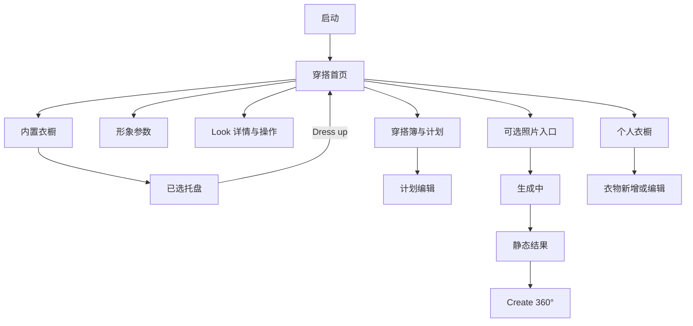
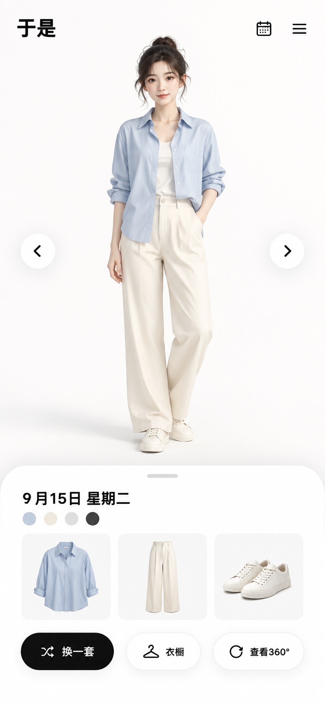
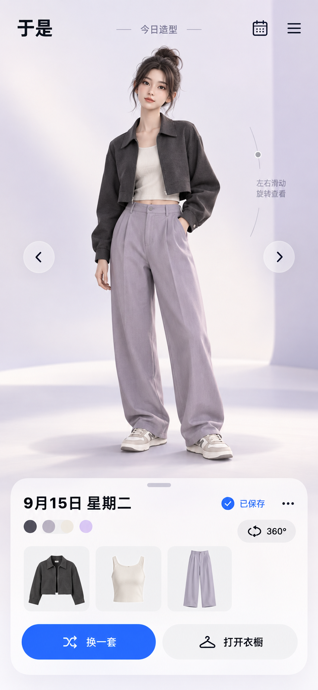
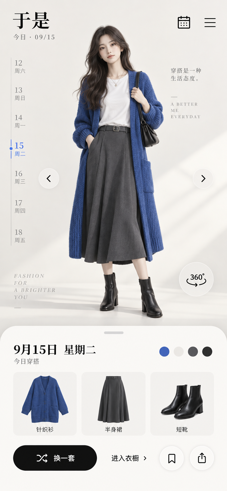

# Woo 页面与三维穿搭 UI 设计

## 状态与依据

- 信息架构与页面状态：`approved`。用户已确认无需上传即可使用虚拟形象换装，并要求参考 Woo 的可见页面、虚拟形象与 UI 完整设计。
- 视觉方案：`pending_selection`。三份可审阅视觉稿已固定，用户选定其中一份后才进入生产视觉代码和三维美术，不在未选定时混用风格。
- 参考事实：[Design 03 的 WOO-REF-01～09](03-OOTD产品总体设计.md#2026-09-14内置服装三维主路径与woo逐状态复刻)、[Design 13 的竞品与三维研究](13-三维虚拟形象与服装系统研究.md#2026-09-14核心需求定稿与建模深度分析)、[当前 App 五状态审计](03-OOTD产品总体设计.md#2026-09-15当前页面视觉审计与改造基线)。
- 产品事实：页面借鉴 Woo 已公开演示的层级与操作，不复制其品牌、人物、服装或未公开页面；“于是”使用自有或已授权资产。

## 设计目标

新安装、零账号、零照片、零用户衣物且断网时，用户能在同一会话完成：看到全身三维角色 → 浏览四类内置服装 → 形成有效选择 → Dress up → 多朝向观察 → 保存 Look。照片生成和 Create 360° 是同一产品中的可选增强，失败或未授权不削弱本地主路径。

页面围绕三个决定设计：今天穿什么、这套由什么组成、是否保存或计划。角色始终是首页唯一主视觉；业务状态使用可读文字和真实数据，不用装饰性动画、假进度或无效按钮代替功能。

## 产品导航与页面地图

根导航保持 Woo 可见的三项结构：左侧首页、中央可选照片动作、右侧衣橱。照片能力未达到门禁时，中央位置不放置可点击的假相机；使用同一间距布局保留首页和衣橱的稳定位置。日历从首页右上角进入，个人衣橱从内置衣橱的明确二级入口进入。

## 页面规格

### P01 穿搭首页

| 区域 | 内容与行为 | 状态要求 |
| --- | --- | --- |
| 顶栏 | 左侧“于是”字标；右侧日历与更多操作 | 44pt 点击区；不压缩品牌或依赖纯图标表达删除 |
| 三维主视口 | 全身人物居中，脚底和头顶均留安全区；水平拖动旋转 | 初始可交互前显示静态降级图与明确状态；加载完成原子替换，不闪空白 |
| Look 切换 | 人物左右两侧上一套/下一套 | 只切换真实已保存 Look；首尾禁用状态可感知，不循环制造不存在的记录 |
| 观察控制 | 正面、侧面、背面三个离散入口 | 与拖动共享同一 yaw 状态；最大字号可折叠为原生菜单 |
| 信息面板 | 日期、颜色摘要、关联衣物、收藏、分享、删除 | 日期来自 Look/计划事实；删除使用确认并完成真实数据操作 |
| 根底栏 | 首页、可选照片、衣橱 | 当前项有图标、文本或无障碍选中状态，不能只靠颜色 |

首页有五种可验收状态：默认内置 Look、未保存草稿、已保存 Look、渲染静态降级、加载失败可重试。不存在“空白角色”状态；没有用户 Look 时显示项目随包默认 Look。

### P02 内置衣橱与选择托盘

页面从上到下固定为顶部返回与标题、黑色已选托盘、Dress up、四类同页目录。TOPS、OUTERWEAR、BOTTOMS、SHOES 各自有标题、数量和紧凑网格；分类胶囊只负责滚动定位，不替代分组内容。

- 每张卡片展示服装缩略图、名称、选中标记和不可用原因。缩略图使用中性实色背景，完整呈现服装轮廓。
- 同槽位再次选择时原位替换；外套可选，上装、下装和鞋为当前必需槽位。一双鞋按一项计数。
- 托盘按身体顺序排列，移除操作与缩略图分离并保持 44pt 点击区域。移除后立即更新计数和 Dress up 可用性。
- Dress up 只在组合完整且全部资产已通过兼容矩阵时启用。提交成功后原子更新首页三维场景；失败保留上一套有效造型和当前草稿。
- 本地三维换装不显示 Refining/Styling；没有网络、账号或相册权限时行为不变。

### P03 形象参数

使用系统 sheet 覆盖首页下部，人物视口继续可见并即时预览。首版仅有肩部宽度和躯干厚度两项受控参数；UI 用“窄—标准—宽”“薄—标准—厚”表达，内部无单位值只作为无障碍值和诊断信息。

取消恢复进入 sheet 前的参数，完成提交当前草稿，恢复默认只恢复两项参数且需要可撤销。参数组合未经人物和全部已选服装验证时不给出可保存预览。

### P04 Look 详情与系统操作

详情与首页共享人物或结果主视觉，信息面板展开显示日期、颜色、来源、关联单品和保存状态。收藏、分享、删除分别有独立状态；系统分享必须提供真实图片或媒体，资源未准备好时说明原因并允许重试。删除完成后切换到相邻 Look 或默认 Look，不用“恢复默认”冒充删除。

### P05 穿搭簿、日期与计划

日历入口打开日期驱动的穿搭簿。默认聚焦今天；有记录的日期显示可访问标记，选择未来日期可新建计划，选择已有日期显示快照和编辑/取消/删除操作。模板 Look、计划穿和实际穿是三种不同状态，标签和操作保持明确。

辅助字号下日期控件、衣物卡和主操作改为单列；保存、取消计划和删除后把焦点移到结果标题，让 VoiceOver 和 UI 自动化都能确认最终状态。

### P06 个人衣橱与衣物编辑

个人衣橱与内置三维目录使用相同卡片节奏，但明确显示来源。用户可以无图新增、编辑、筛选、删除；照片是可选增强。没有可映射三维模板的真实衣物仍能用于记录和计划，卡片不显示伪造的可穿 3D 状态。

### P07 可选照片入口

入口先解释用途、本人且 18+、处理位置、保留与删除，再由用户主动选择系统相机或单张照片。取消、拒绝权限或质检失败均返回原页面并保留内置三维状态。页面不评价年龄、身体、肤色或吸引力。

### P08 生成中

深色背景、人物/照片预览、已选衣物和一个真实任务状态组成页面主体。Refining、Styling 等文案只映射服务端状态；显示取消、离开后继续和失败恢复。进度未知时使用不确定状态，不伪造百分比或完成时间。

### P09 静态试穿结果

全身结果是唯一主视觉，顶部关闭，底部提供保存、收藏、分享和删除。页面持续说明结果是视觉参考，不代表尺码、合身、垂坠、透明度或颜色。保存静态结果不会自动成为实际穿着。

### P10 Create 360°

入口只在已有合格静态结果、用户主动触发、成本/供应商/删除门禁通过后出现。生成完成后提供有限视角拖动或媒体播放、分享和删除；不得标注真实角度、真实背面或数字孪生。它与本地可编辑三维模型保持不同的内容类型和说明。

## 三维画布与人物设计

人物采用精致的风格化成人比例，姿态、画面占比和穿搭观感接近 Woo 公开演示；脸、发、手、鞋、衣领与服装层次在正侧背都可辨。首版身体保持站姿，无呼吸、眨眼、挥手、行走或循环表演。

- 相机固定全身构图和俯仰，只允许受限水平旋转；不提供自由缩放和飞行相机。
- 用户无操作时停止持续绘制；换装、参数和观察变化只更新当前场景。
- 衣物是独立蒙皮网格并与人物共享 `then-humanoid-v1` 骨架和形变合同。身体穿出、领口悬空、鞋脚交叉、接缝破裂或材质跳变均为资产失败，回到 Blender 母版修正。
- 每件衣物声明实际覆盖的 body regions；基础遮蔽始终存在。renderer 不通过放大衣物、关闭碰撞或替换体型做兼容兜底。
- 加载前验证 manifest、字节数、SHA-256、GLB 结构、索引、权重、骨架和允许扩展；加载失败显示当前 Look 的版本化静态图。

## 组件与视觉层级

共享组件保持最小集合：`AvatarViewport`、`ViewAngleControl`、`LookSummaryPanel`、`RootNavigationBar`、`GarmentSection`、`GarmentCard`、`SelectionTray`、`PrimaryActionButton`、`StatusNotice`、`ConfirmationSheet`。业务页面组合这些组件，不建立第二套设计系统。

人物和衣物使用清晰实色画布；Liquid Glass 只用于悬浮导航和操作层。主要操作每页最多一个高强调按钮。删除使用系统 destructive 样式，普通次要操作保持中性。阴影只表达浮层关系，不能用阴影弥补信息层级。

## 三个视觉方向

### 方向 1：Woo 黑白极简（推荐）

最接近 Woo 的白色摄影棚、黑色信息托盘、蓝色主操作和克制系统玻璃。角色与衣物颜色最容易准确判断，当前信息架构的改造量最小。

### 方向 2：柔紫三维工作室

保留相同功能与布局，使用柔紫空间层次强化数字形象氛围。需要额外验证衣物颜色偏移、玻璃叠加和深浅背景下的对比度。

### 方向 3：时装编辑时间线

更强调日期、Look 编号和穿搭记录，适合内容型穿搭簿。首页信息密度最高，与 Woo 极简主视觉的距离也最大。

三个方向只改变色彩、排版气质和装饰层级；页面地图、状态、业务行为、三维合同和无障碍标准完全相同。未选定前不拼接三个方向的局部元素。

## 动效与反馈

- 页面进入和 sheet 使用 iOS 原生转场；托盘选择、卡片选中和信息面板变化使用 160–240ms 的轻量反馈。
- Dress up 只在实际场景完成原子替换后结束忙碌状态；失败保留草稿并在操作附近显示可恢复原因。
- Look 切换不做循环轮播。三维转台由手势直接驱动，松手后短距离收敛，不持续自动旋转。
- Reduce Motion 下移除自定义位移、缩放和惯性，只保留淡入淡出或立即更新；VoiceOver 运行时不让三维手势抢占原生控件焦点。

## 无障碍与自适应

- 所有操作至少 44×44pt；文字支持 Dynamic Type，最大辅助字号时目录和信息卡改为单列，托盘成为页面内容而非遮挡浮层。
- 正侧背、选中、不可用、任务状态和删除结果有文字/无障碍值，不依赖颜色、形状或动画。
- 焦点顺序按品牌/标题 → 主内容 → 当前状态 → 主操作 → 次要操作；异步结果完成、取消或删除后主动聚焦结果标题。
- Reduce Transparency 使用不透明语义背景；Increase Contrast 保持边界、选中和主操作清晰。浅色/深色不改变衣物摄影棚的色彩判断基线。
- 静态降级图包含角色/Look 名称和“3D 预览暂不可用”，其保存、计划和删除操作仍可使用。

## MVP 实施顺序

1. 生产人物/服装资产、body-region 遮蔽和画布质量；通过正侧背、连续 yaw 和 54 组合视觉检查。
2. P02 四类同页目录、独立移除目标和真实 Dress up 状态；沿用现有领域选择事实。
3. P01 人物主视觉、信息面板和观察控件收敛；完成默认、草稿、已保存和降级状态。
4. P03 形象参数和 P05 穿搭簿视觉统一；复用已有业务逻辑，不改数据事实。
5. 照片生成、结果与 Create 360° 在各自供应商、隐私、成本和删除计划批准后实现。

前四项组成当前本地 MVP；第五项属于完整产品目标。视觉方案选择只决定生产外观，不改变以上依赖顺序。

## 设计验收清单

- [ ] 用户已从方向 1/2/3 中选定唯一视觉方案，选定稿和版本 SHA 写入执行计划。
- [ ] P01～P06 在标准字号和最大辅助字号各有同状态截图；参考与 App 使用同一视口比较。
- [ ] 新安装断网主旅程无需账号、照片、用户衣物或权限即可完成并在重启后恢复。
- [ ] 四类同页目录、托盘计数、同槽替换、逐件移除、组合校验和 Dress up 均绑定真实状态。
- [ ] 人物与全部发布服装通过正侧背、连续 yaw、体型采样和 body-region 遮蔽人工视觉检查。
- [ ] 分享、删除、保存、收藏、取消和失败重试执行真实动作，没有空页面、假按钮或定时器状态。
- [ ] Dynamic Type、VoiceOver、Reduce Motion、Reduce Transparency、Increase Contrast 和暗色模式通过交互验收。
- [ ] 模拟器完成布局与状态回归；最低支持真机完成帧时间、内存、热、WebContent/GPU 和文件保护验收。
- [ ] P07～P10 仅在各自功能计划通过时出现；未启用时导航无死入口。

## 变更与回滚边界

本设计不改变数据库、API、用户数据、照片同意或云任务合同。视觉实现按页面切片提交；若一页回滚，恢复该页布局和组件即可，不能保留新旧页面并行或增加兼容开关。三维资产问题回到可编辑母版修复，不能在 UI 或 renderer 留补丁分支。
