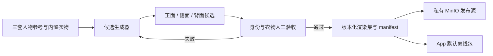
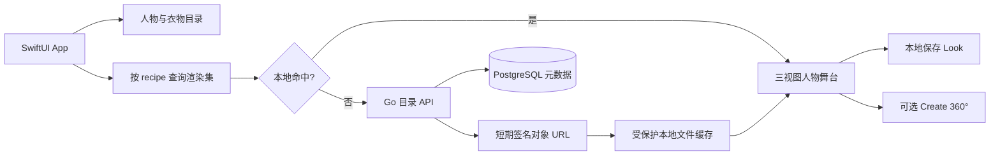

# Woo 立体数字衣橱技术路线研究与决策

## 状态与结论

- 文档状态：`approved`，研究截止 2026-09-15。
- 决策范围：Woo 可见体验、于是首版人物呈现、内置衣物换装、三向观察、结果保存及 Create 360° 的技术路线。
- 当前结论：**首版采用“受控人物预设 + 内置衣物目录 + 预生成并审核的多视角 Look 资产 + 原生 iOS 图片/视频呈现”**。它提供 Woo 式立体观感，但产品与技术文案必须明确其是多视角媒体，不宣称为可编辑三维网格。
- 停止项：停止继续制作 Blender 母版、GLB、骨架、蒙皮服装和 Three.js/WKWebView 生产接线。既有 11-02 工程 POC 只保留 no-go 证据，不再决定产品架构。
- 后续条件能力：Create 360° 使用独立异步短视频；用户本人照片试穿另行启用。只有连续任意角度观察或体型参数被验证为核心价值，才重新评估真实网格。

本决定取代 [Design 13](13-三维虚拟形象与服装系统研究.md) 中 Blender → GLB → Three.js 的生产定案，并由 [PRD 11](../prd/11-数字形象与照片采集需求.md) 与 [11-03 执行计划](../plan/11-03-Woo多视角形象与内置穿搭执行计划.md) 承接。

2026-09-15 的扩展市场复核进一步比较了 Whering、Acloset、Indyx、Stylebook、Alta、Doppl、Doji、DRESSX、Veesual、ZEPETO、Avaturn 及更多开源方案。结论未改变：数字衣橱、图片试穿和真实 3D 是三种不同产品/工程问题；于是先用零上传多视角 Look 提供即时价值，再连接真实衣橱和照片增强。完整矩阵与竞品研究 SOP 见 [Design 19](19-数字衣橱与虚拟试穿竞品研究.md)。

## 研究问题与证据规则

本轮先回答三个问题，再选框架：

1. Woo 公开演示实际证明了什么，哪些只是“看起来像 3D”。
2. 于是的用户价值是否要求运行时 mesh，还是要求人物一致、穿搭好看、可切换视角与可保存。
3. 哪条路线能以最小成本交付三套可爱人物、内置衣物和 Woo 页面，同时保留未来扩展。

证据按以下等级使用：

| 等级 | 含义 | 使用方式 |
| --- | --- | --- |
| A | 作者原帖、官方产品/框架文档、官方仓库和许可证 | 可作为事实与选型依据 |
| B | 本项目从公开演示保存的逐帧截图 | 可证明页面和交互结果，不证明内部技术 |
| C | 第三方转述、相似产品或视觉猜测 | 只用于提出假设，不写成 Woo 事实 |

无法从公开信息确认 Woo 的源码、模型供应商、渲染器、资产格式或后端。没有作者披露或可审计构建前，任何“Woo 使用 Blender/Unity/Three.js/某个扩散模型”的说法均为无证据猜测。

## Woo 可见事实与合理推断

一手来源是 [LerSent 原帖](https://x.com/LerSentAI/status/2090783821452943404)。原帖只称 Woo 为“立体数字衣橱”，没有称其为实时三维网格，也没有公开技术栈。逐帧证据见 [Woo 参考截图](evidence/woo/README.md)。

| 演示状态 | 可确认事实 | 可以形成的推断 | 不能据此确认 |
| --- | --- | --- | --- |
| Look 首页/详情 | 白色影棚背景、全身人物、左右箭头、底部信息面板 | 人物可能是透明背景图片或预渲染帧 | mesh、骨架、相机和材质系统 |
| 人物正面/侧面 | 点击左右控制后出现同一人物的不同朝向 | 离散多视角资产足以复现该行为 | 用户可连续拖动到任意角度 |
| 衣橱与选择 | 按类别浏览衣物并形成选择 | 选择结果可映射为 Look recipe | 衣物是否是 3D 网格或实时布料 |
| Styling | 有单独的异步处理中状态 | 服务端或本地生成并非瞬时完成 | 具体模型、队列和供应商 |
| 结果 | 结果为全屏人物图，提供收藏、下载、分享 | 主要消费物是栅格媒体 | 输出可被再次编辑为网格 |
| Create 360° | 结果后另有独立按钮 | 360 是派生生成任务，可能输出视频或帧序列 | 其一定是 3D 模型或可自由相机轨道 |

最符合公开画面的解释是“图像优先、按视角切换、按需生成短视频”。这是基于 UI 证据的工程推断，不是对 Woo 内部实现的反编译结论。

## 于是的当前产品需求

### 首版必须交付

1. 新安装用户不上传人物照片、不上传衣物、不创建账号，也能选择三套固定的可爱成人形象：短发粉色、双丸子头薄荷色、半马尾蓝色。
2. App 内置小型服装目录。首版固定两件上装、两件下装和两双鞋；只展示已经存在完整结果资产的有效组合。
3. 用户在同一页面选择人物和衣物，点击 Dress up 后看到一致的全身 Look，并能切换正面、侧面、背面。
4. 用户能保存、收藏、查看 Look 详情和穿搭簿；Look 保存的是人物 revision、衣物 ID 集合和渲染集 revision，不把图片当作衣物事实。
5. 随包提供三套默认 Look 的完整三视图，保证首次启动和离线至少能完成浏览与保存。其余已发布组合从私有对象存储下载后原子写入本地缓存。
6. 所有结果明确标注为视觉示意，不承诺尺码、合身、垂坠、透明度或颜色还原。

首版组合上限为 `3 × 2 × 2 × 2 = 24` 套 Look，每套三视图，共 72 张发布图片。包内只放 3 套默认 Look 的 9 张图片和目录缩略图；其余按 recipe 精确下载。新增衣物先新增已审核组合，不在客户端拼出不存在的结果。

### 完整 Woo 目标中的条件能力

- Create 360°：用户主动创建 5–10 秒 MP4，任务可取消、重试、删除；结果是动态媒体，不叫可编辑 3D。
- 下载与系统分享：只在对应媒体确实可用且数据/删除边界获批后启用。
- 本人照片试穿：用户主动选择本人成人照片后，通过独立同意和云端生成门禁启用；不影响无照片主路径。
- 扩充衣物目录：只有内容生产吞吐、应用下载体积和组合覆盖率达到门槛后增加。

### 首版非目标

- 不制作或运行 Blender/GLB/VRM 资产，不做骨架、蒙皮、动作重定向和布料物理。
- 不提供连续任意角度旋转、身体参数滑块、量体、尺码预测或数字孪生。
- 不在用户点击 Dress up 后临时调用生成模型；首版所有可选择组合必须已生成、审核并发布。
- 不用前后景 PNG 叠层冒充真实试穿；复杂遮挡、衣摆、手臂和头发关系必须在完整结果图中解决。
- 不把研究仓库的非商业模型或无明确许可代码接入产品。

## 技术路线比较

| 路线 | 视觉质量 | 首次响应 | 一致性 | 内容扩展成本 | 工程风险 | 结论 |
| --- | --- | --- | --- | --- | --- | --- |
| 客户端 2D 图层拼接 | 低；遮挡和衣褶不自然 | 极快 | 高 | 低 | 中 | 只可做骨架占位，不作为主视觉 |
| 预生成多视角 Look 矩阵 | 高，可逐张人工修正 | 极快 | 高 | 随组合数线性增长 | 低 | **首版选择** |
| 每次运行 VTON API | 高但有漂移 | 秒级到分钟级 | 中 | 目录扩展容易 | 供应商、成本、失败和隐私 | 本人照片或长尾目录阶段 |
| 多视角扩散 + NeRF/3DGS | 研究效果强 | 慢 | 中到高 | 高 | GPU、数据、许可和训练复杂 | 不进入 MVP |
| 人工制作 rigged mesh | 可控且可连续旋转 | 加载后快 | 高 | 每件衣物需适配 | 美术生产、穿模、性能 | 只有连续旋转被验证后复评 |
| 单图生成通用 3D mesh | 可快速得到静态物体 | 慢 | 低到中 | 后处理高 | 拓扑、骨架、衣物解耦缺失 | 不能直接解决数字衣橱 |

预生成矩阵解决的是当前真实问题：人物和衣物都由产品控制，组合数很小，质量比开放输入更重要。它把生成失败和人工修复移到发布前，使用户路径没有 GPU、排队和身份漂移。

## 开源项目与供应商核对

### 虚拟试穿

| 候选 | 能力与输入 | 许可证/产品限制 | 结论 |
| --- | --- | --- | --- |
| [FASHN VTON v1.5](https://github.com/fashn-AI/fashn-vton-1.5) | 人物图 + 平铺或模特衣物图，maskless；约 2 GB 主权重，另有姿态与约 244 MB 人体解析权重 | 主仓库 Apache-2.0；人体解析器继承 NVIDIA SegFormer 许可，仍需逐依赖复核 | 可做离线质量 POC；不直接进入首版运行时 |
| [FASHN API](https://docs.fashn.ai/) | Model Create、Try-On、Edit、Image-to-Video 均为异步任务 | 商业 API；默认 CDN 输出计划三天删除，Base64 输出状态保留 60 分钟；官方称客户内容不用于训练 | **首个内容生产 POC 候选**，只使用项目自有预设与目录素材 |
| [Google Virtual Try-On](https://docs.cloud.google.com/gemini-enterprise-agent-platform/models/capabilities/generate-virtual-try-on-images) | 人物图 + 商品图，返回 1–4 张 PNG | Google Cloud 托管；需项目、计费、地域与条款审查 | 作为第二候选对照，不是多视角或 360 方案 |
| [CatVTON](https://github.com/Zheng-Chong/CatVTON) | 轻量级图像试穿 | CC BY-NC-SA 4.0 | 商业产品 no-go |
| [IDM-VTON](https://github.com/yisol/IDM-VTON) | DensePose、人体解析与扩散试穿 | README 明确 CC BY-NC-SA 4.0 | 商业产品 no-go |
| [OmniVTON++](https://github.com/Jerome-Young/OmniVTON-PlusPlus) | 多输入条件，需 mask、pose、DensePose、parsing 等预处理 | CC BY-NC 4.0 | 商业产品 no-go，且不符合 MVP |

FASHN API 的 Model Create 可以使用 prompt、构图参考和可选 face reference 创建人物图，但它产生的是图片，不是持久身份对象。Edit 文档称可改变视角并尽量保持身份与商品；这只是候选能力，必须用三套人物和衣物矩阵实测，不能把供应商描述当成一致性验收结果。

### 多视角、动态与通用三维

| 候选 | 公开事实 | 结论 |
| --- | --- | --- |
| [VTON360](https://github.com/scnuhealthy/VTON360) | CVPR 2025 研究代码；需要多视角图、人体 mask、相机参数、定制 NeRF Studio/Splatfacto、CUDA 11.8，并分正背视图运行 | 仓库根 LICENSE 请求为 404；许可未明确前不可用于产品，系统复杂度也超过 MVP |
| [FASHN Image to Video](https://docs.fashn.ai/api-reference/image-to-video) | 单图生成 5/10 秒 MP4，480p/720p/1080p；当前生命周期为 Experimental | 可做 Create 360° 候选 POC，但文档只承诺时尚镜头/人物运动，不保证完整 360° 转台 |
| [Hunyuan3D 2.1](https://github.com/Tencent-Hunyuan/Hunyuan3D-2.1) | 图像生成带 PBR 的 GLB/OBJ 静态网格；仓库未检索到 rig/skeleton/skinning 能力 | 不直接生成可换装、可动画的角色体系；定制许可还有地域和规模条款，不进入当前路线 |
| [Three.js SkinnedMesh](https://threejs.org/docs/pages/SkinnedMesh.html) | SkinnedMesh 必须已有 skeleton、skin indices 和 weights；GLTFLoader 加载已制作模型，AnimationMixer 播放已有 clips | 它是 renderer，不是人物/衣物生成器；不能解决内容生产问题 |
| [AVFoundation](https://developer.apple.com/av-foundation/) | AVPlayer/AVPlayerItem 原生播放本地或远程视频，并以 item status 表达 ready/failed | 适合首版动态媒体，无需 WebView/游戏引擎 |

## 选定架构

### 内容生产平面

候选生成器首轮用 FASHN API 做质量/成本 POC，接口必须隔离在内容生产任务中。它不是用户运行时依赖，也不是永久供应商承诺。若质量不达标，可替换生成器或对单张结果做人工修正；已发布 manifest 和 App 契约不变化。

### 用户运行平面

用户浏览目录不依赖 Redis、RabbitMQ 或 GPU。PostgreSQL 保存发布元数据，MinIO 保存媒体字节；App 用 URLSession 下载并核验字节数与 SHA-256，再原子切换本地 revision。Redis 只在出现明确的跨实例缓存/限流需求时启用；RabbitMQ 只承接后续真实异步生成任务。

### iOS 呈现

- SwiftUI 负责页面、选中状态、三视图切换、保存和无障碍。
- PNG 保存母版与需要透明度的源；发布图片统一 WebP，服务端 manifest 声明像素、字节数、SHA-256 与背景策略。
- 视图切换只允许 `front`、`side`、`back` 三个稳定值；左右滑动做吸附切换，不实现假连续旋转。
- Create 360° 输出 H.264 MP4，通过 AVPlayer 播放；播放 readiness/failure 来自 AVPlayerItem 状态，不用定时器伪造。
- 默认 Look 随包；远程资产写入 Application Support 的受保护目录，LRU 只删除可再下载媒体，不删除 Look recipe。

### 最小领域模型

| 实体 | 必要字段 | 事实边界 |
| --- | --- | --- |
| `AvatarPreset` | `id`、`revision`、`name`、`thumbnailAssetID`、`status` | 三套固定人物身份，不含用户身体推断 |
| `CatalogGarment` | `id`、`revision`、`slot`、`name`、`thumbnailAssetID`、`status` | 产品内置衣物；不是用户已拥有衣物 |
| `LookRecipe` | `avatarPresetID`、各 slot garment ID、`recipeHash` | 可重建选择事实，不把文件 URL 当 ID |
| `LookRenderSet` | `recipeHash`、`pipelineRevision`、`status` | 只有 `published` 才能被用户选择 |
| `MediaAsset` | `view`、`objectKey`、`mime`、`width`、`height`、`bytes`、`sha256` | 对象字节与业务实体分离 |
| `GenerationJob` | `kind`、`inputRevision`、`status`、`attempt`、`providerRef` | 仅后续 Create 360°/本人照片生成使用 |

`recipeHash = SHA-256(avatarRevision + orderedSlotGarmentRevisions + pipelineRevision)`。同一 recipe 只能解析到完整且已发布的三视图集合；缺一张即不发布，客户端不得拿旧人物或旧衣物补图。

### 最小 API

| Operation | 用途 | MVP |
| --- | --- | --- |
| `GET /v1/avatar-presets` | 返回可用人物与 revision | 必须 |
| `GET /v1/catalog/garments` | 返回可用内置衣物 | 必须 |
| `POST /v1/look-render-sets:resolve` | 用稳定 ID 解析已发布三视图资产 | 必须 |
| `POST /v1/look-render-sets/{id}/turntable-jobs` | 创建 Create 360° 任务 | 后续 |
| `GET /v1/generation-jobs/{id}` | 查询异步状态和结果 | 后续 |
| `DELETE /v1/generation-jobs/{id}` | 取消/删除派生媒体 | 后续 |

Go 服务继续使用 Gin + Huma operation/Go struct tag 生成运行时 OpenAPI，并通过 Swagger 门户给前端/Umi 使用；不新增手工 YAML、生成脚本或第二套文档服务。

## 质量、成本与发布门槛

### 视觉检查

每个发布 Look 的三张图片都必须通过人工检查：

- 人脸、发型、肤色和身体比例与该 preset 一致。
- 上装、下装、鞋的颜色、领口、袖长、裤/裙轮廓和图案可识别。
- 三个视角没有多余肢体、手指破损、衣物消失、漂浮配件、背景跳变或裁切。
- 三视图衣物组合一致；不能用正面 A 款、侧面 B 款的近似结果。
- 成人但可爱的视觉方向成立，不复刻 Woo 的品牌、人物或衣物资产。

固定矩阵实行 `100%` 人工验收；任一严重缺陷都阻断该 recipe 发布。对生成模型跑分只作筛选，不能替代逐张产品检查。

### SMART 指标

| 指标 | 首版门槛 | 证据 |
| --- | --- | --- |
| 首次可见人物 | 随包默认 Look 在冷启动后 1 秒内可见 | iPhone 模拟器与最低支持真机 trace |
| 已缓存视图切换 | p95 小于 100 ms，无白屏 | UI 自动化 + signpost |
| 目录完整性 | 发布 recipe 的三视图、hash、字节数 100% 完整 | 后端/客户端契约测试 |
| 离线能力 | 三套默认 Look 可浏览、切向和保存，网络请求为 0 | 飞行模式重启录屏与抓包 |
| 视觉缺陷 | 24 套 × 3 视图严重缺陷为 0 | 双人审核表 |
| 缓存恢复 | 下载中断、hash 错误、低存储均保留上一有效 Look | 故障注入测试 |

### POC 选择门槛

FASHN、Google 或其他候选只使用项目自有的 3 套人物参考、2 套完整代表穿搭 recipe 与 3 个视角进行盲审，共产生 18 张候选图。每套 recipe 均含上装、下装和鞋，避免用单件衣物结果误判完整穿搭能力。记录成功率、身份一致性、衣物一致性、单图成本、端到端时延、可删除性和人工修复时间。首选候选必须同时满足：

- 18 个代表输出中严重缺陷为 0，非严重修复不超过 2 张。
- 同一人物三视图身份一致性经双人审核全部通过。
- 输入/输出保留、训练用途、地域和删除合同可接受。
- 单套三视图总成本和人工时间在内容预算内；实际预算由 POC 报告填写，本文不编造金额。

未达门槛时，不把失败模型包装进用户路径；缩小有效目录或更换内容生产方案。

## 连续三维重新准入条件

只有同时满足以下条件才重新建立 mesh 方案：

1. 用户研究证明连续自由旋转或体型参数直接提高核心 Look 保存/复用，而三视图不能满足。
2. 首版组合矩阵扩张使预生成与人工审核成本超过已批准预算。
3. 有可持续的原创/授权人物和服装生产能力，能处理 topology、rig、skinning、body coverage、LOD、材质和穿模。
4. 原生 RealityKit 与受控 Web renderer 在最低真机完成画质、内存、帧时间、发热、无障碍与崩溃对照。
5. 真实三维可以作为独立切片通过验收；不得把 Hunyuan3D 的静态网格或 VTON360 的研究结果直接当作可换装角色。

在这些条件关闭前，Blender、GLB、Three.js、VRM、Unity、Unreal、NeRF 和 3DGS 都不是生产依赖。

## 实施 SOP

1. **Evidence**：固定 Woo 逐帧、来源日期和已知/未知；新增证据必须说明是否一手。
2. **Requirement**：先只维护三套人物、六件衣物、24 套 Look、三视图和默认离线包；扩目录必须新增完整组合预算。
3. **Provider POC**：使用同一输入矩阵测试候选，锁模型/API 版本、seed、输入 hash、结果和费用；不处理真实用户素材。
4. **Art QA**：按 recipe 逐张双人审核；失败退回生成/修图，不发布部分视角。
5. **Publish**：写入 PostgreSQL 元数据和私有 MinIO，生成版本化 manifest；默认 9 张图随 App 包发布。
6. **Client**：先接 mock manifest，再接真实目录/下载；只在完整 hash 验证后切换渲染集。
7. **Acceptance**：执行离线、缓存中断、坏 hash、删除、最大字号、VoiceOver、模拟器与最低真机验收。
8. **360**：静态主线通过后，单独比较视频候选；只有确实能稳定完成约定转身并通过删除/成本门槛才上线。

## 主要风险与处理

| 风险 | 根因处理 |
| --- | --- |
| 人物跨视角漂移 | 固定 reference、seed 和 pipeline revision；逐套审核，不让客户端临时生成 |
| 组合爆炸 | 首版固定 24 套；只有已经完成结果资产的组合才能选择 |
| 远程资源不可用 | 默认 Look 随包；下载原子缓存并保留上一有效 revision |
| 供应商停服/涨价 | 供应商只用于内容生产；发布资产和 manifest 归本项目控制 |
| 将视频宣传成 3D | UI、API 和文档统一使用 `multiview`、`turntableVideo`；只有真实 mesh 才使用 `3dModel` |
| 非商业/不明许可 | CatVTON、IDM-VTON、OmniVTON++ 和许可不明 VTON360 不进入产品 |
| 生成素材权利不清 | 只使用项目自有/已授权人物与服装参考，保存来源、版本、条款和人工修改记录 |

## 一手资料

- [Woo 原始演示](https://x.com/LerSentAI/status/2090783821452943404)
- [FASHN VTON v1.5 官方仓库](https://github.com/fashn-AI/fashn-vton-1.5) 与 [Apache-2.0 LICENSE](https://github.com/fashn-AI/fashn-vton-1.5/blob/main/LICENSE)
- [FASHN API](https://docs.fashn.ai/)、[数据保留](https://docs.fashn.ai/api-overview/data-retention-privacy)、[Model Create](https://docs.fashn.ai/api-reference/model-create)、[Edit](https://docs.fashn.ai/api-reference/edit)、[Image to Video](https://docs.fashn.ai/api-reference/image-to-video)
- [Google Virtual Try-On](https://docs.cloud.google.com/gemini-enterprise-agent-platform/models/capabilities/generate-virtual-try-on-images)
- [CatVTON](https://github.com/Zheng-Chong/CatVTON)、[IDM-VTON](https://github.com/yisol/IDM-VTON)、[OmniVTON++](https://github.com/Jerome-Young/OmniVTON-PlusPlus)
- [VTON360](https://github.com/scnuhealthy/VTON360)、[Hunyuan3D 2.1](https://github.com/Tencent-Hunyuan/Hunyuan3D-2.1)
- [Hugging Face Diffusers inpainting](https://huggingface.co/docs/diffusers/using-diffusers/inpaint)、[model offload](https://huggingface.co/docs/diffusers/optimization/memory)
- [Three.js SkinnedMesh](https://threejs.org/docs/pages/SkinnedMesh.html)、[Animation system](https://threejs.org/manual/en/animation-system.html)
- [Apple AVFoundation](https://developer.apple.com/av-foundation/)
