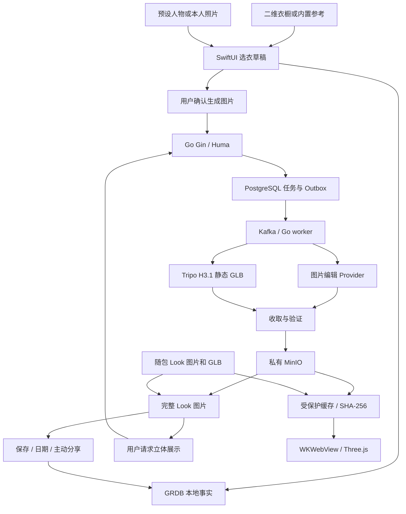

# OOTD 完整产品能力与阶段架构设计

更新：2026-09-22。**设计 `approved`；低成本 Look 链路实施 `pending`。** 用户已授权按调研全面替换设计。本文件是完整产品范围与阶段架构事实源，技术版本归 [Design 01](01-技术选型.md)，稳定需求归 [PRD 10](../prd/10-OOTD产品需求.md)，任务和证据分别归 [Plan 10](../plan/10-OOTD产品实施计划.md) 与 [Acceptance 10](../acceptance/10-OOTD产品系统验收.md)。

## 产品决定

于是帮助用户记录和复用穿搭，以 Woo 风格的完整人物 Look 提供直观展示。最低成本实现固定为：**二维衣橱与选衣 → 完整穿搭图 → 按需整套静态 GLB → Three.js 查看 → 保存、记录与复用**。图片产出后就有独立价值，模型是该图片版本的可选派生物。

换一件衣服时，先编辑选衣草稿，再生成新的完整 Look 图片；用户满意并要求立体展示时，才生成该版本的模型。展示时旋转模型或相机，无须额外调用绑骨、动作、分割、补全或 AI 视频。此方案降低首版内容制作、资产兼容和持续推理成本，代价是新组合需要异步生成，不能承诺即时逐件三维换衣。

三套成人人物预设的美术方向保留：短发粉色、双丸子头薄荷色、半马尾蓝色。先验一套代表 Look，再制作每人物两套完整 Look，共六套首批内容；三套人物各至少一个默认 Look 的图片和 GLB 随包。旧的三人物×两上装×两下装×两鞋、24 组合/72 三视图不再是交付矩阵。内置 Look 切换离线即时，任意新组合的云生成需要网络与相应准入。

## 目标用户与价值判断

优先服务希望轻量记录 OOTD、尝试已有衣物组合的 iPhone 用户；穿搭爱好者的分享与社区是后续回访场景。首次使用不要求建完整衣柜、登录或提供本人照片。

| 用户任务 | 当前产品解法 | 成功证据 |
| --- | --- | --- |
| 先看看效果 | 随包完整 Look 图片与可旋转模型，选择另一套并保存 | 首次会话保存及重启恢复；零照片/登录/网络前置 |
| 整理已有衣物 | 手工或单件照片录入，最小字段即可保存 | 单件录入耗时、实际确认率；未知属性不补值 |
| 试一个新搭配 | 选择人物参考与已支持衣物，主动生成完整穿搭图 | 衣物与人物保持、可接受结果率、真实等待与成本 |
| 查看立体效果 | 对已确认图片主动生成 GLB，复用缓存 | 连续观察、同版本不重复计费、失败仍可用图片 |
| 记住和复用穿搭 | Look、计划、实际穿着、反馈和日记分别保存 | 历史恢复一致；只有明确记录产生穿着事实 |

早期核心指标为“首次保存 Look 的用户比例”和“每周再次保存或记录真实穿搭的用户比例”；真实衣橱分支继续观察推荐后的实际穿着及明确反馈。图片通过率、三维主动生成比例、每个用户保留结果的成本、删除失败率单列。以上是指标定义，没有基线数值或增长承诺。

## 当前批准范围

| 能力 | 本次决定 | 实施边界 |
| --- | --- | --- |
| 内置 Look | 零账号/零上传/离线浏览、整套切换、图片/模型观察、保存/收藏/日期回看 | 11-05；先单套纵切再扩六套内容 |
| 真实衣橱 | 二维照片、元数据、状态、编辑/删除，内置来源与用户拥有分开 | 12 系列已有部分实现；不逐件生成 3D 衣物 |
| 完整穿搭图 | 一个人物参考加支持范围内的选衣快照，明确点击才上传/生成 | 14-01；先验证单路线多参考保真，未经验证类别不可承诺 |
| 按需立体 | 一个图版本对应可选整套静态 GLB，旋转/缩放/复位 | 14-01 云任务 + 11-05 本地展示；图片链路独立可用 |
| 推荐与记录 | 真实可用衣物、可解释最多三套、计划/实际/反馈分离 | 延续 13/16 系列，不依赖生成结果 |
| 日记与社区 | 私人图文日记、明确公开、审核与互动治理 | 19 系列已确认；后端局部完成不等于客户端或运营已发布 |
| 账户与同步 | 现有账户/媒体能力复用；App 接入实际所需网络能力 | 用户云生成需认证；完整跨设备合并另立切片 |
| 导出分享 | Look 图片可由用户主动保存至相册/系统分享；来源权利与个人素材用途明确 | 无需 GLB 成功；不自动发布社区或创建公开链接；未完成前隐藏入口 |
| 视频和高级人物 | 独立视频导出、AI 360 视频、模块衣物、体型、眨眼/注视、骨骼动作 | deferred；不是匹配本轮 Woo 可见效果的首发阻断项 |

不新增商城、广告、订阅收费、任意 GLB 上传、量体/尺码服务、实时布料或通用 AI 工作流平台。保留衣橱、推荐和社区的已有需求，不为展示技术变更重做已完成后端切片。

## 页面与完整用户旅程

导航采用“今日、衣橱、穿搭簿”，账户从头像进入；社区客户端和治理可用时增加“发现”。照片和“新建穿搭”是动作，不是空内容 Tab。组件、留白和视觉 token 沿用根 DESIGN.md，详细状态归 [Design 17](17-Woo页面与三维穿搭UI设计.md)。

1. **首次体验**：今日显示随包 Look 图片，点击“查看立体”加载已有本地模型，切换整套 Look、保存日期/收藏；断网不出现生成进度。
2. **创建草稿**：从内置参考或我的衣橱选衣；选择预设人物或主动准备本人照片。无图衣物可留在结构化搭配里，只有合格图片才能提交视觉任务。
3. **生成图片**：显示实际处理方、发送素材、用途和费用/额度，确认后提交；可离开、恢复、取消。新图独立成 revision，失败保留草稿及上一结果。
4. **核对结果**：同时可看原始衣物参考；保存、收藏、关联日期或主动分享图片。AI 图不覆盖真实衣物属性，也不自动记录已穿。
5. **按需生成立体**：仅点击“生成立体展示”才创建模型任务；已有同版本模型则直接“查看立体”。等待与失败保留图片，允许稍后查看和明确重试。
6. **查看与复用**：模型连续旋转、有界缩放、复位；下一次加载相同校验版本的缓存。更换衣物产生新图、新模型绑定，不让旧模型冒充新造型。
7. **记录与删除**：保存 Look、计划、实际穿着、日记是独立动作；删除 Look 隐藏图片/模型并清理派生物，真实衣物和独立记录按删除影响合同保留。

## 最小实现架构

SwiftUI + Observation 拥有页面、草稿、任务反馈和保存行为；Three.js 只收取已验证模型句柄与观察命令。GRDB 保存本地业务数据，媒体字节独立受保护存放。Go 沿用现有单 module、单二进制、api/worker/all 和 Gin/Huma/GORM；PostgreSQL 保存任务、媒体、幂等和删除事实。Kafka + Outbox/Inbox 负责可靠唤醒，worker 不占用 HTTP 请求等待供应商完成。首片使用状态轮询，不引入 WebSocket、独立 Python/GPU 服务或新工作流引擎。

运行时 OpenAPI 是唯一接口声明，业务表只在获准实现时增加 GORM record/集中 AutoMigrate；本文的概念对象不构成第二份 DTO/schema。当前已有媒体事件 worker，**尚无真实图片/Tripo 生成 worker，App 也尚无已启用云端 Client**。

## Look、资产和任务合同

| 概念 | 最小责任 | 不变量 |
| --- | --- | --- |
| `WardrobeItem` | 用户确认拥有的衣物及属性、状态 | 图片/模型不能创建拥有关系或改写事实 |
| 内置目录 | 只读人物、衣物参考与完整 Look | 每个条目标明来源和版本；不写入用户衣橱 |
| `Look` | 稳定 ID、当前 revision、日期/原时区、收藏 | 与 `OutfitPlan`、`WearEvent`、Diary 独立 |
| `LookRevision` | 人物参考版本、选衣快照、图片资产及可空模型资产引用 | 发布后输入与图片不可变；改选衣或改图创建新版本；生成尝试不必创建新 Look |
| `GenerationJob` | image/model 两种用途、owner、输入版本、Provider/model/参数、状态、外部任务 ID、费用 | 一个任务只生成一种结果；后续视频有独立用途 |
| `MediaAsset` | image/GLB、用途、owner、内容摘要、字节数、存储版本、血缘与删除状态 | 不保存供应商临时 URL 作为长期业务引用 |

模型绑定与去重键包含 **owner、Look ID、Look revision、图片 SHA-256、Provider model 和规范化参数**。不跨用户共享私人照片缓存。同一版本重复点击返回已有有效任务/模型；用户明确重新生成才能形成新尝试，费用再次可见。旧任务完成只能归属其原 revision，不自动覆盖当前画面。

任务状态采用 `queued → running → validating → succeeded`，并有 `failed/canceled/expired` 终态；取消请求、外部取消确认和删除清理状态独立保存。返回 202 只表示任务被接纳。供应商提交超时且不确定是否已接纳时，先按外部任务标识或可用查询对账；不能盲目重提造成二次计费。供应商不支持可靠幂等/查询时，管理员可经专用入口按状态 revision 和非敏感证据编号核对受理结果；任务状态、额度结算和审计记录原子提交。确认受理时补录外部任务 ID 并进入既有迟到清理；确认未受理时终结为失败，已取消/撤销任务则终结为 canceled。该流程不自动重提或查询 Provider。

取消/删除后即刻阻止结果可见，保留 worker 清理依据；迟到结果只进入清理，不能复活。费用按供应商实际已计费与本产品额度分别记录，取消不承诺供应商退款。图片删除覆盖以其为源的模型；只删除模型可保留图片。账号删除需等待可达对象清理收敛，复用现有可靠删除流程。

## 静态 GLB 交付合同

首轮 H3.1 `v3.1-20260211`，standard texture、triangle，约 20,000 面作为实验起点。关闭 rig、retarget、parts、quad、额外智能低模选项；优先普通 GLB 和已支持 PBR 材质/内嵌 PNG/JPEG。无骨架、无动作、无可编辑衣物也可通过“整套立体展示”，但不记为模块换装通过。

原生 validator 改为版本化完整 Look 合同：允许实际需要的多 mesh/material 和内嵌纹理；验证 GLB 长度、buffer/accessor 边界、有限坐标、贴图尺寸/解码预算、索引、声明字节数与 SHA-256。拒绝外部 URI、未知必要扩展和超预算文件；不靠关闭校验接入。压缩扩展只有在配套解码器及设备收益验证后启用。模型整套校验、加载成功后原子替换，失败保留上一有效画面。

2026-09-25 后端结果校验采用 `github.com/qmuntal/gltf` v0.29.0（BSD-2-Clause）解析 GLB，再由 Then 对现行静态输出 profile 执行业务约束；该库用于解析和 accessor 读取，不作为完整 glTF 合规 validator。应用层固定版本读取 MinIO 对象后复算 MIME/字节数/SHA-256，图片要求有界解码且经标准 JPEG 重编码净化；模型要求单 BIN 内嵌 buffer/纹理、无动画/skin/morph target/外部 URI/required extension、有限坐标、纹理最长边 ≤2048 且累计解码像素 ≤24 MP、三角形数在准入目标内。Khronos glTF Validator 的完整合规报告、正式资产及设备验收仍待 POC/发布门禁，静态 profile 通过不等于完整标准或生产验收通过。

本地业务链路验证可使用 `fixture` 合成静态 GLB，从已发布图片创建模型任务并复用相同的校验、私有存储和血缘规则；合成 GLB 不代表 `img2threejs` 输出、人物 Look 质量或生产素材。

当前单文件 2 MiB、单 mesh/skin/material、禁止 images/textures 的工程规则不能直接用于带纹理 Tripo GLB。初次代表验证使用**准入目标**：每模型 ≤10 MiB、纹理最长边 ≤2048、总三角形 ≤50,000、每次仅一个活动模型；不是已实测生产预算。若不满足，先记录原始体积、解码内存和最低真机表现，再决定减少贴图/面数或调整目标；禁止悄悄放开。相机按包围盒归一化取景，缩放不改体型；不要求固定骨数或现有体型 morph。

设备目标：缓存命中后的模型可交互时间 p95 ≤2 秒，持续拖动至少 30 fps，后台/不可见停止渲染，10 分钟反复切换无持续内存增长或崩溃。必须记录最低 iOS 26 真机型号、系统、资产 hash、测量方法和样本数；目前均为待验证目标，模拟器不抵扣。

## 供应商选择与成本

2026-09-22 已通过 GitHub、Context7、Firecrawl 与官方网页核查能力和价格，未发起付费生成。模型展示首选验证 Tripo；图片先验证其托管 Seedream v5。API 接收多图不等于同时保留所有衣物细节，先做授权参考集质量验证，失败才对照 FASHN 等专用 VTON；禁止无提示换供应商或地域。

| 调用 | 官方按量价，USD | 本路线用途 |
| --- | --- | --- |
| Seedream v5 基础图片编辑 | 5 credits = $0.05/次 | 多参考完整 Look 图片候选，最多四个参考输入 |
| Tripo H3.1 standard texture | 30 credits = $0.30/次 | 已确认图片 → 整套静态 GLB；标准纹理已包含 |
| H3.1 无纹理 / detailed texture | $0.20 / $0.40 | 对比项，默认不采用无纹理人物 |
| smart low-poly / auto rig / retarget | +$0.10 / $0.25 / $0.10 每动作 | 首片不调用 |
| FASHN v1.6 | $0.075/成功输出；API 最低充值 100 credits = $7.50 | 单类服装保真对照，不能据此承诺任意多件及鞋包 |

价格来源：[Tripo API](https://developers.tripo3d.ai/en/pricing)、[H3.1](https://developers.tripo3d.ai/en/models/v3-1)、[FASHN API](https://help.fashn.ai/plans-and-pricing/api-pricing)。价格有时效，真实调用前复核账单规则。

一次成功图片 + 一次成功 GLB 的调用成本为 **$0.35**；已有合格图片只生成 GLB 为 **$0.30**。六套各一次成功约 $2.10，仅是调用额，不是充值门槛、人工成本或生产资产总成本。以 1,000 个图片结果、10% 主动生成 3D 的假设估算，调用额约 $80；全部生成约 $350。10% 是测算假设，不是用户数据。

实际可保留结果成本按 `N × (0.05 × r_image + p_3d × 0.30 × r_model)` 计算；r 是每个可保留结果对应的实际计费尝试次数。另计上传下载、对象存储、缓存、失败清理、税费、人工审核及固定服务成本。预算控制依赖明确触发、版本去重、配额预留、已计费对账和上限停止，不依赖无限重试。

## 质量验证与发布判断

先做一套原创/授权完整人物参考的 GLB，核对正侧背及连续观察：脸/发型、四肢、衣物数量、款式/图案、鞋与发丝、遮挡及背面合理性。背面是生成推断，界面不得宣称真实扫描。明显肢体错误、衣物丢失、身份严重改变或意外裸露为单样本不通过，不能被平均分掩盖。

代表包通过后扩大到六套完整 Look，再做至少 12 组授权图片生成输入，覆盖单件替换、多件组合、浅深色/图案/裙装/鞋、复杂轮廓和失败输入。冻结随机种子或记录不可控项，最多两次计费尝试/样本作为 POC 止损建议；需要更多先复核收益与预算。记录全部尝试，包括失败和丢弃，不只展示最好的图。小样本通过只允许进入受控集成，不足以宣称生产人群质量。

Tripo [API 条款](https://developers.tripo3d.ai/en/terms) 区分免费/付费产物权利，且向终端用户提供生成服务存在事先书面许可要求。内部制作内置资产、允许分发 GLB、用户照片处理、终端生成服务分别核实，付费不自动满足所有用途。处理地域、素材保留/删除、真实照片同意沿用 Design 11；未闭合时仅允许授权合成素材的隔离验证，内置离线路径仍可独立推进。

## 当前实现与迁移差距

2026-09-22 源码审计只代表当时工作树；已有后端工程整理按对应 17/19 计划继续，以其验收为准。

| 当前事实 | 目标增量 | 完成证据 |
| --- | --- | --- |
| 一套工程人物、六件模块衣物；八个 GLB 无内嵌纹理 | 整套模型目录、静态回退、三预设六 Look | 发布 manifest 与人工视觉 |
| 原生 validator 拒绝纹理并锁定现有 rig | 带纹理静态 GLB 安全校验与预算 | 合法/坏包、超限与真机解码 |
| JS 支持模型加载/旋转和微动 | 整套原子切换、缩放/复位、资源释放 | 实际画布交互与生命周期 |
| 造型/收藏主要为内存状态 | GRDB Look/revision 保存、恢复、删除 | 重启、事务故障和不复活 |
| 衣橱、计划、实际记录与反馈已有局部实现 | 与 Look 关联但保持事实分离 | 计数、owner、快照与删除影响 |
| 账号/媒体/队列已有后端基础，App 未接云 Client | 两类真实生成任务与必要 App 请求 | 同意、幂等、对账、收取、取消/删除 E2E |

当前工程微动和既有自动测试继续作为回归证据；不把工程模型、官方样例、API 文档或研究结论记为新路线已实现。

## 阶段、投入与退出

| 顺序 | 交付结果 | 退出条件 / 执行 |
| --- | --- | --- |
| 1 代表 Look | 一张好看的完整图 + 一个可加载旋转的 GLB | 来源可用、画质与资源目标可达；11-05 GATE |
| 2 离线闭环 | 单套保存/恢复/删除，再扩三人物六 Look 与页面 | AVATAR-ACC-029/030；11-05，图片输出不作为本片前置 |
| 3 按需云生成 | 完整图先用、模型按需、重复复用、失败恢复、主动图片输出和删除 | TRYON-ACC-011/012、CLOUD-ACC-012、AVATAR-ACC-031；14-01，App账号前置17-30 |
| 4 日常与公开体验 | 推荐/记录、日记、社区、同步按已定模块补齐 | 各领域原有验收；已有后端工作不重复 |
| 后续独立 | 视频导出/AI 视频、模块换装或眼部动作 | 有明确价值与独立资产/成本合同后排期 |

初步投入估算：代表资产 1–2 人日，离线 UI/Look/renderer 5–8 人日，云任务和 App 接入 6–10 人日，整体验收 3–5 人日；合计约 15–25 人日，假设熟悉现有工程且复用后端基础。供应商许可、正式内容反复制作、最低真机等待和社区客户端不包含；这不是交付日期承诺。先在代表资产检查点调整估算，不为省成本越过真实失败和删除处理。

现行设计的详细功能/NFR/验收已拆至[PRD10](../prd/10-OOTD产品需求.md)，工作依赖和步骤归[Plan10](../plan/10-OOTD产品实施计划.md)。13-02补推荐调整与保存，17-30建立App账号访问，19-07/08分别交付私人日记和社区客户端；这些新增明确的工作包须在开工时重新估算，不能继续把上面的Look粗估当完整产品总工期。

## 替换关系与研究入口

旧 P1 多视角渲染集与 P5 模块人物并行路线已由本设计取代；不再保留另一套“proposed 的当前建议”。11-03 原内容准备记录保留，剩余全组合制作退役；11-04 已验证微动保留，眼部后移；11-05 原地改为整套 Look 闭环，14-01 承接用户按需生成。

[Woo 可见证据与路线决定](18-Woo立体数字衣橱技术路线研究与决策.md)、[竞品和代码审计](19-数字衣橱与虚拟试穿竞品研究.md)、[Tripo / img2threejs / Three.js 证据](threejs-avatar-research.md)、[WebGPU 评估边界](webgpu-avatar-assessment.md)。研究说明为什么选择本路线，不能另立当前架构或发布结论。
