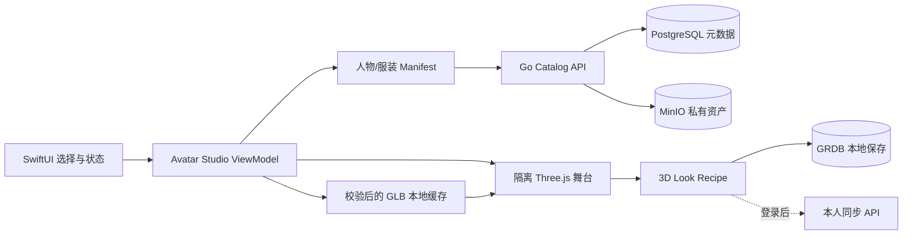

# OOTD 完整产品能力与阶段架构设计

## 状态与适用范围

- 文档状态：`approved`
- 决策日期：2026-09-15
- 关联需求：[PRD 10](../prd/10-OOTD产品需求.md) 与 PRD 11–18
- 关联计划：[产品实施计划](../plan/10-OOTD产品实施计划.md)
- 关联验收：[产品系统验收](../acceptance/10-OOTD产品系统验收.md)

本文修正此前把“第一个 MVP 切片”误写成“完整产品能力边界”的问题。完整产品必须在设计阶段定义清楚用户流程、页面、状态、数据、API、隐私、失败恢复和验收；工程仍按 MVP 顺序逐段实现，未进入当前切片的能力不预建空页面、空表或空服务。

于是的完整产品不是单一的三视图样片，也不是只做真实衣橱管理。它是一个以 Woo 式可爱人物和视觉结果为入口、以真实衣橱和每日决策为长期价值、同时提供本人 AI 试穿、360° 动态结果和可交互真 3D 的完整 OOTD 产品。

## 产品承诺

用户可以从零数据立即开始，也可以逐步建立自己的长期数字衣橱：

1. 不上传本人照片或衣服，直接选择可爱人物和内置服装，完成一次穿搭并保存。
2. 添加自己的衣物，得到基于真实拥有、可用状态、场景和反馈的搭配建议。
3. 主动使用本人照片生成 AI 试穿结果，并在结果页继续生成 360° 动态预览。
4. 在真 3D 模式中旋转、缩放人物，切换经过适配的服装和展示动作。
5. 把决定保存为计划，记录实际穿着和穿后感受，并在多设备间恢复本人数据。

三视图、短视频和真 3D 是三个不同的结果类型。它们共享人物、衣物和 Look 身份，但不互相冒充：

| 层级 | 用户看到的内容 | 结果类型 | 完整产品中的职责 |
| --- | --- | --- | --- |
| 多视角 Look | 正面、侧面、背面 | 已审核图片集合 | 零上传、离线、快速可靠的首次价值 |
| Create 360° | 5–10 秒转身或转台效果 | 视频 | 可保存和分享的动态视觉结果 |
| 交互式真 3D | 连续旋转、缩放、换装、短动作 | 具有实体层级、骨架和动画的 3D 场景 | 角色自定义和持续交互体验 |

## 完整产品能力地图

| 能力域 | 完整产品必须具备 | 第一交付切片 |
| --- | --- | --- |
| 首次使用 | 零账号、零上传、断网可进入默认人物并完成一次穿搭 | 是 |
| 人物工作室 | 三种 Woo 式可爱人物方向；保存人物身份；多视角、视频和真 3D 使用同一人物语义 | 先交付三套预设和多视角 |
| 探索衣橱 | 内置服装按类别浏览、筛选、组合、收藏并形成 Look | 是，固定六件衣物 |
| 我的衣橱 | 手工建档、单图导入、编辑、归档、洗衣/借出状态、删除和历史快照 | 分阶段接入 |
| 智能搭配 | 基于拥有衣物、场景、天气、偏好和穿着历史产生少量可解释结果；支持锁件和换一件 | 分阶段接入 |
| 本人试穿 | 本人照片与所选服装生成视觉结果；清楚说明非尺码/面料保证 | 云阶段 |
| 动态结果 | 从已确认的静态结果主动创建、取消、重试和删除 360° 视频 | 云阶段 |
| 真 3D | 原生 3D 舞台、连续观察、服装槽替换、展示动作、加载与失败状态 | 独立 3D 阶段 |
| 计划和记录 | 今日/未来计划、实际穿着、反馈、历史回看、编辑和删除 | 分阶段接入 |
| 账号和同步 | 注册/登录、本人资料、会话、跨设备同步、冲突处理和账户删除 | 云阶段 |
| 结果管理 | 收藏、下载、系统分享、删除和来源/版本说明 | 随结果类型逐步开放 |
| 隐私和控制 | 分目的同意、私有资产、血缘、可撤回、可验证删除、日志脱敏 | 每阶段前置 |

社交动态、创作者市场、真人造型师交易、联盟购物、广告和订阅属于增长或商业化扩展。它们不是判断当前 OOTD 核心产品是否完整的条件；在核心留存得到证据前，只保留业务边界，不建设实现占位。

## 信息架构与页面合同

App 保持三个一级入口，避免同时维护两套导航：

| 一级入口 | 页面与职责 |
| --- | --- |
| 今日 | Woo 式人物主页、左右切换已保存 Look、日期回看、今日建议，以及人物/穿搭创建主操作 |
| 衣橱 | 内置探索衣橱与我的衣橱分区、单品详情、筛选、状态、录入和删除 |
| 穿搭簿 | 已保存 Look、计划、实际穿着、反馈、收藏和历史详情 |

完整页面集合如下：

1. 启动与首次引导：说明零上传可用，直接进入默认 Look。
2. Woo 式人物主页：品牌、日期、人物舞台、左右切换、主操作和底部导航。
3. 人物选择页：三套人物方向、选择草稿、保存、取消和恢复默认。
4. 衣物分类页：上装、下装、鞋和后续外套/连衣裙/配饰；探索衣橱与我的衣橱来源清晰。
5. 选择托盘：当前人物、已选槽位、冲突说明、撤销和 Dress up。
6. 多视角结果页：正/侧/背、保存、收藏，以及条件启用的本人试穿与 Create 360°。
7. AI 处理页：输入摘要、真实任务阶段、取消、离开后恢复和失败重试。
8. 动态结果页：视频播放、保存、下载、分享和删除。
9. 真 3D 工作室：旋转、缩放、服装槽、动作、相机复位、加载进度和静态回退。
10. 我的衣橱：列表/网格、录入确认、编辑、状态、归档和删除影响确认。
11. 推荐与计划：场景、天气、必须穿、候选解释、锁件、换件、日期和保存。
12. 穿搭簿：计划、实际穿着、反馈、收藏与历史详情。
13. 账户与隐私：App 内账号、会话、同步状态、用途同意、数据导出和删除；P6 的 Web 自助账户页复用同一 OpenAPI，不建立第二套账户逻辑。

Woo 公开演示只约束其可观察页面和交互。未公开页面采用同一视觉语言与本产品信息架构设计，不宣称是 Woo 的隐藏页面。

## 核心端到端流程

### 零上传首次价值

`启动 → 默认人物 → 选择内置衣物 → Dress up → 原子切换完整多视角 Look → 切换视角 → 保存`

- 默认三套 Look 随包，断网仍可完成。
- 只有完整发布的 recipe 才可选择；缺少任何视角时保持上一有效结果。
- 保存的是 Look 和日期，不自动产生“用户拥有”或“实际穿着”事实。

### 真实衣橱长期闭环

`添加衣物 → 确认属性 → 设置场景/约束 → 查看最多三套推荐 → 锁定或换一件 → 保存计划 → 确认实际穿着 → 反馈`

- 推荐只使用用户确认拥有且当前可穿的衣物。
- AI 推断是建议，用户未确认的属性保持未知。
- 删除衣物时明确处理未来计划和历史快照，不能静默破坏历史。

### 本人 AI 试穿

`选择本人照片 → 本人/18+声明 → 选择衣物 → 确认云处理目的 → 创建任务 → 结果检查 → 保存或删除`

- 端侧先做安全解码、必要裁切和元数据净化。
- 生成失败不改变已保存 Look、衣橱、计划或真 3D 状态。
- 结果标识 Provider、模型/管线版本和“视觉参考”性质。

### Create 360°

`已确认静态结果 → 创建 360° → 异步处理 → 播放 → 下载/分享/删除`

- 360° 只能从已确认静态结果创建。
- 视频任务与静态任务分别计费、取消和删除。
- 视频不能标记为真 3D，也不能替代真 3D 验收。

### 交互式真 3D

`进入 3D 工作室 → 异步加载人物 revision → 加载兼容服装 → 原子替换槽位 → 旋转/缩放 → 触发展示动作 → 保存 3D 配方`

- 人物、服装和动作必须绑定明确的资产合同与兼容版本。
- 换装时先验证完整依赖，在离屏实体装配完成后整体切换；失败保留上一有效场景。
- 用户触发动作只播放一次，结束回到待机站姿；减少动态效果时禁用非必要动作。
- 首次 3D 加载失败时给出可重试状态，并允许回到同一 Look 的多视角结果。

## 真 3D 技术设计

### 运行时决定

用户本轮授权确定人物格式后，正式选定标准 GLB，并确认首版新增眨眼和轻微视线跟随：眼睑使用 morph 权重，眼球使用有界平滑的节点方向控制；当前不引入 VRM/three-vrm。源码、许可证、Context7 核对与 img2threejs 限制见 [Three.js 人物研究](threejs-avatar-research.md)。这是新增的资产/动作验收需求，不表示现有低模已经支持。

2026-09-15 用户进一步确认用 Three.js 赋予人物灵动感。iOS 26 客户端采用 **SwiftUI 页面 + 隔离 WKWebView 中的锁版 Three.js + GLB**：

- SwiftUI 继续拥有导航、衣物选择、保存、删除、加载/错误、VoiceOver、Reduce Motion 和静态回退；WebKit 只承载局部人物舞台。
- Three.js、`GLTFLoader` 和辅助模块随 App 锁版打包，GLB 经 Swift 清单、hash、格式、rig 和资源预算校验后才通过本地自定义 scheme 提供；运行时零远程代码、零 CDN、零任意 URL。
- 人物微动由 renderer 投影：轻微呼吸起伏、重心摆动、拖动响应和换装确认反馈。它们不修改 Look 事实，不冒充真实生理数据；Reduce Motion 开启后停止自动及装饰性动作，保留直接旋转操作。
- 页面不可见时停止动画帧，WebContent 退出时释放 geometry、material 和 renderer；进程终止后由 Swift 保持配置并重建舞台。

一手依据：[Three.js](https://github.com/mrdoob/three.js)、[WebKit WKWebView](https://developer.apple.com/documentation/webkit/wkwebview)。

运行时只保留一条生产路径：

| 候选 | 结论 | 原因 |
| --- | --- | --- |
| SwiftUI + Three.js + WKWebView + GLB | 选择 | 当前工程已经通过锁版离线模块、原生资源校验、GLB 换装和 Swift bridge 纵切；可直接实现人物微动和交互 |
| SceneKit | 不选 | 不再为新产品建立第二套 Apple 3D 抽象，无法减少资产生产工作 |
| RealityKit + USDZ | 不选 | 会形成第二套 renderer 和 GLB→USDZ 资产分支；当前需求没有证明迁移能改善人物画风、换装或微动 |
| Unity / Unreal | 不选 | 当前有限人物工作室不需要完整游戏引擎，包体、工程边界和招聘成本不符合 MVP |
| 云端实时串流 | 不选 | 弱网、成本、延迟和隐私会破坏本地可用承诺 |

### 资产交付合同

执行 [Design 01 人物技术冻结](01-技术选型.md#人物技术冻结与变更规则) 的 `AVATAR-BASELINE-01`：项目不使用 Blender 建模、修复、转换或导出，也不要求 `.blend` 母版。优先验证直接交付的授权成品 GLB 人物与配套衣物，具体来源仍为 `pending`；不得将采购策略表述成供应商或人物质量已经验证。任何输入须满足以下交付合同：

| 资产 | 必须满足 |
| --- | --- |
| 人物 | 项目自有/授权；稳定比例、实体命名、材质和默认站姿；所需骨架由代表包验证后冻结，首个微动切片不强制新增骨架动作或 LOD |
| 服装 | 绑定支持的人物 revision；稳定槽位；蒙皮和权重通过极限姿态检查；包含遮蔽规则 |
| 场景 | 人物、服装、灯光和相机锚点具有稳定实体名称；加载后可单独替换服装实体 |
| 动画 | 保留整体微动；首版新增可定位的眼睑 morph、左右眼球节点及默认方向。需要完整骨骼动作时随资产交付 clips，单独验收；不要求无关表情或行走 |
| Manifest | 资产 ID、revision、适配人物范围、字节数、SHA-256、来源权利和实际支持能力完整；不虚列 LOD/动作 |

代表验证限定一个人物、两件上装、一件下装、一双鞋，先证明画风和可换装，再扩展完整目录。交付需保留供应方原始包、版本、许可证和发布 hash，能重复导入与验证；不以缺少 `.blend` 否决合格交付。若候选必须由项目人员手工建模或修复才可用，记录不适配并退出，不能悄然恢复 Blender 流程。AI 静态 mesh 和 img2threejs 继续只是研究候选，不承诺自动得到可用的服装、骨架和动画。

### img2threejs 适配评估（2026-09-15）

本轮按仓库 `img2threejs/img2threejs@6e60b5e`、`plugin-character@d875063` 和 `plugin-img2glb@6f7b62a` 复核。三个仓库均为 Apache-2.0；该许可只解决工具代码的使用条件，不自动授予输入图片、生成角色、训练数据或第三方托管服务的商业权利。

`img2threejs` 主项目不是传统的“图片上传后导出角色模型”服务。它把参考图拆成规格、细节清单和质量门，再生成由 primitive、程序化材质与生成几何组成的 TypeScript `THREE.Group`。官方说明运行权威仍是浏览器 Three.js，示例库中的低模人物与 girl-character 目前也明确标为 `placeholder`。它的单图路线会记录不可见区域低置信度，多视角 visual hull 至少需要两张确定性正交轮廓；这些做法适合 Then 的参考分析和验收方法，但不能证明生产人物质量。

两个官方插件也没有补齐 Then 的完整资产链：

| 能力 | 实际边界 | 对 Then 的结论 |
| --- | --- | --- |
| `plugin-img2glb` | 把输入图片发送到托管的 `trellis-community/TRELLIS`，下载一个 GLB；实现只检查 GLB 头、mesh/material 数量和压缩扩展，并明确把结果称为 generative proxy | 可作为一个静态 mesh 候选生成器；不直接用于含用户照片的生产任务，不把输出视为可信母版 |
| `plugin-character` | 基础重建先得到静态 mesh；插件从**已有 GLB**读取 skeleton、skin joint order、inverse bind 和 clips，再执行绑定与测量门。其 README 明确当前仍有 4/12 检查没有输入生产者 | 可借鉴 rig、mesh parity 和“未测量不算通过”的检查思想；不能为无骨架的生成 GLB自动完成项目骨架、动作和服装适配 |
| GLB baseline integration | 需要现成 multipart GLB 作为测量源，把稀疏截面或密集表面重新编码为 TypeScript/Three.js；不在运行时交付原 GLB | 对已有合格 GLB 是重建/对照工具，不是从零建立人物的捷径；输出格式与 iOS 生产路径不一致 |

因此当前决定如下：

1. **不把 img2threejs 或其插件加入 App/Go 服务运行依赖。** App 使用直接锁版的 Three.js 运行时和经过项目合同校验的 GLB，不执行 img2threejs 生成代码。
2. **允许把 img2threejs 作为离线 POC 与质量方法参考。** 可复用参考图 intake、细节清单、多视角轮廓、逐阶段对照、rig parity 和 fail-closed gate 的思想；不复制其约九十个 Python/Node 工具到项目，也不新增仓库脚本。
3. **只允许一个受限候选实验。** 以私有 `assets/avatar-poc/woo-input-v1` 的一套人物三视图为输入，最多生成一个静态候选；保留输入 hash、工具 commit、参数、输出 hash、耗时和人工正/侧/背对照。托管调用前必须另行确认数据去向和服务条款。
4. **候选必须通过当前 Then 资产合同。** 验证稳定 rest pose、人物/服装独立实体、已有蒙皮与遮蔽、眼睑/眼球数据、GLB 格式与预算、隔离 Three.js 加载、来源权利和最低真机性能。需要完整骨骼动作时才验证对应 clip；不为本轮新增行走门槛。需要开发者手工建模、绑骨或修衣服的候选不适配，不恢复 Blender。
5. **POC 退出判定是工具适配结论，不是产品交付。** 若静态形体和三视图一致性不达标，直接 no-go；若还需额外拓扑/骨架/服装制作而不能直接交付，保留为概念草模和道具研究，不转入首版人物生产。

一手依据：[img2threejs](https://github.com/img2threejs/img2threejs)、[plugin-character](https://github.com/img2threejs/plugin-character)、[plugin-img2glb](https://github.com/img2threejs/plugin-img2glb)、[Microsoft TRELLIS](https://github.com/microsoft/TRELLIS)。TRELLIS 官方仓库说明其图片输入可产出 textured mesh/GLB，同时自托管环境目前要求 Linux、CUDA 与至少 16 GB NVIDIA GPU；当前 Mac 开发机不把它作为本地服务依赖。

### 3D 运行结构

客户端缓存下载到临时文件，完成大小和 SHA-256 校验后原子发布。Manifest 或任何必需资产不完整时不得切换当前场景。后端只发布资产事实和授权下载地址，不在 API 请求中实时运行 3D 生成。

### 真 3D 最小领域对象

| 对象 | 职责 |
| --- | --- |
| `AvatarAssetRevision` | 一套人物 GLB、骨架/实体合同、动作与版本 |
| `GarmentAssetRevision` | 一件适配服装、槽位、兼容人物 revision、材质和版本 |
| `AvatarSceneManifest` | 当前可发布人物、服装、依赖、hash 和资源预算 |
| `InteractiveLookRecipe` | 人物 revision 与各槽位服装 revision 的有序组合 |
| `LookRenderSet` | 同一语义 Look 的正/侧/背媒体 |
| `TurntableVideo` | 同一 Look 派生的 360° 视频及生成任务 |

三个结果使用关联 ID，但分别保存版本和生命周期。图片或视频删除不应隐式删除可交互配方；源人物或服装撤回发布时，新建 Look 禁止使用，历史配方保留可解释快照并按权利要求处理对应资产。

### 资源和性能门槛

数值由 POC 在最低支持真机上实测后冻结，设计阶段不伪造预算。进入生产实现前必须至少记录：

- 首次可见时间、换装时间、平均/峰值内存、帧时间、下载大小、缓存大小和热状态。
- 站姿、展示动作与所有有效服装组合的穿模/破面/遮蔽检查。
- 前后台切换、内存压力、弱网、中断下载、坏 hash、低存储和资源撤回。
- VoiceOver 替代操作、减少动态效果、加大字号和无 3D 能力时的多视角回退。

## 数据与服务边界

完整产品继续使用现有模块化单体：Go + Gin/Huma + GORM，PostgreSQL 保存业务事实，MinIO 保存私有媒体和 3D 资产，Redis 只做可丢失的限流/短缓存，RabbitMQ 处理 AI 和视频异步任务。

| 数据 | 本地 | 服务端 | 说明 |
| --- | --- | --- | --- |
| 默认人物/Look | 随包与 GRDB | 发布目录 | 零账号可用 |
| 我的衣物和计划 | GRDB 事实源 | 登录后同步副本/云事实 | 具体冲突合同在同步切片冻结 |
| AI/视频任务 | 最近状态缓存 | PostgreSQL + RabbitMQ | 任务状态不可只存在 Redis |
| 图片/视频/GLB | 原子缓存 | 私有 MinIO | PostgreSQL 保存 owner、来源、hash 和生命周期 |
| 同意与删除 | 本地提示状态 | PostgreSQL 审计事实 | 每种离机用途分别记录 |

### 静态与三维资源存放规则

| 资源 | 位置 | 规则 |
| --- | --- | --- |
| iOS 随包 UI、默认离线 Look 和发布资产 | `then-app/ThenApp/Resources` 或 Asset Catalog | App 可直接读取；名称语义化，随版本发布 |
| 内部研究、POC 输入和未过发布门的原创素材 | `then-server/assets/` | 可评审、可记录 hash，但不通过 Gin/Swagger 静态路由公开；当前 Woo 输入包位于 `assets/avatar-poc/woo-input-v1` |
| Web 主动公开且无需鉴权的品牌资源 | 对应 Web 工程的 `public/` | 只有明确允许公开下载的 logo、favicon 等进入；不把用户数据、候选人物或私有模型放入 |
| 生产图片、视频、GLB 和可撤回资源 | 私有 MinIO bucket | PostgreSQL 保存 owner、用途、来源、revision、hash 与生命周期；客户端只通过受控 API/短期下载地址取得 |

同一二进制只保留一个事实源。POC 素材在进入正式发布前可以保存在版本化 `assets/`；进入生产目录后由发布流程写入 MinIO 或 App bundle，并在 manifest 中绑定新 revision，不在 `assets`、`public` 和 MinIO 三处重复维护。

API 能力按产品域提供，Huma operation 和 Go struct tag 在运行时生成 OpenAPI，Swagger 门户和 Umi 读取同一契约：

- 人物和内置目录：`avatar-presets`、`catalog/garments`、`look-render-sets`、`avatar-scenes`。
- 我的衣橱：`wardrobe/items`。
- 推荐和记录：`outfit-recommendations`、`outfit-plans`、`actual-wears`、`feedback`。
- 云生成：`try-on-jobs`、`turntable-jobs`、统一任务状态与删除。
- 账号和数据控制：`sessions`、`me`、`consents`、`exports`、`account deletion`。

只有进入获批执行切片时才增加具体 operation、GORM model 和 migration；本文固定能力边界，不要求一次性建立全部接口。

## 失败、降级与恢复

| 失败 | 产品行为 |
| --- | --- |
| 无网络 | 默认人物/Look、已缓存衣橱、计划和记录继续可用；云操作明确不可用 |
| 多视角资产不完整 | 保持上一完整 Look，显示可重试状态 |
| AI/VTO 失败 | 保留输入草稿和原状态，可重试或删除；不伪造成功结果 |
| 360° 失败 | 静态结果仍可使用，视频任务单独恢复 |
| 3D GLB/manifest/WebContent 失败 | 保持上一有效场景；首次失败回到关联多视角 Look |
| 同步冲突 | 不以最后到达的数据静默覆盖；在同步切片固定按实体的合并/选择规则 |
| 删除部分失败 | 对用户显示处理中/待重试；Outbox 驱动对象存储和供应商清理，事实可审计 |

降级只改变呈现能力，不改变事实含义。多视角结果不能变成 `3dModel`，内置 Look 不能变成真实拥有，计划不能变成实际穿着，取消中的云任务不能显示已删除。

## 阶段交付与退出条件

完整产品设计一次固定，实现按以下累积顺序推进：

| 阶段 | 可独立交付结果 | 退出条件 |
| --- | --- | --- |
| P1 零上传 Woo 多视角 | 三套人物、六件衣物、24 套 Look、离线默认、保存/恢复/删除 | 11-03 和系统多视角验收通过 |
| P2 真实衣橱决策闭环 | 录入、状态、推荐、计划、实际穿着、反馈和历史 | PRD 12/13/16 关键切片通过 |
| P3 本人 AI 试穿 | 本人照片、所选衣物、异步生成、保存和删除 | 质量、隐私、成本、恢复与供应商门禁通过 |
| P4 Create 360° | 从静态结果生成、播放、下载、分享和删除视频 | 独立动态价值、质量、成本和删除验收通过 |
| P5 可交互真 3D | Three.js 舞台、GLB 人物/服装、连续观察、换装和动作 | 资产 POC、最低真机、性能、视觉和无障碍通过 |
| P6 账号同步与产品收口 | 注册/登录、本人 CRUD、跨设备恢复、导出、账户删除与全旅程回归 | 完整产品系统验收全部通过 |

阶段编号表达产品累积能力，不替换现有 `FF-SS` 执行计划编号。每个阶段开工前仍按 Design → PRD → 单切片 Plan/Checklist → Implementation → Acceptance 执行。

## 完整产品验收定义

只有以下结果都有可复核证据，才能宣称“完整产品已交付”：

1. 零数据新安装在断网下完成穿搭并保存。
2. 用户建立真实衣橱并完成推荐、计划、实际穿着和反馈闭环。
3. 本人试穿可创建、恢复、保存和删除，失败不污染本地事实。
4. Create 360° 有真实任务和可播放结果，支持取消、下载/分享和删除。
5. 真 3D 在最低支持真机连续旋转、缩放、换装和播放动作，且图片/视频不冒充 3D。
6. 登录用户可以在第二台设备恢复允许同步的数据，并能导出或删除本人数据。
7. 所有媒体和 3D 资产有来源、版本、owner、hash、生命周期和删除证据。
8. Release 构建、无障碍、隐私清单、许可证、安全与服务恢复门禁通过。

当前任何单一 POC、模拟器录屏、API 测试、24 套图片或后端服务健康，都只证明其覆盖的切片，不能单独证明完整产品交付。

## 决策记录

1. 完整产品保留 Woo 式视觉体验、真实衣橱长期闭环、本人 AI 试穿、Create 360° 和可交互真 3D。
2. P1 的预生成多视角决定只解决首个可靠切片，不再作为永久否决真 3D 的依据。
3. 真 3D 在 iOS 使用 SwiftUI + 隔离 WKWebView + 锁版 Three.js + GLB；执行 AVATAR-BASELINE-01，不使用 Blender，不建立自有建模链；优先验证授权成品交付，具体来源待代表包通过。
4. 不做多种 3D 运行格式和 renderer 兼容；选定的 iOS 生产路径只有 Three.js/GLB，不并行维护 RealityKit/USDZ。
5. 11-04 的首个工程增量包含轻微待机起伏、重心摆动、拖动响应和换装确认；本轮用户将眨眼和轻微注视确认为首版必需，由 REQ-038/ACC-027 验收。挥手、行走及其他表情继续分期；眼部能力尚未实现，不回填为已通过。
6. 社交、商城和造型师交易属于增长扩展；完整 OOTD 核心经过留存验证后再设计其实施合同。
