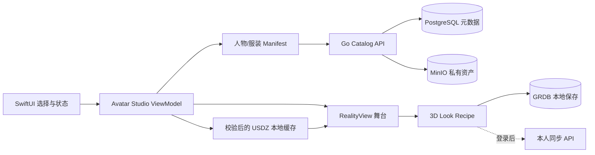

# OOTD 完整产品能力与阶段架构设计

## 状态与适用范围

- 文档状态：`approved`
- 决策日期：2026-09-15
- 关联需求：[PRD 10](../prd/10-OOTD产品需求.md) 与 PRD 11–18
- 关联计划：[产品实施计划](../plan/10-OOTD产品实施计划.md)
- 关联验收：[产品系统验收](../acceptance/10-OOTD产品系统验收.md)

本文修正此前把“第一个 MVP 切片”误写成“完整产品能力边界”的问题。完整产品必须在设计阶段定义清楚用户流程、页面、状态、数据、API、隐私、失败恢复和验收；工程仍按 MVP 顺序逐段实现，未进入当前切片的能力不预建空页面、空表或空服务。

于是的完整产品不是单一的三视图样片，也不是只做真实衣橱管理。它是一个以 Woo 式可爱人物和视觉结果为入口、以真实衣橱和每日决策为长期价值、同时提供本人 AI 试穿、360° 动态结果和可交互真 3D 的完整 OOTD 产品。

## 产品承诺

用户可以从零数据立即开始，也可以逐步建立自己的长期数字衣橱：

1. 不上传本人照片或衣服，直接选择可爱人物和内置服装，完成一次穿搭并保存。
2. 添加自己的衣物，得到基于真实拥有、可用状态、场景和反馈的搭配建议。
3. 主动使用本人照片生成 AI 试穿结果，并在结果页继续生成 360° 动态预览。
4. 在真 3D 模式中旋转、缩放人物，切换经过适配的服装和展示动作。
5. 把决定保存为计划，记录实际穿着和穿后感受，并在多设备间恢复本人数据。

三视图、短视频和真 3D 是三个不同的结果类型。它们共享人物、衣物和 Look 身份，但不互相冒充：

| 层级 | 用户看到的内容 | 结果类型 | 完整产品中的职责 |
| --- | --- | --- | --- |
| 多视角 Look | 正面、侧面、背面 | 已审核图片集合 | 零上传、离线、快速可靠的首次价值 |
| Create 360° | 5–10 秒转身或转台效果 | 视频 | 可保存和分享的动态视觉结果 |
| 交互式真 3D | 连续旋转、缩放、换装、短动作 | 具有实体层级、骨架和动画的 3D 场景 | 角色自定义和持续交互体验 |

## 完整产品能力地图

| 能力域 | 完整产品必须具备 | 第一交付切片 |
| --- | --- | --- |
| 首次使用 | 零账号、零上传、断网可进入默认人物并完成一次穿搭 | 是 |
| 人物工作室 | 三种 Woo 式可爱人物方向；保存人物身份；多视角、视频和真 3D 使用同一人物语义 | 先交付三套预设和多视角 |
| 探索衣橱 | 内置服装按类别浏览、筛选、组合、收藏并形成 Look | 是，固定六件衣物 |
| 我的衣橱 | 手工建档、单图导入、编辑、归档、洗衣/借出状态、删除和历史快照 | 分阶段接入 |
| 智能搭配 | 基于拥有衣物、场景、天气、偏好和穿着历史产生少量可解释结果；支持锁件和换一件 | 分阶段接入 |
| 本人试穿 | 本人照片与所选服装生成视觉结果；清楚说明非尺码/面料保证 | 云阶段 |
| 动态结果 | 从已确认的静态结果主动创建、取消、重试和删除 360° 视频 | 云阶段 |
| 真 3D | 原生 3D 舞台、连续观察、服装槽替换、展示动作、加载与失败状态 | 独立 3D 阶段 |
| 计划和记录 | 今日/未来计划、实际穿着、反馈、历史回看、编辑和删除 | 分阶段接入 |
| 账号和同步 | 注册/登录、本人资料、会话、跨设备同步、冲突处理和账户删除 | 云阶段 |
| 结果管理 | 收藏、下载、系统分享、删除和来源/版本说明 | 随结果类型逐步开放 |
| 隐私和控制 | 分目的同意、私有资产、血缘、可撤回、可验证删除、日志脱敏 | 每阶段前置 |

社交动态、创作者市场、真人造型师交易、联盟购物、广告和订阅属于增长或商业化扩展。它们不是判断当前 OOTD 核心产品是否完整的条件；在核心留存得到证据前，只保留业务边界，不建设实现占位。

## 信息架构与页面合同

App 保持三个一级入口，避免同时维护两套导航：

| 一级入口 | 页面与职责 |
| --- | --- |
| 今日 | Woo 式人物主页、左右切换已保存 Look、日期回看、今日建议，以及人物/穿搭创建主操作 |
| 衣橱 | 内置探索衣橱与我的衣橱分区、单品详情、筛选、状态、录入和删除 |
| 穿搭簿 | 已保存 Look、计划、实际穿着、反馈、收藏和历史详情 |

完整页面集合如下：

1. 启动与首次引导：说明零上传可用，直接进入默认 Look。
2. Woo 式人物主页：品牌、日期、人物舞台、左右切换、主操作和底部导航。
3. 人物选择页：三套人物方向、选择草稿、保存、取消和恢复默认。
4. 衣物分类页：上装、下装、鞋和后续外套/连衣裙/配饰；探索衣橱与我的衣橱来源清晰。
5. 选择托盘：当前人物、已选槽位、冲突说明、撤销和 Dress up。
6. 多视角结果页：正/侧/背、保存、收藏，以及条件启用的本人试穿与 Create 360°。
7. AI 处理页：输入摘要、真实任务阶段、取消、离开后恢复和失败重试。
8. 动态结果页：视频播放、保存、下载、分享和删除。
9. 真 3D 工作室：旋转、缩放、服装槽、动作、相机复位、加载进度和静态回退。
10. 我的衣橱：列表/网格、录入确认、编辑、状态、归档和删除影响确认。
11. 推荐与计划：场景、天气、必须穿、候选解释、锁件、换件、日期和保存。
12. 穿搭簿：计划、实际穿着、反馈、收藏与历史详情。
13. 账户与隐私：App 内账号、会话、同步状态、用途同意、数据导出和删除；P6 的 Web 自助账户页复用同一 OpenAPI，不建立第二套账户逻辑。

Woo 公开演示只约束其可观察页面和交互。未公开页面采用同一视觉语言与本产品信息架构设计，不宣称是 Woo 的隐藏页面。

## 核心端到端流程

### 零上传首次价值

`启动 → 默认人物 → 选择内置衣物 → Dress up → 原子切换完整多视角 Look → 切换视角 → 保存`

- 默认三套 Look 随包，断网仍可完成。
- 只有完整发布的 recipe 才可选择；缺少任何视角时保持上一有效结果。
- 保存的是 Look 和日期，不自动产生“用户拥有”或“实际穿着”事实。

### 真实衣橱长期闭环

`添加衣物 → 确认属性 → 设置场景/约束 → 查看最多三套推荐 → 锁定或换一件 → 保存计划 → 确认实际穿着 → 反馈`

- 推荐只使用用户确认拥有且当前可穿的衣物。
- AI 推断是建议，用户未确认的属性保持未知。
- 删除衣物时明确处理未来计划和历史快照，不能静默破坏历史。

### 本人 AI 试穿

`选择本人照片 → 本人/18+声明 → 选择衣物 → 确认云处理目的 → 创建任务 → 结果检查 → 保存或删除`

- 端侧先做安全解码、必要裁切和元数据净化。
- 生成失败不改变已保存 Look、衣橱、计划或真 3D 状态。
- 结果标识 Provider、模型/管线版本和“视觉参考”性质。

### Create 360°

`已确认静态结果 → 创建 360° → 异步处理 → 播放 → 下载/分享/删除`

- 360° 只能从已确认静态结果创建。
- 视频任务与静态任务分别计费、取消和删除。
- 视频不能标记为真 3D，也不能替代真 3D 验收。

### 交互式真 3D

`进入 3D 工作室 → 异步加载人物 revision → 加载兼容服装 → 原子替换槽位 → 旋转/缩放 → 触发展示动作 → 保存 3D 配方`

- 人物、服装和动作必须绑定明确的资产合同与兼容版本。
- 换装时先验证完整依赖，在离屏实体装配完成后整体切换；失败保留上一有效场景。
- 用户触发动作只播放一次，结束回到待机站姿；减少动态效果时禁用非必要动作。
- 首次 3D 加载失败时给出可重试状态，并允许回到同一 Look 的多视角结果。

## 真 3D 技术设计

### 运行时决定

iOS 26 客户端采用 SwiftUI + RealityKit 的原生路线，3D 局部舞台使用 `RealityView`：

- Apple 当前文档明确提供 iOS/macOS 的 `RealityView`，其 `make` 闭包可以异步加载 bundle 或 URL 内容，并通过 `update` 响应 SwiftUI 状态变化。
- RealityKit 可以加载 `.usd`、`.usda`、`.usdc`、`.usdz` 和 `.reality`，且保留实体层级；本产品交付只选择 **USDZ** 作为 iOS 运行格式，避免多格式兼容分支。
- 3D 只负责人物舞台。SwiftUI 继续拥有导航、衣物选择、保存、删除、加载/错误、VoiceOver 和回退操作。

一手依据：[RealityView](https://developer.apple.com/documentation/realitykit/realityview)、[Loading entities from a file](https://developer.apple.com/documentation/realitykit/loading-entities-from-a-file)、[RealityKit](https://developer.apple.com/documentation/realitykit)。

运行时只保留一条生产路径：

| 候选 | 结论 | 原因 |
| --- | --- | --- |
| SwiftUI + RealityKit + USDZ | 选择 | 与当前 iOS 26/SwiftUI 工程同一运行时；支持实体层级、动画、运行时更新和异步 URL 加载 |
| SceneKit | 不选 | 不再为新产品建立第二套 Apple 3D 抽象，无法减少资产生产工作 |
| Three.js + WKWebView | 不选 | 增加 WebContent、bridge、资源与无障碍边界；既有 11-02 已证明它没有解决人物/服装生产问题 |
| Unity / Unreal | 不选 | 当前有限人物工作室不需要完整游戏引擎，包体、工程边界和招聘成本不符合 MVP |
| 云端实时串流 | 不选 | 弱网、成本、延迟和隐私会破坏本地可用承诺 |

### 资产合同先于建模工具

不预设 Blender、Maya、生成式 3D 服务或某一 Avatar SaaS。任何生产方式只有输出满足同一合同才可进入候选：

| 资产 | 必须满足 |
| --- | --- |
| 人物 | 项目自有/授权；稳定比例、骨架、命名、材质、碰撞范围、LOD、默认站姿和展示动作 |
| 服装 | 绑定支持的人物 revision；稳定槽位；蒙皮和权重通过极限姿态检查；包含遮蔽规则 |
| 场景 | 人物、服装、灯光和相机锚点具有稳定实体名称；加载后可单独替换服装实体 |
| 动画 | 待机、展示、复位动作可按稳定名称取得；缺失动作不能导致场景不可用 |
| Manifest | 资产 ID、revision、兼容人物范围、字节数、SHA-256、LOD、动作和来源权利完整 |

生产工具选型由独立 POC 比较：自有/外包建模、授权 Avatar 平台和生成式静态 mesh 都可以作为输入候选；不能把“得到一个外观相似的静态模型”当成已经完成骨架、可换装、动画、LOD 和权利验收。

### 3D 运行结构

客户端缓存下载到临时文件，完成大小和 SHA-256 校验后原子发布。Manifest 或任何必需资产不完整时不得切换当前场景。后端只发布资产事实和授权下载地址，不在 API 请求中实时运行 3D 生成。

### 真 3D 最小领域对象

| 对象 | 职责 |
| --- | --- |
| `AvatarAssetRevision` | 一套人物 USDZ、骨架/实体合同、动作与版本 |
| `GarmentAssetRevision` | 一件适配服装、槽位、兼容人物 revision、材质和版本 |
| `AvatarSceneManifest` | 当前可发布人物、服装、依赖、hash 和资源预算 |
| `InteractiveLookRecipe` | 人物 revision 与各槽位服装 revision 的有序组合 |
| `LookRenderSet` | 同一语义 Look 的正/侧/背媒体 |
| `TurntableVideo` | 同一 Look 派生的 360° 视频及生成任务 |

三个结果使用关联 ID，但分别保存版本和生命周期。图片或视频删除不应隐式删除可交互配方；源人物或服装撤回发布时，新建 Look 禁止使用，历史配方保留可解释快照并按权利要求处理对应资产。

### 资源和性能门槛

数值由 POC 在最低支持真机上实测后冻结，设计阶段不伪造预算。进入生产实现前必须至少记录：

- 首次可见时间、换装时间、平均/峰值内存、帧时间、下载大小、缓存大小和热状态。
- 站姿、展示动作与所有有效服装组合的穿模/破面/遮蔽检查。
- 前后台切换、内存压力、弱网、中断下载、坏 hash、低存储和资源撤回。
- VoiceOver 替代操作、减少动态效果、加大字号和无 3D 能力时的多视角回退。

## 数据与服务边界

完整产品继续使用现有模块化单体：Go + Gin/Huma + GORM，PostgreSQL 保存业务事实，MinIO 保存私有媒体和 3D 资产，Redis 只做可丢失的限流/短缓存，RabbitMQ 处理 AI 和视频异步任务。

| 数据 | 本地 | 服务端 | 说明 |
| --- | --- | --- | --- |
| 默认人物/Look | 随包与 GRDB | 发布目录 | 零账号可用 |
| 我的衣物和计划 | GRDB 事实源 | 登录后同步副本/云事实 | 具体冲突合同在同步切片冻结 |
| AI/视频任务 | 最近状态缓存 | PostgreSQL + RabbitMQ | 任务状态不可只存在 Redis |
| 图片/视频/USDZ | 原子缓存 | 私有 MinIO | PostgreSQL 保存 owner、来源、hash 和生命周期 |
| 同意与删除 | 本地提示状态 | PostgreSQL 审计事实 | 每种离机用途分别记录 |

API 能力按产品域提供，Huma operation 和 Go struct tag 在运行时生成 OpenAPI，Swagger 门户和 Umi 读取同一契约：

- 人物和内置目录：`avatar-presets`、`catalog/garments`、`look-render-sets`、`avatar-scenes`。
- 我的衣橱：`wardrobe/items`。
- 推荐和记录：`outfit-recommendations`、`outfit-plans`、`actual-wears`、`feedback`。
- 云生成：`try-on-jobs`、`turntable-jobs`、统一任务状态与删除。
- 账号和数据控制：`sessions`、`me`、`consents`、`exports`、`account deletion`。

只有进入获批执行切片时才增加具体 operation、GORM model 和 migration；本文固定能力边界，不要求一次性建立全部接口。

## 失败、降级与恢复

| 失败 | 产品行为 |
| --- | --- |
| 无网络 | 默认人物/Look、已缓存衣橱、计划和记录继续可用；云操作明确不可用 |
| 多视角资产不完整 | 保持上一完整 Look，显示可重试状态 |
| AI/VTO 失败 | 保留输入草稿和原状态，可重试或删除；不伪造成功结果 |
| 360° 失败 | 静态结果仍可使用，视频任务单独恢复 |
| 3D USDZ/manifest 失败 | 保持上一有效场景；首次失败回到关联多视角 Look |
| 同步冲突 | 不以最后到达的数据静默覆盖；在同步切片固定按实体的合并/选择规则 |
| 删除部分失败 | 对用户显示处理中/待重试；Outbox 驱动对象存储和供应商清理，事实可审计 |

降级只改变呈现能力，不改变事实含义。多视角结果不能变成 `3dModel`，内置 Look 不能变成真实拥有，计划不能变成实际穿着，取消中的云任务不能显示已删除。

## 阶段交付与退出条件

完整产品设计一次固定，实现按以下累积顺序推进：

| 阶段 | 可独立交付结果 | 退出条件 |
| --- | --- | --- |
| P1 零上传 Woo 多视角 | 三套人物、六件衣物、24 套 Look、离线默认、保存/恢复/删除 | 11-03 和系统多视角验收通过 |
| P2 真实衣橱决策闭环 | 录入、状态、推荐、计划、实际穿着、反馈和历史 | PRD 12/13/16 关键切片通过 |
| P3 本人 AI 试穿 | 本人照片、所选衣物、异步生成、保存和删除 | 质量、隐私、成本、恢复与供应商门禁通过 |
| P4 Create 360° | 从静态结果生成、播放、下载、分享和删除视频 | 独立动态价值、质量、成本和删除验收通过 |
| P5 可交互真 3D | RealityKit 舞台、USDZ 人物/服装、连续观察、换装和动作 | 资产 POC、最低真机、性能、视觉和无障碍通过 |
| P6 账号同步与产品收口 | 注册/登录、本人 CRUD、跨设备恢复、导出、账户删除与全旅程回归 | 完整产品系统验收全部通过 |

阶段编号表达产品累积能力，不替换现有 `FF-SS` 执行计划编号。每个阶段开工前仍按 Design → PRD → 单切片 Plan/Checklist → Implementation → Acceptance 执行。

## 完整产品验收定义

只有以下结果都有可复核证据，才能宣称“完整产品已交付”：

1. 零数据新安装在断网下完成穿搭并保存。
2. 用户建立真实衣橱并完成推荐、计划、实际穿着和反馈闭环。
3. 本人试穿可创建、恢复、保存和删除，失败不污染本地事实。
4. Create 360° 有真实任务和可播放结果，支持取消、下载/分享和删除。
5. 真 3D 在最低支持真机连续旋转、缩放、换装和播放动作，且图片/视频不冒充 3D。
6. 登录用户可以在第二台设备恢复允许同步的数据，并能导出或删除本人数据。
7. 所有媒体和 3D 资产有来源、版本、owner、hash、生命周期和删除证据。
8. Release 构建、无障碍、隐私清单、许可证、安全与服务恢复门禁通过。

当前任何单一 POC、模拟器录屏、API 测试、24 套图片或后端服务健康，都只证明其覆盖的切片，不能单独证明完整产品交付。

## 决策记录

1. 完整产品保留 Woo 式视觉体验、真实衣橱长期闭环、本人 AI 试穿、Create 360° 和可交互真 3D。
2. P1 的预生成多视角决定只解决首个可靠切片，不再作为永久否决真 3D 的依据。
3. 真 3D 在 iOS 使用 SwiftUI + RealityKit + USDZ；建模/资产生产工具由合同和 POC 选择，不预设 Blender。
4. 不做多种 3D 运行格式和 renderer 兼容；选定的 iOS 生产路径只有 RealityKit/USDZ。
5. 社交、商城和造型师交易属于增长扩展；完整 OOTD 核心经过留存验证后再设计其实施合同。
