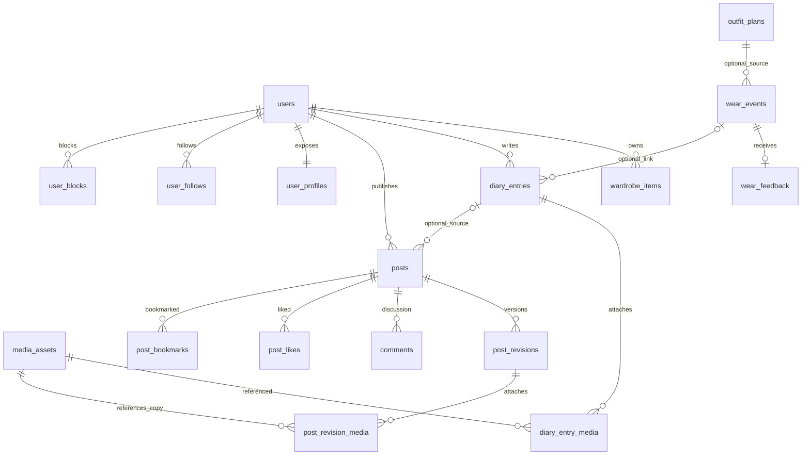

# 后端数据库设计

2026-09-22 Look 路线衔接：现有账户/衣橱/计划/实际/日记/社区的已实施合同保留。后续 14-01 只新增实际需要的 Look/revision、image/model 任务及媒体血缘；模型绑定 owner+Look/revision+图片摘要+Provider/model/参数，图与模型独立状态/费用。逻辑不变量见 Design 20/10，实际表由 GORM record/集中 AutoMigrate、接口由 Huma operation 与运行时 OpenAPI 定义；本次不预建空表、路由或第二份 schema。

状态：`approved / implemented`，2026-09-16；19-02～19-04 已实现账号资料、私人日记和帖子治理，19-05 已实现 B4 关系、评论、通知与申诉数据层并通过真实 PostgreSQL 与远端 CI 验证。[领域边界](21-后端产品边界与领域设计.md) / [接口](23-后端接口设计.md)。下表是逻辑及约束设计，不是第二份可执行 schema；GORM record 和集中 AutoMigrate 是实际建库唯一来源。

## 数据库选择与约定

沿用 PostgreSQL，不引入 MySQL、MongoDB、图数据库或 Elasticsearch。一个业务数据库足以处理事务、社交关系和有界列表；PG 存结构化事实，MinIO 存图片/视频/GLB，Redis 存可丢失计数/限流缓存，Kafka 存待处理消息而非唯一业务状态。不能用 Redis 的点赞计数代替关系表，也不能用队列代替任务表。

约定：`uuid` 标识；日期 `date`；绝对时间 `timestamptz`；原始时区为 IANA 文本；正文 `text`；次数 `bigint`。状态采用 `text + CHECK`，避免不断增加数据库枚举类型。JSONB 仅用于已验证的不可变配方/公开快照/有限消息，不装全部业务实体。新私有表采用 `(owner_id,id)` 主键，公共实体用全局 UUID 主键并建立 `(owner_id,id)` 唯一键供所有权复合外键使用。时间字段统一 created_at/updated_at，修改型实体统一 revision>=1。客户端 owner_id 从会话得出，不能接受客户端指定另一个 owner。

以下 `FK` 均须在 PostgreSQL 实际落地；不能仅依赖 GORM 预加载关联。可空复合引用解除时只置空目标 ID，保留 owner；由显式事务解除后删除（FK RESTRICT），不对 `(owner_id,target_id)` 全列 SET NULL。软删除只用于撤回访问和异步删除过渡，不作为永久存储策略。

## 审查基线的 17 张表

基线 `5658568`，来源 `backend/internal/adapter/postgres/schema.go`。仅列真实现状，不把未来字段混入。

| 表 | 关键字段/键 | 当前用途与缺口 |
| --- | --- | --- |
| users | id PK、display_name、created_at、updated_at | 身份；缺状态/运营角色/删除编排 |
| user_credentials | user_id PK/FK、email 唯一、password_hash | 邮箱密码；缺验证状态/找回挑战 |
| user_sessions | id PK、user_id FK、token_hash 唯一、expires_at | 可撤销会话，不存明文 token |
| self_adult_declarations | owner_id、声明版本/时间 | 本人照片用途前置；不冒充社区实名或年龄核验 |
| wardrobe_items | (owner_id,id) PK、name/category/availability/source、四项 nullable 属性、revision | 私人衣物；尚无独立归档及媒体关联 |
| outfit_plans | (owner_id,id) PK、local_date/time_zone/context_summary/status/revision | 准备穿搭 |
| outfit_plan_items | (owner_id,plan_id,ordinal) PK、衣物 ID/revision/属性快照、redacted | 计划历史不随衣物编辑改变 |
| outfit_plan_deletions | (owner_id,id) PK、deleted_at | 防迟到重建 |
| wear_events | (owner_id,id) PK、local_date/time_zone/completeness/source_plan_id/source_kind/create_fingerprint/revision | 主动确认实际穿着；不等于日记 |
| wear_event_items | (owner_id,event_id,ordinal) PK、衣物 ID/revision/属性快照、redacted | 实际事实快照 |
| wear_event_deletions | (owner_id,id) PK、deleted_at | 防迟到重建 |
| consent_records | id PK、owner/purpose/category/processor/region/policy_version/retention/withdrawn_at | 本人照片准备用途；普通日记图不建立虚假同意 |
| media_assets | id PK、owner/可空 consent/purpose/category/hash/size/object key/version/status | 本人照片与普通日记 JPEG，均最大 12 MiB/24 MP；用途 CHECK 隔离 |
| media_derivations | id PK、media_id FK、object key/version | 媒体衍生关系 |
| deletion_requests | id PK、owner/media_id、status/attempts/next_attempt_at | 单媒体删除状态/重试 |
| outbox_events | id PK、type/aggregate_id/payload/published_at | 已支持 media.uploaded、media.deletion_requested、community.notification_requested |
| inbox_receipts | (event_id,handler_name) PK、processed_at | 消费去重 |

19-02 把实际表数增加到 18；19-03 增加三张日记表；19-04 增加六张帖子治理表；19-05 增加七张互动治理表；19-06 增加 `account_deletion_requests`；17-34 增加反馈和命令回执两表，当前集中迁移共 37 张表。真实 PostgreSQL 已验证关系唯一、双向屏蔽、评论审核状态、通知 Outbox/Inbox 去重、申诉唯一、可靠删号和删除级联；头像媒体列仍待后续切片。

## 第一阶段：基础字段与私人记录

下列设计只有在对应切片实施时建表。`?` 表示 nullable，其余为必填；共通时间/修订字段在约定中定义。

| 表/变化 | 字段与类型 | 唯一、外键、检查、索引 |
| --- | --- | --- |
| users 扩展（19-02 已实现） | status text(active/suspended/deleting)、role text(user/moderator/admin)、revision int | role 默认 user，不接受本人资料 PATCH 修改；按 status 过滤读取 |
| user_credentials 扩展 | email_verified_at timestamptz? | 修改邮箱同时撤销验证/旧挑战；密码变化撤销其他会话 |
| account_challenges 新增 | id uuid PK、user_id uuid FK、purpose text(verify_email/reset_password)、token_hash bytea、expires_at、consumed_at?、attempts int | hash 唯一；单次原子消费；清扫索引 expires_at；不存明文验证码 |
| user_profiles 新增（19-02 部分实现） | 已实现 user_id uuid PK/FK、handle text、bio text?、revision；avatar_media_id 后续 | lower(handle) 唯一、3–30 ASCII 字符；简介<=300 字；公开 DTO 不含账号状态/邮箱；头像随 profile 媒体切片加入 |
| wardrobe_items 扩展 | archived_at timestamptz?、image_media_id uuid? | 归档不覆盖 laundry/packed；推荐同时检查 archived_at；复合 owner/media FK；图片只能 ready 且 wardrobe 用途 |
| wear_feedback 新增（17-34 已实现） | (owner_id,event_id) PK/FK→wear_events、id uuid UNIQUE、thermal_comfort/activity_comfort/occasion_fit/repeat_intent text?、issue_tags jsonb、note text?、revision/时间戳 | 四维/标签/备注至少一项；复用 16-03 枚举；事件删除 CASCADE；无长期偏好缓存表 |
| wear_feedback_mutations 新增（17-34 已实现） | (owner_id,event_id,mutation_id) PK/FK→wear_events、feedback_id、operation、fingerprint | owner+mutation_id 唯一；同命令重试去重、同 ID 不同命令冲突；随事件删除 CASCADE |
| diary_entries 新增（19-03 已实现） | (owner_id,id) PK、local_date date、time_zone text、title text?、body text?、mood text?、occasion text?、wear_event_id uuid?、plan_id uuid?、revision | owner/date/created_at/id DESC 索引；无一天一条限制；目标 ID 外键 SET NULL，service 同事务校验同 owner；Look 字段留到 Look 切片，不创建悬空列 |
| diary_entry_media 新增（19-03 已实现） | (owner_id,entry_id,ordinal) PK、media_id uuid | FK diary CASCADE、FK media RESTRICT；UNIQUE(owner,entry,media)，ordinal 0–8；service 校验 ready/owner/purpose，有序首图为封面 |
| diary_entry_deletions 新增（19-03 已实现） | (owner_id,id) PK、deleted_at | 同既有墓碑风格，禁止离线重试复活；账号删除级联 |

日记的“正文或媒体至少一项”、不超过 9 图、未来日期拒绝、时区有效、关联事件与日记日期一致（计划可不同日）在 service 校验并在持有日记行锁的同事务完成。跨表至少一张图不是伪造的 SQL CHECK。DB 保证字段长度、FK、ordinal/唯一；集成测试保证事务规则。

## 第二阶段：公开笔记与审核

| 表 | 字段与类型 | 约束和索引 |
| --- | --- | --- |
| posts（19-04 已实现） | id uuid PK、owner_id FK、state/revision、draft/pending/published_version?、review_round、复合 source_diary_owner_id/source_diary_id?、published/withdrawn/deleted 时间 | owner/date 索引、公开状态索引、来源复合 FK RESTRICT；删除日记/账号前在同事务显式置空来源；B3 不提前增加 wear/look 来源列 |
| post_revisions（19-04 已实现） | (post_id,version) PK、title/body、review_state/round、reason、submitted/reviewed/created 时间 | FK post CASCADE；父行锁分配版本；待审队列索引；已提交/批准版本不原地改文 |
| post_revision_media（19-04 已实现） | (post_id,version,ordinal) PK、media_id、固定 derived object key/version | 复合 FK revision CASCADE、FK media RESTRICT、ordinal 0–8；ready + community_publish 及 owner 在提交事务校验 |
| post_revision_tags（19-04 已实现） | (post_id,version,tag) PK | 复合 FK revision CASCADE；最多 5 标签由 service 保证，每个规范化 1～20 字由 service+CHECK 保证 |
| moderation_actions（19-04 已实现） | id、actor_id、可空 post/version、report、subject user、action/reason/created_at | 只保存治理定位和原因，不保存正文；B3 决定由 revision 状态和父行锁实现唯一/幂等；评论目标后续加入 |

posts 的当前/公开 revision 必须属于同一 post。采用父子循环 FK 时，在同一建库入口分两步安装约束：先父/子表，再指针约束；创建草稿先插入空指针父行、插入 v1、再更新指针，整笔事务提交。CHECK published 状态必须有 published_revision/published_at；删除/撤回先清可见状态和指针，再清子表。GORM 实现前以空库真实 PG 测试证明，不靠注释假定约束已存在。

outfit_snapshot 限 16 KiB，只保存显式选定的公开类别/描述/目录版本/生成来源；禁止私人 item ID、日记 ID、原时区、精确地址和媒体存储 key。来源关联仅作者 API 返回。公开读取只 JOIN published_revision，不使用 MAX(version) 或 draft_revision。

人工审核决定事务锁定 posts/目标版本，核对 state/version/review_round，写动作，再更新 published 指针与 Outbox。重复相同决定幂等，不同决定返回 409。撤回取消 pending revision；旧审核任务到达时不允许推进状态。

## 第三阶段：互动、发现与治理

| 表 | 字段与类型 | 约束、索引与删除 |
| --- | --- | --- |
| post_likes | (user_id,post_id) PK、created_at | 双 FK；关系唯一，按 post_id 计数索引；不能先加计数再写关系 |
| post_bookmarks | (user_id,post_id) PK、created_at | 双 FK；本人收藏分页(user_id,created_at DESC,post_id DESC)；撤回后列表不返回私有内容 |
| user_follows | (follower_id,followee_id) PK、created_at | 双 user FK；CHECK 两者不同；followee/follower 反向索引；禁止屏蔽关系下创建 |
| user_blocks | (blocker_id,blocked_id) PK、created_at | 双 user FK；CHECK 不同；反向索引；事务内删除双方关注并阻断后续互动 |
| comments（19-05 已实现） | id uuid PK、post_id uuid FK、author_id uuid FK、parent_id uuid? 自引用 FK、body text、state text(pending/published/rejected/deleted/removed)、revision、审核/创建/更新时间 | 父评论存在性由 FK 保证；同帖且父为根评论由持有目标行锁的创建事务保证；根/回复分页索引；原帖撤回即整组不可读 |
| content_reports（19-05 已扩展） | id uuid PK、reporter_id/post_id FK、target_type、comment_id? FK、reason/detail、status、resolution、时间 | post/comment 目标配对 CHECK；同一举报人对同一目标最多一个 open 举报 |
| moderation_appeals（19-05 已实现） | id uuid PK、appellant_id、action_id FK、reason、status(open/upheld/reversed)、resolved_by?、时间 | 同一用户/动作一个 open 申诉；复核新增审计动作，不修改原审计，也不自动复活内容 |
| notifications（19-05 已实现） | id uuid PK、recipient/actor/event、kind、post/comment?、available_at/read_at、created_at | UNIQUE(recipient,event,kind)；只有 Inbox 完成后 available；不存正文、邮箱、图片地址或收藏者；读取复核当前目标可见性 |

首版评论创建后正文不可原地编辑，作者可删除重发，避免已审核评论被静默换文；根评论删除后正文置空/标 deleted，可保留已批准回复树与“原评论已删除”占位，后续清理按保留策略执行。pending/rejected 评论仅本人和审核者可读。

关系计数先从关系表聚合读取；确有测量瓶颈才引入计数缓存。Feed 采用读时 JOIN，不新增 feed_events/fanout 表。以(userA,userB)排序锁定两账号行后修改关注/屏蔽，避免屏蔽和关注并发穿透；评论/点赞同时锁定 post 并验证可见性和双向屏蔽。

## 媒体、任务与账号删除的调整

| 表 | 设计变化 | 必须成立的不变量 |
| --- | --- | --- |
| media_assets | 19-03 增加 `diary_image`，19-04 增加 `community_publish`；两者均为 ordinary_image/无 consent，人物照片仍独立；wardrobe/profile 用途后续加入 | 社区提交只接受本人 ready/community_publish，并将当时 derived key/version 固定到 revision；存储引用不进入公开 DTO |
| media_derivations | 补 owner、kind、mime、bytes/hash/尺寸和 source revision；发布副本作为独立 media asset，通过 source_media_id 血缘 FK关联 | 私有源与公开衍生对象不同 key；原图删除与已发布副本关系可查询；人物采集原图不直接公开 |
| deletion_requests | 沿用单媒体删除；补绑定账号删除任务的可空 ID | 对象所有版本删除结果可重试；账号不能提前级联销毁清理依据 |
| account_deletion_requests（19-06 已实现 schema） | id uuid PK、user_id uuid UNIQUE、status(pending/complete)、media_count、requested_at/completed_at、updated_at；刻意不设 user FK | 先失效后清理；对象元数据保留到最后一个删除请求完成，账号物理删除后最小内部回执仍存在；公开轮询凭据留到独立客户端切片 |
| outbox_events/inbox_receipts | 增加明确事件类型与版本字段 | 复用现有可靠投递；拒绝未知事件版本；新事件按 handler+event 去重，不另建消息服务 |

一般图片首版建议 JPEG/PNG、12 MiB、解码不超过 24 MP、单帧；净化后重新编码并清除 EXIF/GPS，再允许关联。社区只读取审核绑定的衍生版本。尺寸是待评审预算；具体 CPU/内存上界需真实服务测试。新增普通图片不能被现有 `person_photo` 固定 CHECK 或本人声明逻辑错误拦截。

引用删除策略：日记媒体关联删除 CASCADE，媒体对象删除由“无剩余引用 + 删除任务”控制；发布副本独立但沿血缘执行用户选择的传播删除。报告/审核保留期限、备份过期和孤儿媒体 TTL 属于上线待决配置，不在设计阶段声称已执行物理清除。

## 完整产品后续数据域（本轮只界定职责）

| 表族 | 最少需表达的数据 | 实施前还需冻结 |
| --- | --- | --- |
| catalog_avatars / catalog_garments | 稳定 ID、revision、状态、资产/授权引用、类别、GLB 合同 | 授权资产交付与发布规则 |
| catalog_looks / catalog_look_items | 人物版本、服装版本/槽位、完整视角、已验证兼容关系 | 内置目录与版本退役合同 |
| saved_looks / saved_look_items | owner、人物/服装配方快照、收藏、原始日期/时区、revision | 私有造型保存与目录失效恢复 |
| generation_jobs / generation_job_inputs / generation_job_outputs | owner、明确用途、provider/version、状态、幂等键、成本、固定输入/输出媒体版本 | 试穿和视频各自完整 spec，不能用泛型任务表提前代替 |
| export_requests | owner、状态、受控导出媒体、过期时间、可撤回下载 | 导出范围与备份/删除承诺 |
| 同步变更记录 | owner、实体/版本、删除水位、序列游标 | 增量协议、冲突策略、保留窗口；当前墓碑不等于完整同步 |

推荐默认按当前衣橱与明确反馈计算，不因每次“生成”建立永久推荐历史表；保存计划时才保存结构化场景与理由版本。日/月穿搭统计先从 wear_events 查询，不另建统计事实库。

## 核心 ER（省略共通元数据）

## 建库验收要点

真实 PostgreSQL 验证空库 AutoMigrate、复合 owner FK、公开 revision FK、唯一/检查约束、事务回滚、并发撤回/审核/屏蔽、重复请求和级联范围。MinIO 验证固定版本、衍生副本、全部版本删除、删除时引用冲突。开发库可重建，但不增加历史兼容层，也不在需求未确认时执行清库。
