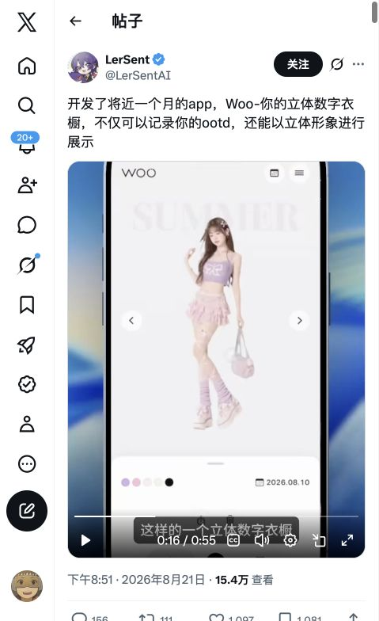
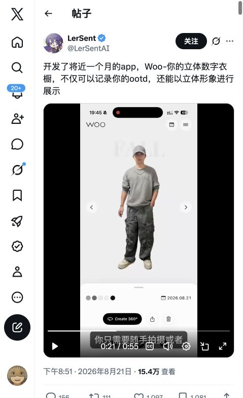
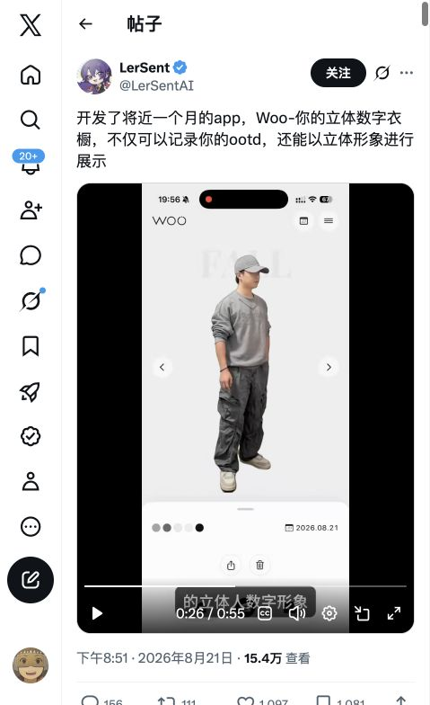
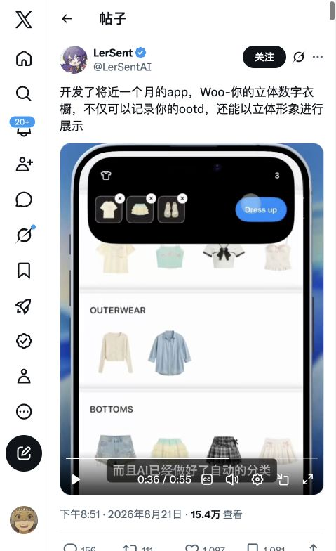
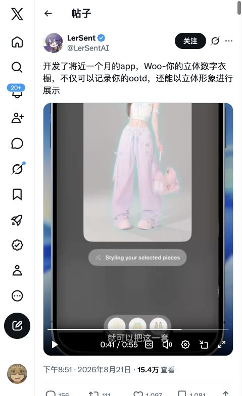
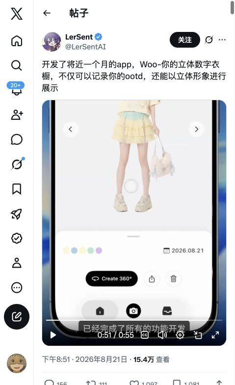

# Woo 参考截图

来源：[LerSent 原帖](https://x.com/LerSentAI/status/2090783821452943404?s=20)。2026-09-14 使用 Codex in-app browser 原生截图保存并逐张打开检查；479×784 浏览器视口。未下载原视频，未修图。时间为进度条的近似值，视频包含手机透视、推拉和字幕；不是 App 原始等比例截屏。

仅用于本项目设计研究，保留原作者归属；不打包进产品、不用于模型训练或生成。分析见 [Design 13](../../13-三维虚拟形象与服装系统研究.md)。

| 文件 | 观察时刻 | SHA-256 |
| --- | --- | --- |
| [create-360.jpg](create-360.jpg) | 约 50–51 秒 | `82b224f64ac48fbb899930032c43ec72bcb061db4fbddeebb7eef14fbfedb3c3` |
| [look-detail.jpg](look-detail.jpg) | 约 10–11 秒 | `8ec02b1a0b408f28e048f63095303eaa5db5725952f192498880d68aa9199ee3` |
| [look-home.jpg](look-home.jpg) | 约 1 秒 | `b162afa0d48214a6635e86c92b958ceebb14c14975b83b06d1f0d5301d2c22cd` |
| [look-overview.jpg](look-overview.jpg) | 约 15–16 秒 | `5e0395c5628ca056f279ebdfaa455be2a6975738c88fc7c809fdcad6bda7052d` |
| [photo-look-front.jpg](photo-look-front.jpg) | 约 20–21 秒 | `07b38fe886ab53dc0fd069f03f656194d871f0a5f050f3d73d7d6a61c5727848` |
| [photo-look-side.jpg](photo-look-side.jpg) | 约 25–26 秒 | `9e21df9eabdf7145f3391aafef1da7c9885ef50fb100bf291de17bb2010dff10` |
| [tryon-result.jpg](tryon-result.jpg) | 约 45–46 秒 | `ae764d3f94647ddae660df3fc39626e3de355d21912c91940ec9f8dc6f8ad59c` |
| [tryon-styling.jpg](tryon-styling.jpg) | 约 40–41 秒 | `6d8409fff3d0eb1056eb5b393d2a5ddcf06579b51d3b7dcd8746634ba9c422c8` |
| [wardrobe-categories.jpg](wardrobe-categories.jpg) | 约 30–31 秒 | `e12d4898743211526e2da3204a3b87152069af1f40e73b0fb92ccad45658894b` |
| [wardrobe-selection.jpg](wardrobe-selection.jpg) | 约 35–36 秒 | `9ad9ce393e8bb2cc824e20a8f8ec985aef64195d19d8cec42bd23596af59682c` |

## Screenshots

