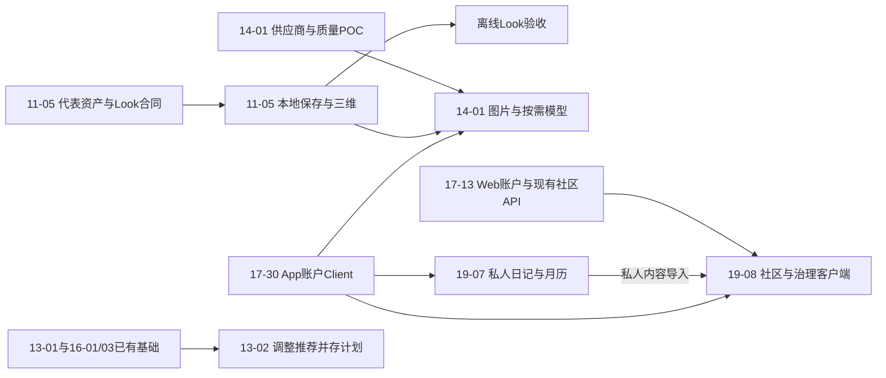

# OOTD 产品实施计划

更新：2026-09-22。新产品设计已批准，总体执行 in_progress；**本轮交付是将现行设计拆成PRD、非功能标准、执行步骤与验收，新Look路线尚未编码或验收**。以下保留其他工程任务的既有状态，不以本次文档检查替代它们的代码/CI证据。

完整待办、checklist、执行先后/可并行关系、建议周期和验收入口已集中到[产品 Backlog](../../BACKLOG.md)。本文件保留阶段/现状，Backlog复用单切片任务ID；实际完成仍由原Plan和Acceptance证据判定。本轮新增Backlog不自动恢复App编码或触发付费/发布。

## 当前执行优先级

首版依次推进代表完整 Look 验证、单套图片/GLB 与本地保存闭环、三人物六套内置内容，并补齐真实衣橱推荐与记录。完整穿搭图和按需模型云任务留在后续版本；届时先落实云认证、同意、实际账号额度、地域/许可与删除。完整跨设备同步、视频和高级角色分别排期。

用户已于 2026-09-23 授权按 Backlog 开始实现；付费调用与生产发布仍以相应实际输入和门禁为准。现有前后端目录/组件整理按 17-26～29 的独立计划继续；不重做已完成的账户、衣橱、日记和社区后端。

当前执行顺序按用户最新指示调整为先完成 `then-server/backend` 的可执行切片；Web 页面与 App 实现暂缓。此顺序不改变首版离线 Look 与衣橱推荐/记录的产品范围，也不将后续云能力视作已启用。

### Q0 启用范围与开工基线（2026-09-23）

- `BL-READY-01` 已完成：用户选定下一版启用离线完整 Look、真实衣橱推荐与记录。云图片、云模型、私人日记和社区延至后续版本；其 App 入口不作为首版可点击功能，已有后端 API 不代表 App 功能已启用。离线 Look 依 11-05/Acceptance 11 与系统 ACC-017 验收；日常闭环依 12/13/16 计划与对应 Acceptance 验收。此范围决定不将后续能力标为已实现或已发布。
- `BL-READY-02` 已完成核对：`then-server@c014e595`、`then-app@0f7498c6` 均在 `main`，与本地 `origin/main` 为 0/0，开始时工作树干净；服务端已有历史 `stash@{0}`，未改动。App 有 GRDB `ootd_outfit_feedback_v1` 及之前迁移、八个分件工程 GLB，尚无正式完整 Look；App 无启用的云 Client。服务端使用 GORM `AutoMigrate` 和运行时 OpenAPI；Web 有 Umi 生成的 `src/api`。本机 Go 1.26.5、Node 24.19.0、npm 12.0.2；当前 Xcode 27.0/Swift 6.4，与工程固定 Xcode 26.6/Swift 6.3.3 不一致。可用 iOS 26.5 与 27.0 模拟器；未确认最低 iOS 26 真机。当前 `docker ps` 未见 Then 服务；其他项目容器未动。后续构建结果必须标注此工具链差异，不能直接抵扣固定工具链和真机发布门禁。
- `BL-READY-03` 待输入：仓库现有资源为无纹理的分件工程 GLB，不满足 11-05-GATE-01 的正式完整图、带纹理整套 GLB、授权源包和视觉验收。取得代表包后先验证一套，再扩六套。
- `BL-READY-04` 待落实最低真机/窗口；本版离线范围无需云测试账号、PG/Kafka/MinIO 或生成费用。后续启用云生成/社区前分别落实隔离环境、预算和运营责任。

## 全流程目标

数字衣橱与选衣 → 完整图先用 → 按需整套 GLB → 保存/复用/日常记录。默认内置内容零账号/零上传/离线，任意新穿搭为显式云动作。社区既有完整需求保留；模块换装、体型、眨眼/注视和视频后移，详见 [Design 20](../design/20-OOTD完整产品能力与阶段架构设计.md)。

## 当前执行与验收边界

| 切片 | 契约 / 执行状态 | 已有结果 | 未完成项 |
| --- | --- | --- | --- |
| [17-27 Web 规范同步](17-27-Web设计体系与工程规范同步执行计划.md) | approved / completed（基础工程与 CI） | shadcn/Radix、token、路由状态与本地门禁通过；06c4f3a 已推送，四项远端 CI 全绿，App 设计 7f10376 已同步 | 账户业务按 17-13；真机与生产发布另验 |
| [17-26 Kafka 与工程规范化](17-26-Kafka与工程规范化执行计划.md) | approved / completed（本地工程验证） | 原工作区已推送；Kafka、根入口、构建/测试适配及全部本地门禁完成 | cd41e59 已推送，远端三项 CI 通过；生产迁移另验 |
| [19-01 后端需求与数据设计](19-01-后端需求与数据设计审核计划.md) | approved / completed | 日记和社区需求、领域、表、API、验收标准已确认 | 发布地域、邮件、审核 SLA 和预算仍待上线前决策 |
| [19-02 账号状态与公开资料](19-02-账号状态与公开资料执行计划.md) | approved / completed | 账号状态/角色/revision、公开资料三接口、PG约束、Umi、完整 integration 与远程 CI 已完成 | 头像/邮件/异步删号后续分片 |
| [19-03 私人穿搭日记与日历 API](19-03-私人穿搭日记与日历API执行计划.md) | approved / completed | 私人图文日记、普通图片、删除影响、月日历与全部本地/远程门禁通过 | 穿后反馈统计另行实现 |
| [19-04 社区帖子审核与治理 API](19-04-社区帖子审核与治理API执行计划.md) | approved / completed | 私人草稿、审核、匿名正文/图片、举报、下架、账号封禁与本地/远程全部门禁通过 | Feed 与互动属于 B4 |
| [19-05 社区发现、互动与通知 API](19-05-社区发现互动与通知API执行计划.md) | approved / completed | 发现、关系、评论、屏蔽、通知、申诉、API 0.16.0/Umi 与本地/远端全部门禁通过 | frontend/App 页面、推荐算法、私信和短视频不在本片 |
| [19-06 可靠账号删除](19-06-可靠账号删除执行计划.md) | approved / completed（后端开发范围） | 202 删除回执、会话/公开内容关闭、媒体 Outbox、最终物理删除、Umi 与远端 CI 全部通过 | 生产备份/保留期、邮件通知和公开进度查询属于发布/客户端后续 |
| [11-01 照片质量 POC](11-01-照片输入与质量门执行计划.md) | approved / in_progress | 领域、临时会话、文件导入、ImageIO 净化、系统适配、DEBUG UI、输入矩阵、独立 RAW 拒绝和模拟器资源测量 | 阈值/公平性、完整安全审计和最低真机门禁；人物照片生产入口关闭 |
| [11-03 原多视角内容](11-03-Woo多视角形象与内置穿搭执行计划.md) | superseded | 原输入包核验事实保留，未付费生成 | 停止旧 24 组合矩阵；现行由 11-05/14-01 承接 |
| [11-04 工程灵动](11-04-Threejs角色灵动反馈执行计划.md) | 部分实现；眼部 deferred | 已有模拟器微动/生命周期证据保留 | 生产资产/最低真机仍未验；眼部不阻断首版 |
| [11-05 完整 Look 离线闭环](11-05-三维人物与造型闭环执行计划.md) | approved / pending | 当前整套图片/GLB、保存恢复与删除合同已替换 | 代表资产、原生校验、Look 持久化、正式页面和真机 |
| [12-01 无图衣橱](12-01-无图衣橱与数据库基础执行计划.md) | approved / blocked（发布） | 真实 SQLite、增删改、重启与自动回归 | 真机及人工发布验收 |
| [12-03 单件图片](12-03-单件图片导入与媒体生命周期执行计划.md) | approved / in_progress | DATA/IMAGE/IOS/TEST 模拟器开发范围完成；真实系统选图、复核、保存/重启、移除/删除、网络采样 | REL-01 真机保护/锁屏/低存储/性能/网络与人工 VoiceOver |
| [12-05 手工属性](12-05-手工衣物属性与确认来源执行计划.md) | approved / in_progress（发布） | 四项可选属性、schema、当前/历史快照、页面与模拟器自动验收完成 | REL-01 真机保护/锁屏/低存储/性能与人工 VoiceOver |
| [16-01 穿搭计划](16-01-穿搭计划与时间线执行计划.md) | approved / in_progress | DOMAIN/DATA/IOS/TEST 完成；最大辅助字号未来日期/取消状态已修复验过 | REL-01 人工 VoiceOver、真机保护；不包含实际穿着/反馈 |
| [16-02 实际穿着](16-02-实际穿着与穿后状态执行计划.md) | approved / blocked（发布） | DOMAIN/DATA/IOS/TEST 完成；实际事件、四态计划、重复确认、待洗、纠正/删除、混合时间线与重启旅程通过 | REL-01 人工 VoiceOver、真机保护和恢复演练；反馈、复用和 App 同步另立切片 |
| [16-03 结构化反馈](16-03-结构化穿后反馈与证据重建执行计划.md) | approved / blocked（发布） | 本机可跳过四维反馈、纠正/撤回、幂等、无缓存证据重建和模拟器旅程完成 | REL-01 真机/VoiceOver/恢复；推荐消费和账号同步另立切片 |
| [13-01 结构化场景与本地硬约束推荐](13-01-结构化场景与本地硬约束推荐执行计划.md) | completed（开发与 CI）/ release blocked | 合并场景输入与最小消费者，交付真实衣物过滤、最多三套候选或无解说明 | 保存/锁定换件/反馈排序/独立归档后续切片；REL-01 真机发布门禁 |
| [17-01 健康与启动](17-01-后端服务启动与健康契约执行计划.md)、[17-07 容器](17-07-后端容器构建与运行验证执行计划.md) | approved / completed | API live/ready、生命周期与隔离 OCI 验证 | 云业务及生产发布另验 |
| [17-10 本机依赖](17-10-数据库与中间件开发环境执行计划.md)、[17-11 测试边界](17-11-后端MVP与测试边界执行计划.md) | approved / completed | 本机四服务协议验证、独立 tests 与 tags | 17-19 已按相同边界加入持久媒体事实与消费者；第三方任务仍无 |
| [17-12 账号 API](17-12-账号认证与本人账户API执行计划.md)、[17-16 会话撤销](17-16-账号HTTP会话撤销闭环执行计划.md) | approved / completed | 注册、Cookie、本人 CRUD、退出/删除后旧会话拒绝；PG/HTTP 回归 | App 接入、公开注册所需邮件/TLS、跨设备同步 |
| [17-17 认证限流](17-17-账号认证Redis限流执行计划.md) | approved / completed | Redis 原子固定窗口、429/503/OpenAPI、真实服务/进程/受限 OCI 验收 | 可信代理/边缘防护和生产流量验收另行完成 |
| [17-18 本人成年声明](17-18-本人成年声明API执行计划.md) | approved / completed | 当前版本查询、确认/撤回、并发幂等、PostgreSQL/HTTP/OpenAPI 与远程 CI 通过 | Provider 逐次同意、上传与删除编排另立切片 |
| [17-19 本人照片私有上传与删除](17-19-本人照片私有上传与删除闭环执行计划.md) | approved / completed（合成数据开发范围） | 8 个 API、MinIO 固定版本、Outbox/Inbox 检查删除（当时使用 RabbitMQ，当前由 17-26 切换 Kafka）、三运行角色、合成数据纵向验收与远程 CI 完成 | 真实照片、生产地域、TLS/KMS/备份和 Provider 仍关闭 |
| [17-20 结构化衣橱账户 API](17-20-结构化衣橱账户API执行计划.md) | approved / completed（后端开发范围） | 5 个账号级无图 CRUD operation、owner 隔离、幂等创建、revision 冲突、稳定分页、账号级联与远程 CI 通过 | App 主动同步、墓碑/合并、衣物图片与第二设备恢复不在本片 |
| [17-21 衣橱确认属性 API](17-21-衣橱确认属性API执行计划.md) | approved / completed（后端开发范围） | 五个衣橱 operation 已扩展四项 nullable 确认属性；本机 unit/race、真实 PostgreSQL、实际二进制与远程 CI 通过 | App Client/主动同步、墓碑与多设备恢复不在本片 |
| [17-31 Web 衣橱数据核验](17-31-Web衣橱数据核验执行计划.md)、[17-32 Web 穿搭计划数据核验](17-32-Web穿搭计划数据核验执行计划.md)、[17-33 Web 实际穿着核验](17-33-Web实际穿着数据核验执行计划.md) | approved / local development complete | 实际 PG/Redis/Go/Next 验证衣橱、手工计划与主动实际记录；计划不自动生成实际，A/B 隔离、revision、重复确认与删除重算通过 | 公开账号门禁、App 离线 Look/推荐/记录与穿后反馈未由此抵扣 |
| [17-22 账号穿搭计划 API](17-22-账号穿搭计划API执行计划.md) | approved / completed（后端开发范围） | 6 个计划 operation、服务端衣物快照、revision/tombstone、两种衣物删除影响策略与远程 CI 通过 | App Client/主动同步、实际穿着、反馈和第二设备恢复不在本片 |
| [17-23 账号实际穿着 API](17-23-账号实际穿着API执行计划.md) | approved / completed（后端开发范围） | 5 个实际事件 operation、not-worn/restore、服务端快照、完整创建命令幂等、重复确认、待洗/计划事务和覆盖两类历史的删除影响；本机与远程三项 CI 全绿 | App Client/主动同步、反馈和第二设备恢复不在本片 |
| [17-34 账号反馈与穿着统计 API](17-34-账号反馈与穿着统计API执行计划.md) | approved / local development complete | 账号反馈 GET/PUT/DELETE、实际穿着统计、命令重试/revision/owner/级联；隔离 PG18、运行 HTTP、完整 Go race 与生成客户端验证通过 | Web 页面接续 17-35；App 主动同步、云推荐证据、远端 CI 与公开发布未验 |
| [17-36 账号邮件验证与找回后端](17-36-账号邮件验证与找回后端执行计划.md) | 契约 approved_with_release_gates / 后端本地实施 completed | 网易 163 TLS SMTP 适配、单次挑战、四个账号 operation 与状态/限流；隔离 PG/Redis、邮件替身和运行时验证通过 | 真实送达、App/Web 链接入口、部署/数据地域与公开注册另验；当前只推进 backend |
| [18-01 数据主体导出与删除回执合同](18-01-数据主体导出与删除回执合同执行计划.md) | 本地合成数据技术合同 approved/completed | 实施前 38 表盘点、两档导出范围、身份再验证、开发期时限与删号后回执凭据已固定 | `BL-DATA-02/03` 完整范围待做；真实用户范围、正式保留与地域另验 |
| [18-02 本人结构化数据导出后端](18-02-本人数据导出后端执行计划.md) | 本地合成数据后端 completed | 四个 Huma operation、39 表迁移、持久任务与私有 ZIP；Go/四服务/实际进程/OCI 本地门禁通过 | 媒体档接续 18-03；客户端展示与注销后回执另验 |
| [18-03 本人原图数据导出后端](18-03-本人原图数据导出后端执行计划.md) | 本地合成数据后端 completed | `with_media` 固定原图版本、`partial`、删图撤销与对象清理；真实服务/进程/只读 OCI 本地通过 | Client 展示与真实用户发布仍待验；注销后回执接续 18-04；`BL-DATA-02` 未完成 |
| [18-04 注销后删除回执后端](18-04-注销后删除回执后端执行计划.md) | 本地合成数据后端 completed | 202 一次性凭据、注销后 Bearer 查询/撤销、真实媒体进度与 7 天查询权；Go/四服务/进程/只读 OCI 本地通过 | Client 展示与真实用户发布另验；`BL-DATA-03` 未完成 |
| [17-37 公开资料头像后端](17-37-公开资料头像后端执行计划.md) | 本地合成数据后端 completed | 独立 profile_avatar 用途、净化固定版本、绑定/替换/撤下及匿名读取；真实 PG/MinIO、Go/进程本地通过 | Client 展示、真实用户素材与公开发布另验；`BL-ACCOUNT-05` 整体未完成 |
| [17-14 仓库与 CI](17-14-客户端服务端仓库拆分与CI执行计划.md)、[17-15 OpenAPI/GORM](17-15-OpenAPI文档门户与Umi生成执行计划.md) | approved / completed | 独立仓库/CI、运行时契约与 AutoMigrate | Web SDK 正式接入不在本片 |
| [17-13 frontend](17-13-Web账户管理执行计划.md) | 基础工程 completed；账户页面 draft / pending | Next.js 16 App Router、Radix UI、Axios/Umi 生成请求层与同源 rewrites 已完成 | 页面稿与状态矩阵批准后实现账户旅程 |
| [17-28 Frontend 目录规范化](17-28-Frontend目录结构规范化.md) | approved / completed（本地） | Provider 独立、测试目录简化、应用/测试类型检查分离、源码依赖检查已执行 | 远端验证见对应提交的 Actions；页面视觉与业务范围保持 17-27 基线 |
| [17-29 Backend 目录规范化](17-29-Backend目录与HTTP文件职责规范化.md) | approved / completed（本地） | HTTP contract/routes/handlers 统一，router/health/errors/openapi 分责，目录与依赖检查；447 声明/生成合同一致，race 与进程集成通过 | 远端验证见对应提交的 Actions；未改业务、数据库和消息合同 |

旧生活管理功能和对应历史数据迁移已退役，不恢复旧实现；本次穿搭日记与轻量生活记录按 PRD 19 重新定义。当前开发业务的保存/删除/恢复仍须符合所属契约，不用清库掩盖实现错误。

## 当前路线的执行与验收

| 顺序 | 切片 | 依赖和退出 |
| --- | --- | --- |
| 1 | 11-05 GATE | 一张完整图+静态带纹理 GLB，来源/画质/资源可用，无骨架/眼部前置 |
| 2 | 11-05 DOMAIN/DATA/RENDER/UI | 单套真实保存/重启/删除、整套切换、旋转/缩放/复位；三人物六套正式内容 |
| 3 | [14-01 图片与按需三维](14-01-完整穿搭图与按需三维生成执行计划.md) | approved_with_gates / pending；图片质量、真实任务/幂等/费用/删除、App Client、主动分享 |
| 云访问前置 | [17-30 App账户与云端访问](17-30-App账户与云端访问执行计划.md) | approved / pending；实际Client、会话、owner/缓存隔离与退出/删号；14-01和19客户端共用，不依赖付费POC |
| 日常决策补齐 | [13-02 推荐调整与计划保存](13-02-推荐调整与计划保存执行计划.md) | approved / pending；锁件/换件/撤销、保存复核、消费明确反馈；依赖现有13-01和16-01/03，不等待云生成 |
| 私人记录客户端 | [19-07 私人日记与月历](19-07-私人日记与月历客户端执行计划.md) | approved / pending；复用19-03 API与17-30，只做明确账号范围，不冒充完整同步 |
| 公开体验客户端 | [19-08 社区发现发布与治理](19-08-社区发现发布与治理客户端执行计划.md) | approved_with_gates / pending；复用既有社区API；App、匿名Web与最小治理端完整闭环，公开投稿需运营就绪 |
| 并行领域 | 12/13/16/19 与已有 17 工程切片 | 沿已有事实和验收补齐，不受旧人物资产采购阻塞；App 实施仍待恢复授权 |
| 后续 | PRD 15 / AVATAR-REQ-017/033/038 | 视频、体型、眼部与高级角色 deferred；不是首版发布门禁 |

旧 P1～P6 的并行图片/模块路线不再作为执行阶段；新顺序是交付依赖，不是需求编号。11-03 退役、11-04 工程证据保留、11-05 原地修订；不挪用已删除编号。

## 里程碑与验收出口

当前按可交付行为排依赖，不按文档编号串行重做全部工作。任务的实际状态只在所属切片checklist维护；表中角色是责任类别，开工时落实执行人。没有个人排期和正式资产/设备条件，不承诺日历上线日期。

| 里程碑 | 用户可见交付 | 主责 / 完成证据 | 暂未通过不应阻塞的范围 |
| --- | --- | --- | --- |
| M0 代表资产 | 一套可接受完整图/静态GLB，实机可安全读取 | 产品+资产+iOS；11-05 GATE及AVATAR-ACC-026/029适用子集 | 衣橱/记录/账户工程继续 |
| M1 离线产品 | 默认三人物、六套正式内容及可用状态；图片/三维→保存/收藏/日期→重启→删除 | iOS+验证；OOTD-SYS-ACC-017和适用NFR，正式资产/最低真机分别通过 | 未启用的云图片/模型/输出与社区 |
| M2 主动云增强 | 实际账号→完整图→可选模型→复用→主动图片输出→源删除 | 后端+iOS+产品；ACCOUNT-ACC-011、TRYON-ACC-011/012、CLOUD-ACC-012、AVATAR-ACC-031、PRIVACY-ACC-011、SYS-018 | 图合格而模型不合格可只开放图片；不得认领三维完成 |
| M3 日常决策 | 真实衣橱→候选→调整→计划→主动实际/反馈→回看 | iOS+验证；原12/13/16验收及SYS-003/005 | 不需要Provider；旧开发通过仍需关闭真机/发布缺口 |
| M4 私人记录 | 账号日记和分事实月历 | iOS+后端；COMMUNITY-ACC-012及001/002/009适用子集 | 全量同步/云Look关联缺失不阻止无关联日记，但不能标关联通过 |
| M5 公开社区 | 发现/发布/审核/互动/治理完整旅程 | iOS+Web+运营；COMMUNITY-ACC-013及003～011、SYS-016适用范围 | 视频/商城仍延期；邮件/审核/地域等生产门禁不能绕过 |

统一非功能要求见[PRD10](../prd/10-OOTD产品需求.md#非功能性需求)，统一测量协议见[Acceptance10](../acceptance/10-OOTD产品系统验收.md#非功能验收协议)。每个里程碑报告功能行为、数据/媒体副作用、测试和不适用项，不能仅报测试数量。

## 保留需求的后续切片准入

以下尚未排入当前Look两主切片，但未删除用户已确认的需求。这里给出下一步输入/输出和边界；真正开工时按领域继续分配FF-SS并回写本表，不预创建空代码或把所有事项塞进14-01。

| 保留范围 | 开工输入 → 执行步骤 → 退出结果 | 当前状态与发布影响 |
| --- | --- | --- |
| OOTD自动拆衣/批量/商品图专项 | 授权输入/支持类别与质量阈值→端侧/外部处理POC→逐项确认草稿→来源、重复、取消、删除与费用验证 | 条件扩展pending；不阻塞手工/单件录入，不用图片展示宣称自动识别完成 |
| 完整跨设备同步/合并 | 用户同步范围与冲突规则→本地ID/云ID映射、revision/墓碑/游标→主动同步→第二设备/离线冲突/删除防复活 | 未排期；17-30登录和现有衣橱CRUD不代表同步；生产若宣传同步则必须独立通过 |
| 邮箱验证/找回、头像、会话列表 | 实际邮件/地域、挑战与滥用限制→最小账号API/持久记录→App/Web消费→过期/重放/枚举/注销演练；头像按独立媒体用途净化 | 账号后续pending；公开注册/社区上线前按产品门禁补齐，不提供不存在的入口 |
| 数据主体导出与删除查询 | 明确本人身份验证、导出字段/范围与保留期→受控导出/删除回执查询→过期权限/删除/敏感缓存/恢复测试 | PRD18保留pending；图片系统分享不是完整导出；19-06已有访问关闭与清理证据继续有效 |
| 云反馈统计/历史复用 | 先固定本地/云事实范围和撤回规则→现有计划/实际/反馈Repository与所需API→统计/复用页面→日期、去重和撤回重算 | 本地16-01～03已有子集；19月历不假算反馈统计，13-02只消费已实现的本地明确反馈 |
| 视频/体型/模块/眼部 | 独立价值与资产/成本条件→对应设计/PRD恢复→最小POC→媒体/交互/权限/设备验收 | deferred；不在本轮实施路线，不以静态GLB旋转冒充完成 |

供应商/生成预算、设备与生产运营输入仍按下节登记；待决不影响本轮PRD/Plan可审查交付，但不能用占位值开启真实能力。

## 实现前必须关闭的实际输入

正式代表图/GLB、生成账号和实际调用预算、供应商用途/地域/删除约定、最低设备条件仍未通过。当前可以完成设计和代码计划，但不能凭官方文档认领画质、真实账单或生产准入。费用和投入估算统一见 Design 20，批准设计不等于批准采购。

现有 App 的 rig 固定校验、不允许贴图、内存 Look 和完成提示时机需在 11-05 改造；现有后端媒体 worker 不是生成 worker，14-01 必须实现真实 submit/query/fetch/对账/清理。保存 Look 不复用以真实衣物为前提的 WearEvent。

## SOP 与完成标准

### 2026-09-22 PRD与执行计划拆解

本轮补齐9份现行功能PRD的流程/错误/数据影响及统一13项NFR；视频PRD15维持deferred。扩充11-05/14-01的文件责任、依赖、步骤、故障与回退，并新增13-02、17-30、19-07/08，分别承接推荐调整、App账号、私人日记与社区客户端缺口。系统、Look、生成、账户与社区验收同步可执行场景，实施项保持pending。

文档检查核对本地链接/章节、表格结构、稳定REQ/RULE/ACC编号、双仓库差异与DESIGN镜像；未移除已有编号、证据或业务文件。本轮不执行App/后端构建、性能测试或真实Provider调用，不把文档通过计入功能验收。原有工作树修改保持，本轮临时比对快照在核验后移入废纸篓。

### 2026-09-22 历史残留清理

本次清理已完成，范围为文档、私有证据位置、忽略规则和确认不再使用的本地生成物：修正旧 QueryProvider/POC 路径，移除私有输入包中已退役的多视角执行矩阵和预算；旧生活管理迁移前置与不存在的 Design 12 引用退役，稳定编号保留，当前 OOTD 数据保护继续有效。

18 个缓存/临时路径、500 个文件约 175 MB 已移入系统废纸篓，可恢复；包括旧 Vite/Next 缓存、第三方试验空目录、旧编译二进制、本轮调研缓存与文档修改备份。未清空废纸篓、依赖、环境配置、数据库或对象存储。原 DerivedData 中 34 个网络验收文件已原样迁至现有私有 acceptance 目录，见 Acceptance 12；15 张 POC 图及 manifest 保留。原灵动录屏缺失在清理前已存在，按 Acceptance 11 明示，不补造证据。

现用工程 GLB、renderer、照片 POC 和测试夹具仍有代码或验收依赖，未作为临时文件删除。完整 Look 替换仍由 11-05 原子迁移；尚未实现的云任务仍归 14-01。本次没有修改业务代码或运行 App/后端集成测试，文件引用、hash、忽略规则和 Git 差异单独核验，不抵扣功能验收。

### 完成判定

Design → PRD → 单切片 Plan → 实现 → Acceptance。稳定 ID 不重编号；退役/延期不转成 completed/passed。新数据/接口只在实际切片实现，运行时 Huma/GORM 是唯一事实源，不预建空包/表/多供应商框架。

每片以可见行为和实际持久化退出，记录代码版本、命令/环境、通过/失败/跳过和证据范围。模拟器、正式资产、最低真机、供应商与生产发布分别判断；文档修订不重跑无关构建，也不改写已有 CI 结论。若并发工作更新了其他切片，读取其最新状态后同步本表。
